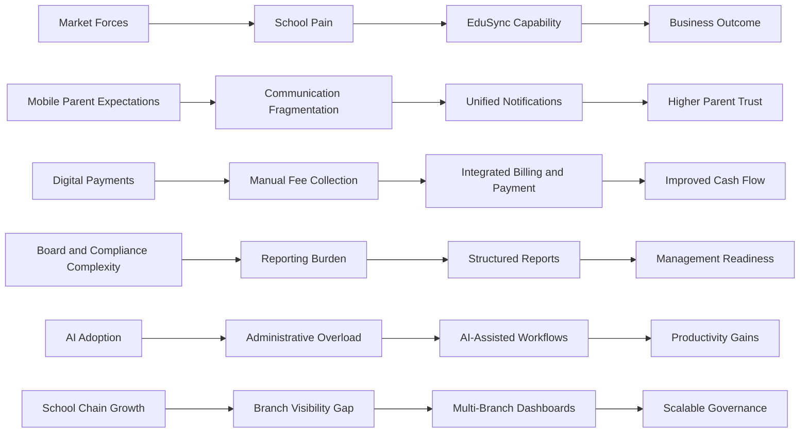
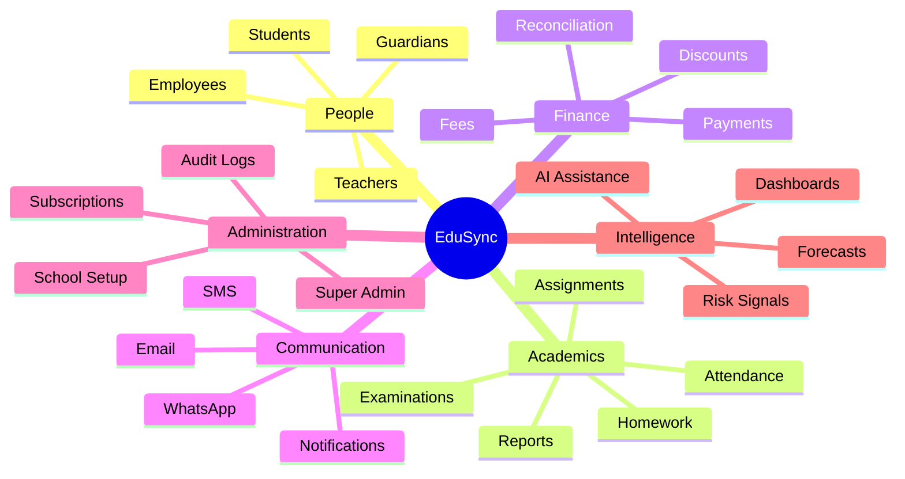
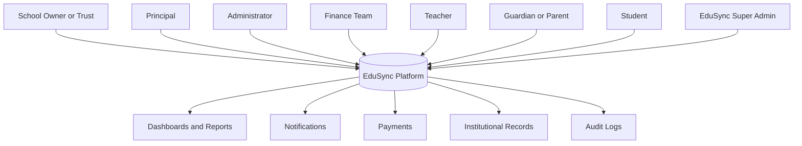
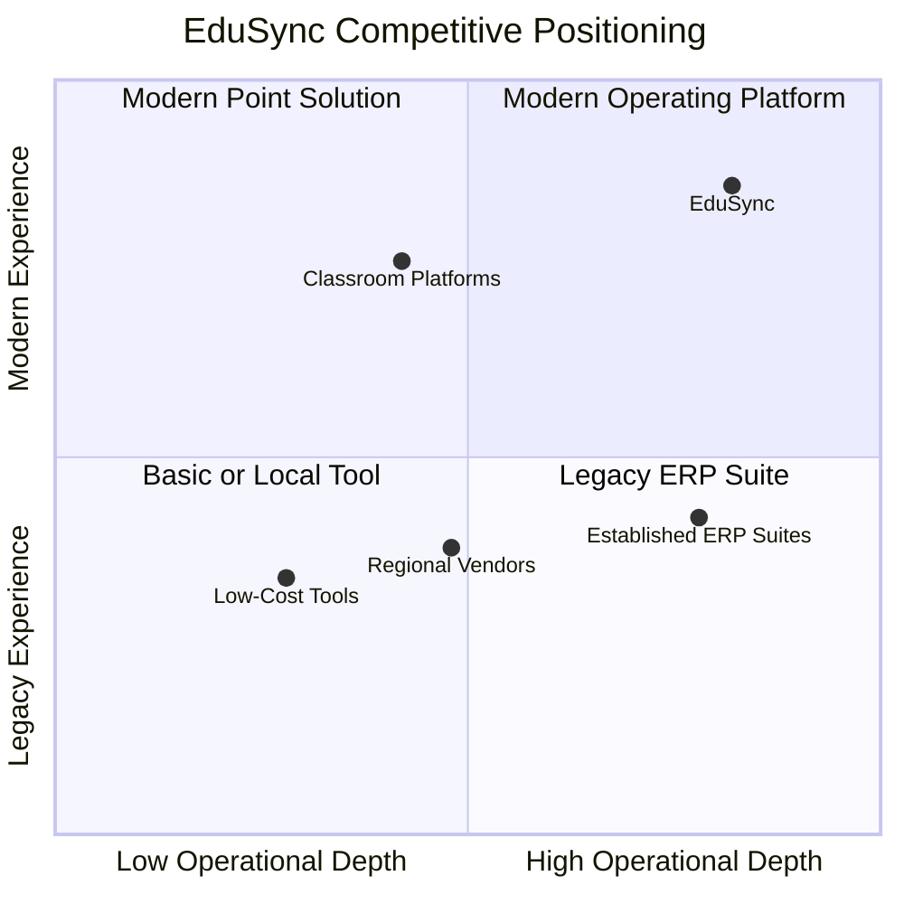
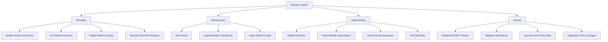
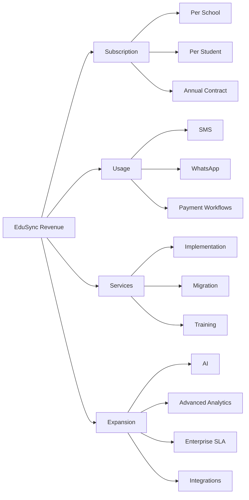
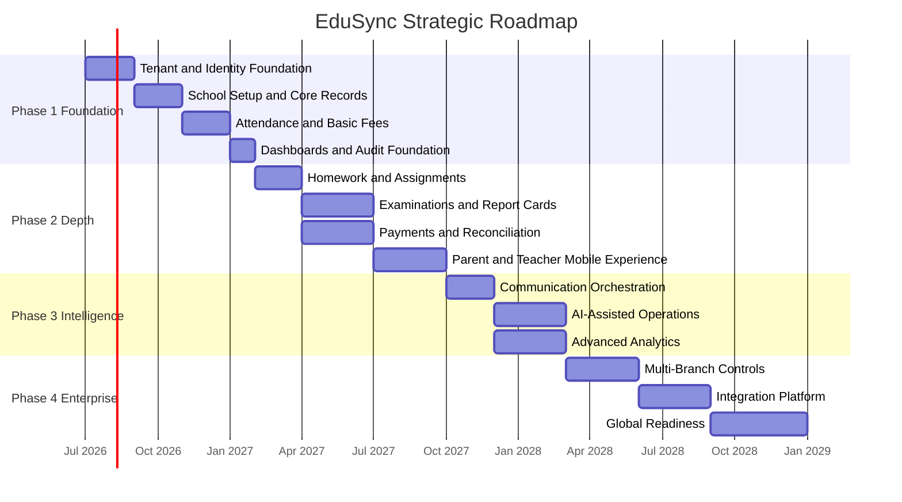
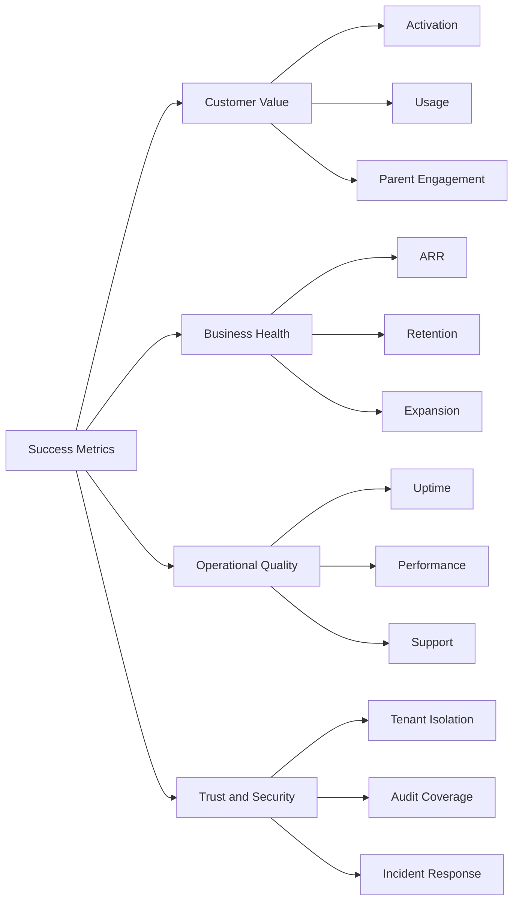
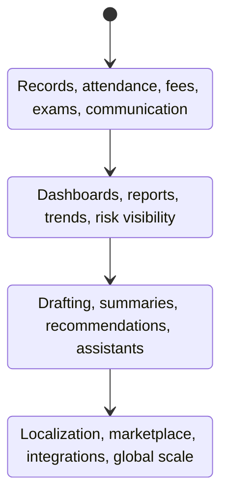

# EduSync Vision Document

| Field | Value |
| --- | --- |
| Product | EduSync |
| Document Type | Vision Document |
| Version | 1.0.0 |
| Status | Draft for Strategic Review |
| Author | EduSync Product, Architecture, and Technology Office |
| Target Market | India; global expansion in future phases |
| Primary Audience | Founders, investors, product leadership, engineering leadership, school management, implementation partners, and strategic advisors |
| Last Updated | 2026-07-02 |

## Overview

EduSync is a cloud-native, multi-tenant School Management SaaS platform designed for private schools, CBSE schools, ICSE schools, state board schools, and coaching institutes serving approximately 200 to 5,000 students. The product vision is to build a modern, secure, scalable, AI-powered operating system for school administration, academic operations, stakeholder communication, financial workflows, and institutional intelligence.

This vision document defines the strategic direction, market opportunity, product intent, business model, competitive stance, roadmap, success metrics, assumptions, risks, and future expansion path for EduSync. It is written as a production SaaS planning document, not as a prototype brief or academic exercise. Every product and technology decision must support enterprise-grade reliability, tenant isolation, data protection, operational efficiency, extensibility, and long-term maintainability.

EduSync is positioned as a unified platform that reduces operational fragmentation inside schools. Instead of forcing schools to operate separate tools for admissions, student records, fees, attendance, examinations, staff workflows, parent communication, payments, and reports, EduSync will provide a coherent system of record with role-aware workflows, secure access, automated communication, integrated analytics, and AI-assisted productivity.

### Strategic Value Flow

## Purpose

The purpose of this document is to establish a complete strategic foundation for EduSync before detailed product requirements, architecture specifications, module-level requirements, and implementation plans are created. It provides shared direction for business, product, design, engineering, security, operations, sales, and customer success teams.

This document serves the following purposes:

- Define the business and product vision for EduSync.
- Clarify the market problem EduSync is designed to solve.
- Establish the target customer profile and stakeholder needs.
- Identify strategic opportunities in the Indian school management SaaS market.
- Describe competitive positioning and differentiation.
- Define product, business, revenue, pricing, roadmap, and success metric direction.
- Record strategic assumptions, dependencies, and risks.
- Create a durable reference for future product requirement documents, software requirement specifications, architecture documents, and go-to-market plans.

## Scope

This document covers the strategic vision for EduSync as a cloud-native school management SaaS platform. It includes product positioning, business opportunity, market context, core objectives, target stakeholders, strategic modules, revenue model, pricing approach, roadmap, success metrics, risks, assumptions, dependencies, and future vision.

This document does not define detailed user stories, database schema, API contracts, UI screen specifications, deployment topology, detailed security controls, or module-level acceptance criteria. Those items must be produced in separate dedicated documents after this vision document is approved.

The product scope includes the following core domains:

- Authentication and identity management.
- School and tenant administration.
- Student, guardian, teacher, and employee management.
- Attendance, homework, assignments, examinations, and academic operations.
- Fees, payments, finance workflows, and reports.
- Dashboards and institutional analytics.
- Notifications through SMS, WhatsApp, email, and in-app channels.
- Subscription management and super admin operations.
- Audit logging, security controls, and AI-assisted workflows.

## Executive Summary

Indian schools are under increasing pressure to operate with the speed, transparency, and reliability expected from modern digital organizations. Parents expect timely communication, digital fee payment, attendance visibility, academic progress updates, and mobile access. Teachers need practical tools that reduce administrative burden rather than adding another layer of work. School leadership needs accurate operational data, compliance readiness, fee collection visibility, and confidence that institutional data is secure. Administrators need workflows that replace spreadsheets, paper registers, duplicate data entry, and disconnected software.

The current school software landscape remains fragmented. Many institutions use legacy ERP systems, custom local software, spreadsheets, messaging groups, payment links, paper files, and manual processes simultaneously. Even when a school has an ERP, adoption is often uneven because systems are difficult to configure, slow to use, weak on mobile experience, or poorly aligned with real school workflows. The result is operational leakage: delayed collections, inaccurate records, manual reconciliation, inconsistent parent communication, avoidable staff workload, weak reporting, and limited decision intelligence.

EduSync addresses this opportunity by building a modern SaaS platform that treats a school as a complex operating environment rather than a collection of isolated modules. The platform will use a shared-database multi-tenant model with strict `school_id` isolation, modern role-based access control, secure audit trails, scalable cloud architecture, and AI capabilities that improve productivity without compromising trust. The product must be simple enough for small private schools and coaching institutes, while structured enough for larger institutions and multi-branch school groups.

EduSync will compete by combining enterprise discipline with practical usability. It will avoid the common trap of becoming a feature-heavy but difficult ERP. The strategic product direction is to deliver high-quality core operations first, then expand into intelligence, automation, ecosystem integrations, and global readiness. The initial market focus is India because of the scale of private schooling, continued digital adoption, strong parent mobile usage, UPI-based payment maturity, and the operational complexity of multiple education boards and school formats.

The business opportunity is recurring subscription revenue from schools, usage-based revenue from communication and payment workflows, premium AI capabilities, implementation services, and future marketplace integrations. Pricing must be transparent enough for small and mid-sized institutions while supporting enterprise contracts for larger school chains. EduSync should be built with a long-term vision of becoming the trusted system of record and intelligence layer for K-12 and coaching education operations.

## Vision

EduSync will become the most trusted AI-powered school management SaaS platform for modern schools, beginning in India and expanding globally.

The product vision is to create a unified digital operating system where every school can manage people, academics, communication, finance, compliance, and institutional decisions through one secure platform. EduSync will not merely digitize registers and forms. It will transform daily school operations into reliable, measurable, connected workflows.

The long-term vision is built on five strategic beliefs:

1. Schools need a reliable system of record before they can benefit from advanced automation.
2. Administrative simplicity is as important as feature completeness.
3. Tenant isolation and data security are foundational product features, not technical afterthoughts.
4. AI must assist school stakeholders in practical, auditable, privacy-conscious ways.
5. The winning platform will combine academic, operational, financial, communication, and analytics workflows into a coherent product experience.

EduSync must be designed as a production SaaS platform from the beginning. It must support secure multi-tenancy, modular growth, clean architecture, performance at institutional scale, observability, maintainability, API readiness, and future migration paths toward service decomposition when business scale requires it.

```mermaid
flowchart TD
    A[EduSync Vision] --> B[Unified School Operations]
    A --> C[Secure Multi-Tenant SaaS]
    A --> D[AI-Assisted Productivity]
    A --> E[Data-Driven Leadership]
    A --> F[Parent and Student Engagement]

    B --> B1[Admissions]
    B --> B2[Attendance]
    B --> B3[Academics]
    B --> B4[Fees and Payments]
    B --> B5[Staff Workflows]

    C --> C1[Tenant Isolation]
    C --> C2[Role-Based Access]
    C --> C3[Audit Logs]
    C --> C4[Secure APIs]

    D --> D1[Drafting Assistance]
    D --> D2[Operational Insights]
    D --> D3[Risk Signals]
    D --> D4[Workflow Recommendations]

    E --> E1[Dashboards]
    E --> E2[Reports]
    E --> E3[Forecasting]
    E --> E4[Compliance Visibility]

    F --> F1[Mobile Access]
    F --> F2[Notifications]
    F --> F3[Fee Transparency]
    F --> F4[Academic Updates]
```

## Mission

EduSync's mission is to help schools operate with clarity, speed, accountability, and trust by providing a secure, intelligent, and easy-to-adopt SaaS platform for every major school workflow.

The mission translates into the following operating commitments:

- Reduce manual administrative workload for school staff.
- Improve communication reliability between schools and families.
- Provide accurate, real-time operational visibility to school leadership.
- Improve fee collection discipline through integrated billing, reminders, and payments.
- Give teachers tools that save time and support academic execution.
- Protect student, parent, staff, and institutional data through secure architecture.
- Provide AI capabilities that are useful, explainable, controlled, and aligned with school policies.
- Support Indian education realities while keeping the architecture globally extensible.

EduSync must make a school more organized without making its people feel controlled by software. The platform should reduce friction in daily work and strengthen institutional discipline through thoughtful workflows.

## Business Opportunity

India has one of the largest school education ecosystems in the world, with significant diversity across private schools, public schools, aided schools, board affiliations, languages, infrastructure maturity, fee structures, and regional operating practices. Private and unaided schools, in particular, face competitive pressure to provide better parent experience, stronger academic outcomes, transparent communication, and digital convenience.

Several structural trends create a strong opportunity for EduSync:

- Parents increasingly expect mobile-first access to school communication, fee status, attendance, announcements, homework, marks, and events.
- Digital payments have become mainstream in India, making integrated school fee workflows more acceptable.
- Schools need stronger reporting for management decisions, compliance, academic planning, and financial discipline.
- Teachers and administrators face growing administrative workload and need practical automation.
- School groups and coaching networks require centralized visibility across branches.
- AI adoption is becoming visible in consumer and business workflows, creating expectations for intelligent assistance.
- Many existing school ERP products are module-rich but experience-poor, creating room for a modern product with strong usability and implementation discipline.

The opportunity is not only software replacement. It is institutional operating transformation. EduSync can become the platform that schools use daily for their operational truth.

### Opportunity Map

## Problem Statement

Schools operate many high-frequency processes that are still managed through disconnected systems, manual registers, messaging apps, spreadsheets, paper documents, standalone payment tools, and fragmented ERP modules. This fragmentation creates inaccurate data, duplicate work, delayed communication, weak accountability, and limited visibility for leadership.

The problem is experienced differently by each stakeholder group:

- School owners and principals lack a single reliable view of admissions, fee collections, attendance, academic performance, staff workload, parent engagement, and operational risks.
- Administrators repeatedly enter the same data across files, registers, software modules, and communication channels.
- Teachers lose time on attendance, homework tracking, exam entry, parent communication, and manual reporting.
- Parents receive inconsistent updates and often need to call or message the school for basic information.
- Students receive fragmented academic support and limited visibility into learning tasks.
- Finance teams struggle with fee plans, discounts, partial payments, reconciliation, reminders, dues reports, and management reporting.
- IT teams and vendors struggle with customizations, data migration, uptime, security, and support.

The core problem is not the absence of software. The core problem is the absence of a trusted, usable, integrated, secure, and intelligent school operations platform that aligns with real Indian school workflows.

## Objectives

EduSync must pursue objectives that balance market relevance, product quality, security, and business viability.

### Strategic Objectives

- Establish EduSync as a trusted SaaS platform for private schools and coaching institutes in India.
- Provide a complete operational foundation across students, staff, academics, fees, payments, communication, reports, and administration.
- Build strong tenant isolation and security controls from the first production release.
- Deliver a modern web and mobile experience for school staff, teachers, parents, and students.
- Introduce AI capabilities where they produce measurable operational value.
- Create a modular architecture that can evolve from modular monolith to microservice-ready deployment when scale requires.
- Build implementation, migration, onboarding, and support processes that reduce adoption risk.
- Develop revenue expansion paths through premium modules, communication usage, payment workflows, AI, and enterprise features.

### Product Objectives

- Reduce administrative data duplication across core school workflows.
- Improve fee collection visibility and parent payment convenience.
- Standardize student, guardian, teacher, and employee records.
- Provide role-specific dashboards for owners, principals, administrators, teachers, finance teams, parents, and super admins.
- Automate routine communication through in-app, email, SMS, and WhatsApp channels.
- Enable configurable academic structures for Indian school contexts.
- Provide auditable actions for sensitive workflows.
- Support reporting that helps leadership make operational decisions.

### Technology Objectives

- Use Java 21 and Spring Boot for backend services.
- Use React, TypeScript, Vite, Tailwind, Shadcn, React Query, React Hook Form, and Zustand for the frontend.
- Use React Native and Expo for mobile applications.
- Use PostgreSQL as the primary relational database.
- Use Redis for caching and performance-sensitive workloads.
- Use RabbitMQ for asynchronous messaging and notification workflows.
- Use Docker, AWS, GitHub Actions, and Nginx for deployment and operations.
- Use AWS S3 for file storage.
- Use REST APIs with clean domain boundaries and consistent security enforcement.
- Use shared-database multi-tenancy with `school_id` on every tenant-owned table.

## Product Goals

EduSync's product goals define what the platform must become for customers.

| Goal | Description | Expected Customer Value |
| --- | --- | --- |
| Unified system of record | Maintain authoritative school data for students, guardians, staff, classes, fees, attendance, exams, and communication. | Less duplication, fewer errors, better governance. |
| Operational workflow engine | Provide practical workflows for daily school administration. | Faster work completion and consistent execution. |
| Parent engagement platform | Provide timely communication, fee visibility, academic updates, and mobile access. | Higher parent satisfaction and fewer repetitive inquiries. |
| Teacher productivity platform | Reduce routine administrative workload for teachers. | More teaching time and improved compliance with school processes. |
| Financial control platform | Manage fee structures, invoices, dues, payments, discounts, and reports. | Improved collections and transparent reconciliation. |
| Leadership intelligence platform | Provide dashboards, metrics, reports, alerts, and trend analysis. | Better decisions and faster risk detection. |
| Secure SaaS foundation | Protect tenant data and provide reliable cloud operations. | Trust, scalability, and enterprise readiness. |
| AI-assisted operations | Use AI to reduce manual drafting, summarize insights, and recommend actions. | Productivity gains without sacrificing control. |

### Product Capability Model

## Business Goals

EduSync's business goals must convert product value into a sustainable SaaS company.

| Business Goal | Target Direction |
| --- | --- |
| Recurring revenue | Build predictable monthly and annual subscription revenue from schools. |
| Low churn | Create operational dependency through reliable daily workflows and strong customer success. |
| Expansion revenue | Add premium modules, AI capabilities, communication usage, payment features, and enterprise controls. |
| Efficient implementation | Develop repeatable onboarding, migration, training, and support playbooks. |
| Strong gross margin | Use cloud-native architecture, automation, and reusable tenant infrastructure. |
| Enterprise readiness | Support larger school groups with multi-branch reporting, access controls, auditability, and SLAs. |
| Brand trust | Position EduSync as secure, professional, reliable, and practical for real schools. |
| Geographic expansion | Start with India and design for future global compliance, localization, currencies, and academic structures. |

The business must avoid growth that depends heavily on one-off customization. Custom work should become configuration, extension points, templates, integrations, or carefully managed enterprise services. The core product must remain scalable and maintainable.

## Stakeholders

EduSync must satisfy a broad stakeholder ecosystem. The product succeeds only when it serves the daily needs of operational users while also delivering governance and business value to decision makers.

| Stakeholder | Primary Needs | EduSync Value |
| --- | --- | --- |
| School owner or trust management | Financial visibility, admissions visibility, reputation, compliance, branch performance. | Executive dashboards, reports, revenue tracking, audit logs, multi-branch controls. |
| Principal | Academic quality, attendance, discipline, teacher performance, parent satisfaction. | Academic dashboards, attendance reports, examination insights, communication controls. |
| Administrator | Student records, documents, certificates, workflows, communication, daily operations. | Centralized records, configurable workflows, automated communication, reduced manual work. |
| Finance team | Fee setup, collections, dues, receipts, discounts, reconciliation, reports. | Fee engine, payment integration, dues tracking, finance reports, audit history. |
| Teacher | Attendance, homework, assignments, marks, class communication, workload management. | Teacher portal, mobile access, fast entry workflows, AI drafting assistance. |
| Student | Tasks, schedules, academic updates, notices, results, learning support. | Student portal, assignments, exam results, notifications, future AI support. |
| Guardian or parent | Attendance visibility, fee payment, communication, academic progress, school announcements. | Parent app, payment access, alerts, reports, messages, calendar visibility. |
| IT administrator | Security, access, uptime, data export, integrations, support. | Role-based access, secure APIs, audit logs, observability, integration controls. |
| Super admin | Tenant provisioning, subscriptions, support, platform monitoring. | Internal administration, subscription management, operational tooling. |
| Sales and customer success | Demos, onboarding, adoption, renewals, support quality. | Standardized setup, usage analytics, implementation playbooks, customer health metrics. |
| Regulators and auditors | Data accuracy, traceability, compliance, student safety. | Reports, audit trails, role restrictions, retention policies. |

### Stakeholder Interaction Model

## Business Rules

The following business rules define foundational constraints for EduSync's product direction:

- Every school must operate as an isolated tenant.
- Every tenant-owned table must include `school_id`.
- Every tenant-owned query must be tenant-isolated.
- No user may access another school's data unless explicitly authorized through a controlled platform-level support or super admin workflow.
- Roles and permissions must be configurable but must include secure defaults.
- Financial transactions must be auditable and traceable.
- Student, guardian, employee, fee, payment, attendance, examination, and notification records must preserve history where required for accountability.
- AI features must not override institutional authority; they must assist, recommend, draft, summarize, or flag.
- Sensitive actions must be logged through audit logs.
- Communication preferences and consent requirements must be respected where applicable.
- Fee calculations must be deterministic, explainable, and reversible through controlled correction workflows.
- Reports must derive from authoritative domain records, not duplicated spreadsheet-like stores.
- Data export must be governed by role, scope, and auditability.
- Configuration must be tenant-specific unless designed as a platform-level default.
- Subscription status must influence feature access according to defined commercial rules.

## Functional Requirements

At the vision level, EduSync must support the following high-level functional capabilities:

- Tenant onboarding, school setup, academic year setup, classes, sections, subjects, and role configuration.
- User authentication, authorization, password management, session management, and secure account recovery.
- Student lifecycle management from enquiry or admission through active enrollment, transfer, alumni status, or exit.
- Guardian profile management with relationship mapping, contact details, and communication preferences.
- Teacher and employee management with role, department, employment, and access details.
- Attendance capture and reporting for students and staff.
- Homework and assignment creation, distribution, tracking, and reporting.
- Examination setup, marks entry, grade processing, report cards, and result publication.
- Fee structure configuration, invoices, discounts, dues, receipts, payment status, and reconciliation.
- Payment gateway integration and payment status synchronization.
- Notifications through in-app, email, SMS, and WhatsApp channels.
- Dashboards for role-specific operational visibility.
- Report generation and export according to permissions.
- Subscription and plan management for SaaS operations.
- Super admin workflows for tenant management and support operations.
- Audit logs for sensitive actions and platform accountability.
- AI-assisted workflows for drafting, summarization, insights, and operational recommendations.

## Non Functional Requirements

EduSync must meet enterprise SaaS non-functional requirements from the beginning:

- Security: Strong authentication, authorization, input validation, secure password storage, least privilege access, audit logging, secure API design, and tenant isolation.
- Privacy: Purpose-limited data processing, access control, retention policies, and secure handling of student and guardian data.
- Availability: Production infrastructure must support reliable daily school operations with clearly defined uptime targets.
- Performance: Common workflows such as login, dashboard loading, attendance marking, fee lookup, and notification creation must remain responsive under expected tenant load.
- Scalability: The architecture must support growth in number of schools, users, records, notifications, payments, and files.
- Maintainability: Code must follow clean architecture, domain-driven design, SOLID principles, and modular boundaries.
- Observability: Logs, metrics, traces, alerts, and operational dashboards must support production support.
- Extensibility: Modules must be designed for future integrations, workflows, localization, and premium features.
- Usability: Interfaces must be simple, role-specific, accessible, and suitable for repeated daily use.
- Reliability: Financial, attendance, and examination workflows must preserve consistency and recover from partial failures.
- Compliance readiness: The platform must be designed to support applicable Indian data protection, school compliance, and future global privacy requirements.
- Portability: Infrastructure should use Dockerized deployments and cloud-native patterns that avoid unnecessary vendor lock-in.

## Market Analysis

### Market Context

India's school education ecosystem is large, diverse, and operationally complex. Schools operate across multiple boards, languages, fee models, infrastructure levels, and parent expectations. Private schools and coaching institutes face strong pressure to differentiate through academic outcomes, communication quality, convenience, transparency, safety, and digital maturity.

Public reporting from India's school data ecosystem shows that school operations are becoming more digitally aware, but digital infrastructure and process maturity remain uneven. UDISE+ reporting covered by major Indian business and education publications in 2025 indicated that the number of school teachers crossed one crore, while digital infrastructure still had significant gaps, including incomplete computer and internet access across schools. This creates a dual opportunity: schools are more ready for digital systems than before, yet many still need practical, usable, and affordable tools that fit their operating reality.

EduSync's primary initial market is not every school in India. The immediate beachhead is fee-paying private schools, CBSE schools, ICSE schools, state board private schools, and coaching institutes with 200 to 5,000 students. These institutions usually have a stronger ability to pay, clearer parent experience pressure, recurring fee workflows, and a greater need for management visibility.

### Demand Drivers

| Demand Driver | Market Implication |
| --- | --- |
| Parent mobile adoption | Schools need reliable apps, notifications, fee payment, and academic updates. |
| Digital payments maturity | Integrated fee collection and reconciliation can become a high-value workflow. |
| Competitive school positioning | Schools use digital experience as a trust and brand signal. |
| Administrative workload | Staff need automation, templates, workflows, and fewer duplicate entries. |
| Compliance and reporting pressure | Structured data and auditable records become more important. |
| Multi-branch school groups | Owners need consolidated reporting and controls. |
| AI awareness | Schools will expect practical AI assistance, but with governance and safety. |

### Market Segments

| Segment | Student Size | Pain Intensity | Willingness to Pay | Product Fit |
| --- | ---: | --- | --- | --- |
| Small private schools | 200-800 | High manual workload, limited IT staff. | Moderate. | Strong if onboarding is simple and pricing is accessible. |
| Mid-sized private schools | 800-2,500 | Strong need for fee, academic, communication, and reporting workflows. | High. | Primary target segment. |
| Large private schools | 2,500-5,000 | Complex operations, governance, integrations, custom reporting. | High. | Strong with enterprise controls and implementation support. |
| School chains | Multi-branch | Central visibility, standardization, branch comparison. | High to very high. | Strategic expansion segment. |
| Coaching institutes | 200-5,000 | Batch management, attendance, fees, communication, tests. | Moderate to high. | Good fit with adapted academic workflows. |

### Market Entry Thesis

EduSync should enter through a focused core workflow bundle rather than a broad but shallow ERP. The highest-value entry wedge is the combination of student records, attendance, fees, payments, parent communication, and dashboards. These workflows are frequent, visible, and measurable. Once the school relies on EduSync for daily operations and fee visibility, expansion into examinations, homework, assignments, AI, advanced reports, and premium modules becomes more natural.

## Competitor Analysis

The Indian school ERP market includes established vendors, regional providers, open-source influenced products, and newer SaaS-first platforms. Competitors often emphasize large module catalogs, mobile apps, communication tools, finance modules, LMS capabilities, or enterprise implementation experience.

Public competitor signals show several patterns:

- MyClassboard presents a broad product suite across ERP, finance, admissions, HR, LMS, connect, mobile apps, safety, payments, WhatsApp, and AI-related examination support.
- Entab emphasizes secure, compliant school ERP deployments and case studies for institutional networks.
- Fedena has a long history in school ERP and is known for open-source roots and education institution management.
- Teachmint has been known for digital classroom and school management positioning, especially in a SaaS and mobile-led context.
- Regional ERP vendors compete through local relationships, implementation customization, and price flexibility.

EduSync must respect these competitors. The market is not empty. The strategic opportunity is to compete with a sharper product experience, modern architecture, secure multi-tenancy, clear pricing, implementation quality, AI-enabled productivity, and a disciplined roadmap.

### Competitor Positioning Matrix

| Competitor Type | Strengths | Weaknesses or Openings | EduSync Response |
| --- | --- | --- | --- |
| Established ERP suites | Many modules, market familiarity, references. | Can feel complex, legacy, implementation-heavy, or uneven in UX. | Deliver modern UX, focused workflows, faster adoption, and strong support. |
| Regional school ERP vendors | Local relationships, low-cost customization, familiarity with regional practices. | Limited scalability, inconsistent security, weak mobile experience, limited product discipline. | Provide configurable product depth with enterprise security and professional onboarding. |
| Digital classroom platforms | Teacher and student engagement, online learning familiarity. | May not fully solve finance, administration, and governance workflows. | Combine academic engagement with administrative system-of-record strength. |
| Open-source or low-cost systems | Lower upfront cost, basic workflows. | Higher support burden, weak SaaS operations, limited accountability. | Offer managed SaaS reliability, security, upgrades, and support. |
| Large enterprise vendors | Brand trust, broad enterprise capabilities. | Expensive, slower implementation, less suitable for mid-market schools. | Optimize for the 200-5,000 student segment with practical pricing. |

### Strategic Differentiators

EduSync's differentiation must be concrete:

- Tenant isolation by design, not by convention.
- Fast, modern, role-aware product experience.
- Strong fee and payment workflow with reconciliation discipline.
- Parent and teacher mobile experience built for daily use.
- AI features that solve real administrative and academic workload problems.
- Implementation playbooks for Indian school contexts.
- Clean architecture that supports long-term product quality.
- Reporting and dashboards that leadership can trust.
- Security-first engineering and auditability.
- Transparent subscription model that scales with institution size.

### Competitive Strategy Diagram

## SWOT Analysis

### Strengths

- Clear positioning as a cloud-native, AI-powered, multi-tenant SaaS platform.
- Modern technology stack suitable for secure, scalable product development.
- Focused target segment of 200-5,000 student institutions with strong operational pain.
- Modular monolith architecture can support disciplined delivery while remaining microservice-ready.
- Multi-tenant shared database model can support efficient SaaS economics when correctly isolated.
- Broad product domain coverage across academics, finance, communication, administration, and intelligence.
- Opportunity to design product experience from first principles rather than inherit legacy UX.

### Weaknesses

- New entrant status means limited initial brand trust, references, and migration proof.
- School ERP adoption requires training, data migration, change management, and support.
- Broad module scope can create execution risk if not phased carefully.
- AI positioning requires governance and credibility to avoid appearing superficial.
- Payment, SMS, WhatsApp, and email integrations add operational dependencies and support complexity.
- Pricing must balance affordability for schools with sustainable SaaS economics.

### Opportunities

- Schools are increasingly open to cloud tools, mobile access, digital payments, and parent communication apps.
- Mid-market schools need modern alternatives to heavy legacy ERP systems.
- AI can reduce real administrative workload in notices, reports, summaries, analysis, and support workflows.
- Multi-branch school groups need centralized controls and analytics.
- Coaching institutes provide adjacent expansion potential.
- Strong implementation methodology can become a market differentiator.
- Future global expansion can reuse core architecture with localization.

### Threats

- Established vendors may lower pricing or bundle additional features.
- Schools may resist migration due to historical data, staff habits, or fear of disruption.
- Data privacy or security incidents could damage trust.
- Communication channel policy changes may affect WhatsApp, SMS, or email delivery economics.
- Payment gateway issues may affect fee collection experience.
- Customization demands could slow product development if not governed.
- AI regulation, parent concerns, or school policies may limit AI feature adoption.

## Revenue Model

EduSync should use a hybrid SaaS revenue model that combines predictable subscription revenue with controlled usage-based and value-added revenue.

### Revenue Streams

| Revenue Stream | Description | Strategic Role |
| --- | --- | --- |
| Core subscription | Monthly or annual platform subscription based on school size and plan. | Primary recurring revenue. |
| Per-student pricing | Pricing tied to active enrolled students. | Aligns revenue with customer scale. |
| Premium modules | Advanced examinations, AI, analytics, admissions CRM, HR, advanced finance, and integrations. | Expansion revenue. |
| Communication usage | SMS, WhatsApp, and high-volume email usage billed by consumption or bundle. | Cost recovery and margin opportunity. |
| Payment processing revenue | Platform fee, convenience fee, or revenue share where commercially and legally appropriate. | Transaction-linked revenue. |
| Implementation services | Data migration, setup, training, and onboarding packages. | Reduces activation risk and covers onboarding effort. |
| Enterprise support | SLA, dedicated success manager, custom reporting, and priority support. | Enterprise monetization. |
| Marketplace integrations | Future third-party tools, content, finance, transport, learning, and assessment integrations. | Ecosystem expansion. |

### Revenue Principles

- Core pricing must be understandable to school owners and administrators.
- Communication and payment costs must be transparent because these depend on external providers.
- Implementation fees should not become the main profit center; they should enable successful adoption.
- Discounts must be governed to avoid damaging long-term SaaS economics.
- Annual plans should be encouraged through pricing incentives because schools operate on annual academic and budget cycles.
- Enterprise plans should allow custom contracts without fragmenting the core product.

## Pricing

EduSync pricing should support adoption by small and mid-sized schools while preserving room for enterprise expansion. The recommended model is a tiered annual SaaS subscription with student bands, optional monthly billing, implementation packages, and usage-based communication charges.

### Pricing Philosophy

The pricing model must be:

- Predictable for schools.
- Aligned with student count and module value.
- Flexible enough for small schools without undervaluing the product.
- Capable of supporting enterprise contracts for school groups.
- Transparent about external costs such as SMS, WhatsApp, and payment gateway charges.
- Designed around annual academic planning cycles.

### Proposed Pricing Tiers

The following pricing structure is a strategic model and must be validated through customer discovery, sales experiments, competitor benchmarking, and unit economics analysis before commercial launch.

| Plan | Target Customer | Included Scope | Pricing Direction |
| --- | --- | --- | --- |
| Starter | Schools with 200-800 students needing core digitization. | Student records, guardian records, attendance, basic fees, basic communication, standard reports. | Entry annual subscription with student-band pricing. |
| Professional | Schools with 800-2,500 students needing full operations. | Starter plus homework, assignments, examinations, payments, advanced dashboards, role controls. | Primary revenue plan. |
| Growth | Schools with 2,500-5,000 students or high process complexity. | Professional plus advanced finance, workflows, analytics, priority support, integrations. | Premium mid-market plan. |
| Enterprise | School groups, large schools, and networks. | Growth plus multi-branch controls, SLA, dedicated success, custom reports, advanced audit, enterprise integrations. | Custom annual contract. |
| AI Add-on | Schools ready for AI-assisted productivity. | AI drafting, summaries, insights, recommendations, controlled assistant features. | Add-on per school or per active staff user. |

### Implementation Pricing

| Package | Customer Fit | Services |
| --- | --- | --- |
| Standard Onboarding | Small and mid-sized schools with clean data. | Tenant setup, configuration, basic migration, admin training. |
| Advanced Migration | Schools moving from legacy ERP or spreadsheets. | Data cleaning support, historical data migration, validation, staff training. |
| Enterprise Rollout | Multi-branch or large institutions. | Rollout planning, branch templates, phased migration, governance workshops, success plan. |

### Pricing Risks

- Pricing too low may increase adoption but weaken support economics.
- Pricing too high may slow adoption in smaller schools.
- Bundling all modules too early may reduce expansion revenue.
- Excessive customization included in subscription can destroy margins.
- Communication costs may fluctuate and should be separated from core subscription where appropriate.

## Roadmap

EduSync's roadmap must prioritize operational foundations before advanced intelligence. Schools will not trust AI insights if core data is incomplete, inconsistent, or difficult to maintain.

### Roadmap Principles

- Build foundational data models first.
- Release modules in adoption-ready increments.
- Prioritize workflows used daily or weekly.
- Avoid deep customization before product-market fit.
- Build tenant isolation, auditability, and security from the first release.
- Use analytics and AI only when supported by reliable domain data.
- Validate each major module with real school workflows before broad release.

### Phase 1: Foundation and Core Operations

Primary objective: Establish EduSync as a usable school system of record.

Scope:

- Authentication and role-based access.
- School setup and academic year configuration.
- Student, guardian, teacher, and employee records.
- Class, section, subject, and basic academic configuration.
- Attendance workflows.
- Basic fee structure, invoices, dues, and receipts.
- Basic notifications.
- Admin and principal dashboards.
- Audit log foundation.
- Super admin tenant provisioning.

### Phase 2: Academic and Financial Depth

Primary objective: Expand daily operational value.

Scope:

- Homework and assignments.
- Examination setup, marks entry, grading, and report cards.
- Payment gateway integration.
- Fee reminders and reconciliation workflows.
- Advanced reports.
- Teacher dashboard.
- Parent portal and mobile app.
- Student portal.
- Communication templates.

### Phase 3: Engagement, Automation, and Intelligence

Primary objective: Improve productivity and decision visibility.

Scope:

- SMS, WhatsApp, and email orchestration.
- Advanced dashboards for leadership.
- AI-assisted notice drafting, report summaries, and operational recommendations.
- Attendance risk signals.
- Fee collection forecasting.
- Staff workload insights.
- Admission pipeline workflows.
- Subscription management enhancements.

### Phase 4: Enterprise and Ecosystem

Primary objective: Support larger institutions and integrations.

Scope:

- Multi-branch school group management.
- Advanced audit and compliance reporting.
- Enterprise SLA and support tooling.
- Integration APIs.
- Marketplace foundation.
- Advanced AI governance.
- Localization framework.
- Global readiness for additional curricula, currencies, and regulatory patterns.

### Roadmap Timeline

## Success Metrics

EduSync success must be measured across customer value, product adoption, business performance, operational quality, and trust.

### Customer Adoption Metrics

| Metric | Target Direction | Why It Matters |
| --- | --- | --- |
| School activation rate | Increase month over month. | Shows onboarding effectiveness. |
| Time to first live workflow | Decrease. | Indicates implementation speed. |
| Weekly active staff users | Increase. | Measures operational adoption. |
| Parent app activation | Increase. | Measures parent engagement value. |
| Teacher attendance usage | High consistency. | Indicates daily workflow dependency. |
| Fee workflow adoption | High percentage of schools using invoices, dues, and receipts. | Confirms financial module value. |

### Business Metrics

| Metric | Target Direction | Why It Matters |
| --- | --- | --- |
| Annual recurring revenue | Increase predictably. | Primary SaaS growth indicator. |
| Net revenue retention | Above 100% over time. | Shows expansion and low churn. |
| Gross margin | Improve with scale. | Indicates SaaS operating health. |
| Customer acquisition cost payback | Decrease. | Improves growth efficiency. |
| Churn rate | Low and declining. | Indicates durable customer value. |
| Expansion revenue | Increase from premium modules and AI. | Shows product depth. |

### Operational Metrics

| Metric | Target Direction | Why It Matters |
| --- | --- | --- |
| Uptime | Meet or exceed SLA targets. | Schools depend on daily availability. |
| Critical incident count | Low and declining. | Indicates platform maturity. |
| Average response time | Within defined performance budgets. | Supports usability. |
| Support ticket volume per school | Decline after onboarding. | Shows usability and training quality. |
| Data migration defect rate | Low. | Builds trust during onboarding. |
| Notification delivery success | High. | Communication reliability matters. |

### Trust and Security Metrics

| Metric | Target Direction | Why It Matters |
| --- | --- | --- |
| Tenant data isolation incidents | Zero. | Non-negotiable trust requirement. |
| Unauthorized access incidents | Zero. | Security foundation. |
| Audit coverage for sensitive actions | Complete. | Enables accountability. |
| Vulnerability remediation time | Within severity SLA. | Maintains security posture. |
| Backup restore test success | 100% in scheduled tests. | Ensures recoverability. |

## Risks

### Strategic Risks

| Risk | Impact | Mitigation |
| --- | --- | --- |
| Overbuilding before product-market fit | Slow delivery and confusing product. | Phase roadmap around high-frequency workflows and customer validation. |
| Competing against entrenched vendors | Longer sales cycles and pricing pressure. | Differentiate through UX, implementation quality, security, AI, and transparent pricing. |
| Weak implementation experience | Customer dissatisfaction and churn. | Build onboarding playbooks, migration tools, training material, and success checkpoints. |
| Excessive customization | Product complexity and margin erosion. | Use configuration-first approach and strict enterprise customization governance. |
| AI overpromising | Loss of credibility. | Ship practical, controlled AI features with measurable value and human review. |

### Product Risks

| Risk | Impact | Mitigation |
| --- | --- | --- |
| Poor teacher adoption | Incomplete data and weak school value. | Build fast teacher workflows and mobile-friendly interactions. |
| Parent app underuse | Reduced engagement value. | Make payments, attendance, announcements, and results immediately useful. |
| Fee calculation defects | Trust loss and operational disruption. | Use deterministic fee engine, test coverage, approval flows, and audit logs. |
| Notification failures | Communication breakdown. | Use queue-based delivery, retries, provider monitoring, and fallback channels. |
| Report inaccuracies | Leadership distrust. | Use authoritative domain data and reconciliation checks. |

### Technology Risks

| Risk | Impact | Mitigation |
| --- | --- | --- |
| Tenant isolation failure | Severe trust and legal risk. | Enforce `school_id` across schema, query layer, tests, and code reviews. |
| Performance bottlenecks | Poor daily usability. | Use indexing, caching, pagination, async processing, and performance budgets. |
| Integration dependency failure | Payment or notification disruption. | Use resilient integration patterns, retries, webhooks, idempotency, and provider monitoring. |
| Data migration defects | Adoption delays and trust issues. | Build migration validation tools and staged sign-off process. |
| Security vulnerabilities | Data exposure and reputational damage. | Secure SDLC, scanning, penetration testing, least privilege, and incident response. |

### Business Risks

| Risk | Impact | Mitigation |
| --- | --- | --- |
| Price sensitivity | Slower sales conversion. | Use student-band pricing and clear ROI messaging. |
| Long school sales cycles | Cash flow pressure. | Offer pilot programs, annual academic-cycle planning, and founder-led sales initially. |
| Support cost escalation | Lower margins. | Invest in product usability, self-service help, training, and operational tooling. |
| Churn during academic-year transitions | Revenue instability. | Provide renewal planning and end-of-year support workflows. |

## Assumptions

This vision is based on the following assumptions:

- Target schools have enough digital readiness to use web and mobile SaaS workflows.
- School leadership values fee visibility, parent communication, and operational reporting enough to pay for reliable software.
- Schools prefer configurable SaaS over heavily custom software when product fit is strong.
- Indian private schools will continue adopting digital payments and parent communication tools.
- AI adoption in schools will be gradual and must be governed, explainable, and optional.
- Shared-database multi-tenancy is appropriate for the early and mid-scale SaaS model when implemented with strict tenant isolation.
- Implementation quality will be a major driver of customer satisfaction and retention.
- The first strong market wedge will come from core operations rather than advanced LMS-only workflows.
- Annual subscriptions will fit school budgeting better than purely monthly usage contracts.
- Future global expansion will require localization, currency, compliance, and curriculum flexibility.

## Dependencies

EduSync's success depends on multiple internal and external dependencies.

### Product and Engineering Dependencies

- Reliable backend architecture using Java 21, Spring Boot, PostgreSQL, Redis, RabbitMQ, and AWS.
- Strong frontend and mobile implementation using React, TypeScript, Vite, Tailwind, Shadcn, React Query, React Hook Form, Zustand, React Native, and Expo.
- Clean domain boundaries that prevent module coupling from becoming unmanageable.
- Automated tests for tenant isolation, fee calculations, access control, and critical workflows.
- CI/CD pipelines through GitHub Actions.
- Observability for production operations.
- Documentation discipline across product, architecture, APIs, security, and deployment.

### External Dependencies

- Payment gateway providers for online fee collection.
- SMS providers for transactional and informational messaging.
- WhatsApp Business Platform providers for approved communication workflows.
- Email delivery providers.
- AWS services for compute, storage, networking, security, and monitoring.
- School-provided data quality during onboarding and migration.
- Applicable legal and regulatory requirements for data protection and education operations.

## Future Scope

Future scope must extend EduSync from school management SaaS into a broader education operations and intelligence platform.

Potential future capabilities include:

- Advanced admissions CRM with lead scoring, campaign tracking, counsellor workflows, and conversion analytics.
- Transport management with route planning, vehicle tracking integration, driver records, and parent alerts.
- Library, inventory, hostel, canteen, visitor, and facility management.
- Payroll and HR compliance workflows.
- Advanced LMS integration and digital content marketplace.
- AI-assisted teacher planning, question paper creation, individualized student support, and parent communication insights.
- Predictive analytics for fee default risk, attendance risk, dropout risk, and academic intervention.
- Multi-school group benchmarking and executive governance dashboards.
- API marketplace for partners.
- Global localization for academic structures, language, currency, date formats, and regional compliance.
- Data warehouse and business intelligence layer for large customers.
- Offline-capable mobile workflows for low-connectivity contexts.

## Future Vision

The long-term future of EduSync is to become the intelligent institutional operating layer for schools. In this future, EduSync does not merely store data; it helps schools understand their operations, anticipate risks, communicate better, reduce administrative work, and improve stakeholder trust.

The future platform should support three levels of maturity.

### Level 1: Digital Operations

At this level, EduSync replaces scattered manual processes with reliable digital workflows. Schools manage records, attendance, fees, communication, examinations, and reports through a unified platform.

### Level 2: Connected Intelligence

At this level, EduSync connects operational data across modules. Leadership can see patterns in attendance, fee collection, academic performance, communication engagement, and staff workflows. Reports become decision tools rather than end-of-month administrative outputs.

### Level 3: AI-Assisted Institution

At this level, EduSync uses AI to assist school operations responsibly. The platform can draft communication, summarize reports, flag operational anomalies, suggest interventions, answer authorized user questions over school data, and support teachers and administrators in routine work. Human approval remains central. AI must never become an uncontrolled decision maker over student welfare, financial actions, or institutional governance.

## References

The following references informed the market and competitive context. They must be revalidated during detailed business planning because market data, competitor offerings, and pricing can change.

- Ministry of Education school data reporting through UDISE+ and related public reporting on India's school infrastructure, teachers, retention, and digital readiness.
- Economic Times coverage of UDISE+ 2024-25 findings on teachers, school infrastructure, and digital access: <https://economictimes.indiatimes.com/industry/services/education/indias-school-teacher-count-crosses-1-crore-in-2024-25-udise-data/articleshow/123571593.cms>
- Times of India coverage of UDISE+ 2024-25 digital infrastructure gaps and regional school indicators: <https://timesofindia.indiatimes.com/education/news/the-missing-link-why-indias-digital-infrastructure-in-schools-must-catch-up/articleshow/123581177.cms>
- MyClassboard public product information, including ERP, finance, admission, HR, LMS, connect, WhatsApp, payment, mobile, and AI-related module positioning: <https://www.myclassboard.com/>
- Entab public school ERP positioning and institutional case study messaging: <https://www.entab.in/>
- Fedena and Foradian public product history and school ERP positioning: <https://fedena.com/>
- Teachmint public school management and digital education positioning: <https://www.teachmint.com/>
- IAMAI and Kantar public reporting on India's internet adoption trends, used as contextual support for mobile-first and digital adoption assumptions.

## Revision History

| Version | Date | Author | Status | Changes |
| --- | --- | --- | --- | --- |
| 1.0.0 | 2026-07-02 | EduSync Product, Architecture, and Technology Office | Draft for Strategic Review | Initial production-quality vision document created for EduSync. |
