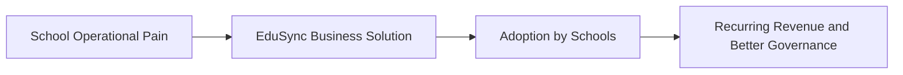
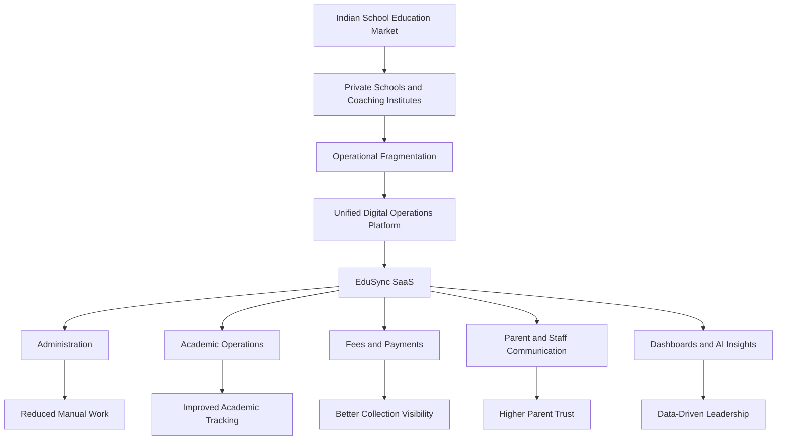
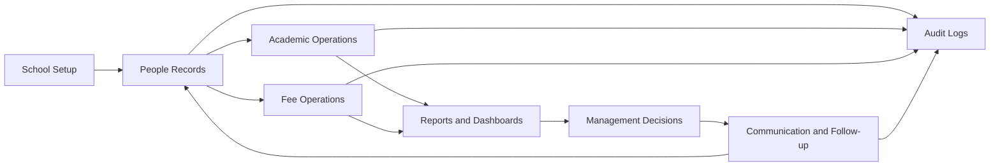
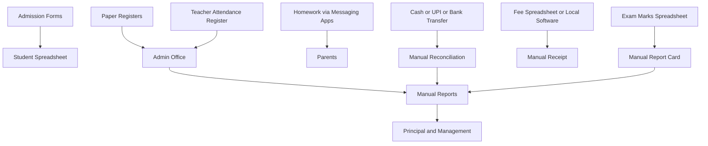
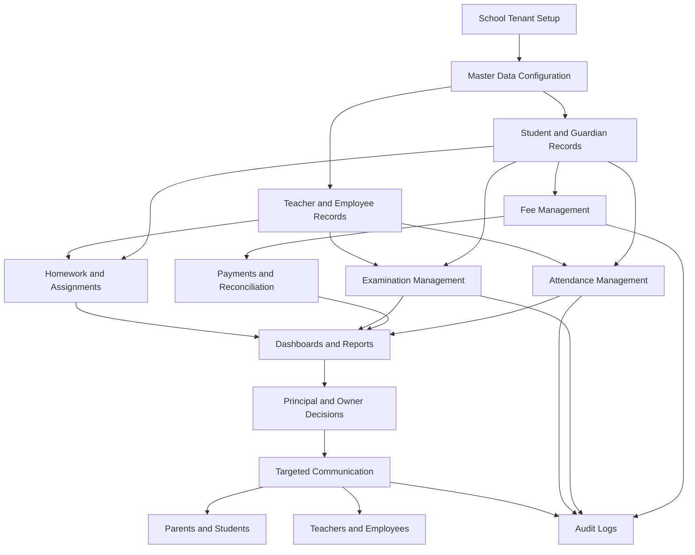
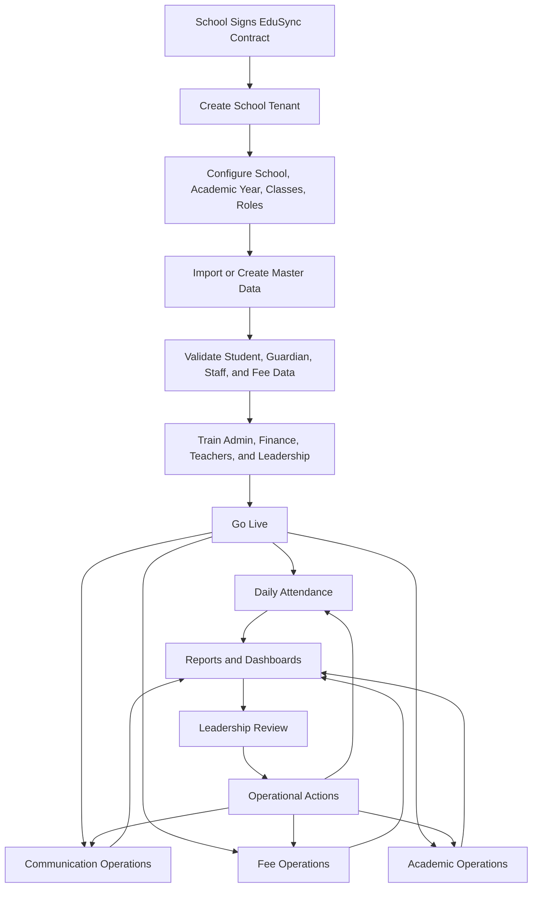
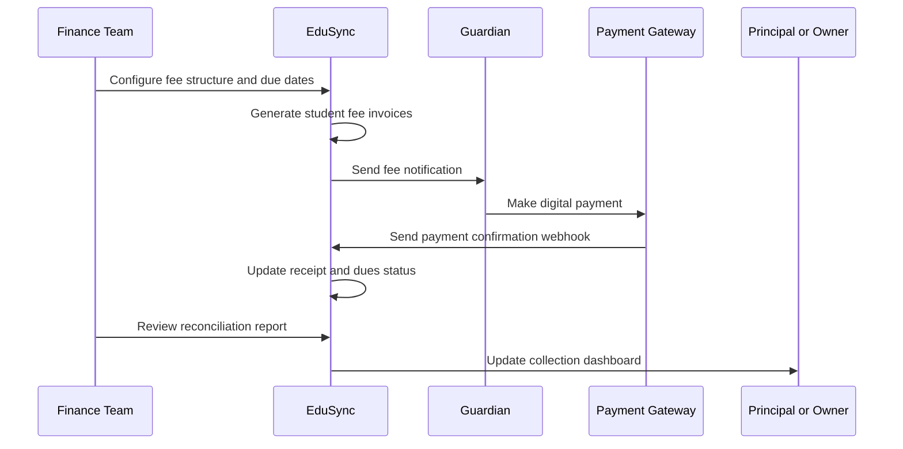
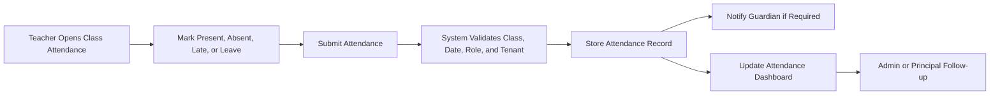

# EduSync Business Requirements Document

| Field | Value |
| --- | --- |
| Product | EduSync |
| Document Type | Business Requirements Document |
| Version | 1.0.0 |
| Status | Draft for Business Review |
| Author | EduSync Product, Business, and Architecture Office |
| Target Market | India |
| Future Market | Global |
| Last Updated | 2026-07-02 |

## Overview

EduSync is a cloud-native, multi-tenant School Management SaaS platform for private schools, CBSE schools, ICSE schools, state board schools, and coaching institutes with approximately 200 to 5,000 students. The product is intended to become the operational system of record for school administration, academic execution, fee management, communication, reporting, and institutional intelligence.

This Business Requirements Document defines the business need, scope, processes, rules, stakeholders, constraints, risks, assumptions, KPIs, success metrics, and business glossary for EduSync. It establishes what the business needs the product to achieve before detailed product requirements, software requirements, architecture specifications, API contracts, database design, and UI/UX specifications are finalized.

EduSync must be treated as a production SaaS product. The business requirements therefore prioritize operational reliability, tenant isolation, security, maintainability, adoption, repeatable implementation, measurable value, and long-term commercial sustainability.

## Purpose

The purpose of this document is to translate the EduSync product vision into business-level requirements that can guide product planning, module prioritization, engineering scope, implementation strategy, sales positioning, customer success operations, and executive decision-making.

This document must be used to:

- Align stakeholders on the business problems EduSync will solve.
- Define the expected business outcomes for schools and for the EduSync SaaS business.
- Document current school workflows and pain points.
- Describe the proposed business solution at a capability level.
- Define business rules that must govern system behavior.
- Identify business risks, constraints, assumptions, KPIs, and success metrics.
- Establish a business vocabulary for future documentation.

### Business Value Flow

## Scope

This document covers business requirements for EduSync across core school operations, including school setup, student management, guardian management, teacher and employee management, attendance, homework, assignments, examinations, fees, payments, reports, dashboards, notifications, SMS, WhatsApp, email, subscriptions, super admin operations, audit logs, and AI-assisted workflows.

The scope includes the business processes required for a school to operate digitally through EduSync and the SaaS business processes required for EduSync to onboard, support, bill, and retain schools.

This document does not define low-level software design, database schemas, API endpoints, UI screen layouts, deployment topology, test cases, or implementation tasks. Those details must be documented separately after the business requirements are approved.

## Business Overview

Schools manage complex recurring operations involving students, guardians, teachers, employees, fees, attendance, academic schedules, examinations, communication, reports, compliance records, and management decisions. In many institutions, these operations are spread across paper registers, spreadsheets, local desktop software, messaging apps, payment links, manual receipts, and partially adopted ERP systems.

EduSync exists to consolidate these operations into a secure SaaS platform that provides one trusted source of operational truth for each school. The product must support daily workflows for administrators, teachers, finance staff, principals, parents, students, and school owners while giving EduSync internal teams the ability to manage tenants, subscriptions, support, and platform operations.

The business opportunity is strongest where schools face operational complexity but lack reliable digital workflow maturity. EduSync will initially focus on Indian schools and coaching institutes that need modern administration, parent communication, fee collection discipline, academic workflow tracking, and leadership visibility.

### Business Context Diagram

## Business Objectives

EduSync must achieve business objectives for both customer schools and the EduSync SaaS business.

### Customer Business Objectives

| Objective | Description | Expected Business Outcome |
| --- | --- | --- |
| Digitize school operations | Move core administrative, academic, communication, and finance workflows into a unified SaaS platform. | Reduced paper usage, duplicate entry, and operational delays. |
| Improve data accuracy | Maintain structured records for students, guardians, teachers, employees, fees, attendance, examinations, and reports. | Better decisions and fewer operational disputes. |
| Improve fee collection visibility | Provide fee setup, dues tracking, receipts, payment status, reminders, and reconciliation workflows. | Improved cash flow discipline and lower collection leakage. |
| Improve parent communication | Provide timely updates through in-app notifications, SMS, WhatsApp, and email. | Higher parent satisfaction and fewer repetitive inquiries. |
| Improve teacher productivity | Reduce routine administrative burden for attendance, homework, assignments, and marks. | More time for teaching and academic follow-up. |
| Improve leadership visibility | Provide dashboards and reports for principals, owners, and school management. | Faster issue detection and better governance. |
| Improve security and accountability | Enforce role-based access, tenant isolation, and audit logs. | Reduced data exposure and improved trust. |

### EduSync Business Objectives

| Objective | Description | Expected Business Outcome |
| --- | --- | --- |
| Build recurring SaaS revenue | Monetize schools through subscription plans and add-ons. | Predictable annual recurring revenue. |
| Reduce onboarding friction | Standardize implementation, migration, and training processes. | Faster activation and lower service cost. |
| Increase product adoption | Drive repeated use by administrators, teachers, finance teams, parents, and leadership. | Lower churn and stronger renewal probability. |
| Enable expansion revenue | Offer premium modules, AI features, advanced reports, communication usage, and enterprise controls. | Higher revenue per school over time. |
| Maintain scalable operations | Use cloud-native architecture and repeatable support processes. | Healthy gross margins and reliable service delivery. |
| Build market trust | Position EduSync as secure, professional, reliable, and practical. | Stronger sales conversion and referral growth. |

## Business Scope

### In Scope

EduSync business scope includes:

- School onboarding and tenant setup.
- Academic year, class, section, subject, and user setup.
- Student admission, enrollment, profile management, status management, and records.
- Guardian relationship management and communication preferences.
- Teacher and employee records.
- Attendance workflows for students and staff.
- Homework, assignment, examination, marks, grades, and academic reports.
- Fee structures, discounts, invoices, dues, receipts, payments, and reconciliation.
- Parent, student, teacher, administrator, finance, principal, owner, and super admin workflows.
- Notifications through in-app, SMS, WhatsApp, and email channels.
- Dashboards, reports, exports, and operational analytics.
- Subscription plan management and platform-level tenant administration.
- Audit logs for sensitive business operations.
- AI-assisted productivity features where business value is clear and human review remains possible.

### Out of Scope for Initial Business Release

The following capabilities are not required for the initial business release unless separately prioritized:

- Full transport management with GPS tracking.
- Hostel operations.
- Library management.
- Inventory and procurement management.
- Payroll processing.
- Advanced LMS content marketplace.
- Biometric hardware integrations.
- Government regulatory filing automation.
- Global localization beyond India.
- Custom software development for individual schools outside approved product configuration.

### Scope Control Principles

- Product configuration must be preferred over school-specific customization.
- Every new module must support tenant isolation, role-based access, auditability, and reporting needs.
- Features must be prioritized by business value, frequency of use, adoption impact, and implementation risk.
- The initial product must solve a coherent set of daily school operations rather than ship many shallow modules.

## Business Processes

EduSync must support the main operational processes that determine whether a school can run efficiently through the platform.

### Core School Business Processes

| Process | Business Description | Primary Stakeholders |
| --- | --- | --- |
| School setup | Configure school identity, academic years, classes, sections, subjects, roles, and policies. | School admin, principal, EduSync implementation team. |
| Student onboarding | Capture student and guardian information, admission details, class allocation, documents, and fee applicability. | Admin, admissions team, guardian, finance team. |
| Staff onboarding | Maintain teacher and employee records, roles, departments, and access. | Admin, HR, principal. |
| Attendance management | Record student and staff attendance and generate summaries. | Teacher, admin, principal, guardian. |
| Academic task management | Create, assign, track, and report homework and assignments. | Teacher, student, guardian, principal. |
| Examination management | Configure exams, enter marks, calculate results, and publish report cards. | Teacher, exam coordinator, principal, guardian, student. |
| Fee management | Configure fee structures, create invoices, track dues, receive payments, apply discounts, and reconcile. | Finance team, guardian, owner, principal. |
| Communication management | Send announcements, alerts, reminders, and academic updates through approved channels. | Admin, teacher, principal, guardian, student. |
| Reporting and analytics | Provide operational reports, dashboards, exports, and leadership insights. | Owner, principal, admin, finance team. |
| Subscription management | Manage EduSync plans, billing, renewals, feature entitlements, and tenant status. | EduSync super admin, sales, finance, customer success. |

### School Operating Model

## Current School Workflow

Many target schools currently run hybrid manual and digital workflows. The exact workflow differs by institution, but the following pattern is common across private schools and coaching institutes.

### Current Workflow Pattern

1. Admissions staff collect enquiry and admission details through forms, spreadsheets, paper documents, phone calls, or local software.
2. Administrators create or update student records manually in registers, spreadsheets, or an existing ERP.
3. Guardian contact details are stored inconsistently across admission forms, messaging groups, fee records, and class teacher lists.
4. Class teachers mark attendance in registers or basic digital tools and later submit summaries to administrators.
5. Homework and assignments are communicated through notebooks, messaging groups, or separate classroom tools.
6. Examination marks are captured in spreadsheets or local modules and then manually consolidated for report cards.
7. Fee structures are maintained by finance teams through spreadsheets, accounting tools, receipts, or separate fee software.
8. Payment confirmations are manually checked across cash, bank transfer, UPI, payment gateway exports, and receipts.
9. Parent communication occurs through phone calls, printed notices, messaging apps, SMS tools, or separate communication platforms.
10. Leadership receives reports after manual consolidation, usually after delays and with limited drill-down capability.

### Current Workflow Diagram

## Current Pain Points

### Operational Pain Points

| Pain Point | Business Impact |
| --- | --- |
| Duplicate data entry | Staff spend time entering the same information in multiple places. |
| Inconsistent student and guardian records | Communication failures, reporting errors, and administrative confusion. |
| Manual attendance consolidation | Delayed visibility into absenteeism and weak parent follow-up. |
| Fragmented academic tracking | Homework, assignments, and exam progress are not consistently visible. |
| Manual fee reconciliation | Finance teams spend significant time matching payments, receipts, dues, and discounts. |
| Delayed leadership reporting | Principals and owners make decisions using late or incomplete data. |
| Informal communication channels | Important notices may be missed, duplicated, or unverifiable. |
| Limited auditability | Sensitive changes cannot always be traced to an authorized user. |
| Weak role control | Staff may have access to data beyond their responsibility. |
| Poor parent experience | Parents must call, message, or visit the school for basic updates. |

### Business Consequences

- Higher administrative cost.
- Increased risk of fee leakage and delayed collections.
- Lower parent trust due to inconsistent communication.
- Reduced teacher productivity.
- Weak compliance readiness.
- Limited institutional memory when staff changes.
- Slow response to attendance, academic, or financial issues.
- Difficulty scaling operations across branches.

## Proposed Solution

EduSync will provide a secure, cloud-native, multi-tenant SaaS platform that unifies school administration, academic operations, fee management, parent communication, dashboards, reports, and AI-assisted productivity.

The proposed solution is based on the following business capabilities:

- A single tenant-isolated school workspace for each institution.
- Structured master data for school, academic year, classes, sections, subjects, students, guardians, teachers, employees, and roles.
- Configurable operational workflows for attendance, homework, assignments, examinations, fees, payments, reports, and notifications.
- Role-specific access for owners, principals, administrators, finance teams, teachers, parents, students, and super admins.
- Integrated communication through in-app notifications, SMS, WhatsApp, and email.
- Integrated fee management with invoices, dues, receipts, discounts, payment status, and reconciliation.
- Dashboards that provide actionable business visibility.
- Audit logs for sensitive transactions and administrative changes.
- AI assistance for drafting, summarizing, recommending, and highlighting operational insights.

### Proposed Future Workflow

## Business Rules

The following business rules are mandatory for EduSync:

| Rule ID | Business Rule | Priority |
| --- | --- | --- |
| BR-001 | Every school must operate as an isolated tenant. | Critical |
| BR-002 | Every tenant-owned business record must be associated with `school_id`. | Critical |
| BR-003 | No school user may access another school's data. | Critical |
| BR-004 | Every tenant-owned query must enforce tenant isolation. | Critical |
| BR-005 | Users must access features according to assigned roles and permissions. | Critical |
| BR-006 | Financial records must be auditable and must preserve transaction history. | Critical |
| BR-007 | Fee discounts, waivers, reversals, and corrections must require authorized access. | High |
| BR-008 | Student attendance must be traceable to the user and timestamp responsible for marking or updating it. | High |
| BR-009 | Examination result publication must be controlled by authorized roles. | High |
| BR-010 | Parent communication must be sent only to valid guardian contacts associated with the student. | High |
| BR-011 | Sensitive operations must create audit log entries. | Critical |
| BR-012 | Subscription status must control tenant access according to commercial rules. | High |
| BR-013 | AI-generated content must remain subject to human review before official communication or record updates. | High |
| BR-014 | Reports must be generated from authoritative system data, not unverified external uploads. | High |
| BR-015 | Deleted or inactive records must not break historical reports. | High |

## Functional Requirements

At the business level, EduSync must provide the following functional capabilities:

- School tenant onboarding and configuration.
- Role-based user access for all major stakeholder groups.
- Student, guardian, teacher, and employee profile management.
- Class, section, subject, and academic year configuration.
- Student and staff attendance management.
- Homework and assignment management.
- Examination setup, marks entry, result processing, and report publishing.
- Fee structure creation, invoice generation, dues tracking, receipt management, and payment reconciliation.
- Parent, student, teacher, administrator, finance, principal, owner, and super admin dashboards.
- Notification delivery through in-app, SMS, WhatsApp, and email channels.
- Reports and exports for operational, academic, financial, and administrative use cases.
- Subscription, plan, billing, renewal, and tenant status management.
- Audit logs for sensitive actions.
- AI-assisted drafting, summarization, analysis, and recommendations.

## Non Functional Requirements

EduSync must satisfy the following non-functional business expectations:

- Security-first design with strict authentication, authorization, tenant isolation, and auditability.
- High availability for daily school operations.
- Responsive performance for common workflows such as login, attendance, fee lookup, dashboard loading, and notification creation.
- Scalable architecture for increasing schools, users, students, transactions, notifications, and files.
- Maintainable modular design using clean architecture and domain-driven principles.
- Reliable notification and payment processing with retries and failure visibility.
- Usable interfaces for non-technical school staff.
- Data backup and restore readiness.
- Supportability through logs, metrics, support tools, and clear operational procedures.
- MkDocs-compatible documentation for product, business, architecture, API, security, and operations.

## Stakeholders

| Stakeholder | Business Interest | Primary EduSync Interaction |
| --- | --- | --- |
| School owner or trust management | Revenue visibility, governance, school reputation, branch performance. | Executive dashboard, reports, subscription decisions. |
| Principal | Academic quality, attendance, discipline, staff productivity, parent satisfaction. | Academic dashboards, reports, approvals, communication oversight. |
| Administrator | Student records, school setup, documents, daily operations. | Admin console, records, workflows, reports. |
| Finance team | Fee setup, collections, dues, receipts, discounts, reconciliation. | Fee module, payment module, finance dashboard. |
| Teacher | Attendance, homework, assignments, marks, classroom communication. | Teacher portal and mobile workflows. |
| Guardian or parent | Student updates, fee payment, communication, attendance, results. | Parent portal, mobile app, notifications, payments. |
| Student | Academic tasks, announcements, attendance, results. | Student portal and mobile experience. |
| EduSync super admin | Tenant provisioning, subscription control, support operations. | Platform administration console. |
| EduSync customer success | Onboarding, adoption, renewals, support health. | Tenant usage analytics and support workflows. |
| EduSync sales | Customer acquisition and plan conversion. | Demo environments, pricing, subscription data. |
| EduSync finance | SaaS billing, revenue recognition, collections. | Subscription and billing reports. |
| Regulators or auditors | Traceability, record integrity, compliance readiness. | Reports and audit records where legally authorized. |

## Business Risks

| Risk | Impact | Mitigation |
| --- | --- | --- |
| School staff resist adoption | Low usage and poor data completeness. | Provide role-specific training, simple workflows, and onboarding support. |
| Data migration quality is poor | Incorrect records and loss of trust. | Use structured templates, validation, reconciliation, and customer sign-off. |
| Fee workflow defects occur | Financial disputes and customer escalation. | Build deterministic fee rules, approvals, audit logs, and strong test coverage. |
| Tenant isolation fails | Severe trust, legal, and commercial damage. | Enforce `school_id`, automated isolation tests, secure code review, and monitoring. |
| Notification delivery is unreliable | Parent communication failures. | Use delivery tracking, retries, provider monitoring, and fallback channels. |
| Product scope becomes too broad | Delayed launch and weak quality. | Prioritize core workflows and use phased roadmap governance. |
| Schools demand custom features | Margin erosion and product complexity. | Use configuration-first design and commercial approval for enterprise customization. |
| Payment integration failures occur | Fee collection disruption. | Implement idempotency, webhook validation, reconciliation reports, and provider fallback procedures. |
| AI outputs are incorrect or inappropriate | Loss of trust and operational risk. | Keep AI assistive, require human review, log usage, and apply policy controls. |

## Business Constraints

EduSync must operate within the following business constraints:

- The first target market is India.
- The product must support private schools, CBSE schools, ICSE schools, state board schools, and coaching institutes.
- Target customer size is 200-5,000 students.
- The platform must use a shared-database multi-tenant model with `school_id` on tenant-owned records.
- The business must avoid uncontrolled custom development for individual schools.
- The product must support web and mobile usage patterns.
- Communication workflows depend on external SMS, WhatsApp, and email providers.
- Payment workflows depend on external payment gateway providers.
- Schools may have inconsistent legacy data quality.
- School purchasing decisions may follow academic-year budgeting cycles.
- Documentation must remain Markdown, MkDocs Material, Mermaid, and PlantUML compatible.

## Business Assumptions

This document assumes:

- Schools are willing to adopt SaaS if the product is reliable, secure, easy to use, and commercially clear.
- Parent communication and fee management are high-value adoption drivers.
- Teachers will adopt the system if daily workflows are fast and do not duplicate existing work.
- School leadership will value dashboards when data is accurate and current.
- Implementation quality will strongly influence renewal probability.
- AI features will be adopted gradually and must be governed by school policy.
- Annual subscription pricing will align with school budgeting cycles.
- Standardized onboarding can reduce implementation cost over time.
- Most target schools will accept cloud hosting if security and reliability are demonstrated.

## Dependencies

EduSync business delivery depends on:

- Product management defining clear module priorities.
- Engineering implementing secure, scalable, tenant-isolated workflows.
- UX design producing role-specific and low-friction interfaces.
- Customer success creating onboarding, migration, and training playbooks.
- Sales defining market positioning, pricing, and qualification criteria.
- Finance defining subscription, invoicing, tax, and collection processes.
- Legal and compliance guidance for data protection, terms of service, privacy, and contracts.
- External providers for payments, SMS, WhatsApp, email, hosting, monitoring, and storage.
- Schools providing accurate source data during onboarding.

## Business KPIs

| KPI | Definition | Target Direction |
| --- | --- | --- |
| School activation rate | Percentage of contracted schools that complete onboarding and start live operations. | Increase |
| Time to go live | Time from contract signing to first production workflow. | Decrease |
| Monthly active schools | Number of schools with meaningful monthly usage. | Increase |
| Weekly active staff users | Number of staff users completing operational workflows weekly. | Increase |
| Parent activation rate | Percentage of guardians using the parent portal or app. | Increase |
| Fee collection visibility rate | Percentage of active students covered by fee invoices and dues tracking. | Increase |
| Digital payment adoption | Percentage of fee collections recorded through integrated or reconciled digital channels. | Increase |
| Notification delivery success rate | Percentage of notifications successfully delivered through configured channels. | Increase |
| Support tickets per active school | Average support burden per school. | Decrease after onboarding |
| Annual recurring revenue | Subscription revenue normalized annually. | Increase |
| Gross revenue retention | Revenue retained from existing customers before expansion. | Increase |
| Net revenue retention | Revenue retained including expansion, add-ons, and upgrades. | Increase |
| Churn rate | Percentage of schools that do not renew. | Decrease |

## Success Metrics

EduSync will be considered successful when it produces measurable outcomes for schools and for the SaaS business.

### School Success Metrics

| Metric | Success Indicator |
| --- | --- |
| Administrative efficiency | Reduction in duplicate data entry and manual report preparation. |
| Attendance compliance | High percentage of classes marking attendance on time. |
| Fee discipline | Improved visibility into dues, collections, discounts, and receipts. |
| Parent engagement | Increased parent portal usage and reduced repetitive inquiry calls. |
| Academic visibility | Timely availability of homework, assignments, examination results, and reports. |
| Leadership visibility | Principals and owners use dashboards for operational decisions. |
| Data quality | Fewer missing guardian contacts, duplicate student records, and inconsistent class mappings. |

### EduSync SaaS Success Metrics

| Metric | Success Indicator |
| --- | --- |
| Product adoption | High recurring usage across administrators, teachers, finance staff, parents, and leadership. |
| Retention | High renewal rate after the first academic year. |
| Expansion | Adoption of premium modules, communication packs, payment workflows, and AI add-ons. |
| Implementation efficiency | Reduced onboarding time as playbooks mature. |
| Operational reliability | Low severity incidents and strong uptime. |
| Security trust | Zero tenant data exposure incidents. |
| Customer advocacy | Positive references, referrals, and case studies. |

## Business Process Flow

### End-to-End School Operations Flow

### Fee Collection Business Flow

### Attendance Business Flow

## Business Glossary

| Term | Definition |
| --- | --- |
| Academic Year | The school operating year used for classes, admissions, fees, attendance, examinations, and reports. |
| Admin | A school staff user responsible for configuration, records, and operational workflows. |
| AI Assistance | EduSync capability that drafts, summarizes, recommends, or analyzes information while keeping humans responsible for final decisions. |
| Assignment | A structured academic task assigned to students for completion and tracking. |
| Attendance | A record of student or staff presence, absence, late status, or leave for a defined date or session. |
| Audit Log | A system-generated record of sensitive actions, including actor, timestamp, action, and affected record. |
| Class | An academic grouping such as Grade 1, Grade 10, or a coaching level. |
| Coaching Institute | An education institution focused on exam preparation, tutoring, or supplementary learning. |
| Discount | An approved reduction applied to a student's fee obligation. |
| Due | A fee amount that remains unpaid after invoice generation or due date. |
| EduSync Super Admin | An internal platform role responsible for tenant, subscription, and platform-level administration. |
| Employee | A non-teaching or teaching staff member employed by the school. |
| Fee Structure | The defined fee components, schedules, due dates, discounts, and applicability rules for students. |
| Guardian | A parent or authorized person associated with a student for communication, payment, and responsibility purposes. |
| Homework | Academic work assigned by a teacher for student completion outside classroom instruction. |
| Invoice | A formal fee demand generated for a student based on fee structure and applicability. |
| Multi-Tenant SaaS | A software model where multiple schools use the same platform while their data remains isolated. |
| Notification | A message sent through in-app, SMS, WhatsApp, or email channels. |
| Payment Reconciliation | The process of matching payments received with invoices, receipts, and student dues. |
| Principal | The academic and operational head of a school. |
| Receipt | A confirmation of payment recorded against a student's fee obligation. |
| Role-Based Access Control | Access model where user permissions are determined by assigned roles and responsibilities. |
| School ID | The tenant identifier used to isolate every school-owned record and query. |
| Section | A subdivision of a class, such as Grade 5-A or Grade 5-B. |
| Student | A learner enrolled in a school or coaching institute. |
| Subscription | The commercial plan under which a school uses EduSync. |
| Tenant | A school or institution account within EduSync with isolated data and configuration. |

## Future Scope

Future business scope may include transport management, library management, hostel management, inventory, payroll, advanced admissions CRM, advanced HR, alumni management, canteen, visitor management, advanced LMS, marketplace integrations, predictive analytics, AI-powered student support, multi-branch benchmarking, and global localization.

Future scope must be evaluated through customer demand, revenue potential, implementation complexity, security impact, and alignment with EduSync's core platform strategy.

## References

- EduSync `AI_INSTRUCTIONS.md`.
- EduSync Vision Document: `docs/getting-started/vision.md`.
- EduSync documentation structure under `docs/`.

## Revision History

| Version | Date | Author | Status | Changes |
| --- | --- | --- | --- | --- |
| 1.0.0 | 2026-07-02 | EduSync Product, Business, and Architecture Office | Draft for Business Review | Initial production-quality business requirements document created. |
