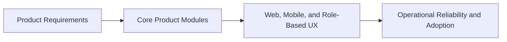
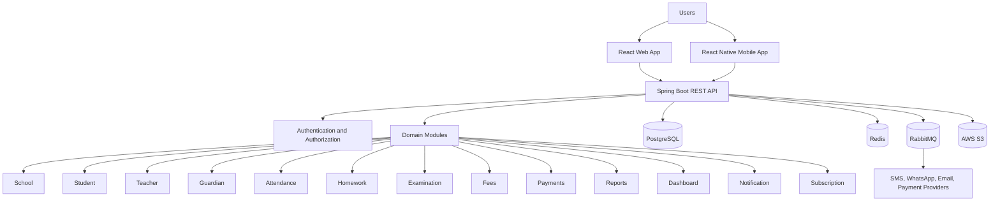
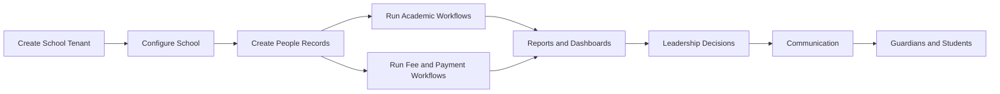
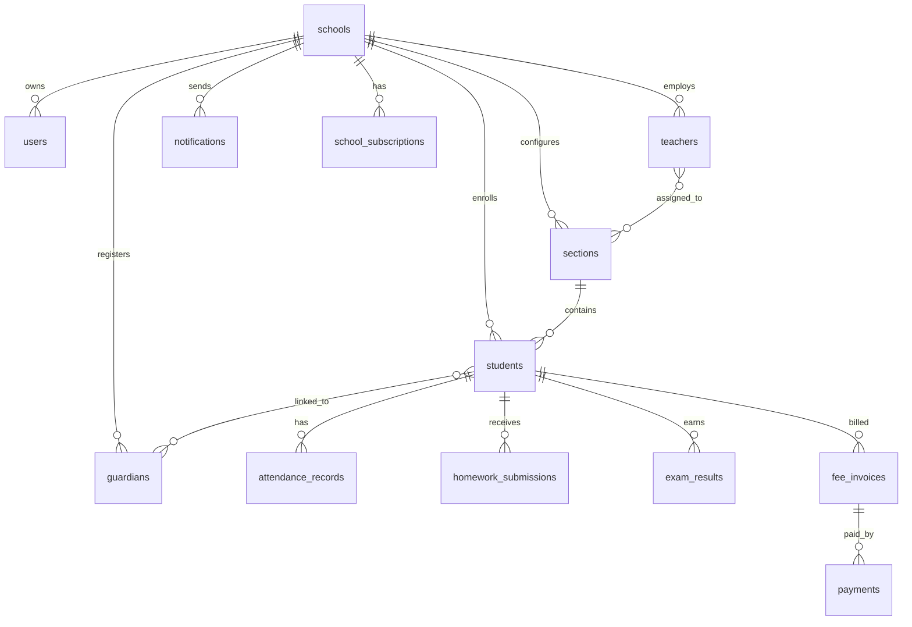
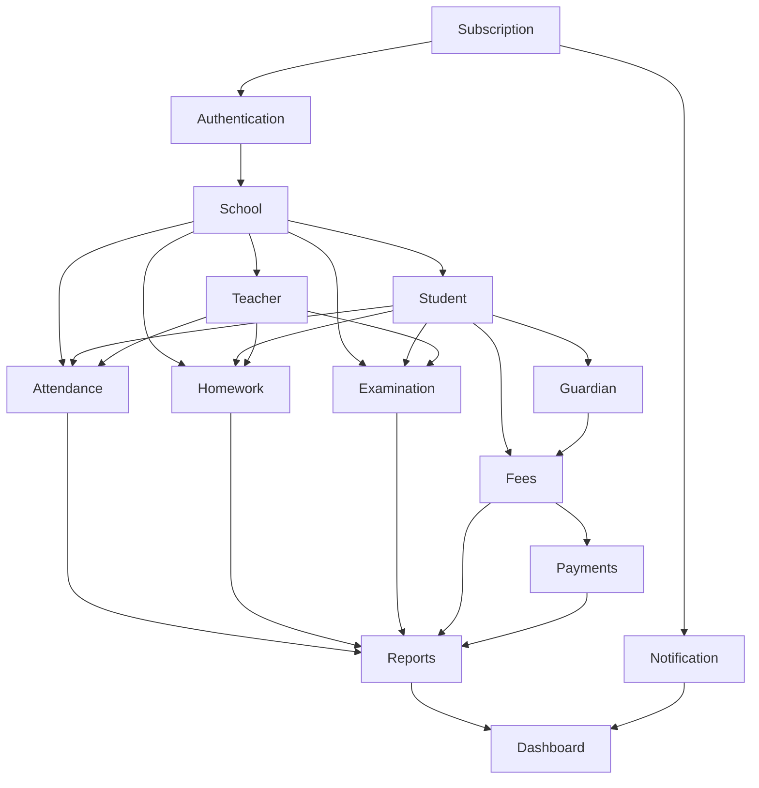
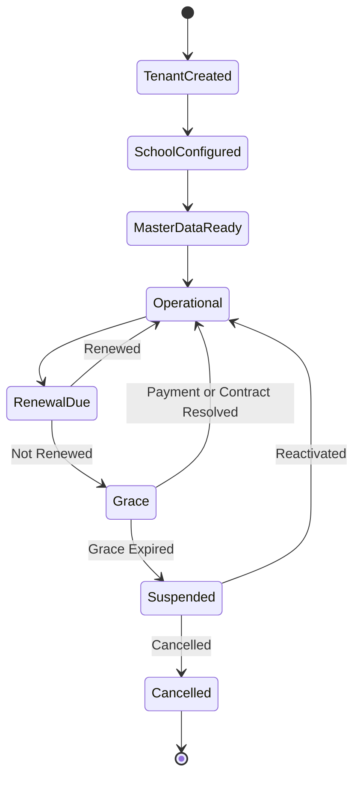

# EduSync Product Requirements Document

| Field | Value |
| --- | --- |
| Product | EduSync |
| Document Type | Product Requirements Document |
| Version | 1.0.0 |
| Status | Draft for Product and Architecture Review |
| Author | EduSync Product, Architecture, Engineering, Security, and UX Office |
| Target Market | India |
| Future Market | Global |
| Target Institutions | Private Schools, CBSE Schools, ICSE Schools, State Board Schools, Coaching Institutes |
| Target Institution Size | 200-5,000 students |
| Last Updated | 2026-07-02 |

## Overview

EduSync is a cloud-native, multi-tenant School Management SaaS platform designed to operate as the digital system of record for modern schools and coaching institutes. The product consolidates identity, school configuration, student records, teacher records, guardian engagement, attendance, homework, examinations, fees, payments, reports, dashboards, notifications, and subscriptions into a single secure platform.

This Product Requirements Document defines the enterprise product requirements for the first major product baseline of EduSync. It describes product goals, scope, module behavior, business rules, functional requirements, validation rules, dependencies, acceptance criteria, future enhancements, non-functional expectations, and release readiness criteria.

EduSync must be built as production SaaS software. Every product requirement must support tenant isolation, security, maintainability, scale, role-based access, auditability, usability, and long-term extensibility.

## Purpose

The purpose of this PRD is to provide a complete product definition that can be used by product managers, engineering teams, architects, UX designers, QA engineers, security reviewers, implementation teams, support teams, sales teams, and executive stakeholders.

This document must be used to:

- Align product scope across all primary EduSync modules.
- Define what each module must accomplish for the school and for the SaaS business.
- Establish business rules and validation rules before implementation.
- Provide acceptance criteria for product readiness and QA validation.
- Clarify module dependencies and sequencing.
- Support future software requirements, architecture documents, API specifications, database design, UX specifications, test strategy, and release planning.

### Product Delivery Flow

## Scope

This PRD covers the following product modules:

- Authentication
- School
- Student
- Teacher
- Guardian
- Attendance
- Homework
- Examination
- Fees
- Payments
- Reports
- Dashboard
- Notification
- Subscription

This document focuses on product behavior and business capability. It does not define low-level database schemas, API endpoint contracts, frontend component specifications, infrastructure topology, deployment runbooks, or test automation implementation. Those artifacts must be created separately and must conform to this PRD.

## Product Vision

EduSync will become the most trusted AI-powered school management SaaS platform for modern schools, beginning in India and expanding globally. The product must help schools manage daily operations with clarity, accuracy, accountability, and speed.

The product vision is to create a single platform where schools can manage people, academics, attendance, fees, payments, communication, reporting, and institutional decisions through secure, role-aware workflows.

## Product Goals

| Goal | Description | Business Outcome |
| --- | --- | --- |
| Unified school operations | Provide one platform for core school workflows. | Reduced fragmentation and operational overhead. |
| Secure multi-tenancy | Isolate every school's data and configuration. | Trust, compliance readiness, and SaaS scalability. |
| Accurate institutional data | Maintain structured records for students, guardians, teachers, attendance, fees, payments, and academics. | Better reporting and fewer disputes. |
| Daily workflow adoption | Make repeated workflows fast and usable for administrators, teachers, finance teams, parents, and leadership. | Higher retention and stronger product dependency. |
| Financial visibility | Provide fee setup, invoicing, payment tracking, dues, receipts, and reconciliation. | Improved fee collection discipline. |
| Parent and guardian engagement | Provide timely communication and self-service access. | Higher parent satisfaction and fewer repetitive inquiries. |
| Leadership intelligence | Provide dashboards and reports that support school governance. | Faster decisions and operational visibility. |
| Extensible SaaS platform | Support future modules, integrations, AI, and global localization. | Long-term product growth. |

## Product Principles

- Every tenant-owned record must be associated with `school_id`.
- Every tenant-owned query must enforce tenant isolation.
- Every module must be designed for role-based access control.
- Sensitive actions must be auditable.
- Product workflows must be simple enough for non-technical school staff.
- Product configuration must be preferred over customer-specific customization.
- Financial and academic records must preserve historical accuracy.
- AI-assisted features, when introduced, must remain controlled and reviewable.
- The platform must support modular monolith delivery while remaining microservice-ready.

## Product Architecture Context

## User Roles

| Role | Description | Primary Product Needs |
| --- | --- | --- |
| Platform Super Admin | EduSync internal user managing tenants, subscriptions, support, and platform controls. | Tenant provisioning, subscription control, support diagnostics, audit visibility. |
| School Owner | Business owner, trust representative, or management leader. | Executive dashboards, fee visibility, reports, branch or school governance. |
| Principal | Academic and operational head of the school. | Attendance, academic reports, teacher oversight, communication approvals, dashboards. |
| School Administrator | Staff user responsible for configuration, records, and daily administration. | School setup, student records, guardian records, teacher records, reports. |
| Finance User | Staff user responsible for fees, payments, receipts, dues, and reconciliation. | Fee setup, invoices, payments, discounts, receipts, reports. |
| Teacher | Academic staff responsible for class activities and student work. | Attendance, homework, marks entry, student view, communication. |
| Guardian | Parent or authorized responsible person for a student. | Student updates, attendance, homework, fee payment, notices, results. |
| Student | Learner enrolled in the school or coaching institute. | Homework, exam results, notifications, academic status. |

## Business Rules

| Rule ID | Rule | Priority |
| --- | --- | --- |
| PBR-001 | Every school must be represented as an isolated tenant. | Critical |
| PBR-002 | Every tenant-owned table must include `school_id`. | Critical |
| PBR-003 | Every tenant-owned query must filter by `school_id`. | Critical |
| PBR-004 | Users must only access modules and records permitted by assigned role and permissions. | Critical |
| PBR-005 | Sensitive operations must create audit log entries. | Critical |
| PBR-006 | Financial transactions must preserve immutable history and controlled correction workflows. | Critical |
| PBR-007 | Academic records must preserve historical context across academic years. | High |
| PBR-008 | Parent-facing data must only be shown to guardians linked to the student. | Critical |
| PBR-009 | Subscription plan status must control feature availability. | High |
| PBR-010 | Notifications must be traceable by recipient, channel, status, and originating module. | High |

## Functional Requirements

At the product level, EduSync must provide:

- Secure authentication and authorization.
- School tenant configuration and academic setup.
- Student, teacher, and guardian profile management.
- Attendance capture, correction, reporting, and guardian notification.
- Homework creation, assignment, tracking, and visibility.
- Examination setup, marks entry, result processing, and report publication.
- Fee structure setup, invoices, dues, receipts, discounts, and reports.
- Payment initiation, confirmation, reconciliation, and failure handling.
- Operational, academic, financial, and executive reports.
- Role-specific dashboards.
- Multi-channel notifications.
- Subscription plan and entitlement management.

## Non Functional Requirements

| Category | Requirement |
| --- | --- |
| Security | Support secure authentication, authorization, tenant isolation, input validation, audit logging, and least privilege access. |
| Availability | Support reliable daily school operations with defined uptime targets. |
| Performance | Common workflows must load quickly under expected school-level concurrency. |
| Scalability | Support growth in schools, users, students, records, notifications, and payment transactions. |
| Maintainability | Follow clean architecture, domain-driven design, SOLID principles, and modular boundaries. |
| Usability | Provide role-specific workflows that reduce training burden and repeated data entry. |
| Auditability | Sensitive changes must be traceable by actor, timestamp, action, and record. |
| Data Integrity | Business-critical records must preserve correctness across updates, status changes, and academic years. |
| Observability | Logs, metrics, and alerts must support production support and incident response. |
| Compatibility | Documentation must remain Markdown and MkDocs compatible, with Mermaid diagrams where appropriate. |

## Product Lifecycle Flow

## Module Requirements

## Authentication Module

### Objectives

| Objective | Description |
| --- | --- |
| Secure platform access | Ensure only authenticated users can access EduSync. |
| Tenant-aware identity | Associate every school user session with the correct tenant context. |
| Role-based access | Enforce permissions by user role, module, action, and record scope. |
| Account lifecycle control | Support creation, activation, deactivation, password reset, and secure recovery. |
| Audit-sensitive access | Track login, logout, failed attempts, password changes, and privileged actions. |

### Business Rules

| Rule ID | Rule |
| --- | --- |
| AUTH-BR-001 | A user must authenticate before accessing protected EduSync features. |
| AUTH-BR-002 | A school user must be linked to exactly one active school tenant unless explicitly designed for platform support. |
| AUTH-BR-003 | Platform super admins must use separate privileged access controls. |
| AUTH-BR-004 | Inactive, suspended, or deleted users must not be able to authenticate. |
| AUTH-BR-005 | Password reset must verify user identity through approved recovery flow. |
| AUTH-BR-006 | Failed login attempts must be rate-limited and auditable. |
| AUTH-BR-007 | Session tokens must not expose sensitive user or tenant data. |
| AUTH-BR-008 | Authorization must be enforced server-side for every protected API operation. |

### Functional Requirements

| ID | Requirement | Priority |
| --- | --- | --- |
| AUTH-FR-001 | Provide login using registered identifier and password. | Critical |
| AUTH-FR-002 | Provide logout and session termination. | Critical |
| AUTH-FR-003 | Provide password reset request and password reset completion flows. | Critical |
| AUTH-FR-004 | Support role and permission assignment. | Critical |
| AUTH-FR-005 | Resolve tenant context after successful authentication. | Critical |
| AUTH-FR-006 | Enforce permission checks at API level. | Critical |
| AUTH-FR-007 | Record authentication events in audit logs. | High |
| AUTH-FR-008 | Support account activation, deactivation, and lockout workflows. | High |
| AUTH-FR-009 | Support secure refresh of authenticated sessions. | High |
| AUTH-FR-010 | Display role-appropriate navigation and available actions. | High |

### Validation Rules

| Field or Action | Validation Rule |
| --- | --- |
| Login identifier | Must be present and match a registered user account format. |
| Password | Must be present and validated against stored secure password hash. |
| New password | Must meet configured strength policy. |
| Tenant context | Must resolve to an active tenant for school users. |
| Role assignment | Must use an existing active role within the user's tenant or platform context. |
| Password reset token | Must be valid, unexpired, single-use, and linked to the requesting account. |
| API access | Must include valid authentication and sufficient authorization. |

### Dependencies

| Dependency | Description |
| --- | --- |
| School Module | Provides tenant status and school context. |
| Subscription Module | Determines whether tenant access is active or restricted. |
| Notification Module | Sends password reset and security notifications. |
| Audit Logging | Records authentication and authorization events. |
| Security Configuration | Provides password policy, token policy, and access rules. |

### Acceptance Criteria

| ID | Acceptance Criteria |
| --- | --- |
| AUTH-AC-001 | Given valid credentials for an active user, the system authenticates the user and resolves the correct tenant context. |
| AUTH-AC-002 | Given invalid credentials, the system denies access without revealing whether the identifier or password is incorrect. |
| AUTH-AC-003 | Given an inactive user, the system denies login and records the event. |
| AUTH-AC-004 | Given a user without permission for a module action, the API rejects the request. |
| AUTH-AC-005 | Given a password reset request for a valid account, the system sends a secure reset notification. |
| AUTH-AC-006 | Given an expired reset token, the system rejects the reset attempt. |
| AUTH-AC-007 | Authentication events are visible in audit records to authorized administrators. |

### Future Enhancements

| Enhancement | Business Value |
| --- | --- |
| Multi-factor authentication | Improves account security for administrators and finance users. |
| Single sign-on | Supports enterprise school groups. |
| Device management | Allows schools to monitor and revoke active devices. |
| Adaptive risk-based login | Reduces unauthorized access risk. |
| Parent OTP login | Simplifies guardian access while maintaining security. |

## School Module

### Objectives

| Objective | Description |
| --- | --- |
| Tenant foundation | Represent each school as an isolated tenant. |
| Institutional profile | Maintain school identity, contact, affiliation, and configuration details. |
| Academic structure | Configure academic years, classes, sections, subjects, and operational calendars. |
| Policy configuration | Provide school-level defaults for attendance, fees, notifications, and reporting. |
| Operational readiness | Support onboarding and setup before school workflows go live. |

### Business Rules

| Rule ID | Rule |
| --- | --- |
| SCHOOL-BR-001 | Each school must have a unique tenant identity. |
| SCHOOL-BR-002 | School records must include `school_id` for tenant-owned data. |
| SCHOOL-BR-003 | A school cannot run student workflows until mandatory setup is complete. |
| SCHOOL-BR-004 | Academic years must not overlap within the same school unless explicitly configured for special cases. |
| SCHOOL-BR-005 | Class and section names must be unique within an academic year scope. |
| SCHOOL-BR-006 | School status must control access to tenant features. |
| SCHOOL-BR-007 | Only authorized users may update school configuration. |
| SCHOOL-BR-008 | Changes to critical school settings must be audited. |

### Functional Requirements

| ID | Requirement | Priority |
| --- | --- | --- |
| SCHOOL-FR-001 | Create and maintain school tenant profiles. | Critical |
| SCHOOL-FR-002 | Configure school name, code, address, contacts, board affiliation, and institution type. | Critical |
| SCHOOL-FR-003 | Configure academic years with start and end dates. | Critical |
| SCHOOL-FR-004 | Configure classes, sections, and subjects. | Critical |
| SCHOOL-FR-005 | Configure school-level roles and assign users to roles. | High |
| SCHOOL-FR-006 | Configure operational calendars and holidays. | High |
| SCHOOL-FR-007 | Configure attendance, fee, notification, and report defaults. | High |
| SCHOOL-FR-008 | Activate, suspend, or archive school tenants through authorized workflows. | Critical |
| SCHOOL-FR-009 | Display setup completion status. | Medium |
| SCHOOL-FR-010 | Export school configuration for authorized users. | Medium |

### Validation Rules

| Field or Action | Validation Rule |
| --- | --- |
| School name | Required and must be unique within platform naming constraints where applicable. |
| School code | Required, unique, URL-safe or system-safe, and immutable after activation unless approved. |
| Academic year dates | Start date must be before end date. |
| Class name | Required and unique within the school and academic year. |
| Section name | Required and unique within class scope. |
| Contact email | Must use valid email format when provided. |
| Contact phone | Must use valid regional phone format when provided. |
| Tenant status change | Must be performed by authorized role and recorded in audit logs. |

### Dependencies

| Dependency | Description |
| --- | --- |
| Authentication Module | Controls school admin access to configuration. |
| Subscription Module | Determines tenant plan and active status. |
| Student Module | Uses school academic structure. |
| Teacher Module | Uses classes, sections, and subjects. |
| Attendance Module | Uses academic calendar and class structure. |
| Fees Module | Uses academic year and class mapping. |
| Notification Module | Uses school communication defaults. |

### Acceptance Criteria

| ID | Acceptance Criteria |
| --- | --- |
| SCHOOL-AC-001 | A platform admin can create a school tenant with required details. |
| SCHOOL-AC-002 | A school admin can configure academic year, classes, sections, and subjects. |
| SCHOOL-AC-003 | Duplicate class-section combinations are rejected within the same academic year. |
| SCHOOL-AC-004 | A suspended school tenant cannot access restricted operational features. |
| SCHOOL-AC-005 | Critical school configuration changes are visible in audit logs. |
| SCHOOL-AC-006 | Other modules cannot create tenant-owned records without valid `school_id`. |

### Future Enhancements

| Enhancement | Business Value |
| --- | --- |
| Multi-branch school group management | Supports school chains and centralized governance. |
| Board-specific templates | Speeds setup for CBSE, ICSE, and state boards. |
| Configuration import wizard | Reduces onboarding effort. |
| Localization profiles | Enables global market expansion. |
| School compliance document repository | Supports institutional governance. |

## Student Module

### Objectives

| Objective | Description |
| --- | --- |
| Student system of record | Maintain authoritative student profiles for all school workflows. |
| Lifecycle management | Support enquiry, admission, active enrollment, transfer, alumni, and inactive statuses. |
| Academic assignment | Link students to academic year, class, section, roll number, and subjects where applicable. |
| Guardian linkage | Maintain accurate guardian relationships and communication access. |
| Operational continuity | Preserve historical student records across academic years. |

### Business Rules

| Rule ID | Rule |
| --- | --- |
| STUDENT-BR-001 | Every student must belong to exactly one school tenant. |
| STUDENT-BR-002 | Active students must be linked to an academic year and class-section assignment. |
| STUDENT-BR-003 | Student admission number must be unique within a school. |
| STUDENT-BR-004 | A student must have at least one active guardian for parent-facing workflows. |
| STUDENT-BR-005 | Student status changes must preserve historical records. |
| STUDENT-BR-006 | Student records must not be deleted when referenced by attendance, fees, payments, or examination records. |
| STUDENT-BR-007 | Sensitive student profile changes must be audited. |
| STUDENT-BR-008 | Guardian access must be limited to linked students. |

### Functional Requirements

| ID | Requirement | Priority |
| --- | --- | --- |
| STUDENT-FR-001 | Create student profiles with demographic, admission, academic, and contact details. | Critical |
| STUDENT-FR-002 | Update student profile details by authorized users. | Critical |
| STUDENT-FR-003 | Assign students to academic year, class, section, and roll number. | Critical |
| STUDENT-FR-004 | Link students to one or more guardians. | Critical |
| STUDENT-FR-005 | Search and filter students by name, admission number, class, section, status, and guardian. | High |
| STUDENT-FR-006 | Change student status through controlled workflows. | High |
| STUDENT-FR-007 | Maintain student academic history across years. | High |
| STUDENT-FR-008 | Upload or link student documents where enabled. | Medium |
| STUDENT-FR-009 | Export student lists by authorized role. | Medium |
| STUDENT-FR-010 | Detect potential duplicate student records. | Medium |

### Validation Rules

| Field or Action | Validation Rule |
| --- | --- |
| Student name | Required and must meet name length and character policy. |
| Admission number | Required and unique within school. |
| Date of birth | Must be a valid date and consistent with school policy where configured. |
| Class-section assignment | Must reference active class and section in the current school. |
| Roll number | Must be unique within class-section where configured. |
| Status change | Must use an allowed transition. |
| Guardian linkage | Must reference an active guardian in the same school tenant. |
| Document upload | Must comply with allowed file type and size policy. |

### Dependencies

| Dependency | Description |
| --- | --- |
| School Module | Provides academic year, class, section, subject, and calendar configuration. |
| Guardian Module | Provides guardian relationship records. |
| Attendance Module | Uses student enrollment and class-section assignment. |
| Homework Module | Uses student class-section membership. |
| Examination Module | Uses student academic assignment and subjects. |
| Fees Module | Uses student fee applicability. |
| Payments Module | Uses student invoice and guardian payment context. |
| Reports Module | Uses student profile and historical academic data. |

### Acceptance Criteria

| ID | Acceptance Criteria |
| --- | --- |
| STUDENT-AC-001 | An authorized admin can create a student with mandatory details and class-section assignment. |
| STUDENT-AC-002 | Duplicate admission numbers within the same school are rejected. |
| STUDENT-AC-003 | A student cannot be linked to a class-section from another school. |
| STUDENT-AC-004 | A guardian can view only students linked to that guardian. |
| STUDENT-AC-005 | Student status changes preserve historical attendance, fee, and exam records. |
| STUDENT-AC-006 | Student search returns only records belonging to the active school tenant. |

### Future Enhancements

| Enhancement | Business Value |
| --- | --- |
| Admissions pipeline | Supports enquiry-to-admission conversion. |
| Student health profile | Supports safety and emergency readiness. |
| Student behavior and discipline tracking | Enables structured interventions. |
| Alumni management | Supports long-term engagement. |
| AI duplicate detection | Improves data quality during migration and onboarding. |

## Teacher Module

### Objectives

| Objective | Description |
| --- | --- |
| Teacher system of record | Maintain authoritative teacher profiles and assignments. |
| Academic responsibility mapping | Link teachers to classes, sections, subjects, and responsibilities. |
| Workflow enablement | Allow teachers to manage attendance, homework, examinations, and communication. |
| Staff accountability | Track teacher-driven actions in academic workflows. |
| Operational visibility | Support principal and admin oversight of teacher activity. |

### Business Rules

| Rule ID | Rule |
| --- | --- |
| TEACHER-BR-001 | Every teacher must belong to one school tenant. |
| TEACHER-BR-002 | A teacher must have an active user account to access teacher workflows. |
| TEACHER-BR-003 | Teacher class and subject assignments must be valid within the school academic structure. |
| TEACHER-BR-004 | Teachers may only mark attendance or enter marks for assigned classes unless granted elevated permission. |
| TEACHER-BR-005 | Inactive teachers must not access operational workflows. |
| TEACHER-BR-006 | Teacher assignment changes must not invalidate historical records. |
| TEACHER-BR-007 | Sensitive profile and assignment changes must be audited. |

### Functional Requirements

| ID | Requirement | Priority |
| --- | --- | --- |
| TEACHER-FR-001 | Create and maintain teacher profiles. | Critical |
| TEACHER-FR-002 | Link teacher profiles to user accounts. | Critical |
| TEACHER-FR-003 | Assign teachers to classes, sections, and subjects. | Critical |
| TEACHER-FR-004 | Assign class teacher responsibilities. | High |
| TEACHER-FR-005 | Search and filter teachers by name, subject, class assignment, and status. | High |
| TEACHER-FR-006 | Enable teachers to access assigned attendance, homework, and examination workflows. | Critical |
| TEACHER-FR-007 | Track teacher actions in audit logs where required. | High |
| TEACHER-FR-008 | Deactivate teacher access when employment or assignment ends. | Critical |
| TEACHER-FR-009 | Maintain teacher assignment history. | Medium |

### Validation Rules

| Field or Action | Validation Rule |
| --- | --- |
| Teacher name | Required. |
| Employee code | Unique within school when configured. |
| Email or phone | Required when login or notification access is enabled. |
| User account link | Must reference an active or pending account in the same school tenant. |
| Subject assignment | Must reference an active subject configured for the school. |
| Class-section assignment | Must reference an active class-section in the same school. |
| Deactivation | Must preserve historical activity records. |

### Dependencies

| Dependency | Description |
| --- | --- |
| Authentication Module | Provides teacher login and permissions. |
| School Module | Provides classes, sections, subjects, and academic year. |
| Attendance Module | Uses teacher assignments for access control. |
| Homework Module | Uses teacher assignments for task creation. |
| Examination Module | Uses teacher assignments for marks entry. |
| Notification Module | Sends teacher-related alerts. |
| Reports Module | Provides teacher activity and academic reports. |

### Acceptance Criteria

| ID | Acceptance Criteria |
| --- | --- |
| TEACHER-AC-001 | An admin can create a teacher and assign subjects and classes. |
| TEACHER-AC-002 | A teacher can access only assigned class workflows unless additional permission exists. |
| TEACHER-AC-003 | Inactive teachers cannot log in or perform teacher actions. |
| TEACHER-AC-004 | Teacher assignment updates do not remove historical records. |
| TEACHER-AC-005 | Principal can view teacher assignment and activity information. |

### Future Enhancements

| Enhancement | Business Value |
| --- | --- |
| Teacher workload analytics | Helps principals balance responsibilities. |
| Lesson planning | Expands teacher productivity value. |
| Substitute teacher workflow | Supports operational continuity. |
| Teacher performance indicators | Supports leadership review. |
| AI-assisted teaching support | Helps draft assignments, notices, and summaries. |

## Guardian Module

### Objectives

| Objective | Description |
| --- | --- |
| Guardian system of record | Maintain accurate parent and guardian profiles. |
| Student relationship mapping | Link guardians to students with relationship, responsibility, and communication preferences. |
| Parent access control | Ensure guardians can access only authorized student information. |
| Communication accuracy | Provide reliable contact data for notifications and fee reminders. |
| Payment enablement | Support guardian-facing fee and payment workflows. |

### Business Rules

| Rule ID | Rule |
| --- | --- |
| GUARDIAN-BR-001 | Every guardian must belong to a school tenant. |
| GUARDIAN-BR-002 | Guardian access must be limited to linked students. |
| GUARDIAN-BR-003 | A student must have at least one active guardian for parent-facing workflows. |
| GUARDIAN-BR-004 | Primary guardian designation must be unique per student where configured. |
| GUARDIAN-BR-005 | Guardian contact changes must be auditable when used for official communication. |
| GUARDIAN-BR-006 | Inactive guardians must not receive official notifications unless retained for historical reporting. |
| GUARDIAN-BR-007 | Payment receipts must be visible only to authorized guardians and school finance users. |

### Functional Requirements

| ID | Requirement | Priority |
| --- | --- | --- |
| GUARDIAN-FR-001 | Create and maintain guardian profiles. | Critical |
| GUARDIAN-FR-002 | Link guardians to one or more students. | Critical |
| GUARDIAN-FR-003 | Define relationship type such as father, mother, legal guardian, or emergency contact. | High |
| GUARDIAN-FR-004 | Maintain contact details and communication preferences. | Critical |
| GUARDIAN-FR-005 | Provide guardian login or portal access where enabled. | Critical |
| GUARDIAN-FR-006 | Show linked student attendance, homework, fees, payments, notices, and results according to permissions. | High |
| GUARDIAN-FR-007 | Support guardian deactivation without deleting historical links. | High |
| GUARDIAN-FR-008 | Detect duplicate guardian contact profiles. | Medium |

### Validation Rules

| Field or Action | Validation Rule |
| --- | --- |
| Guardian name | Required. |
| Relationship | Required when linked to a student. |
| Phone | Required for SMS or WhatsApp communication and must match valid phone format. |
| Email | Required for email communication and must match valid email format. |
| Student link | Must reference a student in the same school tenant. |
| Primary guardian | Only one primary guardian per student where primary designation is enabled. |
| Portal access | Requires verified contact method or approved account setup. |

### Dependencies

| Dependency | Description |
| --- | --- |
| Student Module | Provides linked student records. |
| Authentication Module | Provides guardian portal access. |
| Notification Module | Sends guardian communications. |
| Fees Module | Provides fee dues and invoices. |
| Payments Module | Supports guardian payments. |
| Attendance Module | Provides attendance visibility. |
| Homework Module | Provides homework visibility. |
| Examination Module | Provides result visibility. |

### Acceptance Criteria

| ID | Acceptance Criteria |
| --- | --- |
| GUARDIAN-AC-001 | An admin can create a guardian and link the guardian to a student. |
| GUARDIAN-AC-002 | A guardian can view only linked student information. |
| GUARDIAN-AC-003 | Notification delivery uses active guardian contact preferences. |
| GUARDIAN-AC-004 | A student cannot be left without an active guardian if school policy requires one. |
| GUARDIAN-AC-005 | Deactivated guardians no longer receive new official communications. |

### Future Enhancements

| Enhancement | Business Value |
| --- | --- |
| Guardian consent management | Improves privacy and communication governance. |
| Multi-language parent portal | Supports regional accessibility. |
| Emergency contact workflows | Improves student safety response. |
| Guardian engagement analytics | Helps schools measure communication effectiveness. |
| OTP-first guardian login | Reduces password friction for parents. |

## Attendance Module

### Objectives

| Objective | Description |
| --- | --- |
| Daily attendance capture | Enable fast and accurate student and staff attendance workflows. |
| Absence visibility | Provide timely visibility into absenteeism, late arrivals, and leave. |
| Guardian communication | Notify guardians according to school policy. |
| Historical reporting | Preserve attendance history across academic periods. |
| Operational accountability | Track who marked or modified attendance. |

### Business Rules

| Rule ID | Rule |
| --- | --- |
| ATT-BR-001 | Attendance records must belong to a school tenant. |
| ATT-BR-002 | Attendance can be marked only for active students in a valid class-section. |
| ATT-BR-003 | Attendance date must fall within the active academic year or configured attendance period. |
| ATT-BR-004 | Teachers may mark attendance only for assigned class-sections unless granted permission. |
| ATT-BR-005 | Attendance corrections must be auditable. |
| ATT-BR-006 | Duplicate attendance records for the same student, date, session, and class context must not exist. |
| ATT-BR-007 | Guardian notifications for absence must follow school notification policy. |
| ATT-BR-008 | Attendance reports must include only authorized tenant data. |

### Functional Requirements

| ID | Requirement | Priority |
| --- | --- | --- |
| ATT-FR-001 | Mark daily student attendance by class-section. | Critical |
| ATT-FR-002 | Support attendance statuses such as present, absent, late, leave, and half day. | Critical |
| ATT-FR-003 | Support attendance review before submission. | High |
| ATT-FR-004 | Support authorized attendance correction with reason. | High |
| ATT-FR-005 | Notify guardians for absence or configured events. | High |
| ATT-FR-006 | Provide attendance summary by student, class, date, month, and academic year. | Critical |
| ATT-FR-007 | Support teacher or staff attendance where enabled. | Medium |
| ATT-FR-008 | Prevent unauthorized users from marking attendance. | Critical |
| ATT-FR-009 | Show attendance completion status to administrators and principals. | High |
| ATT-FR-010 | Export attendance reports for authorized users. | Medium |

### Validation Rules

| Field or Action | Validation Rule |
| --- | --- |
| Attendance date | Must be valid and within permitted marking range. |
| Student | Must be active and assigned to the selected class-section. |
| Status | Must be one of the configured attendance statuses. |
| Correction reason | Required when submitted attendance is modified. |
| Teacher access | Teacher must be assigned to the class-section or have elevated permission. |
| Duplicate record | Same student-date-session combination must be unique within school. |
| Notification trigger | Must follow configured school policy. |

### Dependencies

| Dependency | Description |
| --- | --- |
| School Module | Provides academic calendar, classes, sections, and working days. |
| Student Module | Provides active students and class-section assignment. |
| Teacher Module | Provides teacher assignments. |
| Guardian Module | Provides guardian notification recipients. |
| Notification Module | Sends absence or attendance alerts. |
| Reports Module | Provides attendance reports. |
| Dashboard Module | Displays attendance trends and completion. |

### Acceptance Criteria

| ID | Acceptance Criteria |
| --- | --- |
| ATT-AC-001 | A teacher can mark attendance for an assigned class-section. |
| ATT-AC-002 | The system prevents duplicate attendance for the same student, date, and session. |
| ATT-AC-003 | An authorized correction requires a reason and creates an audit record. |
| ATT-AC-004 | Guardian absence notification is sent when enabled by school policy. |
| ATT-AC-005 | Principal can view attendance completion and absentee summaries. |
| ATT-AC-006 | Attendance reports show only data for the active school tenant. |

### Future Enhancements

| Enhancement | Business Value |
| --- | --- |
| Biometric device integration | Automates staff or student attendance where hardware exists. |
| QR-based attendance | Speeds classroom or event attendance. |
| Attendance risk prediction | Identifies students needing intervention. |
| Leave management workflow | Adds structured approval process. |
| Offline attendance capture | Supports low-connectivity environments. |

## Homework Module

### Objectives

| Objective | Description |
| --- | --- |
| Academic task assignment | Enable teachers to create and assign homework to students. |
| Parent visibility | Provide guardians visibility into assigned homework and due dates. |
| Student accountability | Help students track assigned tasks. |
| Teacher productivity | Reduce repetitive communication and manual tracking. |
| Academic history | Preserve homework records for review and reporting. |

### Business Rules

| Rule ID | Rule |
| --- | --- |
| HW-BR-001 | Homework must belong to a school tenant. |
| HW-BR-002 | Homework must be assigned to a valid class-section or student group. |
| HW-BR-003 | Teachers may create homework only for assigned subjects or classes unless permitted. |
| HW-BR-004 | Due date must not be earlier than assignment date unless explicitly allowed. |
| HW-BR-005 | Published homework must be visible to linked guardians and students. |
| HW-BR-006 | Homework edits after publication must be tracked. |
| HW-BR-007 | Attachments must follow file type and size policy. |

### Functional Requirements

| ID | Requirement | Priority |
| --- | --- | --- |
| HW-FR-001 | Create homework with title, description, subject, class-section, assignment date, and due date. | Critical |
| HW-FR-002 | Save homework as draft before publication. | High |
| HW-FR-003 | Publish homework to students and guardians. | Critical |
| HW-FR-004 | Add attachments or reference links where enabled. | Medium |
| HW-FR-005 | Notify students and guardians when homework is published. | High |
| HW-FR-006 | Track homework status where submission tracking is enabled. | Medium |
| HW-FR-007 | Search and filter homework by class, subject, teacher, date, and status. | High |
| HW-FR-008 | Allow authorized edits and cancellations. | High |
| HW-FR-009 | Show homework calendar to students and guardians. | Medium |

### Validation Rules

| Field or Action | Validation Rule |
| --- | --- |
| Title | Required and must meet length limits. |
| Description | Required for published homework. |
| Subject | Must be active and linked to the selected class where applicable. |
| Class-section | Must exist within the same school tenant. |
| Due date | Must be valid and not earlier than assignment date unless policy permits. |
| Attachment | Must comply with file type, size, and security scanning policy. |
| Publish action | Requires teacher assignment or authorized permission. |

### Dependencies

| Dependency | Description |
| --- | --- |
| School Module | Provides class, section, subject, and calendar configuration. |
| Teacher Module | Provides teacher subject and class assignments. |
| Student Module | Provides assigned students. |
| Guardian Module | Provides guardian recipients. |
| Notification Module | Sends homework alerts. |
| Reports Module | Provides homework activity reports. |
| AWS S3 Storage | Stores homework attachments where enabled. |

### Acceptance Criteria

| ID | Acceptance Criteria |
| --- | --- |
| HW-AC-001 | A teacher can create and publish homework for an assigned class and subject. |
| HW-AC-002 | Guardians linked to students in the assigned class can view published homework. |
| HW-AC-003 | Unauthorized teachers cannot publish homework for unassigned classes. |
| HW-AC-004 | Homework with invalid due dates is rejected. |
| HW-AC-005 | Published homework triggers notifications according to school policy. |
| HW-AC-006 | Homework edits after publication are auditable. |

### Future Enhancements

| Enhancement | Business Value |
| --- | --- |
| Student submission workflow | Enables digital homework collection. |
| Grading and feedback | Improves academic tracking. |
| AI homework drafting | Saves teacher time. |
| Plagiarism checks | Supports academic integrity. |
| Recurring homework templates | Reduces repeated teacher effort. |

## Examination Module

### Objectives

| Objective | Description |
| --- | --- |
| Exam lifecycle management | Support exam setup, subject mapping, marks entry, validation, and publication. |
| Accurate academic records | Maintain reliable marks, grades, and report card data. |
| Controlled publication | Ensure results are reviewed and approved before parent or student visibility. |
| Academic reporting | Provide class, subject, student, and exam-level performance reports. |
| Historical continuity | Preserve exam results across academic years. |

### Business Rules

| Rule ID | Rule |
| --- | --- |
| EXAM-BR-001 | Exams must belong to a school tenant and academic year. |
| EXAM-BR-002 | Exam schedules must reference active classes and subjects. |
| EXAM-BR-003 | Marks entry must be allowed only for authorized teachers or exam users. |
| EXAM-BR-004 | Marks must not exceed configured maximum marks. |
| EXAM-BR-005 | Published results must not be changed without authorized correction workflow. |
| EXAM-BR-006 | Report cards must be generated from approved marks. |
| EXAM-BR-007 | Guardians may view only results for linked students after publication. |
| EXAM-BR-008 | Exam configuration and result publication must be audited. |

### Functional Requirements

| ID | Requirement | Priority |
| --- | --- | --- |
| EXAM-FR-001 | Create exam terms or exam groups. | Critical |
| EXAM-FR-002 | Configure subjects, maximum marks, passing marks, grading rules, and weightage. | Critical |
| EXAM-FR-003 | Configure exam schedule by class and subject. | High |
| EXAM-FR-004 | Enter marks by student, class, subject, and exam. | Critical |
| EXAM-FR-005 | Validate marks against configured rules. | Critical |
| EXAM-FR-006 | Review, approve, and publish results. | Critical |
| EXAM-FR-007 | Generate student report cards. | High |
| EXAM-FR-008 | Provide performance summaries by class, subject, student, and exam. | High |
| EXAM-FR-009 | Support marks correction with reason and authorization. | High |
| EXAM-FR-010 | Notify guardians when results are published. | Medium |

### Validation Rules

| Field or Action | Validation Rule |
| --- | --- |
| Exam name | Required and unique within academic year where configured. |
| Subject | Must be active and mapped to selected class. |
| Maximum marks | Must be positive. |
| Passing marks | Must be less than or equal to maximum marks. |
| Marks entered | Must be numeric and within allowed range. |
| Result publication | Requires completion and approval according to school policy. |
| Correction | Requires reason, authorized role, and audit log. |
| Report card | Must use approved marks only. |

### Dependencies

| Dependency | Description |
| --- | --- |
| School Module | Provides academic year, classes, subjects, and grading configuration. |
| Student Module | Provides enrolled students. |
| Teacher Module | Provides subject teachers and marks entry permissions. |
| Guardian Module | Provides result visibility recipients. |
| Notification Module | Sends result publication alerts. |
| Reports Module | Provides academic performance reports. |
| Dashboard Module | Shows academic performance summaries. |

### Acceptance Criteria

| ID | Acceptance Criteria |
| --- | --- |
| EXAM-AC-001 | An authorized user can configure an exam with subjects and marks rules. |
| EXAM-AC-002 | Marks greater than maximum marks are rejected. |
| EXAM-AC-003 | Teachers can enter marks only for assigned subjects or permitted classes. |
| EXAM-AC-004 | Results are not visible to guardians before publication. |
| EXAM-AC-005 | Published result corrections require authorization and audit reason. |
| EXAM-AC-006 | Report cards are generated from approved result data. |

### Future Enhancements

| Enhancement | Business Value |
| --- | --- |
| Online assessments | Expands digital academic capability. |
| Question paper generator | Saves teacher and exam coordinator time. |
| Competency-based reporting | Supports modern assessment practices. |
| AI performance insights | Identifies learning gaps and intervention needs. |
| Board-specific report card templates | Improves fit for CBSE, ICSE, and state boards. |

## Fees Module

### Objectives

| Objective | Description |
| --- | --- |
| Fee structure management | Configure fee components, schedules, applicability, discounts, and due dates. |
| Invoice and dues control | Generate and track student fee obligations. |
| Financial transparency | Provide accurate fee status to finance users, leadership, and guardians. |
| Discount governance | Ensure fee concessions and waivers are authorized and auditable. |
| Reporting readiness | Support financial reports for collections, dues, discounts, and outstanding balances. |

### Business Rules

| Rule ID | Rule |
| --- | --- |
| FEE-BR-001 | Fee records must belong to a school tenant. |
| FEE-BR-002 | Fee structures must be linked to academic year and applicable class, student group, or student. |
| FEE-BR-003 | Fee invoices must be generated from approved fee structures. |
| FEE-BR-004 | Discounts and waivers require authorized access and audit trail. |
| FEE-BR-005 | Paid invoices must not be deleted. |
| FEE-BR-006 | Fee corrections must preserve historical payment and receipt records. |
| FEE-BR-007 | Guardians may view fee records only for linked students. |
| FEE-BR-008 | Due status must be calculated consistently from invoice, discount, payment, and adjustment records. |

### Functional Requirements

| ID | Requirement | Priority |
| --- | --- | --- |
| FEE-FR-001 | Create fee components such as tuition, transport, activity, admission, examination, or custom fees. | Critical |
| FEE-FR-002 | Create fee structures by academic year, class, section, student category, or individual student. | Critical |
| FEE-FR-003 | Configure due dates, installments, late fee rules, and applicability. | High |
| FEE-FR-004 | Generate invoices for students. | Critical |
| FEE-FR-005 | Apply authorized discounts, concessions, waivers, and adjustments. | High |
| FEE-FR-006 | Track paid, unpaid, partially paid, overdue, and adjusted statuses. | Critical |
| FEE-FR-007 | Generate receipts for recorded payments. | Critical |
| FEE-FR-008 | Provide fee dues and collection reports. | Critical |
| FEE-FR-009 | Send fee reminders through Notification Module. | High |
| FEE-FR-010 | Export fee ledgers for authorized users. | Medium |

### Validation Rules

| Field or Action | Validation Rule |
| --- | --- |
| Fee component name | Required and unique within school where configured. |
| Fee amount | Must be non-negative and use supported currency. |
| Due date | Must be valid and within academic year or configured billing period. |
| Fee structure | Must have at least one fee component and one applicability rule. |
| Invoice generation | Must reference active students and approved fee structure. |
| Discount amount | Must not exceed configured invoice balance unless policy allows credit. |
| Late fee | Must follow configured calculation rule. |
| Deletion | Must be blocked for paid or referenced fee records. |

### Dependencies

| Dependency | Description |
| --- | --- |
| School Module | Provides academic year, class, section, and configuration. |
| Student Module | Provides active students and fee applicability. |
| Guardian Module | Provides guardian visibility and reminder recipients. |
| Payments Module | Records and reconciles payment transactions. |
| Notification Module | Sends fee reminders and receipt alerts. |
| Reports Module | Provides finance reports. |
| Dashboard Module | Displays fee collection and dues summaries. |

### Acceptance Criteria

| ID | Acceptance Criteria |
| --- | --- |
| FEE-AC-001 | Finance user can create an approved fee structure for an academic year. |
| FEE-AC-002 | The system generates invoices only for eligible students. |
| FEE-AC-003 | Discount application requires permission and creates an audit record. |
| FEE-AC-004 | Paid invoices cannot be deleted. |
| FEE-AC-005 | Guardian can view dues only for linked students. |
| FEE-AC-006 | Fee reports reconcile invoice, discount, payment, and due values correctly. |

### Future Enhancements

| Enhancement | Business Value |
| --- | --- |
| Advanced scholarship workflows | Supports complex fee concessions. |
| Automated late fee processing | Reduces finance workload. |
| Accounting system integration | Improves finance operations. |
| Fee collection forecasting | Supports cash flow planning. |
| Multi-currency support | Enables global expansion. |

## Payments Module

### Objectives

| Objective | Description |
| --- | --- |
| Digital payment enablement | Allow guardians and finance users to record or initiate fee payments. |
| Payment status accuracy | Maintain reliable payment lifecycle states. |
| Reconciliation control | Match payment gateway confirmations with invoices and receipts. |
| Failure handling | Provide clear handling for failed, pending, duplicate, or partial payments. |
| Auditability | Preserve payment history and transaction traceability. |

### Business Rules

| Rule ID | Rule |
| --- | --- |
| PAY-BR-001 | Payment records must belong to a school tenant. |
| PAY-BR-002 | Payments must be associated with a student, invoice, or approved fee obligation. |
| PAY-BR-003 | Gateway payment confirmation must be verified before marking payment successful. |
| PAY-BR-004 | Duplicate payment notifications must be handled idempotently. |
| PAY-BR-005 | Refunds and reversals require authorized workflows. |
| PAY-BR-006 | Receipts must be generated only for successful or approved manual payments. |
| PAY-BR-007 | Guardians may pay or view payments only for linked students. |
| PAY-BR-008 | Payment records must not be physically deleted after creation. |

### Functional Requirements

| ID | Requirement | Priority |
| --- | --- | --- |
| PAY-FR-001 | Initiate online payment for selected fee invoices. | Critical |
| PAY-FR-002 | Record manual payments such as cash, cheque, bank transfer, or UPI where allowed. | Critical |
| PAY-FR-003 | Receive and validate payment gateway callbacks or webhooks. | Critical |
| PAY-FR-004 | Update payment status as initiated, pending, successful, failed, cancelled, refunded, or reversed. | Critical |
| PAY-FR-005 | Generate receipt after successful payment. | Critical |
| PAY-FR-006 | Reconcile payments against invoices and dues. | Critical |
| PAY-FR-007 | Support partial payments where school policy allows. | High |
| PAY-FR-008 | Provide payment history to finance users and authorized guardians. | High |
| PAY-FR-009 | Record payment failure reason where available. | Medium |
| PAY-FR-010 | Export payment and reconciliation reports. | Medium |

### Validation Rules

| Field or Action | Validation Rule |
| --- | --- |
| Payment amount | Must be positive and not exceed payable amount unless advance policy exists. |
| Invoice reference | Must exist in the same school tenant and be payable. |
| Gateway callback | Must pass signature or authenticity verification. |
| Manual payment | Requires authorized finance role and payment method details. |
| Receipt generation | Allowed only for successful or approved payments. |
| Refund | Requires original successful payment and authorized role. |
| Duplicate callback | Must not create duplicate successful payments. |

### Dependencies

| Dependency | Description |
| --- | --- |
| Fees Module | Provides invoices, dues, discounts, and payable balances. |
| Student Module | Provides student context. |
| Guardian Module | Provides payer access control. |
| Notification Module | Sends payment confirmations and failures. |
| Reports Module | Provides payment and reconciliation reports. |
| Dashboard Module | Displays collection summaries. |
| External Payment Gateway | Processes online payments and callbacks. |

### Acceptance Criteria

| ID | Acceptance Criteria |
| --- | --- |
| PAY-AC-001 | A guardian can initiate payment for a linked student's unpaid invoice. |
| PAY-AC-002 | A successful verified gateway callback updates invoice balance and generates receipt. |
| PAY-AC-003 | Duplicate gateway callbacks do not duplicate receipts or collections. |
| PAY-AC-004 | A finance user can record authorized manual payments. |
| PAY-AC-005 | Failed payments do not reduce dues. |
| PAY-AC-006 | Payment reports reconcile with fee invoice totals. |

### Future Enhancements

| Enhancement | Business Value |
| --- | --- |
| Multiple payment gateways | Improves resilience and regional fit. |
| Auto-reconciliation with bank statements | Reduces finance workload. |
| Refund workflow automation | Improves support and finance governance. |
| Recurring payment mandates | Improves fee collection predictability. |
| Payment analytics | Identifies collection trends and payment behavior. |

## Reports Module

### Objectives

| Objective | Description |
| --- | --- |
| Operational reporting | Provide structured reports for school workflows. |
| Management visibility | Help principals and owners review institutional health. |
| Financial reporting | Support dues, collections, discounts, receipts, and reconciliation reports. |
| Academic reporting | Support attendance, homework, examination, and student performance reports. |
| Export and compliance readiness | Allow authorized exports for internal and external use. |

### Business Rules

| Rule ID | Rule |
| --- | --- |
| REP-BR-001 | Reports must use only tenant-isolated data. |
| REP-BR-002 | Report access must follow role and permission rules. |
| REP-BR-003 | Financial reports must use authoritative fee and payment records. |
| REP-BR-004 | Academic reports must use approved attendance, homework, and examination records. |
| REP-BR-005 | Exports must be restricted to authorized users. |
| REP-BR-006 | Sensitive report access and exports must be auditable. |
| REP-BR-007 | Reports must clearly indicate date range and filter context. |

### Functional Requirements

| ID | Requirement | Priority |
| --- | --- | --- |
| REP-FR-001 | Provide student list and profile reports. | High |
| REP-FR-002 | Provide attendance reports by student, class, date range, and academic year. | Critical |
| REP-FR-003 | Provide fee due, collection, receipt, discount, and outstanding reports. | Critical |
| REP-FR-004 | Provide payment reconciliation reports. | Critical |
| REP-FR-005 | Provide examination performance and report card reports. | High |
| REP-FR-006 | Provide homework activity reports. | Medium |
| REP-FR-007 | Support filters by academic year, class, section, student, date range, and status. | Critical |
| REP-FR-008 | Support export to approved formats where authorized. | High |
| REP-FR-009 | Provide report access based on role. | Critical |
| REP-FR-010 | Support scheduled reports in future-ready design. | Medium |

### Validation Rules

| Field or Action | Validation Rule |
| --- | --- |
| Date range | Start date must be before or equal to end date. |
| Academic year | Must exist in active school tenant. |
| Class-section filter | Must exist in active school tenant. |
| Export action | Requires explicit export permission. |
| Financial report | Must include consistent invoice, payment, discount, and due calculations. |
| Report query | Must always include tenant context. |
| Large report | Must use pagination or asynchronous generation where needed. |

### Dependencies

| Dependency | Description |
| --- | --- |
| School Module | Provides academic and structural filters. |
| Student Module | Provides student records and enrollment context. |
| Teacher Module | Provides teacher filters and academic assignment data. |
| Attendance Module | Provides attendance records. |
| Homework Module | Provides homework records. |
| Examination Module | Provides marks and result data. |
| Fees Module | Provides invoice and dues data. |
| Payments Module | Provides transaction and receipt data. |
| Authentication Module | Controls report access. |

### Acceptance Criteria

| ID | Acceptance Criteria |
| --- | --- |
| REP-AC-001 | Authorized users can generate reports using valid filters. |
| REP-AC-002 | Unauthorized users cannot access restricted reports or exports. |
| REP-AC-003 | Financial reports reconcile with fee and payment records. |
| REP-AC-004 | Attendance reports match submitted attendance records. |
| REP-AC-005 | Exported reports include filter context and generated timestamp. |
| REP-AC-006 | Reports never include data from another school tenant. |

### Future Enhancements

| Enhancement | Business Value |
| --- | --- |
| Custom report builder | Supports advanced school-specific reporting without custom development. |
| Scheduled report delivery | Saves administrative time. |
| Data warehouse integration | Supports enterprise analytics. |
| AI report summaries | Helps leadership interpret data quickly. |
| Board-specific statutory reports | Improves compliance readiness. |

## Dashboard Module

### Objectives

| Objective | Description |
| --- | --- |
| Role-specific visibility | Provide dashboards tailored to user role and responsibility. |
| Operational awareness | Surface key attendance, fee, academic, communication, and task indicators. |
| Decision support | Help leadership detect issues and act quickly. |
| Daily productivity | Give teachers, finance users, and administrators quick access to pending work. |
| SaaS monitoring | Support platform and subscription visibility for EduSync internal users. |

### Business Rules

| Rule ID | Rule |
| --- | --- |
| DASH-BR-001 | Dashboard data must be tenant-isolated. |
| DASH-BR-002 | Dashboard widgets must be role-aware. |
| DASH-BR-003 | Financial dashboard values must use authoritative fee and payment data. |
| DASH-BR-004 | Attendance dashboard values must use submitted attendance data. |
| DASH-BR-005 | Guardian dashboards must show only linked student information. |
| DASH-BR-006 | Dashboard refresh behavior must avoid misleading stale data where operationally critical. |
| DASH-BR-007 | Sensitive metrics must not be visible to unauthorized roles. |

### Functional Requirements

| ID | Requirement | Priority |
| --- | --- | --- |
| DASH-FR-001 | Provide owner and principal dashboard with school-level operational metrics. | Critical |
| DASH-FR-002 | Provide admin dashboard with setup, records, attendance, and pending tasks. | High |
| DASH-FR-003 | Provide finance dashboard with dues, collections, receipts, and payment status. | Critical |
| DASH-FR-004 | Provide teacher dashboard with assigned classes, attendance status, homework, and examination tasks. | High |
| DASH-FR-005 | Provide guardian dashboard with linked student attendance, homework, fees, notices, and results. | High |
| DASH-FR-006 | Provide student dashboard with tasks, notices, and results where enabled. | Medium |
| DASH-FR-007 | Provide super admin dashboard with tenant and subscription status. | High |
| DASH-FR-008 | Support date, academic year, class, and section filters where applicable. | High |
| DASH-FR-009 | Provide drill-down links from dashboard widgets to detailed module views. | High |
| DASH-FR-010 | Handle empty states and restricted data states clearly. | High |

### Validation Rules

| Field or Action | Validation Rule |
| --- | --- |
| Dashboard role | Must resolve from authenticated user permissions. |
| Widget data | Must use only authorized tenant and record scope. |
| Date filter | Must be valid and within accessible data range. |
| Drill-down action | Must enforce target module permissions. |
| Financial widget | Must use consistent fee and payment calculations. |
| Guardian widget | Must filter by linked students only. |

### Dependencies

| Dependency | Description |
| --- | --- |
| Authentication Module | Provides user role and permissions. |
| School Module | Provides tenant and academic context. |
| Student Module | Provides enrollment counts and student context. |
| Teacher Module | Provides teacher assignments. |
| Attendance Module | Provides attendance metrics. |
| Homework Module | Provides homework metrics. |
| Examination Module | Provides exam status and results metrics. |
| Fees Module | Provides dues and invoice metrics. |
| Payments Module | Provides collection and payment metrics. |
| Notification Module | Provides communication status metrics. |
| Subscription Module | Provides tenant plan status. |

### Acceptance Criteria

| ID | Acceptance Criteria |
| --- | --- |
| DASH-AC-001 | Users see dashboard widgets appropriate to their role. |
| DASH-AC-002 | Guardian dashboard shows only linked student data. |
| DASH-AC-003 | Financial widgets reconcile with fee and payment modules. |
| DASH-AC-004 | Drill-down navigation respects module permissions. |
| DASH-AC-005 | Dashboard data does not include another tenant's records. |
| DASH-AC-006 | Empty dashboard states are meaningful for newly onboarded schools. |

### Future Enhancements

| Enhancement | Business Value |
| --- | --- |
| Customizable dashboards | Allows schools to tailor visibility. |
| Predictive risk widgets | Identifies attendance, fee, and academic risks. |
| Executive multi-branch dashboards | Supports school chains. |
| AI insight cards | Provides natural-language summaries. |
| Real-time operational alerts | Improves responsiveness. |

## Notification Module

### Objectives

| Objective | Description |
| --- | --- |
| Unified communication | Provide central notification capability for school workflows. |
| Multi-channel delivery | Support in-app, SMS, WhatsApp, and email notifications. |
| Traceability | Track recipient, channel, status, origin, and timestamps. |
| Policy-based sending | Respect school configuration, user preferences, and workflow triggers. |
| Operational reliability | Retry, monitor, and report failed notifications. |

### Business Rules

| Rule ID | Rule |
| --- | --- |
| NOTIF-BR-001 | Notifications must belong to a school tenant unless platform-level. |
| NOTIF-BR-002 | Recipients must be authorized contacts or users related to the originating context. |
| NOTIF-BR-003 | Guardian notifications must only target guardians linked to relevant students. |
| NOTIF-BR-004 | Notification templates must be approved before use where policy requires. |
| NOTIF-BR-005 | Delivery status must be tracked for each channel. |
| NOTIF-BR-006 | Failed notifications must be visible to authorized users. |
| NOTIF-BR-007 | Communication channels must respect subscription entitlement and provider configuration. |
| NOTIF-BR-008 | Sensitive notifications must avoid exposing unnecessary personal data. |

### Functional Requirements

| ID | Requirement | Priority |
| --- | --- | --- |
| NOTIF-FR-001 | Send in-app notifications to users. | Critical |
| NOTIF-FR-002 | Send SMS notifications through configured provider. | High |
| NOTIF-FR-003 | Send WhatsApp notifications through configured provider. | High |
| NOTIF-FR-004 | Send email notifications through configured provider. | High |
| NOTIF-FR-005 | Support notification templates by module and event. | High |
| NOTIF-FR-006 | Trigger notifications from attendance, homework, examinations, fees, payments, authentication, and subscription events. | Critical |
| NOTIF-FR-007 | Track delivery status as queued, sent, delivered, failed, or cancelled where supported. | Critical |
| NOTIF-FR-008 | Retry failed notifications according to provider and business policy. | Medium |
| NOTIF-FR-009 | Provide notification history by recipient and module. | High |
| NOTIF-FR-010 | Support recipient preferences where enabled. | Medium |

### Validation Rules

| Field or Action | Validation Rule |
| --- | --- |
| Recipient | Must be active, valid, and authorized for the notification context. |
| Channel | Must be enabled for the school subscription and configured provider. |
| Phone number | Required and valid for SMS or WhatsApp. |
| Email address | Required and valid for email. |
| Template | Must exist, be active, and match the channel format. |
| Message payload | Must satisfy provider length, formatting, and policy constraints. |
| Retry | Must not exceed configured retry policy. |

### Dependencies

| Dependency | Description |
| --- | --- |
| Authentication Module | Sends security and account notifications. |
| School Module | Provides notification settings and templates. |
| Guardian Module | Provides guardian recipients and preferences. |
| Student Module | Provides student context. |
| Attendance Module | Triggers absence alerts. |
| Homework Module | Triggers homework alerts. |
| Examination Module | Triggers result alerts. |
| Fees Module | Triggers fee reminders. |
| Payments Module | Triggers payment receipts and failures. |
| Subscription Module | Controls channel entitlements. |
| RabbitMQ | Supports asynchronous delivery. |
| External Providers | Deliver SMS, WhatsApp, and email. |

### Acceptance Criteria

| ID | Acceptance Criteria |
| --- | --- |
| NOTIF-AC-001 | A module can request notification delivery through a central notification service. |
| NOTIF-AC-002 | Guardian notifications are sent only to guardians linked to the relevant student. |
| NOTIF-AC-003 | Disabled channels cannot be used by a tenant. |
| NOTIF-AC-004 | Delivery status is recorded for each notification attempt. |
| NOTIF-AC-005 | Failed notifications are visible to authorized school users or support users. |
| NOTIF-AC-006 | Notification history does not expose another tenant's data. |

### Future Enhancements

| Enhancement | Business Value |
| --- | --- |
| Campaign communication | Supports admission and parent engagement campaigns. |
| Advanced consent management | Improves privacy and compliance. |
| Delivery optimization | Improves cost and reliability across channels. |
| Multi-language templates | Supports regional school communication. |
| AI-assisted notice drafting | Saves administrator and teacher time. |

## Subscription Module

### Objectives

| Objective | Description |
| --- | --- |
| SaaS plan management | Manage commercial plans, feature entitlements, billing cycles, and tenant status. |
| Access control by subscription | Control module availability based on subscribed plan. |
| Renewal visibility | Track subscription start, end, renewal, trial, grace, and suspension states. |
| Revenue operations support | Provide data required for billing, renewals, sales, and customer success. |
| Platform governance | Enable EduSync super admins to manage tenant lifecycle commercially. |

### Business Rules

| Rule ID | Rule |
| --- | --- |
| SUB-BR-001 | Every school tenant must have a subscription state. |
| SUB-BR-002 | Subscription state must control access to paid modules and channels. |
| SUB-BR-003 | Trial, active, grace, suspended, cancelled, and expired states must be clearly defined. |
| SUB-BR-004 | Plan changes must be authorized by EduSync platform roles. |
| SUB-BR-005 | Feature entitlements must be enforced server-side. |
| SUB-BR-006 | Subscription changes must be audited. |
| SUB-BR-007 | Suspended tenants may retain limited access according to business policy. |
| SUB-BR-008 | Historical subscription records must be preserved for revenue and support analysis. |

### Functional Requirements

| ID | Requirement | Priority |
| --- | --- | --- |
| SUB-FR-001 | Create and maintain subscription plans. | Critical |
| SUB-FR-002 | Assign a plan to a school tenant. | Critical |
| SUB-FR-003 | Define plan entitlements by module, limit, channel, and feature. | Critical |
| SUB-FR-004 | Track subscription lifecycle states. | Critical |
| SUB-FR-005 | Enforce feature access according to active entitlements. | Critical |
| SUB-FR-006 | Support trial, renewal, upgrade, downgrade, suspension, cancellation, and expiration workflows. | High |
| SUB-FR-007 | Provide subscription status to school admins and EduSync super admins. | High |
| SUB-FR-008 | Generate subscription reports for sales, finance, and customer success. | Medium |
| SUB-FR-009 | Notify relevant users of upcoming expiry, renewal, suspension, or plan changes. | Medium |
| SUB-FR-010 | Preserve subscription change history. | High |

### Validation Rules

| Field or Action | Validation Rule |
| --- | --- |
| Plan name | Required and unique within platform plan catalog. |
| Plan entitlement | Must reference a valid module, feature, channel, or limit. |
| Subscription start date | Required and must be a valid date. |
| Subscription end date | Must be after start date unless open-ended enterprise contract is configured. |
| Plan assignment | Must reference an active school tenant. |
| State transition | Must follow allowed subscription lifecycle transitions. |
| Suspension | Requires authorized platform role and reason. |
| Feature access | Must be denied when entitlement is absent or subscription state disallows access. |

### Dependencies

| Dependency | Description |
| --- | --- |
| School Module | Provides tenant identity and status. |
| Authentication Module | Provides user access and platform roles. |
| Notification Module | Sends subscription alerts. |
| Dashboard Module | Displays subscription status. |
| Reports Module | Provides subscription and revenue reports. |
| All Product Modules | Must check entitlements where feature access is plan-dependent. |

### Acceptance Criteria

| ID | Acceptance Criteria |
| --- | --- |
| SUB-AC-001 | A super admin can assign an active plan to a school tenant. |
| SUB-AC-002 | A tenant can access only modules included in its plan. |
| SUB-AC-003 | Subscription state changes are audited. |
| SUB-AC-004 | Expired or suspended tenants receive only policy-approved access. |
| SUB-AC-005 | Plan upgrades make newly entitled modules available without data loss. |
| SUB-AC-006 | Subscription reports show plan, status, dates, and tenant details to authorized users. |

### Future Enhancements

| Enhancement | Business Value |
| --- | --- |
| Automated billing integration | Reduces finance operations effort. |
| Usage-based billing | Supports SMS, WhatsApp, AI, and transaction-based pricing. |
| Customer health scoring | Supports renewals and customer success. |
| Contract management | Supports enterprise school groups. |
| Self-service plan upgrade | Increases expansion revenue. |

## Cross-Module Requirements

### Tenant Isolation

| Requirement | Description |
| --- | --- |
| Tenant-owned data | Every tenant-owned record must include `school_id`. |
| Query enforcement | Every query must filter by authenticated tenant context. |
| API enforcement | API handlers must never trust client-provided tenant IDs without server-side validation. |
| Reporting enforcement | Reports, dashboards, and exports must apply tenant isolation. |
| Testing | Automated tests must verify tenant isolation for every module. |

### Audit Requirements

| Audit Area | Required Events |
| --- | --- |
| Authentication | Login, logout, failed login, password reset, account lockout. |
| School | Tenant setup, school setting changes, academic year changes. |
| Student | Profile changes, status changes, guardian link changes. |
| Teacher | Profile changes, assignment changes, deactivation. |
| Attendance | Submission, correction, deletion or cancellation where allowed. |
| Homework | Publication, edit after publication, cancellation. |
| Examination | Exam configuration, marks approval, result publication, correction. |
| Fees | Fee structure approval, invoice generation, discount, waiver, adjustment. |
| Payments | Manual payment, gateway confirmation, refund, reversal. |
| Subscription | Plan assignment, upgrade, downgrade, suspension, renewal, cancellation. |

## Product Diagrams

### Core Domain Relationship Diagram

### Module Dependency Diagram

### Product Workflow State Diagram

## Assumptions

| Assumption | Impact |
| --- | --- |
| Schools are willing to adopt cloud SaaS for core operations when security and reliability are demonstrated. | Supports SaaS-first product model. |
| Student, guardian, teacher, and fee data can be migrated or entered during onboarding. | Drives implementation planning. |
| Parent communication and fee management are high-value adoption drivers. | Influences initial module priority. |
| Teachers will use digital workflows if the product is fast and role-specific. | Drives UX and mobile priorities. |
| Subscription plans will be tied to institution size, modules, and usage. | Drives entitlement design. |
| External providers will be used for payments, SMS, WhatsApp, and email. | Requires resilient integration design. |

## Dependencies

| Dependency | Description |
| --- | --- |
| Java 21 and Spring Boot backend | Required for REST APIs and domain services. |
| PostgreSQL | Required as primary relational database. |
| Redis | Required for caching and performance-sensitive workflows. |
| RabbitMQ | Required for asynchronous notifications and integration events. |
| React and TypeScript web frontend | Required for school staff and admin web experience. |
| React Native and Expo mobile app | Required for guardian, student, and teacher mobile workflows. |
| AWS S3 | Required for file and document storage. |
| Payment gateway provider | Required for online fee collection. |
| SMS, WhatsApp, and email providers | Required for multi-channel communication. |
| GitHub Actions and Docker | Required for CI/CD and deployment workflows. |

## Release Readiness Criteria

| Area | Criteria |
| --- | --- |
| Product | All critical requirements for Authentication, School, Student, Guardian, Teacher, Attendance, Fees, Payments, Reports, Dashboard, Notification, and Subscription are implemented or explicitly deferred. |
| Security | Tenant isolation, role-based access, authentication, and audit logging pass review. |
| Data | Core data migration templates and validation processes are available. |
| QA | Critical acceptance criteria are covered by test cases. |
| UX | Role-specific workflows are usable for school administrators, teachers, finance users, guardians, and leadership. |
| Operations | Monitoring, logging, backup, restore, and support procedures are defined. |
| Documentation | Product, business, architecture, API, deployment, security, and user-facing documentation are prepared according to release scope. |

## Future Scope

Future product scope may include employee HR workflows, admissions CRM, assignments as a richer module separate from homework, transport, library, inventory, hostel, canteen, visitor management, payroll, advanced LMS, AI learning assistance, advanced analytics, data warehouse, multi-branch school groups, global localization, API marketplace, and enterprise integration capabilities.

Future scope must be prioritized based on customer value, revenue potential, implementation risk, security impact, and alignment with EduSync's long-term product vision.

## References

- EduSync `AI_INSTRUCTIONS.md`.
- EduSync Vision Document: `docs/getting-started/vision.md`.
- EduSync Business Requirements Document: `docs/business/business-requirements.md`.
- EduSync documentation structure under `docs/`.

## Revision History

| Version | Date | Author | Status | Changes |
| --- | --- | --- | --- | --- |
| 1.0.0 | 2026-07-02 | EduSync Product, Architecture, Engineering, Security, and UX Office | Draft for Product and Architecture Review | Initial enterprise product requirements document covering core EduSync modules. |
