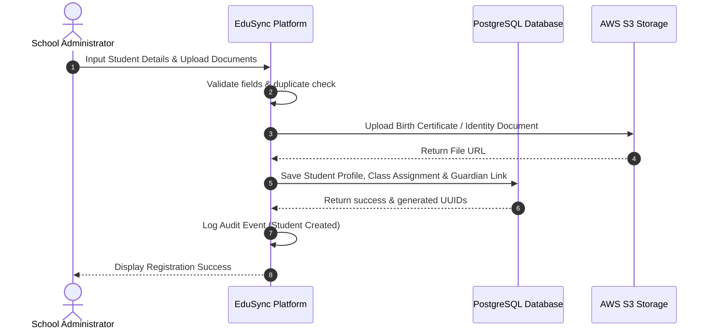
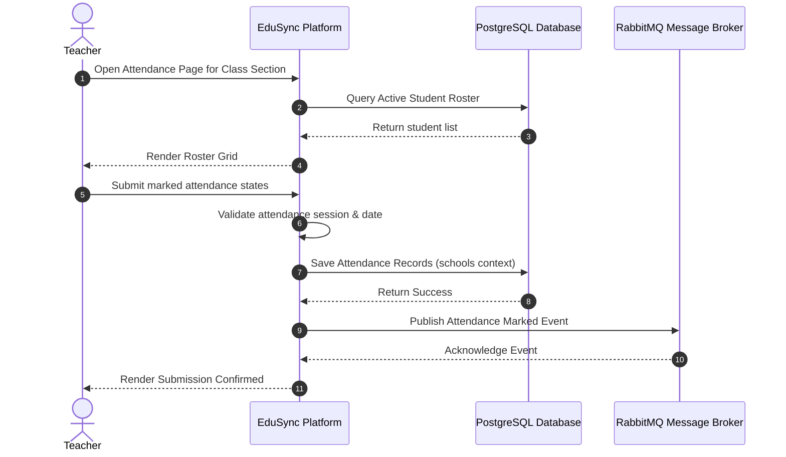
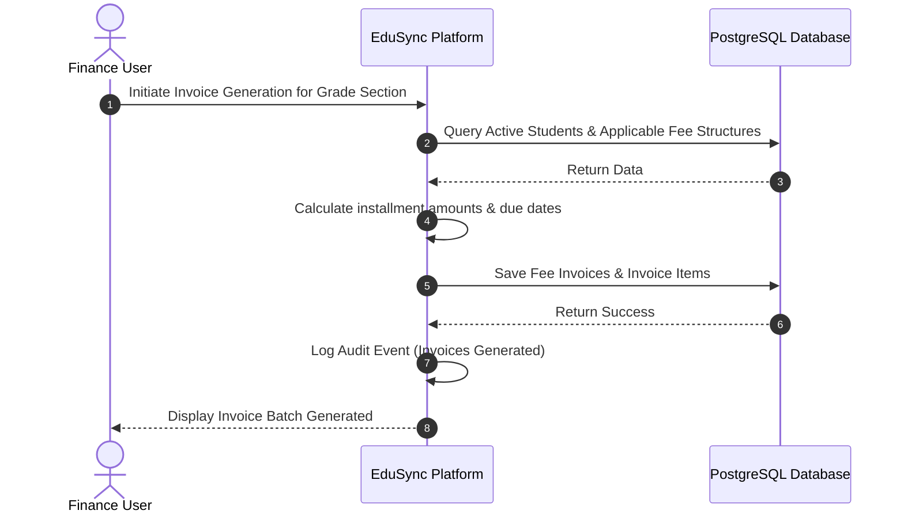

# Use Cases for EduSync

| Field | Value |
| --- | --- |
| Product | EduSync |
| Document Type | Use Case Specification |
| Version | 1.0.0 |
| Status | Draft for Product and Architecture Review |
| Author | EduSync Product, Architecture, Engineering, Security, and UX Office |
| Target Market | India |
| Future Market | Global |
| Last Updated | 2026-07-02 |

## Overview

EduSync is a cloud-native, multi-tenant school management SaaS platform serving schools, coaching institutes, and education organizations. This document defines a complete set of use cases for the core functional modules of the platform. Each use case captures the relevant actor, preconditions, postconditions, main flow, alternative flow, exception flow, business rules, and validation criteria.

The use cases in this document are designed to support product design, software requirements, workflow design, UX flows, security modeling, testing, and implementation planning.

## Purpose

The purpose of this document is to describe how major actors interact with EduSync to complete important school operations. It ensures that business workflows are well understood, role-based behavior is explicit, tenant isolation is maintained, and system behavior can be validated end to end.

## Scope

This document covers the major functional modules of EduSync including:

- Authentication and access control
- School configuration and administration
- Student and guardian management
- Teacher and employee workflows
- Attendance management
- Homework and assignments
- Examinations and results
- Fees and payments
- Reporting and dashboards
- Notifications and communication
- Subscriptions and platform administration
- Audit and AI-assisted operations

## Business Rules

- Every user must operate within a single school tenant context unless explicitly granted platform-level access.
- Every tenant-owned record must include school_id.
- Every read and write operation must enforce tenant isolation.
- User actions must conform to role-based permissions and least-privilege access.
- Sensitive actions must be logged for audit and traceability.
- Parent-facing data must be limited to the students linked to that parent.
- Financial and academic records must preserve historical integrity.
- Notifications must be traceable to the originating module and target recipient.

## Functional Requirements

EduSync must support the following functional capabilities:

- Secure user authentication and authorization
- School tenant setup and configuration
- Student, teacher, guardian, and employee administration
- Attendance capture and management
- Homework and assignment delivery
- Examination scheduling and result management
- Fee setup, invoicing, payments, and reconciliation
- Reporting, dashboards, notifications, and communication
- Platform administration, support, and subscription control

## Non Functional Requirements

| Category | Requirement |
| --- | --- |
| Security | Access must be restricted by role, permission, and tenant context. |
| Usability | Core workflows must require minimal training and support fast task completion. |
| Performance | Common workflows must respond quickly under expected school operational load. |
| Scalability | The system must support growth across tenants, users, students, and transactions. |
| Maintainability | Use clear domain boundaries, modular services, and role-aware workflows. |
| Auditability | Sensitive actions must be traceable by actor, timestamp, and record. |
| Availability | Daily school operations must remain reliable during peak usage periods. |

## Assumptions

- Schools operate through a defined administrative hierarchy.
- Users access the platform through a secure web application and supported mobile experiences.
- Each school is assigned a tenant context and a role-based access model.
- Core operational data is stored centrally and shared across modules.

## Dependencies

- Authentication and authorization services
- School configuration and tenant management services
- Student, teacher, guardian, attendance, homework, examination, fees, payment, reporting, notification, and subscription modules
- Audit logging and observability services
- Messaging, email, SMS, and WhatsApp provider integrations

## Future Scope

- AI-assisted recommendations for academic and financial workflows
- Advanced analytics and predictive insights
- Deeper workflow automation and approval chains
- Expanded mobile-first experiences for parents and students

## References

- [Product Requirements Document](product-requirements.md)
- [User Personas Document](user-personas.md)
- [User Stories Document](user-stories.md)
- [Software Requirements Specification](../04-Software-Requirements/software-requirements.md)

## Revision History

| Version | Date | Description |
| --- | --- | --- |
| 1.0.0 | 2026-07-02 | Initial draft of use cases for EduSync |

## Use Cases

### UC-001: User Authentication and Login

| Field | Description |
| --- | --- |
| Actor | School Admin, Teacher, Parent, Student, Accountant, Principal, Super Admin |
| Preconditions | The user has an active account, a valid school tenant association, and a registered password or recovery method. |
| Postconditions | The user is authenticated and redirected to the appropriate dashboard or module based on role and tenant context. |
| Main Flow | 1. The user enters their credentials. 2. The system validates the username and password. 3. The system checks tenant context and role assignment. 4. The system authenticates the session and creates an audit log entry. 5. The system redirects the user to the appropriate home page. |
| Alternative Flow | 1. The user selects password recovery. 2. The system verifies identity through the configured recovery method. 3. The system creates a new password and notifies the user. |
| Exception Flow | 1. If the credentials are invalid, the system denies access and increments the failed-login count. 2. If the account is inactive or locked, the system blocks access and displays the appropriate status message. |
| Business Rules | Authentication is required for all protected features. Inactive and suspended accounts must not authenticate. |
| Validation | Verify successful login, password recovery, failed login handling, tenant-aware routing, and audit logging. |

### UC-002: Create School Tenant

| Field | Description |
| --- | --- |
| Actor | Super Admin |
| Preconditions | The super admin is authenticated and has platform-level privileges. |
| Postconditions | A new school tenant is created with default configuration, subscription status, and administrative access. |
| Main Flow | 1. The super admin submits new school registration details. 2. The system validates the input and checks for tenant uniqueness. 3. The system creates the school tenant and default configuration records. 4. The system assigns initial access to the designated school administrator. 5. The system records the provisioning action in audit logs. |
| Alternative Flow | 1. The super admin creates the tenant from a template. 2. The system applies the selected configuration package. |
| Exception Flow | 1. If required fields are missing, the system prevents creation and displays validation errors. 2. If the tenant identifier already exists, the system rejects the request. |
| Business Rules | Each school must be isolated as its own tenant. Each tenant must have a unique school identifier. |
| Validation | Verify tenant creation, default setup, access assignment, tenant isolation, and audit logging. |

### UC-003: Configure School Profile

| Field | Description |
| --- | --- |
| Actor | School Admin |
| Preconditions | The school admin is authenticated and assigned to a valid school tenant. |
| Postconditions | School profile information and operational settings are updated for the tenant. |
| Main Flow | 1. The school admin opens the school configuration page. 2. The system loads the current school profile and settings. 3. The admin updates school details such as name, address, academic calendar, and contact information. 4. The system validates the changes. 5. The system saves the updates and updates the tenant configuration. |
| Alternative Flow | 1. The admin uploads school branding or policy documents. 2. The system stores the files and links them to the school profile. |
| Exception Flow | 1. If the submitted data is invalid, the system prevents save and shows validation feedback. 2. If the school is suspended, the system blocks updates. |
| Business Rules | School configuration changes must be restricted to authorized administrative users. |
| Validation | Verify profile update, validation behavior, persistence, and restricted access. |

### UC-004: Create Student Record

| Field | Description |
| --- | --- |
| Actor | School Admin |
| Preconditions | The school admin is authenticated and authorized to manage student records. |
| Postconditions | A student record is created and linked to the correct school, grade, section, and guardian relationships where applicable. |
| Main Flow | 1. The admin enters student details. 2. The system validates the required fields. 3. The system creates the student profile. 4. The system links the student to the selected class and guardian records. 5. The system records the action in audit logs. |
| Alternative Flow | 1. The admin imports multiple student records from a file. 2. The system validates and creates the records in bulk. |
| Exception Flow | 1. If duplicate student records are detected, the system prompts for review. 2. If mandatory fields are missing, the system blocks submission. |
| Business Rules | Student records must be tenant-scoped and linked to the correct school. |
| Validation | Verify student creation, guardian linkage, class assignment, bulk import, and audit logging. |

#### Student Admission Sequence Flow

### UC-005: Manage Guardian Relationship

| Field | Description |
| --- | --- |
| Actor | School Admin, Parent |
| Preconditions | The guardian or parent account exists and the student record exists. |
| Postconditions | The guardian relationship is established or updated and the parent can access the permitted view of the student. |
| Main Flow | 1. The admin links a parent account to a student profile. 2. The system validates the relationship. 3. The system stores the relationship and creates access permissions for the parent. 4. The parent can then view the relevant student information. |
| Alternative Flow | 1. The parent requests a relationship update. 2. The school admin reviews and approves the change. |
| Exception Flow | 1. If the parent is already linked to the student, the system prevents duplicate entries. 2. If the relationship is invalid, the system rejects the request. |
| Business Rules | Parent access must be restricted to authorized student relationships only. |
| Validation | Verify linkage, permission assignment, and restriction of cross-student access. |

### UC-006: Create Teacher Profile

| Field | Description |
| --- | --- |
| Actor | School Admin |
| Preconditions | The school admin is authenticated and has teacher management rights. |
| Postconditions | A teacher profile is created and assigned to the correct department, class, and subject scope. |
| Main Flow | 1. The admin enters teacher details. 2. The system checks for duplicate account or profile data. 3. The system creates the teacher record. 4. The teacher is assigned to classes and subjects. 5. The system saves the role and access configuration. |
| Alternative Flow | 1. The admin imports teacher data in bulk. 2. The system maps imported fields and creates the profiles. |
| Exception Flow | 1. If required fields are missing, the system blocks creation. 2. If the user account already exists, the system prompts for reconciliation. |
| Business Rules | Teacher records must remain isolated by tenant and subject to role-based access. |
| Validation | Verify profile creation, class assignment, role setup, and audit logging. |

### UC-007: Record Daily Attendance

| Field | Description |
| --- | --- |
| Actor | Teacher |
| Preconditions | The teacher is assigned to the class and the attendance session is active for the day. |
| Postconditions | Attendance is recorded for the relevant students and stored for reporting and parent visibility. |
| Main Flow | 1. The teacher opens the attendance page for the assigned class. 2. The system loads the current class roster. 3. The teacher marks student attendance. 4. The system validates and saves the attendance records. 5. The system updates dashboards, reports, and notifications. |
| Alternative Flow | 1. The teacher marks attendance in bulk for a section. 2. The system applies the selected attendance state to all students. |
| Exception Flow | 1. If the attendance window is closed, the system blocks modification. 2. If a device or network issue occurs, the system preserves the draft and allows recovery. |
| Business Rules | Attendance must be linked to the correct class, date, and school tenant. Attendance corrections must be auditable. |
| Validation | Verify attendance entry, bulk update, correction handling, and visibility to parents and reports. |

#### Daily Attendance Capture Flow

### UC-008: Correct Attendance Entry

| Field | Description |
| --- | --- |
| Actor | Teacher, School Admin |
| Preconditions | An attendance record exists and the correction window is valid. |
| Postconditions | The attendance record is updated and the correction is logged for audit purposes. |
| Main Flow | 1. The actor selects the attendance record to correct. 2. The system displays the current state and history. 3. The actor submits the correction reason and new value. 4. The system validates the change. 5. The system updates the record and records the audit trail. |
| Alternative Flow | 1. The actor submits a correction request for approval. 2. The admin reviews and approves or rejects it. |
| Exception Flow | 1. If the correction is outside the allowed window, the system rejects the request. 2. If the actor lacks permission, the system blocks the action. |
| Business Rules | Attendance corrections require an audit trail and the appropriate authorization. |
| Validation | Verify correction workflow, audit entry, permission enforcement, and reporting updates. |

### UC-009: Create Homework Assignment

| Field | Description |
| --- | --- |
| Actor | Teacher |
| Preconditions | The teacher is assigned to the class and the subject. |
| Postconditions | Homework is published to the relevant students and visible to parents where permitted. |
| Main Flow | 1. The teacher creates a homework entry with title, description, deadline, and attachments. 2. The system validates the fields. 3. The system publishes the homework to the selected class. 4. The system sends notifications to students and parents where configured. |
| Alternative Flow | 1. The teacher creates a recurring homework schedule for the week or month. 2. The system generates multiple instances based on the pattern. |
| Exception Flow | 1. If the deadline is invalid, the system prevents submission. 2. If the selected class is invalid, the system blocks publishing. |
| Business Rules | Homework must be tied to a valid class, teacher, and school tenant. |
| Validation | Verify creation, publication, notification dispatch, and visibility to relevant stakeholders. |

### UC-010: Submit Assignment

| Field | Description |
| --- | --- |
| Actor | Student |
| Preconditions | The student is enrolled in the class and the assignment is active. |
| Postconditions | The assignment submission is recorded and available for teacher review. |
| Main Flow | 1. The student opens the assignment. 2. The system displays the details and submission deadline. 3. The student uploads the submission and adds comments if required. 4. The system validates the submission. 5. The system stores the document and marks the assignment as submitted. |
| Alternative Flow | 1. The student saves a draft before final submission. 2. The system stores the draft and allows later completion. |
| Exception Flow | 1. If the deadline is passed, the system prevents late submission unless the policy allows it. 2. If the file type is unsupported, the system rejects the upload. |
| Business Rules | Submissions must be linked to the correct student and assignment. |
| Validation | Verify submission, draft handling, file validation, deadline enforcement, and status updates. |

### UC-011: Grade Assignment

| Field | Description |
| --- | --- |
| Actor | Teacher |
| Preconditions | The assignment was submitted and is available for review. |
| Postconditions | The assignment receives a grade and feedback, and the result is visible to the student and parent where permitted. |
| Main Flow | 1. The teacher opens the submitted assignments list. 2. The system displays the student submission and evaluation criteria. 3. The teacher enters marks, grade, and feedback. 4. The system validates and saves the result. 5. The system updates the student record and notification history. |
| Alternative Flow | 1. The teacher applies a rubric or bulk grade set. 2. The system assigns marks based on the configured rubric. |
| Exception Flow | 1. If the grade is outside the expected range, the system warns the teacher. 2. If the submission is missing, the system blocks grading. |
| Business Rules | Grading must follow configured evaluation rules and school policies. |
| Validation | Verify grading, feedback storage, visibility, and rule enforcement. |

### UC-012: Schedule Examination

| Field | Description |
| --- | --- |
| Actor | School Admin |
| Preconditions | The school admin is authenticated and has examination management rights. |
| Postconditions | An examination schedule is created and distributed to teachers, students, and parents where permitted. |
| Main Flow | 1. The admin defines the examination details, dates, and subjects. 2. The system validates the schedule against academic calendar rules. 3. The system saves the schedule and publishes it. 4. The system sends notifications to relevant stakeholders. |
| Alternative Flow | 1. The admin imports an examination timetable from a file. 2. The system maps the input and creates the schedule. |
| Exception Flow | 1. If there is a scheduling conflict, the system prompts for resolution. 2. If the academic year is invalid, the system blocks creation. |
| Business Rules | Examination schedules must align with the configured academic calendar and school rules. |
| Validation | Verify schedule creation, conflict detection, publication, and notifications. |

### UC-013: Enter Examination Marks

| Field | Description |
| --- | --- |
| Actor | Teacher |
| Preconditions | The examination is active and students are assigned to the subject. |
| Postconditions | Examination marks are stored and used to compute results and reports. |
| Main Flow | 1. The teacher opens the marks entry page for the examination. 2. The system loads the roster and grade scheme. 3. The teacher enters marks for each student. 4. The system validates the values and saves the results. 5. The system updates academic reports and dashboards. |
| Alternative Flow | 1. The teacher uploads marks from a spreadsheet. 2. The system imports the values into the relevant examination records. |
| Exception Flow | 1. If the marks exceed the allowed range, the system rejects them. 2. If a student is missing from the roster, the system warns the teacher. |
| Business Rules | Marks must follow configured mark schemes and be tied to the correct exam and school tenant. |
| Validation | Verify marks entry, validation, import support, and report generation. |

### UC-014: Publish Examination Results

| Field | Description |
| --- | --- |
| Actor | School Admin, Principal |
| Preconditions | Examination marks are finalized and approved. |
| Postconditions | Results are published to the appropriate student and parent views. |
| Main Flow | 1. The actor opens the result approval page. 2. The system displays the finalized marks and computed results. 3. The actor approves publishing. 4. The system publishes the results and sends notifications. |
| Alternative Flow | 1. The actor publishes results in phases, such as by class or section. 2. The system applies the selected rollout scope. |
| Exception Flow | 1. If results are incomplete, the system blocks publication. 2. If the actor lacks approval rights, the system rejects the request. |
| Business Rules | Result publication must follow school policy and approval workflow. |
| Validation | Verify approval control, publication, notification delivery, and tenant restriction. |

### UC-015: Define Fee Structure

| Field | Description |
| --- | --- |
| Actor | School Admin, Accountant |
| Preconditions | The school admin or accountant is authenticated and authorized for fee configuration. |
| Postconditions | Fee structures, categories, and installment rules are created or updated. |
| Main Flow | 1. The actor opens the fee configuration page. 2. The system loads existing fee structures. 3. The actor defines fee categories, amounts, and installment rules. 4. The system validates the configuration. 5. The system saves the fee structure for future billing. |
| Alternative Flow | 1. The actor applies a fee template from a previous academic year. 2. The system copies the structure and adjusts the values. |
| Exception Flow | 1. If the fees conflict with existing rules, the system warns the actor. 2. If the student group is invalid, the system blocks creation. |
| Business Rules | Fee structures must be tenant-scoped and consistent with school policy. |
| Validation | Verify configuration, validation, installment rules, and correct association with student groups. |

### UC-016: Generate Invoice and Receipt

| Field | Description |
| --- | --- |
| Actor | Accountant |
| Preconditions | Fee structures are available and student records exist. |
| Postconditions | An invoice and receipt are created and tied to the payment record. |
| Main Flow | 1. The accountant selects the student or billing group. 2. The system generates the invoice based on the active fee structure. 3. The accountant reviews the invoice. 4. The system creates a receipt after payment confirmation. |
| Alternative Flow | 1. The accountant creates a manual invoice. 2. The system stores it as a customized financial record. |
| Exception Flow | 1. If the student is not eligible for the selected fee policy, the system blocks generation. 2. If the payment gateway fails, the status remains pending and the user is notified. |
| Business Rules | Financial documents must preserve immutable history and support corrections through controlled workflow. |
| Validation | Verify invoice generation, receipt creation, payment status updates, and audit history. |

#### Invoice & Receipt Generation Flow

### UC-017: Process Fee Payment

| Field | Description |
| --- | --- |
| Actor | Parent, Accountant |
| Preconditions | The parent or accountant has access to the relevant invoice and payment method. |
| Postconditions | The payment is recorded, the invoice is updated, and a confirmation is issued. |
| Main Flow | 1. The actor opens the invoice or fee summary. 2. The system displays amount due and payment options. 3. The actor selects a payment method and submits the payment. 4. The payment gateway processes the payment. 5. The system updates the invoice, creates a receipt, and notifies the relevant parties. |
| Alternative Flow | 1. The parent chooses a partial payment. 2. The system updates the outstanding balance accordingly. |
| Exception Flow | 1. If the payment fails, the system displays the failure cause and preserves the pending status. 2. If the payment is duplicate, the system flags it for review. |
| Business Rules | Payments must be traceable, tenant-scoped, and reconciled against invoices. |
| Validation | Verify payment processing, receipt issuance, duplicate handling, and reconciliation state. |

### UC-018: Generate Financial Reports

| Field | Description |
| --- | --- |
| Actor | Accountant, Principal, School Owner |
| Preconditions | Financial data exists for the selected school and time range. |
| Postconditions | A financial report is generated for review or distribution. |
| Main Flow | 1. The actor selects the report type and date range. 2. The system gathers relevant fee, invoice, receipt, and payment data. 3. The system calculates the summary metrics. 4. The system renders the report and provides export options. |
| Alternative Flow | 1. The actor schedules recurring reports. 2. The system delivers the report automatically on the selected cadence. |
| Exception Flow | 1. If no data exists for the selected period, the system displays an empty report with a clear message. 2. If the user lacks permission, the system denies access. |
| Business Rules | Financial reports must reflect authorized data only and preserve audit integrity. |
| Validation | Verify report generation, filtering, export, role restriction, and calculation accuracy. |

### UC-019: View Dashboard and Analytics

| Field | Description |
| --- | --- |
| Actor | School Owner, Principal, Teacher, Accountant, Parent, Student, School Admin, Super Admin |
| Preconditions | The user is authenticated and assigned to a valid role. |
| Postconditions | A personalized dashboard is displayed with relevant metrics, alerts, and tasks. |
| Main Flow | 1. The user opens the dashboard. 2. The system loads role-specific widgets and metrics. 3. The system displays pending tasks, summaries, and alerts. 4. The user reviews the information and takes action as needed. |
| Alternative Flow | 1. The user customizes the dashboard layout or filters. 2. The system saves the selected preferences. |
| Exception Flow | 1. If the user has no relevant data, the system shows an empty state with guidance. 2. If the dashboard data is unavailable, the system reports the issue. |
| Business Rules | Dashboards must show only authorized and tenant-scoped information. |
| Validation | Verify role-based dashboard rendering, widget loading, and data isolation. |

### UC-020: Send Notification

| Field | Description |
| --- | --- |
| Actor | School Admin, Teacher, Accountant, Principal |
| Preconditions | The actor is authenticated and has permission to send a notification. |
| Postconditions | The notification is delivered to the selected recipients through the configured channel. |
| Main Flow | 1. The actor creates a message with recipient scope and channel. 2. The system validates the content and recipients. 3. The system queues the notification. 4. The provider sends the message. 5. The system updates delivery status and logs the event. |
| Alternative Flow | 1. The actor schedules the notification for a later time. 2. The system queues the message and delivers it at the scheduled time. |
| Exception Flow | 1. If the provider is unavailable, the system marks the notification as failed and retries based on policy. 2. If the recipients are invalid, the system blocks dispatch. |
| Business Rules | Notifications must be traceable by recipient, channel, status, and originating module. |
| Validation | Verify message creation, recipient validation, delivery tracking, and audit logging. |

### UC-021: View Student Academic Progress

| Field | Description |
| --- | --- |
| Actor | Parent, Student, Teacher, Principal |
| Preconditions | The user is authenticated and linked to the appropriate student or class context. |
| Postconditions | Academic progress information is displayed for the relevant student or class. |
| Main Flow | 1. The user opens the academic progress view. 2. The system collects attendance, homework, assignment, exam, and performance data. 3. The system calculates the summary and displays it in a readable format. |
| Alternative Flow | 1. The user filters the view by subject, term, or period. 2. The system recalculates the view based on the selected filter. |
| Exception Flow | 1. If there is no academic data, the system displays a clear empty state. 2. If the user is unauthorized, the system blocks access. |
| Business Rules | Academic views must respect user role and relationship-based access. |
| Validation | Verify data aggregation, filtering, access restriction, and clarity of presentation. |

### UC-022: Manage Subscription and Plan

| Field | Description |
| --- | --- |
| Actor | School Owner, Super Admin |
| Preconditions | The school tenant exists and billing information is available. |
| Postconditions | The subscription plan and entitlement state are updated for the tenant. |
| Main Flow | 1. The school owner or super admin selects a subscription plan. 2. The system validates tenant eligibility and plan constraints. 3. The system updates the plan and entitlements. 4. The system records activation or renewal history. |
| Alternative Flow | 1. The school owner requests a plan upgrade. 2. The super admin reviews and approves the change. |
| Exception Flow | 1. If the payment or renewal fails, the system suspends or limits features according to policy. 2. If the plan is unavailable, the system rejects the request. |
| Business Rules | Subscription status must control feature availability and service access. |
| Validation | Verify plan update, entitlements, renewal history, and enforcement of feature limits. |

### UC-023: Review Audit Logs

| Field | Description |
| --- | --- |
| Actor | Super Admin, School Admin |
| Preconditions | The actor has permission to view audit records. |
| Postconditions | Audit logs are available for investigation or compliance review. |
| Main Flow | 1. The actor opens the audit log view. 2. The system filters records by user, date range, module, or action. 3. The actor reviews the history. 4. The system displays relevant details including actor, timestamp, and result. |
| Alternative Flow | 1. The actor exports the audit log for an incident report. 2. The system generates a downloadable report. |
| Exception Flow | 1. If the actor lacks permission, the system denies access. 2. If the logs are unavailable, the system displays an error state. |
| Business Rules | Sensitive actions must be recorded with actor, timestamp, action, and outcome. |
| Validation | Verify filtering, visibility, export functionality, and restriction of unauthorized access. |

### UC-024: Use AI-Assisted Insights

| Field | Description |
| --- | --- |
| Actor | Principal, Teacher, School Owner, Accountant, Parent, Student |
| Preconditions | The user is authenticated and the AI feature is enabled for the tenant. |
| Postconditions | AI-generated insights are displayed to the user, with clear indication that review is required when applicable. |
| Main Flow | 1. The user opens an AI-enabled module. 2. The system collects relevant data from the current context. 3. The system generates insights or recommendations. 4. The system presents the results to the user. |
| Alternative Flow | 1. The user requests a different type of insight or time range. 2. The system regenerates the recommendations based on the request. |
| Exception Flow | 1. If the AI service is unavailable, the system displays a graceful fallback message. 2. If data is insufficient, the system returns a concise explanation. |
| Business Rules | AI-generated recommendations must remain reviewable and must not override human decisions without approval. |
| Validation | Verify insight generation, controlled presentation, fallback behavior, and data protection. |
