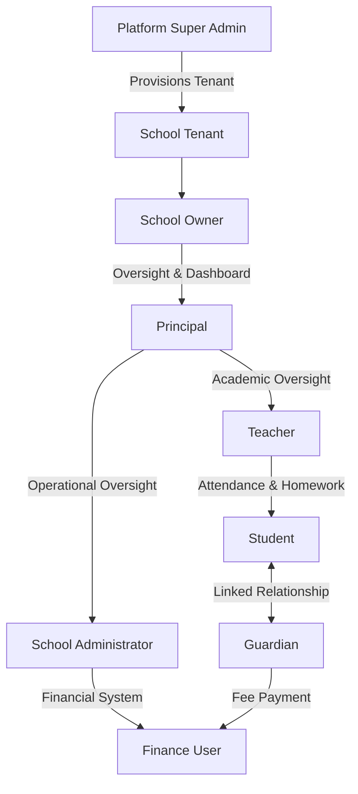

# User Personas for EduSync

| Field | Value |
| --- | --- |
| Product | EduSync |
| Document Type | User Personas Specification |
| Version | 1.0.0 |
| Status | Draft for Product and Architecture Review |
| Author | EduSync Product, Architecture, Engineering, Security, and UX Office |
| Target Market | India |
| Future Market | Global |
| Last Updated | 2026-07-02 |

## Overview

EduSync is a cloud-native, multi-tenant school management SaaS platform designed for private schools, CBSE schools, ICSE schools, state board schools, and coaching institutes. The product must support a wide range of users with distinct operational roles, responsibilities, and information needs. This document defines the primary user personas that influence product requirements, workflow design, access control, dashboard design, communication patterns, and reporting behavior.

The personas in this document represent the main human actors interacting with EduSync across academic, administrative, financial, and governance processes. Each persona is defined with goals, responsibilities, pain points, needs, permissions, typical workflow, and success criteria so that product design and implementation remain user-centered, secure, and role-aware.

## Purpose

The purpose of this document is to provide a structured understanding of the key users of EduSync so that requirements, UX flows, permission models, and reporting features are aligned to actual school operations. This document supports product management, UX design, engineering, security, quality assurance, and implementation teams in designing workflows that are practical for real school environments.

## Scope

This document covers the following user personas:

- School Owner
- Principal
- Admin
- Teacher
- Accountant
- Parent
- Student
- Super Admin

The document focuses on user expectations, operational context, and system interaction patterns relevant to EduSync product design. It does not define low-level UI specifications, API contracts, role matrix implementation details, or database schema design.

## Business Rules

- Every user must operate within a single school tenant context unless explicitly granted platform-level access.
- Every tenant-owned record must be associated with school_id.
- Every query and workflow must enforce tenant isolation and prevent cross-school data exposure.
- User access must be governed by role-based permissions and least-privilege principles.
- Sensitive actions such as fee approval, student record changes, and administrative changes must be auditable.
- Parent-facing data must be restricted to the student relationships explicitly assigned to that parent.
- Academic and financial records must preserve historical accuracy and support auditability.
- Role-specific dashboards and reports must present actionable information without overwhelming the user.

## Functional Requirements

EduSync must support persona-driven experiences that include:

- Role-based authentication and authorization.
- Persona-specific dashboards and reports.
- School-level operational workflows for administration, academics, and finance.
- Parent and student self-service access.
- Secure communication and notification capabilities.
- Audit-friendly management of sensitive records and actions.
- Multi-tenant access control that preserves school-level boundaries.

## Non Functional Requirements

| Category | Requirement |
| --- | --- |
| Security | Access must be restricted by role, permission, and tenant context. |
| Usability | Core workflows must require minimal training and support fast task completion. |
| Performance | Common operational workflows must respond quickly for daily school usage. |
| Scalability | The system must support growth across schools, users, students, records, and communications. |
| Maintainability | Persona-based flows must be implemented through clear domain boundaries and reusable services. |
| Auditability | Critical actions must be traceable by user, time, action, and affected record. |
| Availability | School operations must remain reliable during peak academic and fee-related periods. |

## Assumptions

- Each school has a defined administrative hierarchy and a small set of operational roles.
- Schools will use EduSync as a primary system of record for student, academic, attendance, and fee operations.
- Users will access EduSync through a web application and, where applicable, a mobile experience.
- Role assignments are managed centrally by the school administration or platform administration.

## Dependencies

- Authentication and authorization services.
- School configuration and tenant management capabilities.
- Student, teacher, guardian, attendance, examination, homework, fee, and payment modules.
- Audit logging and notification infrastructure.
- Reporting and dashboard services.

## Future Scope

- Persona-specific AI assistants for school administration and teaching workflows.
- Deeper role customization for large institutions and multi-branch organizations.
- Advanced workflow automation for approvals, escalations, and communications.
- Expanded mobile-first experiences for teachers, parents, and students.

## References

- [Product Requirements Document](product-requirements.md)
- [Software Requirements Specification](../04-Software-Requirements/software-requirements.md)
- [Architecture Overview](../06-Architecture/README.md)
- [C4 Level 1 — System Context](../06-Architecture/C4/C4-Level-1-System-Context.md)

## Revision History

| Version | Date | Description |
| --- | --- | --- |
| 1.0.0 | 2026-07-02 | Initial draft of user personas for EduSync |

## Persona Overview

| Persona | Primary Focus | Primary Product Need |
| --- | --- | --- |
| School Owner | Institutional governance and oversight | Executive visibility, control, and confidence |
| Principal | Academic leadership and operational management | Attendance, teacher oversight, and academic reporting |
| Admin | Daily school administration | Record management, configuration, and coordination |
| Teacher | Classroom teaching and student engagement | Attendance, homework, assignments, and marks entry |
| Accountant | School finance operations | Fee management, payments, receipts, and reconciliation |
| Parent | Student progress and school communication | Student updates, communications, and fee visibility |
| Student | Learning progress and academic engagement | Homework, results, notifications, and self-service access |
| Super Admin | Platform governance and tenant administration | Tenant provisioning, subscription control, and support visibility |

## Detailed Personas

### School Owner

#### Goals

- Maintain full visibility into school performance and operations.
- Ensure that the school uses a dependable, modern system for governance.
- Improve trust, accountability, and operational discipline.

#### Responsibilities

- Review institutional dashboards and reports.
- Monitor fees, dues, enrollment trends, and school performance.
- Approve major operational policies and strategic decisions.
- Ensure the school remains compliant with internal and external reporting expectations.

#### Pain Points

- Limited visibility into real-time school performance.
- Dependence on fragmented spreadsheets and manual reporting.
- Difficulty tracking fee collection, attendance trends, and academic performance in one place.

#### Needs

- Executive dashboards with actionable summary metrics.
- Role-based access to high-level operational and financial data.
- Reliable reporting for decision-making and stakeholder communication.
- Confidence that the platform is secure and audit-friendly.

#### Permissions

- View school-level dashboards and reports.
- View financial summaries, fee status, and payment trends.
- Approve or review high-impact school-level settings where applicable.
- Access audit and operational history relevant to the school tenant.
- Cannot access data from other schools or platform-level tenant data outside the assigned school context.

#### Typical Workflow

1. Logs in to EduSync and opens the executive dashboard.
2. Reviews fee collection, student activity, attendance trends, and academic indicators.
3. Reviews reports for leadership decisions or parent communication.
4. Approves or reviews major school policy updates or operational changes.
5. Uses dashboards to monitor performance over time.

#### Success Criteria

- The owner can understand school performance within minutes.
- The owner can review financial and academic trends without manual consolidation.
- The owner trusts the platform for governance and strategic decision-making.

### Principal

#### Goals

- Maintain academic discipline and operational control across the school.
- Monitor teacher performance, student attendance, and academic progress.
- Improve communication and accountability across departments.

#### Responsibilities

- Review attendance, academic reports, and school-wide trends.
- Monitor teacher activity and class-level performance.
- Oversee operational readiness and academic compliance.
- Coordinate escalations and communication with staff and parents when necessary.

#### Pain Points

- Manual tracking of attendance and academic reporting.
- Delayed visibility into discipline, progress, or teacher issues.
- Inconsistent communication across departments.

#### Needs

- A centralized view of attendance, reports, and teacher activity.
- Fast access to student and class-level summaries.
- Tools to monitor exceptions and intervene early.
- Structured communication workflows for alerts and approvals.

#### Permissions

- View and manage attendance records and academic summaries.
- Review teacher and class-level performance data.
- Access school-wide reports and dashboards.
- Approve or trigger communications and administrative actions within assigned authority.
- Cannot access unrelated school data outside the assigned tenant context.

#### Typical Workflow

1. Opens the dashboard at the start of the day.
2. Reviews attendance exceptions and class activity.
3. Checks student performance and academic reports.
4. Coordinates with teachers or admins on issues that need follow-up.
5. Shares reports or updates with school leadership and staff.

#### Success Criteria

- The principal can identify issues quickly and act on them efficiently.
- Academic reporting is consistent, timely, and trusted.
- Leadership communication is faster and more structured.

### Admin

#### Goals

- Keep school records accurate, current, and accessible.
- Support daily operations with consistent administrative workflows.
- Reduce repetitive administrative work and manual errors.

#### Responsibilities

- Manage student, guardian, teacher, and staff records.
- Configure school settings and operational parameters.
- Coordinate admissions, transfers, registrations, and school-wide updates.
- Support communications, reports, and user administration.

#### Pain Points

- Repetitive manual data entry and record updates.
- Difficulty maintaining accurate records across multiple modules.
- High volume of support requests from parents, teachers, and staff.

#### Needs

- A unified platform for managing core school records.
- Fast search, bulk operations, and structured workflows.
- Role-aware access to administrative tools.
- Clear audit trails for changes to critical records.

#### Permissions

- Create, update, and manage student, teacher, guardian, and staff records.
- Configure school settings and operational rules.
- Access school reports and administrative dashboards.
- Manage user access within the assigned school tenant.
- Cannot perform platform-level actions outside the assigned tenant scope.

#### Typical Workflow

1. Receives a request or update from a teacher, parent, or department.
2. Verifies the relevant record or request in EduSync.
3. Updates the record or initiates the required workflow.
4. Confirms the change and notifies relevant stakeholders.
5. Tracks the outcome through reports or audit history.

#### Success Criteria

- Administrative tasks are completed faster and with fewer errors.
- Records remain accurate and available to authorized users.
- Staff and parents receive timely and clear updates.

### Teacher

#### Goals

- Deliver lessons effectively and keep student records accurate.
- Manage classroom attendance, homework, assignments, and assessments.
- Maintain strong communication with students and parents.

#### Responsibilities

- Mark attendance for assigned classes.
- Create and publish homework and assignments.
- Enter marks or assessment results.
- Track student progress and communicate concerns.

#### Pain Points

- Manual attendance and marks entry create delays and errors.
- Limited visibility into student performance across subjects.
- Difficult communication with parents and students in a structured way.

#### Needs

- Fast class workflows for attendance and result entry.
- Simple tools for homework and assignment distribution.
- Clear visibility into student performance and pending tasks.
- Reliable notifications and communication functions.

#### Permissions

- View and manage assigned class and student records.
- Mark attendance, create homework, and publish assignments.
- Enter assessments and results for assigned subjects.
- Send communications to students and guardians where permitted.
- Cannot access unrelated classes, schools, or administrative records outside authorization scope.

#### Typical Workflow

1. Opens the class dashboard for the day.
2. Marks attendance and records classroom activity.
3. Publishes homework or assignments.
4. Enters assessment results or updates student progress.
5. Communicates with parents or students about concerns or updates.

#### Success Criteria

- Teachers can complete daily classroom tasks quickly.
- Student and parental communications become more consistent.
- Academic records are accurate, timely, and easy to review.

### Accountant

#### Goals

- Ensure fee collection and payment reconciliation are accurate and timely.
- Reduce payment delays, disputes, and reporting effort.
- Maintain reliable financial records for the school.

#### Responsibilities

- Create and manage fee structures, invoices, and receipts.
- Track payments, dues, overdue accounts, and discounts.
- Reconcile transactions and resolve payment exceptions.
- Prepare finance reports and provide financial visibility to stakeholders.

#### Pain Points

- Manual tracking of receipts and dues.
- Inconsistent payment visibility across channels.
- Delays in reconciliation and reporting.

#### Needs

- Structured fee and payment workflows.
- Clear dashboards for outstanding balances and payment status.
- Automated reminders and receipt generation.
- Reliable history and auditability for financial transactions.

#### Permissions

- Manage fee structures, invoices, receipts, and payments.
- Review outstanding dues and payment history.
- Generate finance reports and reconcile transactions.
- Access financial audit history within the assigned school tenant.
- Cannot access unrelated school financial data outside the assigned tenant scope.

#### Typical Workflow

1. Reviews fee schedules and pending payments.
2. Generates or updates invoices and receipts.
3. Tracks payment status and follows up on overdue amounts.
4. Reconciles transactions and resolves exceptions.
5. Shares finance summaries with leadership or administration.

#### Success Criteria

- Fee collection is faster and more transparent.
- Reconciliation is accurate and completed with fewer manual steps.
- Financial reporting is reliable and actionable.

### Parent

#### Goals

- Stay informed about the academic and personal progress of the child.
- Manage communication with the school and stay aware of obligations.
- Resolve issues quickly when problems arise.

#### Responsibilities

- Review attendance, homework, assignments, and academic updates.
- Track fee payments and school announcements.
- Respond to school communications and requests.
- Support the child’s learning through timely engagement.

#### Pain Points

- Lack of timely visibility into attendance and academic updates.
- Difficulty understanding fee status and obligations.
- Fragmented communication from multiple school channels.

#### Needs

- A secure portal for student updates and school announcements.
- Clear visibility into attendance, homework, results, and fee status.
- Simple, reliable communication with the school.
- Confidence that personal and student information is protected.

#### Permissions

- View information related to the linked student or students.
- Receive notifications and messages relevant to the child.
- View attendance, homework, results, and fee status relevant to the child.
- Cannot view unrelated students, staff records, or other school information outside the assigned relationship.

#### Typical Workflow

1. Logs in to the parent portal.
2. Reviews notifications and school announcements.
3. Checks the child’s attendance, homework, and results.
4. Reviews fee status or payment reminders.
5. Responds to school messages or requests.

#### Success Criteria

- Parents receive timely, relevant, and trustworthy information.
- Parent-school communication is simpler and more effective.
- Parents can resolve common questions without calling the school repeatedly.

### Student

#### Goals

- Stay organized with schoolwork, deadlines, and academic progress.
- Access academic information and school updates easily.
- Build confidence in managing daily learning responsibilities.

#### Responsibilities

- Review homework, assignments, and assessment updates.
- Track attendance and academic progress.
- Respond to school communications and deadlines.
- Use self-service tools where available.

#### Pain Points

- Missing homework deadlines or assignment details.
- Limited visibility into academic performance and upcoming tasks.
- Unclear or delayed communication from the school.

#### Needs

- A simple and reliable student view of assignments and results.
- Timely notifications about homework, exams, and school announcements.
- Clear access to personal academic information.
- A secure experience that protects student privacy.

#### Permissions

- View personal academic records, homework, assignments, and results.
- View attendance and notification history relevant to the student.
- Access self-service features permitted by the school policy.
- Cannot access other students’ records, staff records, or administrative data.

#### Typical Workflow

1. Logs in to the student portal or mobile experience.
2. Reviews assignments, homework, and notifications.
3. Checks attendance, examination updates, and academic status.
4. Completes required actions or participates in school communications.
5. Uses the portal to track learning progress over time.

#### Success Criteria

- Students can quickly understand their academic responsibilities.
- School communication reaches them in a timely and usable format.
- Students feel supported by the system in managing daily learning tasks.

### Super Admin

#### Goals

- Provide secure and scalable platform operations for all schools.
- Support tenant onboarding, platform health, subscriptions, and support cases.
- Protect the platform from misuse, abuse, and operational risk.

#### Responsibilities

- Provision and manage school tenants.
- Configure platform-level policies, subscriptions, and service controls.
- Monitor platform health, support escalations, and audit activity.
- Coordinate with support and engineering teams for issue resolution.

#### Pain Points

- Need to manage multiple tenants while maintaining isolation and security.
- Require comprehensive visibility into platform usage, billing, and support issues.
- Must prevent cross-tenant data leakage and operational misconfiguration.

#### Needs

- A secure control center for platform administration.
- Tools to monitor subscriptions, tenants, and support events.
- Reliable audit trails and diagnostics for production operations.
- Clear guardrails to preserve multi-tenant integrity.

#### Permissions

- Manage platform-level tenants, subscriptions, and service configuration.
- Access audit logs and platform diagnostics.
- Support customer or school administration requests where appropriate.
- Perform administrative actions across the SaaS platform within defined operational boundaries.
- Cannot bypass tenant isolation or access school data outside authorized platform operations.

#### Typical Workflow

1. Reviews new tenant requests, subscriptions, or support issues.
2. Provisions or updates school tenants and product entitlements.
3. Monitors diagnostics, audit activity, and operational alerts.
4. Coordinates support actions or escalations with engineering or customer teams.
5. Verifies that platform operations remain secure and compliant.

#### Success Criteria

- Platform operations remain secure, reliable, and scalable.
- New schools can be onboarded quickly and safely.
- Support and operational issues are resolved with full visibility and control.
