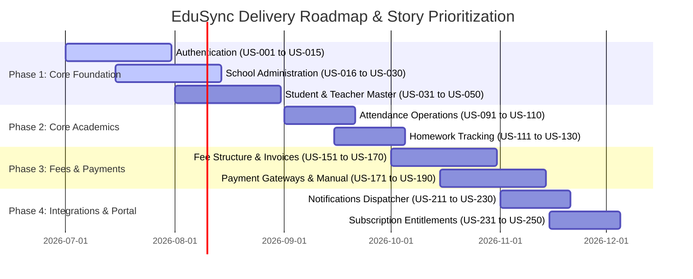

# User Stories for EduSync

| Field | Value |
| --- | --- |
| Product | EduSync |
| Document Type | Agile User Stories Backlog |
| Version | 1.0.0 |
| Status | Draft for Product and Architecture Review |
| Author | EduSync Product, Architecture, Engineering, Security, and UX Office |
| Target Market | India |
| Future Market | Global |
| Last Updated | 2026-07-02 |

## Overview

This document contains a production-grade backlog of user stories for EduSync. Each story is written using the standard Agile format and is mapped to a module, role, priority, and business value. The stories are intended to guide product delivery, UX design, engineering implementation, and quality assurance across the platform.

## Purpose

The purpose of this backlog is to capture functional expectations from the perspective of system users across academic, administrative, financial, communications, and platform governance workflows. These stories support implementation planning, release prioritization, and validation of business value.

## Scope

The backlog covers the major EduSync modules, including authentication, school administration, student management, teacher workflows, attendance, homework, assessments, fees, payments, reporting, dashboards, notifications, subscriptions, and platform administration.

### Delivery Timeline

## User Story Backlog

| ID | User Story | Acceptance Criteria | Priority | Module | Role | Business Value |
| --- | --- | --- | --- | --- | --- | --- |
| US-001 | As a school admin, I want to log in securely to the school portal, so that only authorized staff can access school data. | 1. The user can access the relevant workflow from the assigned role context. 2. The action is completed without exposing data outside the tenant scope. 3. The system records the action for audit and traceability where required. | High | Authentication | School Admin | High |
| US-002 | As a teacher, I want to reset my password, so that I can recover access quickly when needed. | 1. The user can access the relevant workflow from the assigned role context. 2. The action is completed without exposing data outside the tenant scope. 3. The system records the action for audit and traceability where required. | High | Authentication | Teacher | High |
| US-003 | As a parent, I want to sign in with my linked parent account, so that I can view my child’s information safely. | 1. The user can access the relevant workflow from the assigned role context. 2. The action is completed without exposing data outside the tenant scope. 3. The system records the action for audit and traceability where required. | High | Authentication | Parent | High |
| US-004 | As a student, I want to sign in to a personal dashboard, so that I can access my academic information. | 1. The user can access the relevant workflow from the assigned role context. 2. The action is completed without exposing data outside the tenant scope. 3. The system records the action for audit and traceability where required. | High | Authentication | Student | High |
| US-005 | As a accountant, I want to authenticate with multi-factor verification, so that financial records remain protected. | 1. The user can access the relevant workflow from the assigned role context. 2. The action is completed without exposing data outside the tenant scope. 3. The system records the action for audit and traceability where required. | High | Authentication | Accountant | High |
| US-006 | As a principal, I want to access the system from a browser, so that I can review school operations without delays. | 1. The user can access the relevant workflow from the assigned role context. 2. The action is completed without exposing data outside the tenant scope. 3. The system records the action for audit and traceability where required. | High | Authentication | Principal | High |
| US-007 | As a super admin, I want to manage tenant-level access policies, so that I can control platform access effectively. | 1. The user can access the relevant workflow from the assigned role context. 2. The action is completed without exposing data outside the tenant scope. 3. The system records the action for audit and traceability where required. | High | Authentication | Super Admin | High |
| US-008 | As a school admin, I want to lock inactive accounts, so that unauthorized access is prevented. | 1. The user can access the relevant workflow from the assigned role context. 2. The action is completed without exposing data outside the tenant scope. 3. The system records the action for audit and traceability where required. | Medium | Authentication | School Admin | High |
| US-009 | As a teacher, I want to receive session timeout warnings, so that I do not lose work unexpectedly. | 1. The user can access the relevant workflow from the assigned role context. 2. The action is completed without exposing data outside the tenant scope. 3. The system records the action for audit and traceability where required. | Medium | Authentication | Teacher | Medium |
| US-010 | As a parent, I want to use password recovery, so that I can recover access without support. | 1. The user can access the relevant workflow from the assigned role context. 2. The action is completed without exposing data outside the tenant scope. 3. The system records the action for audit and traceability where required. | Medium | Authentication | Parent | High |
| US-011 | As a student, I want to view my login history, so that I can monitor account activity. | 1. The user can access the relevant workflow from the assigned role context. 2. The action is completed without exposing data outside the tenant scope. 3. The system records the action for audit and traceability where required. | Low | Authentication | Student | Medium |
| US-012 | As a accountant, I want to log out from shared devices, so that sensitive records stay protected. | 1. The user can access the relevant workflow from the assigned role context. 2. The action is completed without exposing data outside the tenant scope. 3. The system records the action for audit and traceability where required. | High | Authentication | Accountant | High |
| US-013 | As a principal, I want to switch between school roles, so that I can access the correct context quickly. | 1. The user can access the relevant workflow from the assigned role context. 2. The action is completed without exposing data outside the tenant scope. 3. The system records the action for audit and traceability where required. | Medium | Authentication | Principal | Medium |
| US-014 | As a super admin, I want to audit login attempts, so that I can investigate suspicious activity. | 1. The user can access the relevant workflow from the assigned role context. 2. The action is completed without exposing data outside the tenant scope. 3. The system records the action for audit and traceability where required. | High | Authentication | Super Admin | High |
| US-015 | As a school admin, I want to manage user roles, so that I can assign appropriate permissions. | 1. The user can access the relevant workflow from the assigned role context. 2. The action is completed without exposing data outside the tenant scope. 3. The system records the action for audit and traceability where required. | High | Authentication | School Admin | High |
| US-016 | As a school admin, I want to configure school profile information, so that the school record stays accurate. | 1. The user can access the relevant workflow from the assigned role context. 2. The action is completed without exposing data outside the tenant scope. 3. The system records the action for audit and traceability where required. | High | School | School Admin | High |
| US-017 | As a principal, I want to view school structure and departments, so that I can oversee academic organization. | 1. The user can access the relevant workflow from the assigned role context. 2. The action is completed without exposing data outside the tenant scope. 3. The system records the action for audit and traceability where required. | High | School | Principal | High |
| US-018 | As a super admin, I want to create a new school tenant, so that new schools can be onboarded quickly. | 1. The user can access the relevant workflow from the assigned role context. 2. The action is completed without exposing data outside the tenant scope. 3. The system records the action for audit and traceability where required. | High | School | Super Admin | High |
| US-019 | As a school admin, I want to set academic terms and calendars, so that operations align with school schedules. | 1. The user can access the relevant workflow from the assigned role context. 2. The action is completed without exposing data outside the tenant scope. 3. The system records the action for audit and traceability where required. | High | School | School Admin | High |
| US-020 | As a principal, I want to define grade and section hierarchies, so that class organization remains consistent. | 1. The user can access the relevant workflow from the assigned role context. 2. The action is completed without exposing data outside the tenant scope. 3. The system records the action for audit and traceability where required. | High | School | Principal | High |
| US-021 | As a accountant, I want to link fee settings to the school profile, so that financial processes align with school policy. | 1. The user can access the relevant workflow from the assigned role context. 2. The action is completed without exposing data outside the tenant scope. 3. The system records the action for audit and traceability where required. | Medium | School | Accountant | Medium |
| US-022 | As a school admin, I want to update school contact information, so that stakeholders receive correct details. | 1. The user can access the relevant workflow from the assigned role context. 2. The action is completed without exposing data outside the tenant scope. 3. The system records the action for audit and traceability where required. | Medium | School | School Admin | High |
| US-023 | As a principal, I want to view branch or campus details, so that I can manage multiple locations effectively. | 1. The user can access the relevant workflow from the assigned role context. 2. The action is completed without exposing data outside the tenant scope. 3. The system records the action for audit and traceability where required. | Medium | School | Principal | Medium |
| US-024 | As a super admin, I want to activate or suspend a school tenant, so that I can control service availability. | 1. The user can access the relevant workflow from the assigned role context. 2. The action is completed without exposing data outside the tenant scope. 3. The system records the action for audit and traceability where required. | High | School | Super Admin | High |
| US-025 | As a school admin, I want to maintain school holidays, so that planning and attendance remain accurate. | 1. The user can access the relevant workflow from the assigned role context. 2. The action is completed without exposing data outside the tenant scope. 3. The system records the action for audit and traceability where required. | High | School | School Admin | High |
| US-026 | As a principal, I want to review school configuration summaries, so that I can verify setup quickly. | 1. The user can access the relevant workflow from the assigned role context. 2. The action is completed without exposing data outside the tenant scope. 3. The system records the action for audit and traceability where required. | Medium | School | Principal | Medium |
| US-027 | As a school admin, I want to capture school policies, so that staff and parents follow clear rules. | 1. The user can access the relevant workflow from the assigned role context. 2. The action is completed without exposing data outside the tenant scope. 3. The system records the action for audit and traceability where required. | Medium | School | School Admin | Medium |
| US-028 | As a super admin, I want to configure subscription limits per school, so that I can manage platform entitlements. | 1. The user can access the relevant workflow from the assigned role context. 2. The action is completed without exposing data outside the tenant scope. 3. The system records the action for audit and traceability where required. | High | School | Super Admin | High |
| US-029 | As a school admin, I want to manage academic years, so that records remain organized over time. | 1. The user can access the relevant workflow from the assigned role context. 2. The action is completed without exposing data outside the tenant scope. 3. The system records the action for audit and traceability where required. | High | School | School Admin | High |
| US-030 | As a principal, I want to see the current school configuration status, so that I can identify missing setup items. | 1. The user can access the relevant workflow from the assigned role context. 2. The action is completed without exposing data outside the tenant scope. 3. The system records the action for audit and traceability where required. | Medium | School | Principal | Medium |
| US-031 | As a school admin, I want to create student profiles, so that student records are maintained centrally. | 1. The user can access the relevant workflow from the assigned role context. 2. The action is completed without exposing data outside the tenant scope. 3. The system records the action for audit and traceability where required. | High | Student | School Admin | High |
| US-032 | As a teacher, I want to view assigned student lists, so that I can plan class activities. | 1. The user can access the relevant workflow from the assigned role context. 2. The action is completed without exposing data outside the tenant scope. 3. The system records the action for audit and traceability where required. | High | Student | Teacher | High |
| US-033 | As a principal, I want to review student enrollment trends, so that I can monitor school growth. | 1. The user can access the relevant workflow from the assigned role context. 2. The action is completed without exposing data outside the tenant scope. 3. The system records the action for audit and traceability where required. | High | Student | Principal | Medium |
| US-034 | As a parent, I want to view my child’s profile, so that I can stay informed about school records. | 1. The user can access the relevant workflow from the assigned role context. 2. The action is completed without exposing data outside the tenant scope. 3. The system records the action for audit and traceability where required. | High | Student | Parent | High |
| US-035 | As a student, I want to view my personal profile, so that I can confirm my details. | 1. The user can access the relevant workflow from the assigned role context. 2. The action is completed without exposing data outside the tenant scope. 3. The system records the action for audit and traceability where required. | Medium | Student | Student | High |
| US-036 | As a school admin, I want to update student contact details, so that communications remain accurate. | 1. The user can access the relevant workflow from the assigned role context. 2. The action is completed without exposing data outside the tenant scope. 3. The system records the action for audit and traceability where required. | High | Student | School Admin | High |
| US-037 | As a teacher, I want to see student academic history, so that I can support learners better. | 1. The user can access the relevant workflow from the assigned role context. 2. The action is completed without exposing data outside the tenant scope. 3. The system records the action for audit and traceability where required. | High | Student | Teacher | High |
| US-038 | As a principal, I want to monitor student status changes, so that I can respond to transitions faster. | 1. The user can access the relevant workflow from the assigned role context. 2. The action is completed without exposing data outside the tenant scope. 3. The system records the action for audit and traceability where required. | Medium | Student | Principal | Medium |
| US-039 | As a accountant, I want to link students to fee records, so that billing stays accurate. | 1. The user can access the relevant workflow from the assigned role context. 2. The action is completed without exposing data outside the tenant scope. 3. The system records the action for audit and traceability where required. | High | Student | Accountant | High |
| US-040 | As a school admin, I want to bulk import student records, so that onboarding is faster. | 1. The user can access the relevant workflow from the assigned role context. 2. The action is completed without exposing data outside the tenant scope. 3. The system records the action for audit and traceability where required. | High | Student | School Admin | High |
| US-041 | As a student, I want to view my attendance summary, so that I can track my participation. | 1. The user can access the relevant workflow from the assigned role context. 2. The action is completed without exposing data outside the tenant scope. 3. The system records the action for audit and traceability where required. | High | Student | Student | High |
| US-042 | As a parent, I want to receive student status alerts, so that I can respond quickly to issues. | 1. The user can access the relevant workflow from the assigned role context. 2. The action is completed without exposing data outside the tenant scope. 3. The system records the action for audit and traceability where required. | High | Student | Parent | High |
| US-043 | As a teacher, I want to track student discipline notes, so that I can communicate concerns clearly. | 1. The user can access the relevant workflow from the assigned role context. 2. The action is completed without exposing data outside the tenant scope. 3. The system records the action for audit and traceability where required. | Medium | Student | Teacher | Medium |
| US-044 | As a principal, I want to review student progression reports, so that I can support student outcomes. | 1. The user can access the relevant workflow from the assigned role context. 2. The action is completed without exposing data outside the tenant scope. 3. The system records the action for audit and traceability where required. | High | Student | Principal | High |
| US-045 | As a school admin, I want to archive inactive students, so that records remain clean and current. | 1. The user can access the relevant workflow from the assigned role context. 2. The action is completed without exposing data outside the tenant scope. 3. The system records the action for audit and traceability where required. | Medium | Student | School Admin | Medium |
| US-046 | As a student, I want to view my assignment and exam history, so that I can plan my studies better. | 1. The user can access the relevant workflow from the assigned role context. 2. The action is completed without exposing data outside the tenant scope. 3. The system records the action for audit and traceability where required. | High | Student | Student | High |
| US-047 | As a parent, I want to see my child’s academic performance, so that I can support learning at home. | 1. The user can access the relevant workflow from the assigned role context. 2. The action is completed without exposing data outside the tenant scope. 3. The system records the action for audit and traceability where required. | High | Student | Parent | High |
| US-048 | As a teacher, I want to filter students by class and section, so that I can manage groups efficiently. | 1. The user can access the relevant workflow from the assigned role context. 2. The action is completed without exposing data outside the tenant scope. 3. The system records the action for audit and traceability where required. | Medium | Student | Teacher | Medium |
| US-049 | As a school admin, I want to manage student transfers, so that school records stay consistent. | 1. The user can access the relevant workflow from the assigned role context. 2. The action is completed without exposing data outside the tenant scope. 3. The system records the action for audit and traceability where required. | High | Student | School Admin | High |
| US-050 | As a principal, I want to view student attendance by class, so that I can identify attendance concerns early. | 1. The user can access the relevant workflow from the assigned role context. 2. The action is completed without exposing data outside the tenant scope. 3. The system records the action for audit and traceability where required. | High | Student | Principal | High |
| US-051 | As a school admin, I want to create guardian records, so that parent relationships are maintained. | 1. The user can access the relevant workflow from the assigned role context. 2. The action is completed without exposing data outside the tenant scope. 3. The system records the action for audit and traceability where required. | High | Guardian | School Admin | High |
| US-052 | As a parent, I want to link my account to my child, so that I can access relevant school information. | 1. The user can access the relevant workflow from the assigned role context. 2. The action is completed without exposing data outside the tenant scope. 3. The system records the action for audit and traceability where required. | High | Guardian | Parent | High |
| US-053 | As a teacher, I want to contact guardians through the platform, so that I can share academic updates quickly. | 1. The user can access the relevant workflow from the assigned role context. 2. The action is completed without exposing data outside the tenant scope. 3. The system records the action for audit and traceability where required. | High | Guardian | Teacher | High |
| US-054 | As a principal, I want to review guardian engagement summaries, so that I can understand communication patterns. | 1. The user can access the relevant workflow from the assigned role context. 2. The action is completed without exposing data outside the tenant scope. 3. The system records the action for audit and traceability where required. | Medium | Guardian | Principal | Medium |
| US-055 | As a school admin, I want to manage guardian contact preferences, so that communications remain relevant. | 1. The user can access the relevant workflow from the assigned role context. 2. The action is completed without exposing data outside the tenant scope. 3. The system records the action for audit and traceability where required. | Medium | Guardian | School Admin | Medium |
| US-056 | As a parent, I want to view school announcements, so that I can stay up to date. | 1. The user can access the relevant workflow from the assigned role context. 2. The action is completed without exposing data outside the tenant scope. 3. The system records the action for audit and traceability where required. | High | Guardian | Parent | High |
| US-057 | As a teacher, I want to send notices to guardians, so that important updates reach families. | 1. The user can access the relevant workflow from the assigned role context. 2. The action is completed without exposing data outside the tenant scope. 3. The system records the action for audit and traceability where required. | High | Guardian | Teacher | High |
| US-058 | As a parent, I want to view fee reminders, so that I can stay on top of obligations. | 1. The user can access the relevant workflow from the assigned role context. 2. The action is completed without exposing data outside the tenant scope. 3. The system records the action for audit and traceability where required. | High | Guardian | Parent | High |
| US-059 | As a school admin, I want to resolve guardian record conflicts, so that data quality stays high. | 1. The user can access the relevant workflow from the assigned role context. 2. The action is completed without exposing data outside the tenant scope. 3. The system records the action for audit and traceability where required. | Medium | Guardian | School Admin | Medium |
| US-060 | As a parent, I want to receive attendance updates, so that I can monitor my child’s presence. | 1. The user can access the relevant workflow from the assigned role context. 2. The action is completed without exposing data outside the tenant scope. 3. The system records the action for audit and traceability where required. | High | Guardian | Parent | High |
| US-061 | As a teacher, I want to view my assigned classes, so that I can organize my daily work. | 1. The user can access the relevant workflow from the assigned role context. 2. The action is completed without exposing data outside the tenant scope. 3. The system records the action for audit and traceability where required. | High | Teacher | Teacher | High |
| US-062 | As a teacher, I want to update my profile, so that my professional information stays current. | 1. The user can access the relevant workflow from the assigned role context. 2. The action is completed without exposing data outside the tenant scope. 3. The system records the action for audit and traceability where required. | Medium | Teacher | Teacher | Medium |
| US-063 | As a teacher, I want to see my timetable, so that I can plan lessons effectively. | 1. The user can access the relevant workflow from the assigned role context. 2. The action is completed without exposing data outside the tenant scope. 3. The system records the action for audit and traceability where required. | High | Teacher | Teacher | High |
| US-064 | As a teacher, I want to record daily attendance, so that class participation is tracked accurately. | 1. The user can access the relevant workflow from the assigned role context. 2. The action is completed without exposing data outside the tenant scope. 3. The system records the action for audit and traceability where required. | High | Teacher | Teacher | High |
| US-065 | As a teacher, I want to edit attendance for valid reasons, so that corrections are handled properly. | 1. The user can access the relevant workflow from the assigned role context. 2. The action is completed without exposing data outside the tenant scope. 3. The system records the action for audit and traceability where required. | High | Teacher | Teacher | High |
| US-066 | As a teacher, I want to publish homework, so that students know their tasks clearly. | 1. The user can access the relevant workflow from the assigned role context. 2. The action is completed without exposing data outside the tenant scope. 3. The system records the action for audit and traceability where required. | High | Teacher | Teacher | High |
| US-067 | As a teacher, I want to assign classwork and projects, so that students receive structured tasks. | 1. The user can access the relevant workflow from the assigned role context. 2. The action is completed without exposing data outside the tenant scope. 3. The system records the action for audit and traceability where required. | High | Teacher | Teacher | High |
| US-068 | As a teacher, I want to enter assessment marks, so that academic evaluation is recorded promptly. | 1. The user can access the relevant workflow from the assigned role context. 2. The action is completed without exposing data outside the tenant scope. 3. The system records the action for audit and traceability where required. | High | Teacher | Teacher | High |
| US-069 | As a teacher, I want to view student performance trends, so that I can identify learning gaps. | 1. The user can access the relevant workflow from the assigned role context. 2. The action is completed without exposing data outside the tenant scope. 3. The system records the action for audit and traceability where required. | High | Teacher | Teacher | High |
| US-070 | As a teacher, I want to send individual notices, so that I can communicate concerns effectively. | 1. The user can access the relevant workflow from the assigned role context. 2. The action is completed without exposing data outside the tenant scope. 3. The system records the action for audit and traceability where required. | High | Teacher | Teacher | High |
| US-071 | As a teacher, I want to upload lesson resources, so that students can access supporting materials. | 1. The user can access the relevant workflow from the assigned role context. 2. The action is completed without exposing data outside the tenant scope. 3. The system records the action for audit and traceability where required. | Medium | Teacher | Teacher | Medium |
| US-072 | As a teacher, I want to see pending tasks by deadline, so that I can manage workload better. | 1. The user can access the relevant workflow from the assigned role context. 2. The action is completed without exposing data outside the tenant scope. 3. The system records the action for audit and traceability where required. | Medium | Teacher | Teacher | Medium |
| US-073 | As a principal, I want to review teacher workload summaries, so that I can balance responsibilities. | 1. The user can access the relevant workflow from the assigned role context. 2. The action is completed without exposing data outside the tenant scope. 3. The system records the action for audit and traceability where required. | Medium | Teacher | Principal | Medium |
| US-074 | As a teacher, I want to view class-wise reports, so that I can evaluate teaching outcomes. | 1. The user can access the relevant workflow from the assigned role context. 2. The action is completed without exposing data outside the tenant scope. 3. The system records the action for audit and traceability where required. | High | Teacher | Teacher | High |
| US-075 | As a teacher, I want to receive reminders for pending entries, so that I can avoid administrative backlog. | 1. The user can access the relevant workflow from the assigned role context. 2. The action is completed without exposing data outside the tenant scope. 3. The system records the action for audit and traceability where required. | Medium | Teacher | Teacher | Medium |
| US-076 | As a teacher, I want to submit leave requests, so that staff operations remain organized. | 1. The user can access the relevant workflow from the assigned role context. 2. The action is completed without exposing data outside the tenant scope. 3. The system records the action for audit and traceability where required. | Medium | Teacher | Teacher | Medium |
| US-077 | As a school admin, I want to assign teachers to sections, so that classroom staffing is accurate. | 1. The user can access the relevant workflow from the assigned role context. 2. The action is completed without exposing data outside the tenant scope. 3. The system records the action for audit and traceability where required. | High | Teacher | School Admin | High |
| US-078 | As a teacher, I want to see student attendance alerts, so that I can respond to absences quickly. | 1. The user can access the relevant workflow from the assigned role context. 2. The action is completed without exposing data outside the tenant scope. 3. The system records the action for audit and traceability where required. | High | Teacher | Teacher | High |
| US-079 | As a teacher, I want to access my teaching calendar, so that I can stay organized throughout the term. | 1. The user can access the relevant workflow from the assigned role context. 2. The action is completed without exposing data outside the tenant scope. 3. The system records the action for audit and traceability where required. | Medium | Teacher | Teacher | Medium |
| US-080 | As a teacher, I want to submit marking corrections, so that records remain accurate. | 1. The user can access the relevant workflow from the assigned role context. 2. The action is completed without exposing data outside the tenant scope. 3. The system records the action for audit and traceability where required. | High | Teacher | Teacher | High |
| US-081 | As a school admin, I want to create employee profiles, so that staff records are managed centrally. | 1. The user can access the relevant workflow from the assigned role context. 2. The action is completed without exposing data outside the tenant scope. 3. The system records the action for audit and traceability where required. | High | Employee | School Admin | High |
| US-082 | As a principal, I want to view non-teaching staff lists, so that I can coordinate support departments. | 1. The user can access the relevant workflow from the assigned role context. 2. The action is completed without exposing data outside the tenant scope. 3. The system records the action for audit and traceability where required. | Medium | Employee | Principal | Medium |
| US-083 | As a employee, I want to view my personal employment details, so that I can confirm my information. | 1. The user can access the relevant workflow from the assigned role context. 2. The action is completed without exposing data outside the tenant scope. 3. The system records the action for audit and traceability where required. | Medium | Employee | Employee | Medium |
| US-084 | As a school admin, I want to assign department and designation, so that organizational structure is maintained. | 1. The user can access the relevant workflow from the assigned role context. 2. The action is completed without exposing data outside the tenant scope. 3. The system records the action for audit and traceability where required. | High | Employee | School Admin | High |
| US-085 | As a employee, I want to request leave, so that I can manage time off efficiently. | 1. The user can access the relevant workflow from the assigned role context. 2. The action is completed without exposing data outside the tenant scope. 3. The system records the action for audit and traceability where required. | Medium | Employee | Employee | Medium |
| US-086 | As a principal, I want to review employee attendance, so that I can oversee staff punctuality. | 1. The user can access the relevant workflow from the assigned role context. 2. The action is completed without exposing data outside the tenant scope. 3. The system records the action for audit and traceability where required. | High | Employee | Principal | High |
| US-087 | As a school admin, I want to archive former employees, so that records remain accurate. | 1. The user can access the relevant workflow from the assigned role context. 2. The action is completed without exposing data outside the tenant scope. 3. The system records the action for audit and traceability where required. | Medium | Employee | School Admin | Medium |
| US-088 | As a employee, I want to receive internal notices, so that I stay informed about school updates. | 1. The user can access the relevant workflow from the assigned role context. 2. The action is completed without exposing data outside the tenant scope. 3. The system records the action for audit and traceability where required. | Medium | Employee | Employee | Medium |
| US-089 | As a principal, I want to track staff deployment across departments, so that I can balance operations. | 1. The user can access the relevant workflow from the assigned role context. 2. The action is completed without exposing data outside the tenant scope. 3. The system records the action for audit and traceability where required. | Medium | Employee | Principal | Medium |
| US-090 | As a school admin, I want to bulk import staff records, so that onboarding is faster. | 1. The user can access the relevant workflow from the assigned role context. 2. The action is completed without exposing data outside the tenant scope. 3. The system records the action for audit and traceability where required. | High | Employee | School Admin | High |
| US-091 | As a teacher, I want to mark attendance for my class, so that student participation is recorded accurately. | 1. The user can access the relevant workflow from the assigned role context. 2. The action is completed without exposing data outside the tenant scope. 3. The system records the action for audit and traceability where required. | High | Attendance | Teacher | High |
| US-092 | As a principal, I want to view attendance dashboards, so that I can monitor school-wide participation. | 1. The user can access the relevant workflow from the assigned role context. 2. The action is completed without exposing data outside the tenant scope. 3. The system records the action for audit and traceability where required. | High | Attendance | Principal | High |
| US-093 | As a parent, I want to view my child’s attendance status, so that I can stay informed on reliability. | 1. The user can access the relevant workflow from the assigned role context. 2. The action is completed without exposing data outside the tenant scope. 3. The system records the action for audit and traceability where required. | High | Attendance | Parent | High |
| US-094 | As a school admin, I want to approve attendance corrections, so that data quality remains high. | 1. The user can access the relevant workflow from the assigned role context. 2. The action is completed without exposing data outside the tenant scope. 3. The system records the action for audit and traceability where required. | High | Attendance | School Admin | High |
| US-095 | As a teacher, I want to apply attendance reasons, so that absence reasons are captured properly. | 1. The user can access the relevant workflow from the assigned role context. 2. The action is completed without exposing data outside the tenant scope. 3. The system records the action for audit and traceability where required. | High | Attendance | Teacher | High |
| US-096 | As a principal, I want to review late arrival trends, so that I can address punctuality issues. | 1. The user can access the relevant workflow from the assigned role context. 2. The action is completed without exposing data outside the tenant scope. 3. The system records the action for audit and traceability where required. | Medium | Attendance | Principal | Medium |
| US-097 | As a student, I want to view my attendance history, so that I can track my presence. | 1. The user can access the relevant workflow from the assigned role context. 2. The action is completed without exposing data outside the tenant scope. 3. The system records the action for audit and traceability where required. | High | Attendance | Student | High |
| US-098 | As a accountant, I want to see attendance-based fee implications, so that finance decisions stay accurate. | 1. The user can access the relevant workflow from the assigned role context. 2. The action is completed without exposing data outside the tenant scope. 3. The system records the action for audit and traceability where required. | Medium | Attendance | Accountant | Medium |
| US-099 | As a school admin, I want to generate attendance reports, so that compliance and review are easier. | 1. The user can access the relevant workflow from the assigned role context. 2. The action is completed without exposing data outside the tenant scope. 3. The system records the action for audit and traceability where required. | High | Attendance | School Admin | High |
| US-100 | As a teacher, I want to bulk mark attendance for a day, so that daily processes are faster. | 1. The user can access the relevant workflow from the assigned role context. 2. The action is completed without exposing data outside the tenant scope. 3. The system records the action for audit and traceability where required. | High | Attendance | Teacher | High |
| US-101 | As a principal, I want to monitor attendance by section, so that I can identify low participation quickly. | 1. The user can access the relevant workflow from the assigned role context. 2. The action is completed without exposing data outside the tenant scope. 3. The system records the action for audit and traceability where required. | High | Attendance | Principal | High |
| US-102 | As a parent, I want to receive attendance alerts for absences, so that I can respond early. | 1. The user can access the relevant workflow from the assigned role context. 2. The action is completed without exposing data outside the tenant scope. 3. The system records the action for audit and traceability where required. | High | Attendance | Parent | High |
| US-103 | As a teacher, I want to view attendance exceptions, so that I can follow up with students quickly. | 1. The user can access the relevant workflow from the assigned role context. 2. The action is completed without exposing data outside the tenant scope. 3. The system records the action for audit and traceability where required. | High | Attendance | Teacher | High |
| US-104 | As a school admin, I want to configure attendance rules, so that school policy is enforced consistently. | 1. The user can access the relevant workflow from the assigned role context. 2. The action is completed without exposing data outside the tenant scope. 3. The system records the action for audit and traceability where required. | High | Attendance | School Admin | High |
| US-105 | As a principal, I want to export attendance data, so that I can share records with stakeholders. | 1. The user can access the relevant workflow from the assigned role context. 2. The action is completed without exposing data outside the tenant scope. 3. The system records the action for audit and traceability where required. | Medium | Attendance | Principal | Medium |
| US-106 | As a teacher, I want to create homework assignments, so that students receive clear tasks. | 1. The user can access the relevant workflow from the assigned role context. 2. The action is completed without exposing data outside the tenant scope. 3. The system records the action for audit and traceability where required. | High | Homework | Teacher | High |
| US-107 | As a student, I want to view my homework list, so that I can manage my study tasks. | 1. The user can access the relevant workflow from the assigned role context. 2. The action is completed without exposing data outside the tenant scope. 3. The system records the action for audit and traceability where required. | High | Homework | Student | High |
| US-108 | As a parent, I want to view homework assigned to my child, so that I can support learning at home. | 1. The user can access the relevant workflow from the assigned role context. 2. The action is completed without exposing data outside the tenant scope. 3. The system records the action for audit and traceability where required. | High | Homework | Parent | High |
| US-109 | As a teacher, I want to schedule homework deadlines, so that students have clear expectations. | 1. The user can access the relevant workflow from the assigned role context. 2. The action is completed without exposing data outside the tenant scope. 3. The system records the action for audit and traceability where required. | High | Homework | Teacher | High |
| US-110 | As a student, I want to mark homework as completed, so that I can track progress. | 1. The user can access the relevant workflow from the assigned role context. 2. The action is completed without exposing data outside the tenant scope. 3. The system records the action for audit and traceability where required. | Medium | Homework | Student | Medium |
| US-111 | As a teacher, I want to attach homework resources, so that students can access supporting materials. | 1. The user can access the relevant workflow from the assigned role context. 2. The action is completed without exposing data outside the tenant scope. 3. The system records the action for audit and traceability where required. | Medium | Homework | Teacher | Medium |
| US-112 | As a principal, I want to review homework completion trends, so that I can monitor academic engagement. | 1. The user can access the relevant workflow from the assigned role context. 2. The action is completed without exposing data outside the tenant scope. 3. The system records the action for audit and traceability where required. | Medium | Homework | Principal | Medium |
| US-113 | As a school admin, I want to set homework submission rules, so that standard practices are enforced. | 1. The user can access the relevant workflow from the assigned role context. 2. The action is completed without exposing data outside the tenant scope. 3. The system records the action for audit and traceability where required. | Medium | Homework | School Admin | Medium |
| US-114 | As a teacher, I want to send reminders for pending homework, so that students submit work on time. | 1. The user can access the relevant workflow from the assigned role context. 2. The action is completed without exposing data outside the tenant scope. 3. The system records the action for audit and traceability where required. | High | Homework | Teacher | High |
| US-115 | As a parent, I want to receive homework notifications, so that I can support timely completion. | 1. The user can access the relevant workflow from the assigned role context. 2. The action is completed without exposing data outside the tenant scope. 3. The system records the action for audit and traceability where required. | High | Homework | Parent | High |
| US-116 | As a student, I want to see overdue homework tasks, so that I can avoid missing deadlines. | 1. The user can access the relevant workflow from the assigned role context. 2. The action is completed without exposing data outside the tenant scope. 3. The system records the action for audit and traceability where required. | High | Homework | Student | High |
| US-117 | As a teacher, I want to edit homework after publishing, so that I can correct mistakes quickly. | 1. The user can access the relevant workflow from the assigned role context. 2. The action is completed without exposing data outside the tenant scope. 3. The system records the action for audit and traceability where required. | Medium | Homework | Teacher | Medium |
| US-118 | As a principal, I want to monitor homework completion by class, so that I can identify struggling groups. | 1. The user can access the relevant workflow from the assigned role context. 2. The action is completed without exposing data outside the tenant scope. 3. The system records the action for audit and traceability where required. | High | Homework | Principal | High |
| US-119 | As a school admin, I want to archive old homework records, so that the system remains organized. | 1. The user can access the relevant workflow from the assigned role context. 2. The action is completed without exposing data outside the tenant scope. 3. The system records the action for audit and traceability where required. | Medium | Homework | School Admin | Medium |
| US-120 | As a teacher, I want to filter homework by subject and class, so that I can manage tasks efficiently. | 1. The user can access the relevant workflow from the assigned role context. 2. The action is completed without exposing data outside the tenant scope. 3. The system records the action for audit and traceability where required. | Medium | Homework | Teacher | Medium |
| US-121 | As a teacher, I want to create assignments for a class, so that students receive structured tasks. | 1. The user can access the relevant workflow from the assigned role context. 2. The action is completed without exposing data outside the tenant scope. 3. The system records the action for audit and traceability where required. | High | Assignments | Teacher | High |
| US-122 | As a student, I want to submit my assignment online, so that I can deliver work digitally. | 1. The user can access the relevant workflow from the assigned role context. 2. The action is completed without exposing data outside the tenant scope. 3. The system records the action for audit and traceability where required. | High | Assignments | Student | High |
| US-123 | As a teacher, I want to review submitted assignments, so that I can assess student work efficiently. | 1. The user can access the relevant workflow from the assigned role context. 2. The action is completed without exposing data outside the tenant scope. 3. The system records the action for audit and traceability where required. | High | Assignments | Teacher | High |
| US-124 | As a parent, I want to view assignment deadlines, so that I can help my child stay on track. | 1. The user can access the relevant workflow from the assigned role context. 2. The action is completed without exposing data outside the tenant scope. 3. The system records the action for audit and traceability where required. | High | Assignments | Parent | High |
| US-125 | As a school admin, I want to configure assignment submission policies, so that school rules are applied consistently. | 1. The user can access the relevant workflow from the assigned role context. 2. The action is completed without exposing data outside the tenant scope. 3. The system records the action for audit and traceability where required. | Medium | Assignments | School Admin | Medium |
| US-126 | As a teacher, I want to grade assignments, so that students receive feedback promptly. | 1. The user can access the relevant workflow from the assigned role context. 2. The action is completed without exposing data outside the tenant scope. 3. The system records the action for audit and traceability where required. | High | Assignments | Teacher | High |
| US-127 | As a student, I want to see assignment feedback, so that I can improve my performance. | 1. The user can access the relevant workflow from the assigned role context. 2. The action is completed without exposing data outside the tenant scope. 3. The system records the action for audit and traceability where required. | High | Assignments | Student | High |
| US-128 | As a principal, I want to monitor assignment completion rates, so that I can track academic progress. | 1. The user can access the relevant workflow from the assigned role context. 2. The action is completed without exposing data outside the tenant scope. 3. The system records the action for audit and traceability where required. | Medium | Assignments | Principal | Medium |
| US-129 | As a teacher, I want to bulk upload assignment rubrics, so that I can standardize assessment. | 1. The user can access the relevant workflow from the assigned role context. 2. The action is completed without exposing data outside the tenant scope. 3. The system records the action for audit and traceability where required. | Medium | Assignments | Teacher | Medium |
| US-130 | As a student, I want to receive reminders for due assignments, so that I can avoid missing deadlines. | 1. The user can access the relevant workflow from the assigned role context. 2. The action is completed without exposing data outside the tenant scope. 3. The system records the action for audit and traceability where required. | High | Assignments | Student | High |
| US-131 | As a school admin, I want to create examination schedules, so that tests are planned with clarity. | 1. The user can access the relevant workflow from the assigned role context. 2. The action is completed without exposing data outside the tenant scope. 3. The system records the action for audit and traceability where required. | High | Examinations | School Admin | High |
| US-132 | As a teacher, I want to enter marks for examinations, so that academic results are recorded promptly. | 1. The user can access the relevant workflow from the assigned role context. 2. The action is completed without exposing data outside the tenant scope. 3. The system records the action for audit and traceability where required. | High | Examinations | Teacher | High |
| US-133 | As a principal, I want to review exam results by class, so that I can monitor performance trends. | 1. The user can access the relevant workflow from the assigned role context. 2. The action is completed without exposing data outside the tenant scope. 3. The system records the action for audit and traceability where required. | High | Examinations | Principal | High |
| US-134 | As a student, I want to view my exam results, so that I can understand my performance. | 1. The user can access the relevant workflow from the assigned role context. 2. The action is completed without exposing data outside the tenant scope. 3. The system records the action for audit and traceability where required. | High | Examinations | Student | High |
| US-135 | As a parent, I want to view my child’s examination results, so that I can support improvement. | 1. The user can access the relevant workflow from the assigned role context. 2. The action is completed without exposing data outside the tenant scope. 3. The system records the action for audit and traceability where required. | High | Examinations | Parent | High |
| US-136 | As a school admin, I want to publish result declarations, so that students and parents receive timely outcomes. | 1. The user can access the relevant workflow from the assigned role context. 2. The action is completed without exposing data outside the tenant scope. 3. The system records the action for audit and traceability where required. | High | Examinations | School Admin | High |
| US-137 | As a teacher, I want to apply grade conversion rules, so that results reflect school policy. | 1. The user can access the relevant workflow from the assigned role context. 2. The action is completed without exposing data outside the tenant scope. 3. The system records the action for audit and traceability where required. | High | Examinations | Teacher | High |
| US-138 | As a principal, I want to generate performance analytics, so that I can identify academic priorities. | 1. The user can access the relevant workflow from the assigned role context. 2. The action is completed without exposing data outside the tenant scope. 3. The system records the action for audit and traceability where required. | High | Examinations | Principal | High |
| US-139 | As a accountant, I want to link examination fee payments, so that financial and academic workflows align. | 1. The user can access the relevant workflow from the assigned role context. 2. The action is completed without exposing data outside the tenant scope. 3. The system records the action for audit and traceability where required. | Medium | Examinations | Accountant | Medium |
| US-140 | As a student, I want to download my report card, so that I can keep records for reference. | 1. The user can access the relevant workflow from the assigned role context. 2. The action is completed without exposing data outside the tenant scope. 3. The system records the action for audit and traceability where required. | Medium | Examinations | Student | Medium |
| US-141 | As a parent, I want to receive result notifications, so that I can stay informed immediately. | 1. The user can access the relevant workflow from the assigned role context. 2. The action is completed without exposing data outside the tenant scope. 3. The system records the action for audit and traceability where required. | High | Examinations | Parent | High |
| US-142 | As a school admin, I want to manage re-exam workflows, so that academic processes remain flexible. | 1. The user can access the relevant workflow from the assigned role context. 2. The action is completed without exposing data outside the tenant scope. 3. The system records the action for audit and traceability where required. | Medium | Examinations | School Admin | Medium |
| US-143 | As a teacher, I want to view exam evaluation status, so that I can complete assessments on time. | 1. The user can access the relevant workflow from the assigned role context. 2. The action is completed without exposing data outside the tenant scope. 3. The system records the action for audit and traceability where required. | High | Examinations | Teacher | High |
| US-144 | As a principal, I want to compare results across terms, so that I can monitor progress over time. | 1. The user can access the relevant workflow from the assigned role context. 2. The action is completed without exposing data outside the tenant scope. 3. The system records the action for audit and traceability where required. | High | Examinations | Principal | High |
| US-145 | As a school admin, I want to archive previous examination records, so that historical data stays organized. | 1. The user can access the relevant workflow from the assigned role context. 2. The action is completed without exposing data outside the tenant scope. 3. The system records the action for audit and traceability where required. | Medium | Examinations | School Admin | Medium |
| US-146 | As a school admin, I want to define fee structures, so that tuition and other charges are captured accurately. | 1. The user can access the relevant workflow from the assigned role context. 2. The action is completed without exposing data outside the tenant scope. 3. The system records the action for audit and traceability where required. | High | Fees | School Admin | High |
| US-147 | As a accountant, I want to create invoices for students, so that billing is generated consistently. | 1. The user can access the relevant workflow from the assigned role context. 2. The action is completed without exposing data outside the tenant scope. 3. The system records the action for audit and traceability where required. | High | Fees | Accountant | High |
| US-148 | As a parent, I want to view outstanding fee balances, so that I can understand my obligations. | 1. The user can access the relevant workflow from the assigned role context. 2. The action is completed without exposing data outside the tenant scope. 3. The system records the action for audit and traceability where required. | High | Fees | Parent | High |
| US-149 | As a accountant, I want to apply discounts and concessions, so that fee policy is implemented fairly. | 1. The user can access the relevant workflow from the assigned role context. 2. The action is completed without exposing data outside the tenant scope. 3. The system records the action for audit and traceability where required. | High | Fees | Accountant | High |
| US-150 | As a principal, I want to review fee collection summaries, so that I can monitor financial discipline. | 1. The user can access the relevant workflow from the assigned role context. 2. The action is completed without exposing data outside the tenant scope. 3. The system records the action for audit and traceability where required. | High | Fees | Principal | High |
| US-151 | As a school admin, I want to configure installment plans, so that payment processes are more flexible. | 1. The user can access the relevant workflow from the assigned role context. 2. The action is completed without exposing data outside the tenant scope. 3. The system records the action for audit and traceability where required. | High | Fees | School Admin | High |
| US-152 | As a parent, I want to pay fees online, so that I can complete transactions conveniently. | 1. The user can access the relevant workflow from the assigned role context. 2. The action is completed without exposing data outside the tenant scope. 3. The system records the action for audit and traceability where required. | High | Fees | Parent | High |
| US-153 | As a accountant, I want to generate receipts, so that students and parents receive proof of payment. | 1. The user can access the relevant workflow from the assigned role context. 2. The action is completed without exposing data outside the tenant scope. 3. The system records the action for audit and traceability where required. | High | Fees | Accountant | High |
| US-154 | As a school admin, I want to manage late fee rules, so that policy enforcement remains consistent. | 1. The user can access the relevant workflow from the assigned role context. 2. The action is completed without exposing data outside the tenant scope. 3. The system records the action for audit and traceability where required. | Medium | Fees | School Admin | Medium |
| US-155 | As a accountant, I want to track overdue accounts, so that I can follow up on pending dues. | 1. The user can access the relevant workflow from the assigned role context. 2. The action is completed without exposing data outside the tenant scope. 3. The system records the action for audit and traceability where required. | High | Fees | Accountant | High |
| US-156 | As a principal, I want to review fee defaulters, so that I can address collection concerns. | 1. The user can access the relevant workflow from the assigned role context. 2. The action is completed without exposing data outside the tenant scope. 3. The system records the action for audit and traceability where required. | High | Fees | Principal | High |
| US-157 | As a parent, I want to receive fee reminders, so that I can avoid missed payments. | 1. The user can access the relevant workflow from the assigned role context. 2. The action is completed without exposing data outside the tenant scope. 3. The system records the action for audit and traceability where required. | High | Fees | Parent | High |
| US-158 | As a accountant, I want to export fee reports, so that I can share financial information with stakeholders. | 1. The user can access the relevant workflow from the assigned role context. 2. The action is completed without exposing data outside the tenant scope. 3. The system records the action for audit and traceability where required. | Medium | Fees | Accountant | Medium |
| US-159 | As a school admin, I want to set fee payment windows, so that scheduling is clear for families. | 1. The user can access the relevant workflow from the assigned role context. 2. The action is completed without exposing data outside the tenant scope. 3. The system records the action for audit and traceability where required. | Medium | Fees | School Admin | Medium |
| US-160 | As a accountant, I want to correct fee entries after approval, so that financial records stay accurate. | 1. The user can access the relevant workflow from the assigned role context. 2. The action is completed without exposing data outside the tenant scope. 3. The system records the action for audit and traceability where required. | High | Fees | Accountant | High |
| US-161 | As a parent, I want to view payment history, so that I can verify completed payments. | 1. The user can access the relevant workflow from the assigned role context. 2. The action is completed without exposing data outside the tenant scope. 3. The system records the action for audit and traceability where required. | High | Fees | Parent | High |
| US-162 | As a principal, I want to monitor fee collection trends, so that I can support financial planning. | 1. The user can access the relevant workflow from the assigned role context. 2. The action is completed without exposing data outside the tenant scope. 3. The system records the action for audit and traceability where required. | High | Fees | Principal | High |
| US-163 | As a school admin, I want to link fee categories to student groups, so that billing rules are applied correctly. | 1. The user can access the relevant workflow from the assigned role context. 2. The action is completed without exposing data outside the tenant scope. 3. The system records the action for audit and traceability where required. | High | Fees | School Admin | High |
| US-164 | As a accountant, I want to generate arrears reports, so that I can focus recovery effort. | 1. The user can access the relevant workflow from the assigned role context. 2. The action is completed without exposing data outside the tenant scope. 3. The system records the action for audit and traceability where required. | High | Fees | Accountant | High |
| US-165 | As a parent, I want to download receipts, so that I can retain payment proof. | 1. The user can access the relevant workflow from the assigned role context. 2. The action is completed without exposing data outside the tenant scope. 3. The system records the action for audit and traceability where required. | Medium | Fees | Parent | Medium |
| US-166 | As a parent, I want to make a secure payment, so that I can settle dues with confidence. | 1. The user can access the relevant workflow from the assigned role context. 2. The action is completed without exposing data outside the tenant scope. 3. The system records the action for audit and traceability where required. | High | Payments | Parent | High |
| US-167 | As a accountant, I want to track payment status, so that I can confirm successful transactions. | 1. The user can access the relevant workflow from the assigned role context. 2. The action is completed without exposing data outside the tenant scope. 3. The system records the action for audit and traceability where required. | High | Payments | Accountant | High |
| US-168 | As a school admin, I want to configure payment gateways, so that fee collection can be processed digitally. | 1. The user can access the relevant workflow from the assigned role context. 2. The action is completed without exposing data outside the tenant scope. 3. The system records the action for audit and traceability where required. | High | Payments | School Admin | High |
| US-169 | As a parent, I want to view failed payment details, so that I can resolve issues quickly. | 1. The user can access the relevant workflow from the assigned role context. 2. The action is completed without exposing data outside the tenant scope. 3. The system records the action for audit and traceability where required. | High | Payments | Parent | High |
| US-170 | As a accountant, I want to reconcile payments with invoices, so that financial records stay consistent. | 1. The user can access the relevant workflow from the assigned role context. 2. The action is completed without exposing data outside the tenant scope. 3. The system records the action for audit and traceability where required. | High | Payments | Accountant | High |
| US-171 | As a principal, I want to review payment summaries, so that I can monitor cash flow visibility. | 1. The user can access the relevant workflow from the assigned role context. 2. The action is completed without exposing data outside the tenant scope. 3. The system records the action for audit and traceability where required. | High | Payments | Principal | High |
| US-172 | As a super admin, I want to monitor payment provider events, so that I can support operational continuity. | 1. The user can access the relevant workflow from the assigned role context. 2. The action is completed without exposing data outside the tenant scope. 3. The system records the action for audit and traceability where required. | Medium | Payments | Super Admin | Medium |
| US-173 | As a accountant, I want to generate payment reconciliation reports, so that audit and reporting are easier. | 1. The user can access the relevant workflow from the assigned role context. 2. The action is completed without exposing data outside the tenant scope. 3. The system records the action for audit and traceability where required. | High | Payments | Accountant | High |
| US-174 | As a parent, I want to receive payment confirmation messages, so that I have proof of payment instantly. | 1. The user can access the relevant workflow from the assigned role context. 2. The action is completed without exposing data outside the tenant scope. 3. The system records the action for audit and traceability where required. | High | Payments | Parent | High |
| US-175 | As a school admin, I want to enable refund workflows, so that financial adjustments are handled properly. | 1. The user can access the relevant workflow from the assigned role context. 2. The action is completed without exposing data outside the tenant scope. 3. The system records the action for audit and traceability where required. | Medium | Payments | School Admin | Medium |
| US-176 | As a accountant, I want to apply partial payments, so that flexible settlement is supported. | 1. The user can access the relevant workflow from the assigned role context. 2. The action is completed without exposing data outside the tenant scope. 3. The system records the action for audit and traceability where required. | High | Payments | Accountant | High |
| US-177 | As a principal, I want to review payment exceptions, so that I can identify risks quickly. | 1. The user can access the relevant workflow from the assigned role context. 2. The action is completed without exposing data outside the tenant scope. 3. The system records the action for audit and traceability where required. | Medium | Payments | Principal | Medium |
| US-178 | As a school admin, I want to set payment approval rules, so that financial governance remains consistent. | 1. The user can access the relevant workflow from the assigned role context. 2. The action is completed without exposing data outside the tenant scope. 3. The system records the action for audit and traceability where required. | High | Payments | School Admin | High |
| US-179 | As a parent, I want to save payment methods securely, so that future payments are faster. | 1. The user can access the relevant workflow from the assigned role context. 2. The action is completed without exposing data outside the tenant scope. 3. The system records the action for audit and traceability where required. | Medium | Payments | Parent | High |
| US-180 | As a accountant, I want to view transaction audit history, so that I can investigate discrepancies. | 1. The user can access the relevant workflow from the assigned role context. 2. The action is completed without exposing data outside the tenant scope. 3. The system records the action for audit and traceability where required. | High | Payments | Accountant | High |
| US-181 | As a principal, I want to view academic reports, so that I can assess school performance. | 1. The user can access the relevant workflow from the assigned role context. 2. The action is completed without exposing data outside the tenant scope. 3. The system records the action for audit and traceability where required. | High | Reports | Principal | High |
| US-182 | As a accountant, I want to generate financial reports, so that I can provide management visibility. | 1. The user can access the relevant workflow from the assigned role context. 2. The action is completed without exposing data outside the tenant scope. 3. The system records the action for audit and traceability where required. | High | Reports | Accountant | High |
| US-183 | As a school admin, I want to export attendance reports, so that I can share records with stakeholders. | 1. The user can access the relevant workflow from the assigned role context. 2. The action is completed without exposing data outside the tenant scope. 3. The system records the action for audit and traceability where required. | High | Reports | School Admin | High |
| US-184 | As a parent, I want to download my child’s report card, so that I can track progress. | 1. The user can access the relevant workflow from the assigned role context. 2. The action is completed without exposing data outside the tenant scope. 3. The system records the action for audit and traceability where required. | High | Reports | Parent | High |
| US-185 | As a teacher, I want to view class performance reports, so that I can improve instructional planning. | 1. The user can access the relevant workflow from the assigned role context. 2. The action is completed without exposing data outside the tenant scope. 3. The system records the action for audit and traceability where required. | High | Reports | Teacher | High |
| US-186 | As a principal, I want to compare reports across terms, so that I can monitor continuous improvement. | 1. The user can access the relevant workflow from the assigned role context. 2. The action is completed without exposing data outside the tenant scope. 3. The system records the action for audit and traceability where required. | High | Reports | Principal | High |
| US-187 | As a super admin, I want to access tenant-level reports, so that I can support product operations. | 1. The user can access the relevant workflow from the assigned role context. 2. The action is completed without exposing data outside the tenant scope. 3. The system records the action for audit and traceability where required. | Medium | Reports | Super Admin | Medium |
| US-188 | As a school admin, I want to schedule recurring reports, so that management receives timely updates. | 1. The user can access the relevant workflow from the assigned role context. 2. The action is completed without exposing data outside the tenant scope. 3. The system records the action for audit and traceability where required. | Medium | Reports | School Admin | Medium |
| US-189 | As a accountant, I want to review dues and collections reports, so that I can prioritize collections. | 1. The user can access the relevant workflow from the assigned role context. 2. The action is completed without exposing data outside the tenant scope. 3. The system records the action for audit and traceability where required. | High | Reports | Accountant | High |
| US-190 | As a teacher, I want to see subject-wise performance trends, so that I can tailor support for students. | 1. The user can access the relevant workflow from the assigned role context. 2. The action is completed without exposing data outside the tenant scope. 3. The system records the action for audit and traceability where required. | High | Reports | Teacher | High |
| US-191 | As a parent, I want to view fee payment summary reports, so that I can understand financial obligations. | 1. The user can access the relevant workflow from the assigned role context. 2. The action is completed without exposing data outside the tenant scope. 3. The system records the action for audit and traceability where required. | High | Reports | Parent | High |
| US-192 | As a principal, I want to monitor attendance and performance together, so that I can identify risk areas. | 1. The user can access the relevant workflow from the assigned role context. 2. The action is completed without exposing data outside the tenant scope. 3. The system records the action for audit and traceability where required. | High | Reports | Principal | High |
| US-193 | As a school admin, I want to generate student admission reports, so that I can track enrollment activity. | 1. The user can access the relevant workflow from the assigned role context. 2. The action is completed without exposing data outside the tenant scope. 3. The system records the action for audit and traceability where required. | High | Reports | School Admin | High |
| US-194 | As a super admin, I want to view platform usage reports, so that I can plan capacity and growth. | 1. The user can access the relevant workflow from the assigned role context. 2. The action is completed without exposing data outside the tenant scope. 3. The system records the action for audit and traceability where required. | Medium | Reports | Super Admin | High |
| US-195 | As a accountant, I want to download reconciliation reports, so that I can support audits. | 1. The user can access the relevant workflow from the assigned role context. 2. The action is completed without exposing data outside the tenant scope. 3. The system records the action for audit and traceability where required. | High | Reports | Accountant | High |
| US-196 | As a school owner, I want to view an executive dashboard, so that I can oversee school health quickly. | 1. The user can access the relevant workflow from the assigned role context. 2. The action is completed without exposing data outside the tenant scope. 3. The system records the action for audit and traceability where required. | High | Dashboard | School Owner | High |
| US-197 | As a principal, I want to see a leadership dashboard, so that I can focus on priority issues. | 1. The user can access the relevant workflow from the assigned role context. 2. The action is completed without exposing data outside the tenant scope. 3. The system records the action for audit and traceability where required. | High | Dashboard | Principal | High |
| US-198 | As a teacher, I want to view my daily dashboard, so that I can manage classroom tasks. | 1. The user can access the relevant workflow from the assigned role context. 2. The action is completed without exposing data outside the tenant scope. 3. The system records the action for audit and traceability where required. | High | Dashboard | Teacher | High |
| US-199 | As a accountant, I want to view finance dashboards, so that I can track collections and dues. | 1. The user can access the relevant workflow from the assigned role context. 2. The action is completed without exposing data outside the tenant scope. 3. The system records the action for audit and traceability where required. | High | Dashboard | Accountant | High |
| US-200 | As a parent, I want to view a personal dashboard, so that I can access relevant information at a glance. | 1. The user can access the relevant workflow from the assigned role context. 2. The action is completed without exposing data outside the tenant scope. 3. The system records the action for audit and traceability where required. | High | Dashboard | Parent | High |
| US-201 | As a student, I want to see a student dashboard, so that I can track academic progress clearly. | 1. The user can access the relevant workflow from the assigned role context. 2. The action is completed without exposing data outside the tenant scope. 3. The system records the action for audit and traceability where required. | High | Dashboard | Student | High |
| US-202 | As a school admin, I want to view operations dashboard, so that I can monitor daily administration. | 1. The user can access the relevant workflow from the assigned role context. 2. The action is completed without exposing data outside the tenant scope. 3. The system records the action for audit and traceability where required. | High | Dashboard | School Admin | High |
| US-203 | As a super admin, I want to see platform operations dashboard, so that I can support tenants and subscriptions. | 1. The user can access the relevant workflow from the assigned role context. 2. The action is completed without exposing data outside the tenant scope. 3. The system records the action for audit and traceability where required. | High | Dashboard | Super Admin | High |
| US-204 | As a principal, I want to customize dashboard widgets, so that I can prioritize the metrics that matter. | 1. The user can access the relevant workflow from the assigned role context. 2. The action is completed without exposing data outside the tenant scope. 3. The system records the action for audit and traceability where required. | Medium | Dashboard | Principal | Medium |
| US-205 | As a school owner, I want to view trend charts over time, so that I can make better strategic decisions. | 1. The user can access the relevant workflow from the assigned role context. 2. The action is completed without exposing data outside the tenant scope. 3. The system records the action for audit and traceability where required. | High | Dashboard | School Owner | High |
| US-206 | As a school admin, I want to send bulk notifications, so that important updates reach the right audience. | 1. The user can access the relevant workflow from the assigned role context. 2. The action is completed without exposing data outside the tenant scope. 3. The system records the action for audit and traceability where required. | High | Notification | School Admin | High |
| US-207 | As a teacher, I want to notify students of homework, so that students receive timely reminders. | 1. The user can access the relevant workflow from the assigned role context. 2. The action is completed without exposing data outside the tenant scope. 3. The system records the action for audit and traceability where required. | High | Notification | Teacher | High |
| US-208 | As a parent, I want to receive school announcements, so that I stay informed about important events. | 1. The user can access the relevant workflow from the assigned role context. 2. The action is completed without exposing data outside the tenant scope. 3. The system records the action for audit and traceability where required. | High | Notification | Parent | High |
| US-209 | As a student, I want to receive exam reminders, so that I do not miss important dates. | 1. The user can access the relevant workflow from the assigned role context. 2. The action is completed without exposing data outside the tenant scope. 3. The system records the action for audit and traceability where required. | High | Notification | Student | High |
| US-210 | As a accountant, I want to send fee reminders, so that collections improve and overdue balances reduce. | 1. The user can access the relevant workflow from the assigned role context. 2. The action is completed without exposing data outside the tenant scope. 3. The system records the action for audit and traceability where required. | High | Notification | Accountant | High |
| US-211 | As a principal, I want to broadcast critical notices, so that urgent communications are delivered rapidly. | 1. The user can access the relevant workflow from the assigned role context. 2. The action is completed without exposing data outside the tenant scope. 3. The system records the action for audit and traceability where required. | High | Notification | Principal | High |
| US-212 | As a school admin, I want to schedule notification campaigns, so that communications are sent at the right time. | 1. The user can access the relevant workflow from the assigned role context. 2. The action is completed without exposing data outside the tenant scope. 3. The system records the action for audit and traceability where required. | Medium | Notification | School Admin | Medium |
| US-213 | As a parent, I want to choose notification preferences, so that I receive messages in a useful format. | 1. The user can access the relevant workflow from the assigned role context. 2. The action is completed without exposing data outside the tenant scope. 3. The system records the action for audit and traceability where required. | Medium | Notification | Parent | Medium |
| US-214 | As a teacher, I want to view message delivery status, so that I know whether communications reached recipients. | 1. The user can access the relevant workflow from the assigned role context. 2. The action is completed without exposing data outside the tenant scope. 3. The system records the action for audit and traceability where required. | Medium | Notification | Teacher | Medium |
| US-215 | As a super admin, I want to monitor notification service health, so that I can maintain communication reliability. | 1. The user can access the relevant workflow from the assigned role context. 2. The action is completed without exposing data outside the tenant scope. 3. The system records the action for audit and traceability where required. | Medium | Notification | Super Admin | Medium |
| US-216 | As a super admin, I want to create subscription plans, so that the business can offer suitable product tiers. | 1. The user can access the relevant workflow from the assigned role context. 2. The action is completed without exposing data outside the tenant scope. 3. The system records the action for audit and traceability where required. | High | Subscriptions | Super Admin | High |
| US-217 | As a school admin, I want to view my school subscription status, so that I know which features are active. | 1. The user can access the relevant workflow from the assigned role context. 2. The action is completed without exposing data outside the tenant scope. 3. The system records the action for audit and traceability where required. | High | Subscriptions | School Admin | High |
| US-218 | As a super admin, I want to activate or deactivate plan features, so that I can manage entitlements precisely. | 1. The user can access the relevant workflow from the assigned role context. 2. The action is completed without exposing data outside the tenant scope. 3. The system records the action for audit and traceability where required. | High | Subscriptions | Super Admin | High |
| US-219 | As a school owner, I want to view billing and renewal information, so that I can plan budget and renewals. | 1. The user can access the relevant workflow from the assigned role context. 2. The action is completed without exposing data outside the tenant scope. 3. The system records the action for audit and traceability where required. | High | Subscriptions | School Owner | High |
| US-220 | As a super admin, I want to track subscription renewals, so that I can reduce churn and support customers. | 1. The user can access the relevant workflow from the assigned role context. 2. The action is completed without exposing data outside the tenant scope. 3. The system records the action for audit and traceability where required. | High | Subscriptions | Super Admin | High |
| US-221 | As a school admin, I want to request plan upgrades, so that the school can expand capabilities as needed. | 1. The user can access the relevant workflow from the assigned role context. 2. The action is completed without exposing data outside the tenant scope. 3. The system records the action for audit and traceability where required. | High | Subscriptions | School Admin | High |
| US-222 | As a super admin, I want to suspend overdue subscriptions, so that I can enforce payment policies. | 1. The user can access the relevant workflow from the assigned role context. 2. The action is completed without exposing data outside the tenant scope. 3. The system records the action for audit and traceability where required. | High | Subscriptions | Super Admin | High |
| US-223 | As a school owner, I want to receive renewal reminders, so that I can avoid service interruptions. | 1. The user can access the relevant workflow from the assigned role context. 2. The action is completed without exposing data outside the tenant scope. 3. The system records the action for audit and traceability where required. | Medium | Subscriptions | School Owner | Medium |
| US-224 | As a super admin, I want to view subscription usage metrics, so that I can align plans with adoption. | 1. The user can access the relevant workflow from the assigned role context. 2. The action is completed without exposing data outside the tenant scope. 3. The system records the action for audit and traceability where required. | High | Subscriptions | Super Admin | High |
| US-225 | As a school admin, I want to see feature limits by plan, so that I can manage expectations and usage. | 1. The user can access the relevant workflow from the assigned role context. 2. The action is completed without exposing data outside the tenant scope. 3. The system records the action for audit and traceability where required. | Medium | Subscriptions | School Admin | Medium |
| US-226 | As a super admin, I want to provision a new school tenant, so that new schools can be onboarded safely. | 1. The user can access the relevant workflow from the assigned role context. 2. The action is completed without exposing data outside the tenant scope. 3. The system records the action for audit and traceability where required. | High | Super Admin | Super Admin | High |
| US-227 | As a super admin, I want to view platform-wide audit logs, so that I can investigate security and compliance events. | 1. The user can access the relevant workflow from the assigned role context. 2. The action is completed without exposing data outside the tenant scope. 3. The system records the action for audit and traceability where required. | High | Super Admin | Super Admin | High |
| US-228 | As a super admin, I want to manage support tickets, so that I can resolve customer issues quickly. | 1. The user can access the relevant workflow from the assigned role context. 2. The action is completed without exposing data outside the tenant scope. 3. The system records the action for audit and traceability where required. | High | Super Admin | Super Admin | High |
| US-229 | As a super admin, I want to monitor system health, so that I can maintain service reliability. | 1. The user can access the relevant workflow from the assigned role context. 2. The action is completed without exposing data outside the tenant scope. 3. The system records the action for audit and traceability where required. | High | Super Admin | Super Admin | High |
| US-230 | As a super admin, I want to review tenant usage and billing, so that I can make informed operational decisions. | 1. The user can access the relevant workflow from the assigned role context. 2. The action is completed without exposing data outside the tenant scope. 3. The system records the action for audit and traceability where required. | High | Super Admin | Super Admin | High |
| US-231 | As a super admin, I want to configure global platform settings, so that I can enforce governance standards. | 1. The user can access the relevant workflow from the assigned role context. 2. The action is completed without exposing data outside the tenant scope. 3. The system records the action for audit and traceability where required. | High | Super Admin | Super Admin | High |
| US-232 | As a super admin, I want to grant temporary access to support teams, so that I can assist customers without compromising security. | 1. The user can access the relevant workflow from the assigned role context. 2. The action is completed without exposing data outside the tenant scope. 3. The system records the action for audit and traceability where required. | High | Super Admin | Super Admin | High |
| US-233 | As a super admin, I want to track feature adoption across schools, so that I can prioritize product investment. | 1. The user can access the relevant workflow from the assigned role context. 2. The action is completed without exposing data outside the tenant scope. 3. The system records the action for audit and traceability where required. | High | Super Admin | Super Admin | High |
| US-234 | As a super admin, I want to manage failed tenant operations, so that I can restore service quickly. | 1. The user can access the relevant workflow from the assigned role context. 2. The action is completed without exposing data outside the tenant scope. 3. The system records the action for audit and traceability where required. | High | Super Admin | Super Admin | High |
| US-235 | As a super admin, I want to review suspicious activity alerts, so that I can protect the SaaS platform from misuse. | 1. The user can access the relevant workflow from the assigned role context. 2. The action is completed without exposing data outside the tenant scope. 3. The system records the action for audit and traceability where required. | High | Super Admin | Super Admin | High |
| US-236 | As a super admin, I want to view audit logs for user activity, so that I can investigate actions and changes. | 1. The user can access the relevant workflow from the assigned role context. 2. The action is completed without exposing data outside the tenant scope. 3. The system records the action for audit and traceability where required. | High | Audit Logs | Super Admin | High |
| US-237 | As a school admin, I want to review sensitive record change history, so that I can verify changes and maintain trust. | 1. The user can access the relevant workflow from the assigned role context. 2. The action is completed without exposing data outside the tenant scope. 3. The system records the action for audit and traceability where required. | High | Audit Logs | School Admin | High |
| US-238 | As a principal, I want to see approval event history, so that I can understand decision records. | 1. The user can access the relevant workflow from the assigned role context. 2. The action is completed without exposing data outside the tenant scope. 3. The system records the action for audit and traceability where required. | Medium | Audit Logs | Principal | Medium |
| US-239 | As a accountant, I want to review financial transaction history, so that I can investigate discrepancies. | 1. The user can access the relevant workflow from the assigned role context. 2. The action is completed without exposing data outside the tenant scope. 3. The system records the action for audit and traceability where required. | High | Audit Logs | Accountant | High |
| US-240 | As a school admin, I want to filter audit logs by date and user, so that I can find relevant records quickly. | 1. The user can access the relevant workflow from the assigned role context. 2. The action is completed without exposing data outside the tenant scope. 3. The system records the action for audit and traceability where required. | Medium | Audit Logs | School Admin | Medium |
| US-241 | As a principal, I want to receive AI-based attendance insights, so that I can identify attendance risks early. | 1. The user can access the relevant workflow from the assigned role context. 2. The action is completed without exposing data outside the tenant scope. 3. The system records the action for audit and traceability where required. | Medium | AI | Principal | High |
| US-242 | As a teacher, I want to get AI suggestions for student support, so that I can act on learning patterns. | 1. The user can access the relevant workflow from the assigned role context. 2. The action is completed without exposing data outside the tenant scope. 3. The system records the action for audit and traceability where required. | Medium | AI | Teacher | High |
| US-243 | As a school owner, I want to view AI-driven school summaries, so that I can understand operational trends quickly. | 1. The user can access the relevant workflow from the assigned role context. 2. The action is completed without exposing data outside the tenant scope. 3. The system records the action for audit and traceability where required. | Medium | AI | School Owner | High |
| US-244 | As a accountant, I want to receive AI-based payment risk alerts, so that I can prioritize collection follow-up. | 1. The user can access the relevant workflow from the assigned role context. 2. The action is completed without exposing data outside the tenant scope. 3. The system records the action for audit and traceability where required. | Medium | AI | Accountant | High |
| US-245 | As a parent, I want to receive AI-informed student progress prompts, so that I can engage more effectively. | 1. The user can access the relevant workflow from the assigned role context. 2. The action is completed without exposing data outside the tenant scope. 3. The system records the action for audit and traceability where required. | Medium | AI | Parent | High |
| US-246 | As a student, I want to get AI study recommendations, so that I can improve my learning plan. | 1. The user can access the relevant workflow from the assigned role context. 2. The action is completed without exposing data outside the tenant scope. 3. The system records the action for audit and traceability where required. | Medium | AI | Student | High |
| US-247 | As a super admin, I want to monitor AI feature usage, so that I can manage adoption responsibly. | 1. The user can access the relevant workflow from the assigned role context. 2. The action is completed without exposing data outside the tenant scope. 3. The system records the action for audit and traceability where required. | Medium | AI | Super Admin | Medium |
| US-248 | As a school admin, I want to configure AI assistance preferences, so that I can align automation with school policy. | 1. The user can access the relevant workflow from the assigned role context. 2. The action is completed without exposing data outside the tenant scope. 3. The system records the action for audit and traceability where required. | Medium | AI | School Admin | Medium |
| US-249 | As a teacher, I want to review AI-generated recommendations before applying them, so that I can retain human control. | 1. The user can access the relevant workflow from the assigned role context. 2. The action is completed without exposing data outside the tenant scope. 3. The system records the action for audit and traceability where required. | High | AI | Teacher | High |
| US-250 | As a principal, I want to receive AI summaries for school reports, so that I can prepare faster for reviews. | 1. The user can access the relevant workflow from the assigned role context. 2. The action is completed without exposing data outside the tenant scope. 3. The system records the action for audit and traceability where required. | Medium | AI | Principal | High |
| US-251 | As a school admin, I want to manage academic year transitions, so that operations continue smoothly across terms. | 1. The user can access the relevant workflow from the assigned role context. 2. The action is completed without exposing data outside the tenant scope. 3. The system records the action for audit and traceability where required. | High | General Operations | School Admin | High |
| US-252 | As a principal, I want to approve teacher communication templates, so that school messaging stays consistent. | 1. The user can access the relevant workflow from the assigned role context. 2. The action is completed without exposing data outside the tenant scope. 3. The system records the action for audit and traceability where required. | Medium | General Operations | Principal | Medium |

---

## References

- [Product Requirements Document](product-requirements.md)
- [User Personas Document](user-personas.md)
- [Use Cases Document](use-cases.md)
- [Software Requirements Specification](../04-Software-Requirements/software-requirements.md)
