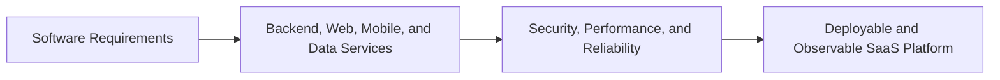
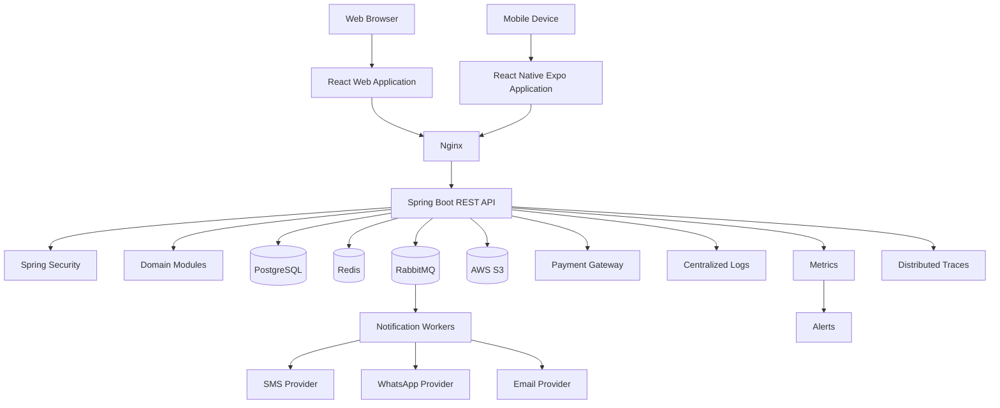
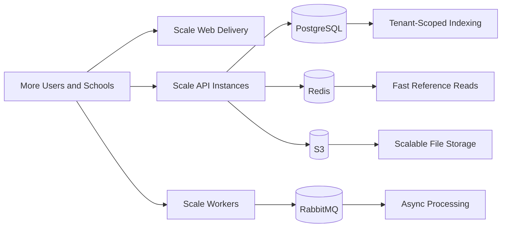
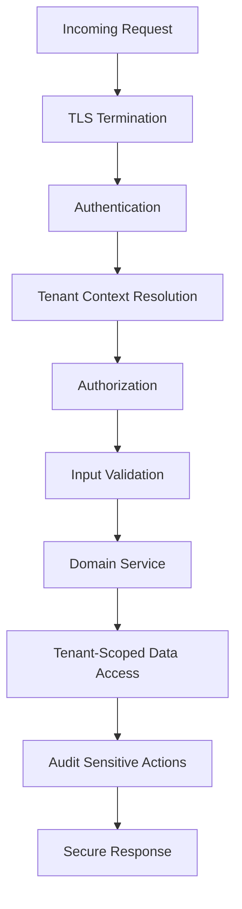
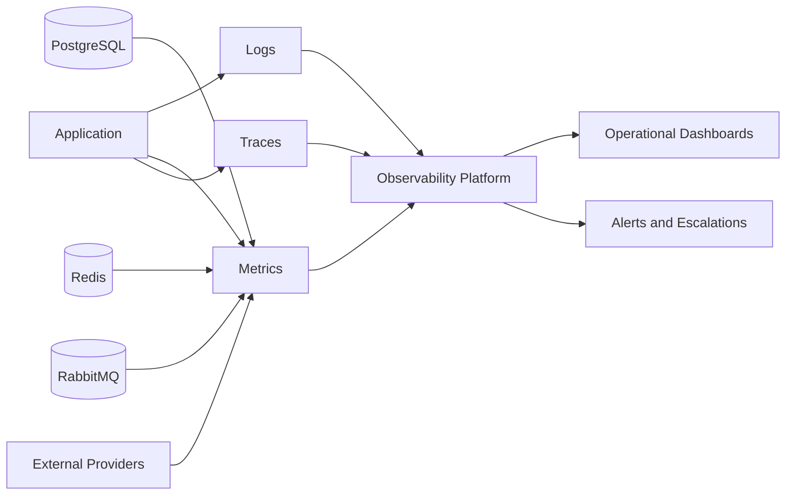

# EduSync Software Requirements Specification

| Field | Value |
| --- | --- |
| Product | EduSync |
| Document Type | Software Requirements Specification |
| Version | 1.0.0 |
| Status | Draft for Architecture and Engineering Review |
| Author | EduSync Product, Architecture, Engineering, Security, DevOps, and QA Office |
| Target Market | India |
| Future Market | Global |
| Last Updated | 2026-07-02 |

## Overview

EduSync is a cloud-native, multi-tenant School Management SaaS platform for private schools, CBSE schools, ICSE schools, state board schools, and coaching institutes with approximately 200 to 5,000 students. The platform must support secure school operations across authentication, school setup, student records, guardian records, teacher records, attendance, homework, examinations, fees, payments, reports, dashboards, notifications, subscriptions, super administration, audit logs, and AI-assisted workflows.

This Software Requirements Specification defines the enterprise-level software requirements for EduSync. It translates business and product expectations into system-level functional and non-functional requirements that engineering, architecture, QA, security, DevOps, and operations teams must satisfy.

EduSync must be designed as production SaaS software from the beginning. The system must enforce tenant isolation, protect sensitive school data, support reliable daily workflows, scale across many institutions, and remain maintainable as product modules expand.

## Purpose

The purpose of this document is to define the software requirements that govern how EduSync must be built, operated, secured, monitored, deployed, and maintained.

This document must be used to:

- Guide architecture and implementation decisions.
- Define system-wide functional requirements.
- Define non-functional quality attributes.
- Establish performance, scalability, availability, security, reliability, accessibility, and disaster recovery expectations.
- Define API, coding, deployment, browser, and mobile compatibility standards.
- Provide acceptance criteria for engineering readiness, release readiness, and operational readiness.

### System Delivery Flow

## Scope

This specification applies to the EduSync web application, mobile application, backend services, REST APIs, database, cache, messaging, file storage, integrations, CI/CD, deployment infrastructure, observability stack, backup processes, disaster recovery processes, and operational support workflows.

The scope includes:

- React, TypeScript, Vite, Tailwind, Shadcn, React Query, React Hook Form, and Zustand frontend requirements.
- React Native and Expo mobile application requirements.
- Java 21, Spring Boot, Spring Security, Spring Data JPA, Hibernate, MapStruct, Validation, and Lombok backend requirements.
- PostgreSQL database requirements.
- Redis cache requirements.
- RabbitMQ messaging requirements.
- Docker, AWS, GitHub Actions, and Nginx deployment requirements.
- AWS S3 storage requirements.
- REST API standards.
- Tenant isolation, security, audit logging, monitoring, backup, disaster recovery, and compliance requirements.

This document does not define individual UI designs, database physical schema, API endpoint-by-endpoint contracts, or implementation task breakdowns. Those artifacts must be created separately and must comply with this specification.

## System Context

## Business Rules

| Rule ID | Business Rule | Priority |
| --- | --- | --- |
| SRS-BR-001 | Every school must operate as an isolated tenant. | Critical |
| SRS-BR-002 | Every tenant-owned database table must include `school_id`. | Critical |
| SRS-BR-003 | Every tenant-owned query must enforce tenant isolation. | Critical |
| SRS-BR-004 | No school user may access another school's data. | Critical |
| SRS-BR-005 | Every protected API must enforce authentication and authorization server-side. | Critical |
| SRS-BR-006 | Sensitive actions must create audit log records. | Critical |
| SRS-BR-007 | Financial records must preserve immutable transaction history and controlled corrections. | Critical |
| SRS-BR-008 | Academic and attendance records must preserve historical context across academic years. | High |
| SRS-BR-009 | Subscription status must control feature access and channel entitlements. | High |
| SRS-BR-010 | External integration failures must not corrupt internal system state. | Critical |
| SRS-BR-011 | AI-assisted outputs must remain reviewable and must not bypass authorization rules. | High |

## Functional Requirements

### Core Functional Requirements

| ID | Requirement | Priority |
| --- | --- | --- |
| SRS-FR-001 | The system must authenticate users before allowing access to protected resources. | Critical |
| SRS-FR-002 | The system must authorize every protected action using role and permission rules. | Critical |
| SRS-FR-003 | The system must resolve tenant context for every authenticated school user. | Critical |
| SRS-FR-004 | The system must support school tenant setup and configuration. | Critical |
| SRS-FR-005 | The system must manage student, guardian, teacher, and employee records. | Critical |
| SRS-FR-006 | The system must support attendance capture, correction, reporting, and guardian notification. | Critical |
| SRS-FR-007 | The system must support homework and assignment workflows. | High |
| SRS-FR-008 | The system must support examination setup, marks entry, approval, result publication, and report cards. | Critical |
| SRS-FR-009 | The system must support fee structure configuration, invoice generation, discounts, dues, receipts, and reports. | Critical |
| SRS-FR-010 | The system must support payment initiation, payment confirmation, manual payment recording, receipt generation, and reconciliation. | Critical |
| SRS-FR-011 | The system must generate operational, academic, financial, and administrative reports. | Critical |
| SRS-FR-012 | The system must provide role-specific dashboards. | High |
| SRS-FR-013 | The system must send notifications through in-app, SMS, WhatsApp, and email channels where configured. | High |
| SRS-FR-014 | The system must manage subscription plans, entitlements, tenant lifecycle states, and feature access. | Critical |
| SRS-FR-015 | The system must maintain audit logs for sensitive actions. | Critical |
| SRS-FR-016 | The system must support platform super admin workflows for tenant and subscription administration. | High |
| SRS-FR-017 | The system must support secure file upload and retrieval through configured storage. | Medium |
| SRS-FR-018 | The system must expose REST APIs for frontend and mobile clients. | Critical |

### Tenant Isolation Functional Requirements

| ID | Requirement | Priority |
| --- | --- | --- |
| SRS-TENANT-001 | The backend must derive tenant context from authenticated server-side context, not from untrusted client input. | Critical |
| SRS-TENANT-002 | Repository, service, and query layers must enforce `school_id` filtering for tenant-owned records. | Critical |
| SRS-TENANT-003 | Reports, dashboards, exports, and background jobs must enforce tenant isolation. | Critical |
| SRS-TENANT-004 | Administrative support access must use explicit platform authorization and audit logs. | Critical |
| SRS-TENANT-005 | Automated tests must verify cross-tenant access denial for all modules. | Critical |

### Integration Functional Requirements

| ID | Requirement | Priority |
| --- | --- | --- |
| SRS-INT-001 | Payment gateway callbacks must be authenticated, validated, and idempotent. | Critical |
| SRS-INT-002 | SMS, WhatsApp, and email delivery must be processed asynchronously through queues where appropriate. | High |
| SRS-INT-003 | Integration failures must be captured with retry status and failure reason. | High |
| SRS-INT-004 | External provider credentials must be stored securely and never committed to source control. | Critical |
| SRS-INT-005 | File storage operations must validate file type, size, tenant ownership, and access permissions. | High |

## Non Functional Requirements

| Category | Requirement Summary |
| --- | --- |
| Performance | Common user workflows must respond quickly under expected school and platform load. |
| Scalability | The system must scale across schools, users, students, transactions, messages, reports, and files. |
| Availability | The platform must remain available for daily school operations with clear uptime targets. |
| Security | The platform must protect student, guardian, staff, financial, and institutional data. |
| Maintainability | The codebase must follow clean architecture, domain-driven design, SOLID principles, and modular boundaries. |
| Reliability | Critical workflows must handle failures without data corruption. |
| Accessibility | Web and mobile interfaces must support accessible use by school stakeholders. |
| Observability | Logs, metrics, traces, dashboards, alerts, and audit records must support production operations. |
| Recoverability | Backup and disaster recovery procedures must support business continuity. |
| Compliance | The system must be designed for applicable Indian privacy, contractual, audit, and future global compliance needs. |

## Performance

### Performance Targets

| Area | Requirement | Target |
| --- | --- | --- |
| Login | Authenticate valid users and load initial role context. | P95 under 2 seconds under normal load. |
| Dashboard | Load role-specific dashboard summary. | P95 under 3 seconds for common dashboard views. |
| Attendance | Load class attendance roster. | P95 under 2 seconds for typical class size. |
| Attendance submission | Submit attendance for a class-section. | P95 under 2 seconds excluding notification delivery. |
| Student search | Search students by common filters. | P95 under 2 seconds for indexed filters. |
| Fee lookup | Load student fee summary and dues. | P95 under 3 seconds. |
| Payment callback | Process idempotent payment callback. | P95 under 2 seconds after provider delivery. |
| Report preview | Load common filtered report. | P95 under 5 seconds for standard date ranges. |
| Large export | Generate large exports asynchronously where needed. | Completion time based on report size with visible status. |
| Notification enqueue | Queue notification request. | P95 under 1 second for accepted messages. |

### Performance Requirements

| ID | Requirement |
| --- | --- |
| PERF-001 | API endpoints must use pagination for list responses that can grow beyond one page. |
| PERF-002 | Database queries must use appropriate indexes for tenant, date, status, class, student, and invoice lookup patterns. |
| PERF-003 | Dashboard and report queries must avoid unbounded scans. |
| PERF-004 | Expensive exports must run asynchronously when synchronous response time would exceed acceptable limits. |
| PERF-005 | Caching must be used for stable reference data and high-read workloads where correctness permits. |
| PERF-006 | File upload and download operations must not block unrelated core workflows. |
| PERF-007 | Notification delivery must be decoupled from user-facing transaction completion where immediate delivery is not required. |
| PERF-008 | Performance tests must cover high-volume tenant data and concurrent school workflows. |

## Scalability

EduSync must scale at two levels: within a single school tenant and across many school tenants.

### Scalability Requirements

| ID | Requirement |
| --- | --- |
| SCALE-001 | The architecture must support horizontal scaling of stateless backend application instances. |
| SCALE-002 | The frontend must be deployable as static assets behind a web server or CDN-compatible hosting model. |
| SCALE-003 | The database design must support tenant-scoped indexing and query partitioning strategies where needed. |
| SCALE-004 | Asynchronous workloads such as notifications, exports, and integration retries must scale through RabbitMQ workers. |
| SCALE-005 | Redis must be used for cache and transient coordination patterns where appropriate. |
| SCALE-006 | File storage must use AWS S3 or equivalent object storage rather than local application disk. |
| SCALE-007 | The system must avoid tenant-specific application deployments for standard SaaS customers. |
| SCALE-008 | The modular monolith must preserve domain boundaries so high-scale domains can be extracted later if required. |
| SCALE-009 | The system must support growth in active schools, users, students, attendance records, invoices, payments, notifications, and report data. |

### Scaling Model

## Availability

### Availability Requirements

| ID | Requirement |
| --- | --- |
| AVAIL-001 | The production platform must target high availability for daily school operations. |
| AVAIL-002 | Planned maintenance must be communicated in advance where customer impact is expected. |
| AVAIL-003 | Application instances must be replaceable without manual server reconstruction. |
| AVAIL-004 | Health checks must be exposed for load balancer and monitoring systems. |
| AVAIL-005 | Critical dependencies such as PostgreSQL, Redis, RabbitMQ, S3, payment gateway, and communication providers must be monitored. |
| AVAIL-006 | Degraded external provider state must not make unrelated internal workflows unavailable. |
| AVAIL-007 | The system must provide graceful error messages when a dependent service is unavailable. |

### Availability Targets

| Environment | Target |
| --- | --- |
| Production | Minimum 99.5% monthly availability for core application access during initial production maturity, with a roadmap toward 99.9%. |
| Staging | Best effort availability suitable for release validation. |
| Development | Best effort availability for engineering usage. |

## Security

Security is a foundational requirement for EduSync because the system handles student data, guardian data, employee data, academic records, fee data, payment data, documents, and institutional operational information.

### Security Requirements

| ID | Requirement |
| --- | --- |
| SEC-001 | All protected APIs must require authentication. |
| SEC-002 | Authorization must be enforced server-side using roles, permissions, tenant context, and record scope. |
| SEC-003 | Passwords must be stored using strong one-way hashing. |
| SEC-004 | Authentication tokens must be signed, time-bound, and protected from client-side misuse. |
| SEC-005 | Tenant isolation must be enforced in service and data access layers. |
| SEC-006 | Sensitive configuration and credentials must be stored in secure environment or secret management systems. |
| SEC-007 | APIs must validate all input using server-side validation. |
| SEC-008 | The system must protect against common web vulnerabilities including injection, broken access control, XSS, CSRF where applicable, insecure deserialization, and security misconfiguration. |
| SEC-009 | File uploads must validate type, size, ownership, and malware scanning strategy where available. |
| SEC-010 | Payment callbacks must use provider signature validation or equivalent authenticity checks. |
| SEC-011 | Administrative and financial actions must be auditable. |
| SEC-012 | Production logs must not contain passwords, secrets, full payment credentials, or unnecessary sensitive personal data. |
| SEC-013 | HTTPS must be required for production traffic. |
| SEC-014 | CORS must be restricted to approved origins. |
| SEC-015 | Security tests and dependency scans must be part of CI/CD readiness. |

### Security Control Diagram

## Maintainability

### Maintainability Requirements

| ID | Requirement |
| --- | --- |
| MAINT-001 | Backend code must follow clean architecture with clear Controller, Service, Repository, DTO, Mapper, Entity, Validation, Exception, Configuration, and Security responsibilities. |
| MAINT-002 | Domain logic must be placed in service or domain layers, not controllers. |
| MAINT-003 | Controllers must handle request mapping, validation delegation, authorization context, and response shaping. |
| MAINT-004 | Repositories must encapsulate persistence access and must enforce tenant-scoped queries where applicable. |
| MAINT-005 | DTOs must be used for API input and output; entities must not be exposed directly to clients. |
| MAINT-006 | MapStruct must be used for repeatable mapping patterns where appropriate. |
| MAINT-007 | Validation must use Bean Validation and explicit business validation where needed. |
| MAINT-008 | Exceptions must use consistent error response formats. |
| MAINT-009 | Frontend code must use TypeScript, component boundaries, typed API clients, React Query for server state, React Hook Form for forms, and Zustand for client state where appropriate. |
| MAINT-010 | Modules must be organized to reduce coupling and support future extraction. |
| MAINT-011 | Code must include tests for critical business rules, tenant isolation, authorization, fee calculations, payments, and reports. |
| MAINT-012 | Documentation must be updated when product behavior, APIs, architecture, or operational procedures change. |

## Reliability

### Reliability Requirements

| ID | Requirement |
| --- | --- |
| REL-001 | Critical write operations must be transactional where consistency is required. |
| REL-002 | Payment processing must be idempotent. |
| REL-003 | Notification processing must use retries and failure recording. |
| REL-004 | Background jobs must be safe to retry. |
| REL-005 | Partial failures must be visible through logs, metrics, and user-facing status where appropriate. |
| REL-006 | Fee and payment calculations must be deterministic and test-covered. |
| REL-007 | Attendance and examination corrections must preserve history and audit context. |
| REL-008 | Database migrations must be versioned, repeatable, and validated before production deployment. |
| REL-009 | The system must fail safely when external providers are unavailable. |
| REL-010 | Support teams must have enough diagnostic information to investigate production incidents without direct database manipulation as the default path. |

## Accessibility

EduSync must be usable by administrators, teachers, finance staff, principals, parents, and students with varying levels of technical comfort.

### Accessibility Requirements

| ID | Requirement |
| --- | --- |
| A11Y-001 | Web UI must follow WCAG 2.1 AA-aligned design practices where feasible for production release. |
| A11Y-002 | Forms must provide labels, validation messages, and keyboard-accessible controls. |
| A11Y-003 | Color must not be the only way to communicate status. |
| A11Y-004 | Text contrast must be sufficient for normal and compact operational UI. |
| A11Y-005 | Navigation must be usable by keyboard for web workflows. |
| A11Y-006 | Error messages must be understandable and actionable. |
| A11Y-007 | Mobile UI must support platform accessibility features such as scalable text and screen reader labels where practical. |
| A11Y-008 | Tables and reports must remain readable and navigable on supported devices. |

## Logging

### Logging Requirements

| ID | Requirement |
| --- | --- |
| LOG-001 | Backend services must produce structured logs. |
| LOG-002 | Logs must include correlation IDs or request IDs for tracing user journeys. |
| LOG-003 | Logs must include tenant context where safe and appropriate. |
| LOG-004 | Logs must record integration failures, background job failures, and security-relevant events. |
| LOG-005 | Logs must not include passwords, secrets, tokens, full payment credentials, or unnecessary sensitive personal data. |
| LOG-006 | Error logs must include enough context for diagnosis without exposing private data. |
| LOG-007 | Production logs must be centrally searchable by authorized support and engineering users. |
| LOG-008 | Log retention must follow operational, security, cost, and compliance requirements. |

## Monitoring

### Monitoring Requirements

| ID | Requirement |
| --- | --- |
| MON-001 | The platform must monitor API availability, latency, error rate, and throughput. |
| MON-002 | The platform must monitor database health, connection usage, slow queries, and storage utilization. |
| MON-003 | The platform must monitor Redis health and cache availability. |
| MON-004 | The platform must monitor RabbitMQ queue depth, consumer health, retry counts, and dead-letter queues. |
| MON-005 | The platform must monitor notification delivery success and failure rates by channel. |
| MON-006 | The platform must monitor payment callback failures and reconciliation mismatches. |
| MON-007 | The platform must monitor disk, memory, CPU, network, and container health. |
| MON-008 | Alerts must be configured for critical production failure conditions. |
| MON-009 | Dashboards must provide operational visibility for engineering and support teams. |

### Monitoring Flow

## Disaster Recovery

### Disaster Recovery Requirements

| ID | Requirement |
| --- | --- |
| DR-001 | Production disaster recovery procedures must be documented and tested. |
| DR-002 | Recovery Time Objective and Recovery Point Objective must be defined for production. |
| DR-003 | Database backup restoration must be tested on a scheduled basis. |
| DR-004 | Infrastructure must be reproducible from code or documented deployment procedures. |
| DR-005 | Critical secrets, configuration, and deployment artifacts must be recoverable through controlled processes. |
| DR-006 | Object storage recovery strategy must be documented. |
| DR-007 | Incident communication procedures must identify internal owners and customer communication paths. |
| DR-008 | Disaster recovery tests must capture findings and remediation actions. |

### Initial Recovery Targets

| Metric | Target |
| --- | --- |
| RPO | 24 hours or better for initial production; improve as customer scale grows. |
| RTO | 8 hours or better for initial production; improve as operational maturity grows. |
| Backup restore test | At least quarterly for production backups. |
| DR review | At least twice per year or after major architecture changes. |

## Backup

### Backup Requirements

| ID | Requirement |
| --- | --- |
| BAK-001 | PostgreSQL production data must be backed up on a scheduled basis. |
| BAK-002 | Backups must be encrypted at rest where supported by infrastructure. |
| BAK-003 | Backup access must be restricted to authorized operational roles. |
| BAK-004 | Backup retention must balance recovery requirements, compliance, and cost. |
| BAK-005 | Backup restore procedures must be documented and tested. |
| BAK-006 | AWS S3 stored documents must use versioning, lifecycle, or equivalent protection strategy where appropriate. |
| BAK-007 | Backup failures must generate alerts. |
| BAK-008 | Backup restoration must verify tenant data integrity and application compatibility. |

## Compliance

EduSync must be designed with compliance readiness for Indian schools and future global expansion. This document does not provide legal advice; legal counsel must validate applicable regulatory obligations.

### Compliance Requirements

| ID | Requirement |
| --- | --- |
| COMP-001 | The system must support privacy-aware handling of student, guardian, staff, financial, and academic data. |
| COMP-002 | Access to personal and financial data must be role-restricted. |
| COMP-003 | Audit logs must support investigation of sensitive administrative, academic, financial, and security actions. |
| COMP-004 | Data retention and deletion policies must be configurable or documented according to business and legal requirements. |
| COMP-005 | Customer contracts, privacy policies, and terms must align with actual platform behavior. |
| COMP-006 | The architecture must be capable of supporting future compliance requirements for global markets. |
| COMP-007 | Production support access to customer data must be controlled, justified, and auditable. |
| COMP-008 | Security incidents must follow documented response and communication procedures. |

## API Standards

### REST API Requirements

| ID | Requirement |
| --- | --- |
| API-001 | APIs must follow REST principles using resource-oriented URLs. |
| API-002 | APIs must use standard HTTP methods such as GET, POST, PUT, PATCH, and DELETE according to action semantics. |
| API-003 | APIs must return consistent HTTP status codes. |
| API-004 | APIs must use JSON request and response bodies unless a file or stream response is required. |
| API-005 | APIs must use DTOs and must not expose JPA entities directly. |
| API-006 | APIs must validate input and return structured validation errors. |
| API-007 | APIs must enforce authentication, authorization, and tenant context. |
| API-008 | List APIs must support pagination and appropriate filtering. |
| API-009 | Sorting must be explicit and restricted to supported fields. |
| API-010 | API errors must use a consistent error response structure. |
| API-011 | Idempotency must be supported for payment callbacks and retry-sensitive operations. |
| API-012 | APIs must be documented for frontend, mobile, QA, and integration consumers. |

### Standard Error Response

| Field | Description |
| --- | --- |
| timestamp | Server-side error timestamp. |
| status | HTTP status code. |
| error | Standard error category. |
| message | Human-readable safe error message. |
| path | API path. |
| correlationId | Request correlation identifier. |
| validationErrors | Field-level validation errors when applicable. |

## Coding Standards

### Backend Coding Standards

| Area | Standard |
| --- | --- |
| Language | Java 21. |
| Framework | Spring Boot with Spring Security, Spring Data JPA, Hibernate, Validation, MapStruct, and Lombok. |
| Architecture | Clean Architecture, Domain Driven Design, SOLID principles, modular monolith, microservice-ready boundaries. |
| Controller | Handles routing, request validation entry point, authorization context, and response mapping. |
| Service | Owns domain workflows, business rules, transactions, and orchestration. |
| Repository | Owns persistence access and tenant-scoped queries. |
| DTO | Used for API request and response models. |
| Mapper | Uses MapStruct where appropriate for mapping between entities and DTOs. |
| Entity | Represents persistence model and must not be exposed directly to API consumers. |
| Validation | Uses Bean Validation plus explicit domain validation. |
| Exception | Uses consistent application exception hierarchy and error response format. |
| Security | Uses Spring Security and server-side authorization checks. |

### Frontend Coding Standards

| Area | Standard |
| --- | --- |
| Language | TypeScript. |
| Framework | React with Vite. |
| Styling | Tailwind and Shadcn components where appropriate. |
| Server state | React Query. |
| Forms | React Hook Form with schema or structured validation. |
| Client state | Zustand where shared client state is needed. |
| API access | Typed API client or consistent request abstraction. |
| Components | Role-specific, reusable, accessible, and testable components. |
| Error handling | Consistent user-facing error and empty-state patterns. |

### Mobile Coding Standards

| Area | Standard |
| --- | --- |
| Framework | React Native with Expo. |
| Language | TypeScript. |
| Navigation | Consistent role-aware navigation model. |
| API access | Shared typed API patterns where feasible. |
| Offline behavior | Explicit handling for network failures and retry where appropriate. |
| Accessibility | Support platform accessibility labels and scalable UI patterns where feasible. |

## Deployment Requirements

### Deployment Architecture Requirements

| ID | Requirement |
| --- | --- |
| DEPLOY-001 | The application must be deployable using Docker containers. |
| DEPLOY-002 | CI/CD must use GitHub Actions or approved equivalent. |
| DEPLOY-003 | Nginx must be used for web serving, reverse proxy, or ingress responsibilities where applicable. |
| DEPLOY-004 | Production deployments must use environment-specific configuration. |
| DEPLOY-005 | Secrets must not be stored in source code or documentation. |
| DEPLOY-006 | Database migrations must run through controlled deployment procedures. |
| DEPLOY-007 | Deployments must support rollback or remediation strategy. |
| DEPLOY-008 | Health checks must be available for deployment verification. |
| DEPLOY-009 | Staging must be used to validate releases before production. |
| DEPLOY-010 | Static frontend assets must be versioned or cache-managed to prevent stale client issues. |

### Deployment Flow

```mermaid
flowchart LR
    Code[Code Commit] --> CI[GitHub Actions CI]
    CI --> Tests[Automated Tests]
    Tests --> Build[Build Artifacts and Images]
    Build --> Scan[Security and Quality Checks]
    Scan --> Staging[Deploy to Staging]
    Staging --> Verify[Smoke and Regression Verification]
    Verify --> Approval[Release Approval]
    Approval --> Production[Deploy to Production]
    Production --> Monitor[Monitor Health and Metrics]
```

## Browser Compatibility

### Browser Support Requirements

| Browser | Support Level |
| --- | --- |
| Google Chrome latest stable | Fully supported. |
| Microsoft Edge latest stable | Fully supported. |
| Mozilla Firefox latest stable | Supported. |
| Safari latest stable on macOS | Supported for core workflows. |
| Mobile Chrome latest stable | Supported for responsive web workflows. |
| Mobile Safari latest stable | Supported for responsive web workflows. |

### Browser Requirements

| ID | Requirement |
| --- | --- |
| BROWSER-001 | The web application must support modern evergreen browsers. |
| BROWSER-002 | The web application must provide responsive layouts for common desktop, tablet, and mobile viewport sizes. |
| BROWSER-003 | The system must not depend on browser-specific behavior without fallback. |
| BROWSER-004 | Critical forms must work reliably in supported browsers. |
| BROWSER-005 | Browser compatibility must be verified before production release. |

## Mobile Compatibility

### Mobile Application Requirements

| ID | Requirement |
| --- | --- |
| MOBILE-001 | Mobile applications must be built with React Native and Expo. |
| MOBILE-002 | Mobile applications must support Android and iOS according to product release scope. |
| MOBILE-003 | Guardian, student, and teacher mobile workflows must be optimized for small screens. |
| MOBILE-004 | Mobile apps must handle intermittent network connectivity gracefully. |
| MOBILE-005 | Mobile apps must secure stored tokens and sensitive local data. |
| MOBILE-006 | Push notification behavior must respect platform policies and user permissions where implemented. |
| MOBILE-007 | Mobile apps must use the same authorization and tenant isolation rules as the web application. |
| MOBILE-008 | Mobile releases must be tested on representative Android and iOS devices or simulators. |

### Mobile Web Requirements

| ID | Requirement |
| --- | --- |
| MWEB-001 | Critical web workflows must remain usable on mobile browsers when users do not install the mobile app. |
| MWEB-002 | Tables and reports must provide responsive alternatives or horizontal scrolling where required. |
| MWEB-003 | Touch targets must be large enough for practical mobile use. |
| MWEB-004 | Authentication, fee lookup, payment, homework, and notification views must be usable on mobile viewports. |

## Assumptions

| Assumption | Impact |
| --- | --- |
| Schools will use modern browsers or mobile apps for daily workflows. | Defines browser and mobile support scope. |
| PostgreSQL is the system of record for transactional data. | Drives data integrity and backup strategy. |
| External providers will be used for payments, SMS, WhatsApp, and email. | Requires resilient integration and monitoring. |
| Schools will have varying data quality during onboarding. | Requires validation, migration checks, and support workflows. |
| Shared-database multi-tenancy is the selected SaaS model. | Requires strict `school_id` enforcement. |
| AWS is the initial target cloud platform. | Guides deployment, storage, backup, and monitoring decisions. |

## Dependencies

| Dependency | Required For |
| --- | --- |
| React, TypeScript, Vite | Web application. |
| Tailwind and Shadcn | Frontend UI system. |
| React Query | Server state management. |
| React Hook Form | Form management and validation. |
| Zustand | Client state management. |
| React Native and Expo | Mobile applications. |
| Java 21 and Spring Boot | Backend services and REST APIs. |
| Spring Security | Authentication and authorization. |
| Spring Data JPA and Hibernate | Persistence layer. |
| MapStruct | DTO and entity mapping. |
| PostgreSQL | Primary database. |
| Redis | Cache and transient performance support. |
| RabbitMQ | Asynchronous messaging. |
| AWS S3 | File storage. |
| Docker | Containerized deployment. |
| AWS | Cloud infrastructure. |
| GitHub Actions | CI/CD automation. |
| Nginx | Web serving and reverse proxy. |

## Acceptance Criteria

| Area | Acceptance Criteria |
| --- | --- |
| Functional | Critical functional requirements are implemented, tested, and traceable to product modules. |
| Tenant Isolation | Cross-tenant access tests pass for every module. |
| Security | Authentication, authorization, input validation, and audit logging pass security review. |
| Performance | Critical workflows meet defined performance targets under expected load. |
| Reliability | Payment, notification, fee, attendance, and examination workflows handle retries and failures safely. |
| Observability | Logs, metrics, traces, dashboards, and alerts are available for production operations. |
| Backup | Backup and restore procedures are documented and tested. |
| Deployment | CI/CD, staging validation, production deployment, and rollback procedures are defined. |
| Compatibility | Supported browsers and mobile platforms pass release validation. |
| Documentation | Relevant product, software, architecture, API, security, and operational documentation is updated. |

## Future Scope

Future software requirements may include multi-region deployment, stronger RPO and RTO targets, advanced autoscaling, data warehouse integration, event-driven module decomposition, GraphQL or specialized read APIs where justified, offline-first mobile workflows, enterprise SSO, MFA, advanced device management, enhanced AI governance, custom report builder infrastructure, multi-currency support, global compliance controls, and partner integration marketplace capabilities.

Future scope must be evaluated through business value, customer demand, operational cost, security impact, and architectural readiness.

## References

- EduSync `AI_INSTRUCTIONS.md`.
- EduSync Vision Document: `docs/getting-started/vision.md`.
- EduSync Business Requirements Document: `docs/business/business-requirements.md`.
- EduSync Product Requirements Document: `docs/product/product-requirements.md`.
- EduSync documentation structure under `docs/`.

## Revision History

| Version | Date | Author | Status | Changes |
| --- | --- | --- | --- | --- |
| 1.0.0 | 2026-07-02 | EduSync Product, Architecture, Engineering, Security, DevOps, and QA Office | Draft for Architecture and Engineering Review | Initial enterprise software requirements specification created. |
