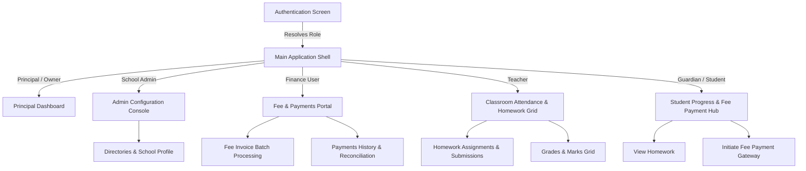

# Figma UI/UX Planning and Design System Specification

| Field | Value |
| --- | --- |
| Title | Figma UI/UX Planning and Design System Specification |
| Document ID | DOC-UX-FIGMA-001 |
| Version | 1.0.0 |
| Status | Draft |
| Author | EduSync UX and Product Team |
| Created Date | 2026-07-02 |
| Last Updated | 2026-07-02 |
| Reviewers | Principal Architect, Head of Product, Engineering Leads |
| Approval Status | Pending Review |
| Confidentiality | Internal |

---

## 1. Revision History

| Version | Date | Author | Status | Changes |
| --- | --- | --- | --- | --- |
| 1.0.0 | 2026-07-02 | EduSync UX and Product Team | Draft | Initial version of the Figma planning and Design System specification document. |

---

## Table of Contents

- [2. Executive Summary](#2-executive-summary)
- [3. Purpose](#3-purpose)
- [4. Objectives](#4-objectives)
- [5. Scope](#5-scope)
- [6. Out of Scope](#6-out-of-scope)
- [7. Audience](#7-audience)
- [8. Definitions](#8-definitions)
- [9. Assumptions](#9-assumptions)
- [10. Dependencies](#10-dependencies)
- [11. Figma File Organization](#11-figma-file-organization)
- [12. Design System Specification](#12-design-system-specification)
  - [12.1 Color Tokens](#121-color-tokens)
  - [12.2 Typography Specimen](#122-typography-specimen)
  - [12.3 Layout Grid and Breakpoints](#123-layout-grid-and-breakpoints)
  - [12.4 Spacing Scale](#124-spacing-scale)
  - [12.5 Elevation & Shape](#125-elevation--shape)
  - [12.6 Reusable UI Components](#126-reusable-ui-components)
- [13. Screen Specifications by Module](#13-screen-specifications-by-module)
  - [13.1 Authentication Module](#131-authentication-module)
  - [13.2 School Module](#132-school-module)
  - [13.3 Student Module](#133-student-module)
  - [13.4 Guardian Module](#134-guardian-module)
  - [13.5 Teacher Module](#135-teacher-module)
  - [13.6 Employee Module](#136-employee-module)
  - [13.7 Attendance Module](#137-attendance-module)
  - [13.8 Homework Module](#138-homework-module)
  - [13.9 Examination Module](#139-examination-module)
  - [13.10 Fees Module](#1310-fees-module)
  - [13.11 Payments Module](#1311-payments-module)
  - [13.12 Reports Module](#1312-reports-module)
  - [13.13 Dashboard Module](#1313-dashboard-module)
  - [13.14 Notification Module](#1314-notification-module)
  - [13.15 Subscription Module](#1315-subscription-module)
  - [13.16 Super Admin Module](#1316-super-admin-module)
  - [13.17 Audit Logs Module](#1317-audit-logs-module)
  - [13.18 AI Services Module](#1318-ai-services-module)
- [14. References](#14-references)
- [15. Conclusion](#15-conclusion)

---

## 2. Executive Summary

This document defines the comprehensive user interface and experience (UI/UX) planning for the EduSync platform. It outlines the Figma file page structure, visual brand guidelines, design system components, and detailed layout specifications for every core product module. By detailing each user screen, interaction state, responsive behavior, and layout pattern, this specification acts as the design system of record that bridge product requirements and engineering implementation.

---

## 3. Purpose

The purpose of this document is to catalog and describe the visual foundations, reusable component standards, and screen states for the entire EduSync SaaS platform. This planning document ensures visual alignment across product engineering, establishes strict layouts for multi-tenant and role-based views, and provides detailed reference schemas for frontend and mobile development teams.

---

## 4. Objectives

- **Standardize UI Foundations**: Document the colors, typography, spacing, grids, and visual elevations based on Material Design 3.
- **Map Screen States**: Define the empty, error, loading, and success states for all screens across all modules.
- **Ensure Responsive Consistency**: Outline the transition patterns between React (web/desktop) and React Native (mobile) layouts.
- **Define Navigation Archetype**: Map the role-based bottom-tab and drawer navigation hierarchies.
- **Improve Component Reusability**: Enforce modularity using twelve core primitive components.

---

## 5. Scope

This document covers all user-facing panels, mobile app screens, web dashboards, and administrative systems for the 18 product modules:
- Authentication, School, Student, Guardian, Teacher, Employee, Attendance, Homework, Examination, Fees, Payments, Reports, Dashboard, Notification, Subscription, Super Admin, Audit Logs, and AI Services.

---

## 6. Out of Scope

This document does not define:
- Concrete CSS or TypeScript styling code.
- REST API endpoint contracts.
- Database index configurations.
- Testing frameworks (such as Jest or Playwright scripts).

---

## 7. Audience

- **UI/UX Designers**: To structure and link the Figma workspace.
- **Frontend Engineers**: To implement the React web shell and styles.
- **Mobile Engineers**: To build the React Native Expo app screens.
- **QA Engineers**: To write test cases for edge cases, error states, and responsive views.
- **Product Owners**: To verify visual flow matches business rules.

---

## 8. Definitions

- **Material Design 3 (M3)**: The default design framework guidelines from Google.
- **M3 Tokens**: Semantic naming conventions (e.g., Primary, On-Primary, Surface) that map to CSS or NativeWind variables.
- **Tonal Colors**: Soft, low-contrast background fills (e.g., Primary Container) designed to group content.
- **Bottom Navigation Tab**: The main tab bar positioned at the bottom of mobile screens.
- **Drawer Navigation**: A side menu container that slides out to reveal secondary views.
- **Skeleton Loader**: Shaded placeholder blocks that represent content loading.
- **Idempotent State**: Visual components that remain unchanged if a user performs the same action repeatedly.

---

## 9. Assumptions

- **Inter Font Availability**: The typography hierarchy assumes that the Inter font family is loaded via CDN or local assets.
- **Material Symbols Rounded**: Icon naming follows the Google Material Symbols Rounded family.
- **Role Permissions Resolution**: The app shell resolves user roles during bootstrapping to dynamically show tabs or drawers.

---

## 10. Dependencies

- **Design System Asset Library**: Access to the WOFF2 font files (`Inter` and `Material Symbols Rounded`) is required for offline page rendering and design fidelity.
- **Product Requirements Alignment**: This document depends directly on the core capabilities and rules specified in `docs/03-Product-Requirements/product-requirements.md`.
- **Figma Desktop or Web Client**: Editing and rendering the specified Figma canvas frames requires the use of Figma Desktop or Web interface version 120 or higher.

---

## 11. Figma File Organization

The Figma canvas must be partitioned into the following sequential pages to separate design contexts:

| Page Number | Page Name | Scope & Contents |
| --- | --- | --- |
| Page 1 | 🗺️ Roadmap & Changelog | Change history log, layout patterns, color scopes, Figma system indicators. |
| Page 2 | 🎨 Design System Foundations | Colors, Typography specimen, spacing grid, shadows, border radii. |
| Page 3 | 🧱 Reusable UI Primitives | Primary, secondary, tonal buttons; input text fields; card structures, alerts, sheets. |
| Page 4 | 🔐 Identity & Access | Login forms, password reset slides, multi-tenant OTP verification. |
| Page 5 | 🏢 Directories & Config | School profile, student directory, teacher mapping console, employee assignments. |
| Page 6 | 📚 Academic Hub | Attendance rosters, homework boards, exam configurations, marks grids. |
| Page 7 | 💳 Financial Center | Fee setup panels, concessions, invoices, payment gateways, receipts. |
| Page 8 | 📊 Insights & Comms | Chat threads, announcements feeds, operational reports, role dashboards. |
| Page 9 | 🛠️ Platform Governance | Subscription manager, super admin controls, audit logs console, AI sidebar. |

### Layout Navigation Flow Diagram

---

## 12. Design System Specification

### 12.1 Color Tokens

Every color token maps to a specific hex code in both Light and Dark modes:

| Token Name | Light Mode Hex | Dark Mode Hex | Description |
| --- | --- | --- | --- |
| `primary` | `#7C3AED` | `#CFBCFF` | Violet primary accent for CTA fills, active states. |
| `on-primary` | `#FFFFFF` | `#341277` | High-contrast label/icon color placed on primary fills. |
| `primary-container`| `#ECE0FF` | `#4A2E8A` | Soft backdrop for grouping related actions or active tabs. |
| `on-primary-container` | `#290055` | `#EDDCFF` | Text or icon color inside a primary container. |
| `accent` | `#0D9488` | `#2DD4BF` | Teal color representing auxiliary features like metrics, success tags. |
| `accent-container` | `#CFFAF4` | `#0C4A43` | Tonal teal background. |
| `success` | `#16A34A` | `#4ADE80` | Green semantic color for positive states, present attendance. |
| `warning` | `#F59E0B` | `#FBBF24` | Amber semantic color for pending invoices, late arrivals. |
| `error` | `#DC2626` | `#FF8A80` | Red semantic color for failed transactions, absent marks. |
| `surface` | `#FFFFFF` | `#1A1820` | Container cards, fields, sheets backdrops. |
| `surface-2` | `#F3EFFA` | `#221F2B` | Navigation bar backgrounds, inputs default states. |
| `surface-3` | `#ECE5F7` | `#2A2734` | Border lines, inactive select options. |
| `background` | `#F6F3FC` | `#121017` | Canvas background for the entire viewport. |
| `outline` | `#CFC8DA` | `#494351` | Divider line color, default border outlines. |
| `outline-variant` | `#E8E2F1` | `#332F3C` | Subtle secondary borders, card separations. |

### 12.2 Typography Specimen

Font family is **Inter**. Standard Material Design 3 type-scaling is configured as follows:

| Style Class | Font Size | Weight | Line Height | Letter Spacing |
| --- | --- | --- | --- | --- |
| `Display Large` | 57px | 800 (ExtraBold) | 64px | -0.02em |
| `Headline Medium`| 28px | 700 (Bold) | 36px | -0.01em |
| `Title Large` | 22px | 700 (Bold) | 28px | 0.00em |
| `Title Medium` | 16px | 600 (SemiBold) | 24px | 0.00em |
| `Body Large` | 16px | 400 (Regular) | 24px | 0.00em |
| `Body Medium` | 14px | 400 (Regular) | 20px | 0.00em |
| `Label / Caption`| 12px | 600 (SemiBold) | 16px | 0.04em (Uppercase) |

### 12.3 Layout Grid and Breakpoints

To align web dashboards and mobile screens, designs are locked to the following grid containers:

- **Desktop (Web - Breakpoint >= 1024px)**:
  - Width: 1440px canvas.
  - Columns: 12-column grid.
  - Gutter: 24px width.
  - Margin: 80px side margins.
- **Mobile (React Native - Breakpoint <= 600px)**:
  - Width: 375px canvas.
  - Columns: 4-column grid.
  - Gutter: 16px width.
  - Margin: 16px side margins.

### 12.4 Spacing Scale

The layout is anchored to an **8pt grid** (with a 4pt micro-scale for compact widgets):

- `xs`: 4px (Padding inside badges, micro gaps)
- `sm`: 8px (Inner component spacing, icon-to-label gaps)
- `md`: 12px (Form vertical spacing, card inner item margins)
- `lg`: 16px (Card paddings, mobile screen outer gutters)
- `xl`: 24px (Section vertical margins, outer grid separation gaps)
- `2xl`: 32px (Header bottom margins, login container offsets)
- `3xl`: 48px (Hero component margins)

### 12.5 Elevation & Shape

- **Level 1 (Default Cards)**: Border radius `12px` / Box shadow `0px 1px 2px rgba(28, 20, 45, 0.1)`.
- **Level 2 (Dropdowns, Sheets)**: Border radius `16px` / Box shadow `0px 4px 12px rgba(28, 20, 45, 0.15)`.
- **Level 3 (Modal Dialogs)**: Border radius `24px` / Box shadow `0px 12px 32px rgba(28, 20, 45, 0.22)`.
- **Pill Shape**: Fills with fully rounded edges (`999px` radius) used for tag badges and button outlines.

### 12.6 Reusable UI Components

Designs must consume only these structured primitives:

1. **`AppButton`**: Consumes `Filled` (primary actions), `Tonal` (secondary actions), `Outlined` (actions needing boundaries), and `Text` (low priority) states.
2. **`AppInput`**: Handles email/password/text entries. Consumes `Default`, `Focused` (2px outline), `Error` (red outline), and `Disabled` states.
3. **`AppCard`**: Content wrapper implementing elevation layers.
4. **`AppAvatar`**: Circular representation of name/profile.
5. **`AppHeader`**: Layout bar for screen titles and actions.
6. **`Loader`**: Indeterminate circular loader or skeleton layout bars.
7. **`EmptyState`**: Fills empty boards with illustrative graphic and recovery actions.
8. **`ModalDialog`**: Level 3 container positioned over the scrim backdrop for critical confirmations.
9. **`BottomSheet`**: Slide-up pane for action options.
10. **`Badge`**: Tonal pill shapes indicating status (e.g., Paid, Pending).
11. **`NotificationBanner`**: Floating banner for real-time announcements.
12. **`StatusIndicator`**: Dot representing connectivity or online status.

---

## 13. Screen Specifications by Module

### 13.1 Authentication Module

#### Screen 1: Splash Screen
- **Screen Name**: Splash Screen
- **Screen Purpose**: Initialize the session token, resolve tenant context, and authenticate credentials.
- **Components**: Large central school icon badge, title label, subtitle label, circular loading indicator.
- **Layout**: Centered single-column layout on an absolute gradient background.
- **Navigation**: Transitions automatically to `Onboarding` if unauthenticated, or directly to `Dashboard` (with resolved role tabs) if authenticated.
- **User Flow**: User opens the app -> system checks session token -> transitions to correct route.
- **Mobile Layout**: Full-screen centered icon with a bottom loading indicator.
- **Desktop Layout**: Stretched full-screen gradient with absolute middle centered container.
- **Empty States**: Not applicable.
- **Error States**: Display error message banner "Failed to authenticate session" with a retry button.
- **Loading States**: Display full-screen unpacking loader showing "Unpacking...".
- **Success States**: Direct page transition to home.

#### Screen 2: Onboarding Screen
- **Screen Name**: Onboarding Screen
- **Screen Purpose**: Introduce key platform benefits to newly registered users.
- **Components**: Illustrative graphics, feature headings, descriptive body text, slider pagination dots, skip button, next arrow button.
- **Layout**: Split screen. Top 60% dedicated to graphical illustrations, bottom 40% containing typography blocks and primary actions.
- **Navigation**: Next button shifts slider index. Skip or final next button routes to `Login`.
- **User Flow**: User swipes through pages or clicks next -> reaches the final screen -> clicks next -> lands on Login.
- **Mobile Layout**: Staged vertically, using full-width slides.
- **Desktop Layout**: Wide split-screen with illustrations on the left, textual slides and actions on the right.
- **Empty States**: Not applicable.
- **Error States**: Not applicable.
- **Loading States**: Quick slide transitions with subtle opacity changes.
- **Success States**: Transitions user to the Login layout.

#### Screen 3: Login Screen
- **Screen Name**: Login Screen
- **Screen Purpose**: Capture user credentials and authenticate the school tenant session.
- **Components**: Tenant input field (or school selection dropdown), identifier text field, password field with visibility toggle, forgot password action, primary login button, biometrics login button.
- **Layout**: Vertical form container centered inside the screen. Logo card positioned at the top.
- **Navigation**: Login button triggers credentials validation. Forgot password links to `Reset Password`.
- **User Flow**: User inputs email/roll number and password -> clicks Sign In -> system requests verification -> success redirects to home dashboard.
- **Mobile Layout**: Single-column vertical scroll with wide inputs.
- **Desktop Layout**: 12-column grid. Left side features a high-fidelity brand graphic, right side hosts the credentials card.
- **Empty States**: Fields are empty by default; input validation displays inline validation states under fields.
- **Error States**: Invalid credentials trigger a toast notification "Incorrect username or password".
- **Loading States**: Login button displays an inline loading spinner; fields are disabled during the verification request.
- **Success States**: Sets session token in storage, transitions user to the Dashboard.

#### Screen 4: OTP Verification Screen
- **Screen Name**: OTP Verification Screen
- **Screen Purpose**: Verify parent phone numbers or secure MFA login.
- **Components**: Text header displaying the target phone number, 6-digit input blocks, countdown timer, resend link, verify button.
- **Layout**: Centered card container with large numerical inputs.
- **Navigation**: Back button returns to `Login`. Successful verification routes to `Dashboard`.
- **User Flow**: User receives SMS -> types the 6 numbers -> clicks Verify -> session active.
- **Mobile Layout**: Compact form container optimized for virtual keypad entry.
- **Desktop Layout**: Modal box overlays the login screen.
- **Empty States**: 6 empty box fields with default grey outlines.
- **Error States**: Incorrect inputs highlight the box borders in red with error text "Invalid code, please try again".
- **Loading States**: Disables inputs and displays "Verifying OTP..." loading indicator.
- **Success States**: Green checks on fields before loading the workspace.

#### Screen 5: Password Reset Screen
- **Screen Name**: Password Reset Screen
- **Screen Purpose**: Request a password reset link or token.
- **Components**: Back navigation button, email text field, reset request button.
- **Layout**: Single-column vertical stack with description banner.
- **Navigation**: Back button transitions back to `Login`. Success state transitions to check-in alert page.
- **User Flow**: User inputs email -> clicks Request -> email sent -> user returns to Login.
- **Mobile Layout**: Scroll container with text field and CTA at the bottom.
- **Desktop Layout**: Centered card layout matching login screen dimensions.
- **Empty States**: Email field displays a default placeholder value.
- **Error States**: Non-registered email triggers error validation message "Email not registered".
- **Loading States**: Button shows loading spinner, input disabled.
- **Success States**: Success banner appears on screen showing "Reset link sent to your registered email".

---

### 13.2 School Module

#### Screen 1: School Profile Configuration
- **Screen Name**: School Profile Configuration
- **Screen Purpose**: Configure the official school profile and tenant defaults.
- **Components**: Input fields for school name, unique code, contact details, board affiliation dropdown, upload button for logo.
- **Layout**: Form grid with section breaks for profile, contacts, and affiliations.
- **Navigation**: Access via the Settings sidebar. Save changes commits configuration.
- **User Flow**: Administrator navigates to Profile Configuration -> changes fields -> uploads new logo -> clicks Save.
- **Mobile Layout**: Multi-step vertical form with tab page groups.
- **Desktop Layout**: 2-column layout. Left column hosts form controls, right column displays live mockup preview of the profile card.
- **Empty States**: Shows blank form with placeholder helper text for new tenants.
- **Error States**: Red validation outlines on missing mandatory inputs, showing warning message "School code is required and must be unique".
- **Loading States**: Display skeleton form placeholders during data retrieval.
- **Success States**: Display top floating toast "Configuration saved successfully" with green status badge.

#### Screen 2: Academic Structure Setup
- **Screen Name**: Academic Structure Setup
- **Screen Purpose**: Manage academic years, classes, sections, and subject configurations.
- **Components**: Academic year selector, list of classes, add class button, modal popup for section creation, subject allocations list.
- **Layout**: Structured tree-view layout or master-detail list configuration.
- **Navigation**: Triggered from setup sidebar. Back navigates to settings dashboard.
- **User Flow**: Admin clicks "Add Class" -> inputs name and section -> assigns subjects -> clicks Submit -> tree updates.
- **Mobile Layout**: Full-width swipe lists for classes with sub-expansion lists for sections.
- **Desktop Layout**: Three-pane master-detail view (Academic Year pane -> Class pane -> Subject allocation list).
- **Empty States**: Displays an icon with a message "No classes configured. Click Add Class to begin setup".
- **Error States**: Duplicate entries trigger a modal warning "A class with this name already exists in this academic year".
- **Loading States**: Display inline loading progress bar over the class table.
- **Success States**: Adds the new row to the class tree with a brief green highlight.

---

### 13.3 Student Module

#### Screen 1: Student Registration Form
- **Screen Name**: Student Registration Form
- **Screen Purpose**: Register a new student profile and assign class placements.
- **Components**: Basic info forms (name, DOB, gender), unique admission number field, class-section selectors, guardian lookup field, file upload for student photo, submit CTA.
- **Layout**: Segmented progressive form layout utilizing vertical navigation cards.
- **Navigation**: Access via the Student Directory. Cancel returns to directory; Submit initiates validation.
- **User Flow**: Admin enters details -> links to an existing guardian using lookup -> submits form -> student profile created.
- **Mobile Layout**: Tabbed form view with progressive "Next" and "Back" navigation buttons at the bottom.
- **Desktop Layout**: Multi-column scroll panel with clear grouping borders.
- **Empty States**: Form fields empty. Auto-generated admission number pre-filled.
- **Error States**: Triggers red field boundaries with clear warnings, e.g., "Student must have at least one active guardian assigned".
- **Loading States**: Submitting button changes to loading state and blocks input interactions.
- **Success States**: Form clears and displays success dialogue "Student STU-4029 registered successfully".

#### Screen 2: Student Directory List
- **Screen Name**: Student Directory List
- **Screen Purpose**: Browse, search, filter, and export the student database.
- **Components**: Global search bar, class filters, status pills (Active, Inactive, Alumni), student records table, export button.
- **Layout**: Top action bar with tab-like status pills, followed by a list view or data table.
- **Navigation**: Tap on student record routes to `Student Profile`.
- **User Flow**: User enters search query -> updates class filter -> list narrows -> clicks record to view detail.
- **Mobile Layout**: Compact list view using list cards containing avatars, names, and class subtitles.
- **Desktop Layout**: 12-column wide layout. Features a left-hand filter pane and a detailed right-hand records table.
- **Empty States**: Displays search icon with the text "No students found matching the filter criteria".
- **Error States**: Display error banner "Failed to load student records" with a retry button.
- **Loading States**: Display full-height skeleton loader blocks for table rows.
- **Success States**: Renders filtered or full list data.

#### Screen 3: Student Profile View
- **Screen Name**: Student Profile View
- **Screen Purpose**: Detailed overview of a student's personal, guardian, academic, attendance, and fee history.
- **Components**: Header section with student photo, basic stats cards (Attendance %, Fee status, GPA), tabbed panels for detail views (Demographics, Guardian Details, Fee Invoices, Academic Records).
- **Layout**: Top header profile container with a tabbed content panel below.
- **Navigation**: Back button returns to directory. Edit button opens inline edit views.
- **User Flow**: User clicks tabs to browse different record categories -> clicks edit to modify specific demographic fields.
- **Mobile Layout**: Vertical layout, tabs span horizontally at the top, content scrolls vertically below.
- **Desktop Layout**: Split header layout. Left pane contains personal details card and quick action links; right pane contains a wide tabbed panel for transcripts and invoice lists.
- **Empty States**: Missing sections (such as no active invoices) display standard inline text "No fee records available for this student".
- **Error States**: Toast notification error "Unable to fetch student detail record from server".
- **Loading States**: Shimmer loader applied to avatars and statistics blocks.
- **Success States**: Profile renders with correct details and colored badge highlights.

---

### 13.4 Guardian Module

#### Screen 1: Guardian Directory List
- **Screen Name**: Guardian Directory List
- **Screen Purpose**: Browse and manage all parents and registered guardians.
- **Components**: Search filter, contact information table, quick action buttons for messaging or editing.
- **Layout**: Standard table layout on desktop, list card layout on mobile.
- **Navigation**: Clicking records opens `Guardian Profile Detail`.
- **User Flow**: User searches parent by phone -> clicks name -> views linked students.
- **Mobile Layout**: Simple scroll list displaying parent names, phone numbers, and child names as badges.
- **Desktop Layout**: Structured grid containing column sorting controls.
- **Empty States**: Show informative text "No parent records configured".
- **Error States**: Red toast display indicating database query failure.
- **Loading States**: Table rows display grey skeleton animation.
- **Success States**: Populates lists.

#### Screen 2: Guardian Profile Detail
- **Screen Name**: Guardian Profile Detail
- **Screen Purpose**: Detailed view of guardian contact details, security credentials, and linked students.
- **Components**: Payer profile card, contact inputs, table of linked student records, edit action.
- **Layout**: Two-column layout on desktop, stacked card layout on mobile.
- **Navigation**: Back action to parent directory. Edit action to edit mode.
- **User Flow**: User views contacts -> clicks child name -> routes to student's profile.
- **Mobile Layout**: Linear list of details cards with list elements.
- **Desktop Layout**: Balanced dashboard with contact info on the left, child cards on the right.
- **Empty States**: Linked students list displays "No students linked to this guardian".
- **Error States**: Warning prompt: "Could not update contact phone, check verification constraints".
- **Loading States**: Shimmer text fields.
- **Success States**: Saves edits with a green floating success confirmation.

#### Screen 3: Student Linkage Console
- **Screen Name**: Student Linkage Console
- **Screen Purpose**: Link parent/guardian accounts to student profiles.
- **Components**: Guardian search bar, student search selector, relationship dropdown selector (Mother, Father, Guardian, Emergency), link confirmation trigger.
- **Layout**: Side-by-side card container mapping the relationship link.
- **Navigation**: Triggered from guardian profile page.
- **User Flow**: User picks parent -> searches student -> sets relationship -> clicks Link -> system establishes foreign key linkage.
- **Mobile Layout**: Progressive multi-step screen view.
- **Desktop Layout**: Interactive drag-and-drop linking workspace.
- **Empty States**: Shows prompt "Select a guardian and student to create connection".
- **Error States**: Display warning "This student is already linked to this guardian with this role".
- **Loading States**: Processing overlay blocking click interactions.
- **Success States**: Success confirmation message with linked profile cards.

---

### 13.5 Teacher Module

#### Screen 1: Teacher Directory List
- **Screen Name**: Teacher Directory List
- **Screen Purpose**: Administrative list of academic staff.
- **Components**: Staff list, search tool, subjects filters, add teacher trigger.
- **Layout**: Horizontal master-detail setup on desktop, scroll cards on mobile.
- **Navigation**: Click record to open `Teacher Profile Detail`.
- **User Flow**: Admin filters by subject "Mathematics" -> picks teacher -> views profile.
- **Mobile Layout**: Profile list with direct tap-to-call actions.
- **Desktop Layout**: Filter panel on the left side, data tables in center.
- **Empty States**: Display graphic showing "No teachers registered".
- **Error States**: Display banner: "Unable to retrieve teacher listing".
- **Loading States**: Full skeleton list overlays.
- **Success States**: Direct listing render.

#### Screen 2: Teacher Profile Detail
- **Screen Name**: Teacher Profile Detail
- **Screen Purpose**: View profile details, credentials, class schedules, and subject allocations.
- **Components**: Header panel, personal contacts details, subject list, classes allocation list.
- **Layout**: Tabbed panel displaying personal, academic, and scheduling records.
- **Navigation**: Back to teacher directory, class teacher assignments.
- **User Flow**: Admin opens profile -> views timetable -> modifies class allocation.
- **Mobile Layout**: Timetable tab displayed as a vertical list of periods.
- **Desktop Layout**: Timetable presented in a 6-day grid format.
- **Empty States**: Timetable tab displays "No classes allocated for this teacher".
- **Error States**: Red outline on conflicts: "Teacher is already allocated to Grade 9-B during Period 2".
- **Loading States**: Timetable cells show loading grids.
- **Success States**: Saved updates highlight.

#### Screen 3: Class Assignment Panel
- **Screen Name**: Class Assignment Panel
- **Screen Purpose**: Assign teachers as class teachers or allocate subjects to classes.
- **Components**: Class selector, teacher selector, subject dropdown, assignment history list, save CTA.
- **Layout**: Balanced forms panel with side table lists showing current active assignments.
- **Navigation**: Settings -> Academic -> Class Assignments.
- **User Flow**: Admin selects Grade 9-A -> selects Math -> chooses Mr. Verma -> clicks Assign.
- **Mobile Layout**: Stacked selectors with a confirmation list below.
- **Desktop Layout**: Grid configuration showing all classes with editable teacher cells.
- **Empty States**: Class row cells are blank if no teacher is assigned.
- **Error States**: Error alert "This subject teacher is already allocated to another class at the same time".
- **Loading States**: Selector inputs are disabled while processing.
- **Success States**: Background flashes green on successful assignment.

---

### 13.6 Employee Module

#### Screen 1: Employee List
- **Screen Name**: Employee List
- **Screen Purpose**: Management directory of non-teaching staff (HR, Admin, Finance, Super Admin).
- **Components**: Search bar, department filters, active status column, role tags.
- **Layout**: Simple master table.
- **Navigation**: Drawer menu -> Employees.
- **User Flow**: Admin opens listing -> edits employee role tags -> clicks Save.
- **Mobile Layout**: Standard list with phone icons for calling.
- **Desktop Layout**: Admin table with column sorting.
- **Empty States**: "No staff records found".
- **Error States**: Toast notification: "Failed to update employee status".
- **Loading States**: Skeleton line items.
- **Success States**: Data populates.

#### Screen 2: Role Assignment Profile
- **Screen Name**: Role Assignment Profile
- **Screen Purpose**: Manage access permissions and system role mappings for employees.
- **Components**: Staff card, role checkbox matrix, save CTA.
- **Layout**: Card view with a list of system capabilities and toggle switches.
- **Navigation**: Click on employee row to edit system access privileges.
- **User Flow**: Admin selects Finance User role -> toggles Fee Edit access -> clicks Save.
- **Mobile Layout**: Vertical listing of permissions with toggles.
- **Desktop Layout**: Matrix grid where columns represent roles and rows represent modular permissions.
- **Empty States**: Shows warning "Select at least one role to enable dashboard access".
- **Error States**: Toast notification: "Insufficient platform privileges to assign super admin role".
- **Loading States**: Inputs are locked.
- **Success States**: Permission badge updates to reflect the new state.

---

### 13.7 Attendance Module

#### Screen 1: Attendance Marking Roster
- **Screen Name**: Attendance Marking Roster
- **Screen Purpose**: Mark daily attendance for students in a class-section.
- **Components**: Class-section header display, date selector, student roster list with Swipe-to-Mark controls (Swipe right for Present, Swipe left for Absent), status check pill controls, confirmation button.
- **Layout**: Full-width vertical list view with prominent touch targets.
- **Navigation**: Access from Drawer or bottom tab path. Save button triggers the confirmation step.
- **User Flow**: Teacher picks class -> selects date -> taps status pills for absent students -> clicks Submit.
- **Mobile Layout**: List layout optimized for thumb-swipes, featuring large green/red check icons.
- **Desktop Layout**: Tabular grid with checkbox fields for Present, Absent, Late, and Leave statuses.
- **Empty States**: Roster displays default status: "All present".
- **Error States**: Red indicator popup "Attendance is already marked for this date. Click Edit to make changes".
- **Loading States**: Roster displays full-length shimmer loaders during fetching.
- **Success States**: Displays animation overlay showing a green checkmark indicating successful sync.

#### Screen 2: Attendance Calendar Dashboard
- **Screen Name**: Attendance Calendar Dashboard
- **Screen Purpose**: Provide a detailed monthly calendar overview of a student's attendance.
- **Components**: Metrics overview banner (Present %, Absences count, Late arrivals count), monthly calendar grid, color-coded date indicators (Green = Present, Red = Absent, Yellow = Late), scrollable list of absent dates.
- **Layout**: Top header showing metrics dashboard, calendar grid positioned in the center, detailed scroll container below.
- **Navigation**: Access via the Attendance bottom tab or student detail page.
- **User Flow**: Guardian selects a child -> reviews attendance calendar -> taps an absent day to view notes.
- **Mobile Layout**: Vertical layout. Compact grid display for calendar dates.
- **Desktop Layout**: 12-column grid. Left panel shows monthly statistics, right panel hosts a full-size interactive calendar.
- **Empty States**: Newly enrolled student calendar shows dates without indicators with message "No attendance recorded for this month".
- **Error States**: Toast alert: "Unable to retrieve calendar statistics for this month".
- **Loading States**: Shimmer overlays on calendar day cells.
- **Success States**: Calendar updates with colored circles indicating attendance events.

#### Screen 3: Attendance Analytics Summary
- **Screen Name**: Attendance Analytics Summary
- **Screen Purpose**: Provide principals and admins with aggregate attendance summaries.
- **Components**: Overall school attendance percentage metric card, class-wise performance bar chart, alarm panel showing classes falling below critical threshold (e.g. < 75%).
- **Layout**: Structured grid panel with chart wrappers.
- **Navigation**: Drawer -> Analytics -> Attendance.
- **User Flow**: Principal opens dashboard -> views school-wide percentage -> drills down into Class 9-A's monthly trend.
- **Mobile Layout**: Stacked metrics charts with horizontal swipe controls for months.
- **Desktop Layout**: Multi-widget analytics layout with sidebar filters.
- **Empty States**: "No analytics data available for selected date range".
- **Error States**: "Error loading metrics data".
- **Loading States**: Skeleton loading boxes placeholder.
- **Success States**: Visual charts render.

---

### 13.8 Homework Module

#### Screen 1: Homework Creator
- **Screen Name**: Homework Creator
- **Screen Purpose**: Enable teachers to create and assign homework tasks.
- **Components**: Title input, description editor, class-section selector, subject dropdown, assignment date picker, due date picker, S3 file upload field, draft/publish actions.
- **Layout**: Linear forms panel with structured card blocks.
- **Navigation**: Triggered from academics hub. Submit returns to list views.
- **User Flow**: Teacher types title -> uploads worksheet -> sets due date -> clicks Publish.
- **Mobile Layout**: Vertical form fields with standard file picking sheet.
- **Desktop Layout**: Split form panel. Form fields on the left, interactive live preview of student mobile notification on the right.
- **Empty States**: Fields blank. Draft state active by default.
- **Error States**: Red borders with label "Due date cannot be before assignment date".
- **Loading States**: Form disabled, file upload progress bar visible.
- **Success States**: Toast notice "Homework published and notifications sent to 32 parents".

#### Screen 2: Homework Roster List
- **Screen Name**: Homework Roster List
- **Screen Purpose**: Roster listing of all homework assignments.
- **Components**: Search filter, class filters, list of homework cards displaying subject, title, due date, submission status tag, attachment clip icon.
- **Layout**: Vertical timeline style list.
- **Navigation**: Clicking card opens detailed view / submission page.
- **User Flow**: Student logs in -> views homework feed -> filters by "Pending" -> selects task.
- **Mobile Layout**: Standard list card with large colored tags (Green = Done, Red = Overdue, Yellow = Pending).
- **Desktop Layout**: Two-column layout. Left column holds list cards, right column displays active homework details.
- **Empty States**: "No assignments pending. Enjoy your day!".
- **Error States**: "Failed to retrieve homework feed. Retry".
- **Loading States**: Skeleton preview of timeline list cards.
- **Success States**: Rendered listings.

#### Screen 3: Homework Detail View
- **Screen Name**: Homework Detail View
- **Screen Purpose**: Detailed view of homework task, attachments, and submission console.
- **Components**: Header, assignment metadata block, description text, links to PDF attachments, submit file button, feedback notes.
- **Layout**: Center aligned details container.
- **Navigation**: Back to roster list.
- **User Flow**: Student reads homework description -> downloads PDF -> uploads completed homework image -> clicks Submit.
- **Mobile Layout**: Stacked view with button locked to the bottom.
- **Desktop Layout**: Centered card frame layout.
- **Empty States**: Not applicable.
- **Error States**: "File size exceeds 10MB limit. Upload failed".
- **Loading States**: Upload button showing progress percentage.
- **Success States**: Changes status badge to "Submitted" with green text.

---

### 13.9 Examination Module

#### Screen 1: Exam Term Setup Panel
- **Screen Name**: Exam Term Setup Panel
- **Screen Purpose**: Configure examination terms, grading brackets, and class weightages.
- **Components**: Add Term button, term list table, grading scales form (A+ to F limits), configure subjects matrix.
- **Layout**: Tabbed panels dividing terms, scales, and rules.
- **Navigation**: Settings -> Academic -> Exam Setup.
- **User Flow**: Admin creates "Term 1" -> adds grading rules -> saves config.
- **Mobile Layout**: Stacked form fields with list accordions.
- **Desktop Layout**: Structured dashboard layouts.
- **Empty States**: "No exam terms configured".
- **Error States**: "Grading limits overlap".
- **Loading States**: Shimmer blocks.
- **Success States**: Success toast notification.

#### Screen 2: Exam Schedule Sheet
- **Screen Name**: Exam Schedule Sheet
- **Screen Purpose**: Schedule exam dates, sessions, and venues.
- **Components**: Term dropdown filter, class selector, scheduler table (Subject, Date, Session, Max Marks, Passing Marks), save CTA.
- **Layout**: Spreadsheet-style scheduling matrix.
- **Navigation**: Click cells to input exam details.
- **User Flow**: Coordinator selects Grade 9 -> assigns English exam on Sep 15 -> inputs max marks -> saves.
- **Mobile Layout**: List cards representing each scheduled exam.
- **Desktop Layout**: Dense data entry grid.
- **Empty States**: "No exams scheduled for this term".
- **Error States**: Red highlighted fields showing "Room 204 is occupied by another exam at this time".
- **Loading States**: Inputs locked.
- **Success States**: Grid saves and updates status to "Scheduled".

#### Screen 3: Exam Marks Entry Grid
- **Screen Name**: Exam Marks Entry Grid
- **Screen Purpose**: Input student marks for exams.
- **Components**: Exam and subject selectors, student marks entry table (Roll, Name, Marks field, Present/Absent toggle), class statistics summary card.
- **Layout**: Spreadsheet-style layout.
- **Navigation**: Navigates between fields using keyboard arrows.
- **User Flow**: Teacher opens grid -> inputs marks -> clicks Save Draft -> clicks Publish once verified.
- **Mobile Layout**: Roster listing of students with a compact number keypad layout for entry.
- **Desktop Layout**: Wide tabular grid optimized for fast data entry.
- **Empty States**: Score cells show placeholder dashes.
- **Error States**: "Entered marks cannot exceed maximum configured marks (50)".
- **Loading States**: Locked cells with loading spinner.
- **Success States**: Displays the class average statistic update.

#### Screen 4: Report Card Generator
- **Screen Name**: Report Card Generator
- **Screen Purpose**: Process and generate student report cards.
- **Components**: Class selector, student checkbox selection roster, print/export format picker, generate CTA, download links list.
- **Layout**: Dual-pane layout. Checkbox roster on the left, PDF preview panel on the right.
- **Navigation**: Drawer -> Exams -> Report Cards.
- **User Flow**: Admin checks student roster -> selects PDF template -> clicks Generate -> downloads files.
- **Mobile Layout**: List view with single-tap "Download PDF" links.
- **Desktop Layout**: Side-by-side roster and interactive PDF layout.
- **Empty States**: Preview panel shows "Select a student to preview their report card".
- **Error States**: "Results must be published before report cards can be generated".
- **Loading States**: Overlay showing progress: "Generating 38 report cards...".
- **Success States**: List of PDF download links shown on screen.

---

### 13.10 Fees Module

#### Screen 1: Fee Component Manager
- **Screen Name**: Fee Component Manager
- **Screen Purpose**: Configure school fee components and payment plans.
- **Components**: Add component button, component list table (Tuition, Transport, Exams, Library), configure frequency settings (Monthly, Termly, Annual).
- **Layout**: Dual pane. Master list on left, editor drawer on right.
- **Navigation**: Drawer -> Finance -> Fee Settings.
- **User Flow**: Finance user clicks Add -> selects "Tuition Fee" -> sets frequency to "Termly" -> clicks Save.
- **Mobile Layout**: Single column with scroll cards.
- **Desktop Layout**: Grid table layout.
- **Empty States**: "No fee components defined. Click Add to create".
- **Error States**: Warning message "Component code must be unique".
- **Loading States**: Shimmer row cells.
- **Success States**: Component added to list.

#### Screen 2: Fee Invoicing Panel
- **Screen Name**: Fee Invoicing Panel
- **Screen Purpose**: Generate and dispatch student fee invoices.
- **Components**: Target class selector, fee structure picker, student selection checklist, bulk generate CTA.
- **Layout**: Configuration form on the left, target student list on the right.
- **Navigation**: Drawer -> Finance -> Invoicing.
- **User Flow**: User picks Grade 9-A -> selects "Term 2 Fee Structure" -> clicks Generate Invoices.
- **Mobile Layout**: Progressive multi-step screens.
- **Desktop Layout**: Side-by-side select panels.
- **Empty States**: Roster displays "No eligible students found".
- **Error States**: "An invoice for Term 2 has already been generated for these students".
- **Loading States**: Button shows "Generating invoices..." progress bar.
- **Success States**: Invoices created and dispatched to parent dashboard.

#### Screen 3: Payer Invoices Dashboard
- **Screen Name**: Payer Invoices Dashboard
- **Screen Purpose**: Dashboard showing fee invoices and outstanding dues.
- **Components**: Student profile, total due amount display, list of fee invoice cards (Invoice ID, Term, Amount, Due Date, Status Tag), pay button.
- **Layout**: Large outstanding balance display at the top, list of invoice cards below.
- **Navigation**: Bottom Tab -> Fees -> click Invoice to pay.
- **User Flow**: Parent logs in -> views ₹12,500 due -> clicks Pay -> opens gateway.
- **Mobile Layout**: Single column scroll container with floating footer button.
- **Desktop Layout**: 2-column view. Dues overview on left, interactive invoices table on right.
- **Empty States**: Displays "All fees paid! No outstanding dues. Thank you!".
- **Error States**: "Failed to load fee ledger".
- **Loading States**: Skeleton cards.
- **Success States**: Invoice cards updated with colored status badges (Green = Paid, Red = Overdue, Yellow = Unpaid).

---

### 13.11 Payments Module

#### Screen 1: Payment Gateway Checkout Sheet
- **Screen Name**: Payment Gateway Checkout Sheet
- **Screen Purpose**: Initiate and complete online fee payment.
- **Components**: Payment amount summary, payment method options (UPI, Net Banking, Cards), gateway interface, transaction status indicator.
- **Layout**: Overlaid bottom sheet layout.
- **Navigation**: Triggered from fees screen. Close action cancels transaction.
- **User Flow**: User clicks Pay -> sheet slides up -> user enters UPI ID -> approves payment in app -> checkout completes.
- **Mobile Layout**: Native overlay bottom sheet.
- **Desktop Layout**: Modal dialog centered on screen with backdrop.
- **Empty States**: Not applicable.
- **Error States**: Display error message "Transaction failed. No amount has been deducted. Please retry".
- **Loading States**: Display spinning ring with text "Processing transaction...".
- **Success States**: Display green checkmark with message "Payment successful. Receipt has been generated".

#### Screen 2: Transaction Receipt History
- **Screen Name**: Transaction Receipt History
- **Screen Purpose**: Browse past transaction receipts and download payment records.
- **Components**: Date range filters, search, transaction table (Date, Receipt ID, Amount, Payment Method, Status), download receipt action button.
- **Layout**: Standard search filter bar followed by a detailed transaction grid.
- **Navigation**: Tap record to view full PDF receipt.
- **User Flow**: Parent selects date range -> locates Term 1 payment -> clicks download -> saves PDF.
- **Mobile Layout**: Vertical history cards with instant download icons.
- **Desktop Layout**: Dense data table with print options.
- **Empty States**: "No transaction history matching selected filters".
- **Error States**: "Error retrieving transaction records".
- **Loading States**: Loading shimmer rows.
- **Success States**: Population of transaction lines.

---

### 13.12 Reports Module

#### Screen 1: Operational Reports Board
- **Screen Name**: Operational Reports Board
- **Screen Purpose**: Main access dashboard for school analytics and PDF/Excel reports.
- **Components**: Report category tabs (Finance, Academic, System), report cards list (e.g. Fee Collections Report, Roster List, Class Performance Report), download trigger.
- **Layout**: Grid of cards organized by functional category.
- **Navigation**: Drawer -> Reports.
- **User Flow**: Principal opens board -> clicks Academic tab -> selects Class Performance Report -> sets filters -> exports PDF.
- **Mobile Layout**: Stacked vertical list categorizing reports.
- **Desktop Layout**: 3-column dashboard with filter options.
- **Empty States**: Not applicable.
- **Error States**: "Failed to generate report on the server".
- **Loading States**: Button shows spinner during PDF generation.
- **Success States**: Triggers automatic file download.

---

### 13.13 Dashboard Module

#### Screen 1: Owner & Principal Dashboard
- **Screen Name**: Owner & Principal Dashboard
- **Screen Purpose**: Provide institutional owners and principals with a high-level operational overview.
- **Components**: Total student count card, daily student/staff attendance percentage, collection metrics chart, notification approvals queue.
- **Layout**: Multi-card responsive dashboard grid.
- **Navigation**: Default landing screen for owners and principals.
- **User Flow**: Principal views 91.4% attendance -> clicks card to review low-attendance classes -> approves outstanding notice template.
- **Mobile Layout**: Stacked cards with vertical scroll and swipeable charts.
- **Desktop Layout**: 12-column grid dashboard with side stats panel.
- **Empty States**: Fresh system shows mock setup indicators.
- **Error States**: Widget frames display "Unable to load metric".
- **Loading States**: Skeleton cards.
- **Success States**: Data populates.

#### Screen 2: Finance Dashboard
- **Screen Name**: Finance Dashboard
- **Screen Purpose**: Financial overview for billing and collections staff.
- **Components**: Dues summary tracker, collections chart (target vs. actual), invoice status count, recent transactions list.
- **Layout**: Centered metrics panel with lists.
- **Navigation**: Default landing page for Finance role.
- **User Flow**: User reviews cash flow chart -> drills down into Overdue list -> sends bulk payment reminders.
- **Mobile Layout**: Standard vertical metrics card set.
- **Desktop Layout**: Double column layout showing collection charts.
- **Empty States**: Not applicable.
- **Error States**: Metric blocks display error states.
- **Loading States**: Shimmer loaders.
- **Success States**: Populates charts.

#### Screen 3: Teacher Dashboard
- **Screen Name**: Teacher Dashboard
- **Screen Purpose**: Daily tasks and class management hub for teachers.
- **Components**: Today's schedule cards, pending attendance alerts, homework drafts list, student announcements block.
- **Layout**: Vertical timeline of daily classes with alerts.
- **Navigation**: Default landing page for Teachers.
- **User Flow**: Mr. Verma views "Period 1 Maths" -> clicks Take Attendance -> completes roster -> returns to dashboard.
- **Mobile Layout**: Scroll list of schedule cards.
- **Desktop Layout**: Split dashboard. Class schedule on left, student alerts and homework manager on right.
- **Empty States**: "No classes scheduled for today. Enjoy your day!".
- **Error States**: "Unable to sync schedule".
- **Loading States**: Shimmer card lines.
- **Success States**: Displays schedule items.

#### Screen 4: Guardian & Student Dashboard
- **Screen Name**: Guardian & Student Dashboard
- **Screen Purpose**: Academic progress, calendar, and task center for parents and students.
- **Components**: Student details summary, today's schedule, homework status card, pending dues warning, announcements feed.
- **Layout**: Top profile card, followed by alerts and quick links.
- **Navigation**: Default landing page for parents and students.
- **User Flow**: Parent reviews today's homework -> clicks card to read details -> notes ₹12,500 due warning -> transitions to Payments.
- **Mobile Layout**: Compact swipeable cards optimized for quick scanning.
- **Desktop Layout**: Wide grid containing separate panels for academics and finance.
- **Empty States**: Shows welcome guides for new students.
- **Error States**: Alert banner: "Offline mode. Showing cached data".
- **Loading States**: Skeleton widgets.
- **Success States**: Live updates loaded.

#### Screen 5: Super Admin Dashboard
- **Screen Name**: Super Admin Dashboard
- **Screen Purpose**: System-level health and tenant management dashboard for EduSync platform administrators.
- **Components**: Active tenants count, MRR metrics card, pending support tickets queue, subscription plans summary.
- **Layout**: Grid layout of monitoring panels.
- **Navigation**: Landing page for Super Admin.
- **User Flow**: Super Admin reviews server load -> approves tenant provisioning request -> updates billing plan definitions.
- **Mobile Layout**: Stacked text metric widgets.
- **Desktop Layout**: 12-column grid system dashboard.
- **Empty States**: Not applicable.
- **Error States**: "System monitoring connection error".
- **Loading States**: Grey loading placeholders.
- **Success States**: Populates monitoring stats.

---

### 13.14 Notification Module

#### Screen 1: Multi-Channel Logger
- **Screen Name**: Multi-Channel Logger
- **Screen Purpose**: Browse log of all dispatched SMS, WhatsApp, and email messages.
- **Components**: Status indicators (Sent, Delivered, Failed), recipient columns, search field, message preview tooltip.
- **Layout**: Detailed audit log table.
- **Navigation**: Drawer -> Communications -> Logs.
- **User Flow**: User searches by student name -> checks delivery status -> views details.
- **Mobile Layout**: List of delivery status cards.
- **Desktop Layout**: Paginated logs grid table.
- **Empty States**: "No logs matching selected filters".
- **Error States**: "Error loading logs".
- **Loading States**: Shimmer rows.
- **Success States**: Logs list populate.

#### Screen 2: Message Template Creator
- **Screen Name**: Message Template Creator
- **Screen Purpose**: Configure message templates for automated notifications.
- **Components**: Template name field, channel checkboxes, rich-text editor with merge tags (e.g. `{student_name}`, `{fee_amount}`), submit button.
- **Layout**: Structured forms layout.
- **Navigation**: Triggered from notification setup.
- **User Flow**: Admin writes template -> inserts merge tags -> saves config -> template sent to platform review.
- **Mobile Layout**: Form fields stacked vertically.
- **Desktop Layout**: Split panel. Editor on left, real-time message mockup on right.
- **Empty States**: Editor is blank.
- **Error States**: Red border around invalid merge tags.
- **Loading States**: Form disabled.
- **Success States**: Success toast: "Template saved and submitted for approval".

---

### 13.15 Subscription Module

#### Screen 1: Tenant Plan Configurator
- **Screen Name**: Tenant Plan Configurator
- **Screen Purpose**: Assign and configure SaaS plans for school tenants.
- **Components**: Tenant profile info card, plan dropdown (Trial, Standard, Premium), start/end dates pickers, feature toggles list.
- **Layout**: Double column dashboard layout.
- **Navigation**: Super Admin Console -> Tenant Subscription.
- **User Flow**: Super Admin opens tenant card -> upgrades plan to Premium -> edits active features -> clicks Save.
- **Mobile Layout**: Vertical progressive form.
- **Desktop Layout**: Centered config dashboard grid.
- **Empty States**: "No active subscription plan configured".
- **Error States**: Red alerts: "Entitlements mismatch".
- **Loading States**: Inputs locked.
- **Success States**: Success dialog "Premium plan assigned to Greenwood School".

---

### 13.16 Super Admin Module

#### Screen 1: Super Admin Tenant Console
- **Screen Name**: Super Admin Tenant Console
- **Screen Purpose**: Manage and provision school tenants.
- **Components**: Tenant registry table (School, Code, Status, Subscribed Plan), provision new school button, status edit action.
- **Layout**: Tabular administrative registry.
- **Navigation**: Default Super Admin workspace panel.
- **User Flow**: Super Admin registers new tenant -> sets school code -> initializes defaults -> clicks Provision.
- **Mobile Layout**: Stacked tenant lists with phone/email contacts actions.
- **Desktop Layout**: Full-width data table with quick filter sidebar.
- **Empty States**: "No tenants registered on the platform".
- **Error States**: Red prompt indicating registration failure.
- **Loading States**: Full overlay progress loader showing "Provisioning tenant database...".
- **Success States**: Tenant listing populates.

---

### 13.17 Audit Logs Module

#### Screen 1: System Audit Log List
- **Screen Name**: System Audit Log List
- **Screen Purpose**: Display administrative and security event logs.
- **Components**: Event date picker, user filters, module category dropdown, audit records grid (Actor, Role, Action, Module, Timestamp).
- **Layout**: Tabular log sheet with filter controls.
- **Navigation**: Drawer -> Security -> Audit Logs.
- **User Flow**: Auditor filters by "Finance" -> reviews fee discount approvals.
- **Mobile Layout**: Scroll list of timeline events cards.
- **Desktop Layout**: Dense database style grid table.
- **Empty States**: "No logs matching filters".
- **Error States**: "Unable to load logs".
- **Loading States**: Shimmer row cells.
- **Success States**: Data populates.

---

### 13.18 AI Services Module

#### Screen 1: AI Assistant Sidebar
- **Screen Name**: AI Assistant Sidebar
- **Screen Purpose**: Contextual AI assistant to draft documents, messages, and notices.
- **Components**: Prompt text area, prompt templates list, draft editor panel, edit guidelines selector, insert action.
- **Layout**: Collapsible side drawer.
- **Navigation**: Click AI icon on any page.
- **User Flow**: Teacher opens panel -> clicks "Draft Assignment Notice" -> inputs parameters -> receives text -> inserts in editor.
- **Mobile Layout**: Full-screen modal wizard interface.
- **Desktop Layout**: Overlay sidebar pane next to the main workspace.
- **Empty States**: Prompts empty, displays template links.
- **Error States**: "AI services connection timeout. Please try again".
- **Loading States**: Display skeleton text lines pulsing while text is generated.
- **Success States**: Populates editor with generated text.

---

## 14. References

- [Documentation AI Instructions](file:///Users/pushpraj/Work/edusync-docs/.ai/documentation.instructions.md)
- [Product Requirements Document](../03-Product-Requirements/product-requirements.md)
- [User Personas Document](../03-Product-Requirements/user-personas.md)
- [User Stories Document](../03-Product-Requirements/user-stories.md)
- [Use Cases Document](../03-Product-Requirements/use-cases.md)

---

## 15. Conclusion

This Figma planning and Design System specification provides the blueprint for the user experience of the EduSync platform. By mapping each module's primary screens, responsive transitions, component primitives, and visual tokens, it ensures that developers and designers work from a single source of truth. Implementing these structured states and token foundations ensures a cohesive, high-fidelity experience across the web interfaces and mobile applications.
