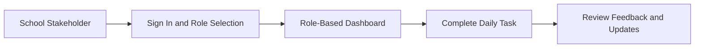

# UI/UX

EduSync's user experience is designed to be role-aware, fast, and simple for school staff, teachers, parents, and students.

```mermaid
flowchart LR
    User[School Stakeholder] --> Entry[Sign In and Role Selection]
    Entry --> Dashboard[Role-Based Dashboard]
    Dashboard --> Task[Complete Daily Task]
    Task --> Feedback[Review Feedback and Updates]
```
