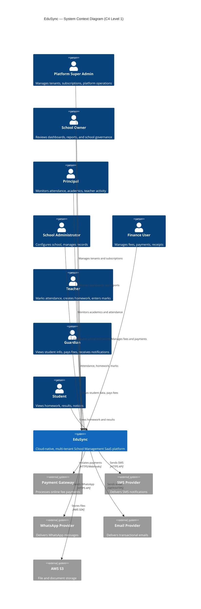

# EduSync C4 Architecture — Level 1: System Context

| Field | Value |
| --- | --- |
| Document ID | EDUSYNC-C4-L1-001 |
| Version | 1.0.0 |
| Status | Draft |
| Author | Pushpraj Jaiswal |
| Created | 2026-07-02 |
| Last Updated | 2026-07-02 |
| Confidentiality | Internal |

---

## Overview

The System Context diagram is the highest level of the C4 model. It shows EduSync as a single system and identifies all external actors (people and systems) that interact with it.

---

## Structurizr DSL

```dsl
workspace "EduSync – System Context" {

    model {

        # ── People ──
        superAdmin   = person "Platform Super Admin"   "Manages tenants, subscriptions, platform operations"          "Internal"
        schoolOwner  = person "School Owner"            "Business owner reviewing dashboards and reports"              "School Staff"
        principal    = person "Principal"               "Academic and operational head of the school"                  "School Staff"
        schoolAdmin  = person "School Administrator"    "Configures school, manages records, daily administration"     "School Staff"
        financeUser  = person "Finance User"            "Manages fees, payments, receipts, reconciliation"             "School Staff"
        teacher      = person "Teacher"                 "Marks attendance, creates homework, enters marks"             "School Staff"
        guardian     = person "Guardian"                 "Views student info, pays fees, receives notifications"        "External"
        student      = person "Student"                 "Views homework, exam results, and notifications"              "External"

        # ── EduSync System ──
        edusync = softwareSystem "EduSync" "Cloud-native, multi-tenant School Management SaaS platform" {
            tags "Target System"
        }

        # ── External Systems ──
        paymentGateway  = softwareSystem "Payment Gateway"         "Processes online fee payments (Razorpay, Stripe)"       "External System"
        smsProvider     = softwareSystem "SMS Provider"            "Delivers SMS notifications to guardians and staff"      "External System"
        whatsappProvider = softwareSystem "WhatsApp Provider"      "Delivers WhatsApp messages via approved API"            "External System"
        emailProvider   = softwareSystem "Email Provider"          "Delivers transactional and notification emails"         "External System"
        awsS3           = softwareSystem "AWS S3"                  "Stores documents, attachments, and report files"        "External System"

        # ── Relationships ──
        superAdmin   -> edusync     "Manages tenants, subscriptions, and platform settings"
        schoolOwner  -> edusync     "Reviews dashboards, reports, and school governance"
        principal    -> edusync     "Monitors attendance, academics, and teacher activity"
        schoolAdmin  -> edusync     "Configures school, manages student and teacher records"
        financeUser  -> edusync     "Manages fee structures, invoices, payments, and receipts"
        teacher      -> edusync     "Marks attendance, creates homework, enters exam marks"
        guardian     -> edusync     "Views student data, pays fees, receives notifications"
        student      -> edusync     "Views homework, exam results, and notices"

        edusync -> paymentGateway   "Initiates and verifies online payments"                   "HTTPS/Webhooks"
        edusync -> smsProvider      "Sends SMS notifications"                                  "HTTPS API"
        edusync -> whatsappProvider "Sends WhatsApp notifications"                             "HTTPS API"
        edusync -> emailProvider    "Sends email notifications"                                "SMTP/HTTPS API"
        edusync -> awsS3            "Stores and retrieves files"                               "AWS SDK"
    }

    views {
        systemContext edusync "SystemContext" {
            include *
            autoLayout tb
        }

        styles {
            element "Person" {
                shape Person
                background #08427B
                color #ffffff
            }
            element "Target System" {
                background #1168BD
                color #ffffff
            }
            element "External System" {
                background #999999
                color #ffffff
            }
        }
    }
}
```

---

## Mermaid Equivalent



---

## Actors Summary

| Actor | Type | Description |
| --- | --- | --- |
| Platform Super Admin | Internal Person | Manages tenants, subscriptions, platform support |
| School Owner | School Staff | Business owner reviewing dashboards and governance |
| Principal | School Staff | Academic and operational head of the school |
| School Administrator | School Staff | Configuration, records, daily administration |
| Finance User | School Staff | Fee management, payments, receipts, reconciliation |
| Teacher | School Staff | Attendance, homework, examinations |
| Guardian | External Person | Parent or authorized responsible person |
| Student | External Person | Learner enrolled in the institution |

## External Systems Summary

| System | Purpose | Protocol |
| --- | --- | --- |
| Payment Gateway | Online fee payment processing | HTTPS, Webhooks |
| SMS Provider | SMS notification delivery | HTTPS API |
| WhatsApp Provider | WhatsApp message delivery | HTTPS API |
| Email Provider | Email notification delivery | SMTP, HTTPS API |
| AWS S3 | File and document storage | AWS SDK |

---

## References

- [Product Requirements](../../03-Product-Requirements/product-requirements.md)
- [C4 Level 2 — Container Diagram](C4-Level-2-Container.md)
- [Architecture Overview](../README.md)

---

## Revision History

| Version | Date | Author | Changes |
| --- | --- | --- | --- |
| 1.0.0 | 2026-07-02 | Pushpraj Jaiswal | Initial system context diagram |
