# EduSync C4 Architecture — Level 2: Container Diagram

| Field | Value |
| --- | --- |
| Document ID | EDUSYNC-C4-L2-001 |
| Version | 1.0.0 |
| Status | Draft |
| Author | Pushpraj Jaiswal |
| Created | 2026-07-02 |
| Last Updated | 2026-07-02 |
| Confidentiality | Internal |

---

## Overview

The Container diagram zooms into the EduSync system boundary and shows the major deployable containers — applications, data stores, and message brokers — along with their interactions.

---

## Structurizr DSL

```dsl
workspace "EduSync – Container Diagram" {

    model {

        # ── People ──
        schoolStaff  = person "School Staff"  "Administrators, finance users, principals, owners"  "School Staff"
        teacher      = person "Teacher"       "Academic staff managing attendance, homework, exams"  "School Staff"
        guardian     = person "Guardian"       "Parent or authorized responsible person for student"  "External"
        student      = person "Student"       "Learner enrolled in the institution"                  "External"
        superAdmin   = person "Super Admin"   "EduSync internal platform operator"                   "Internal"

        # ── EduSync System Boundary ──
        edusync = softwareSystem "EduSync" "Cloud-native, multi-tenant School Management SaaS" {

            # ── Frontend Containers ──
            webApp = container "Web Application" "React single-page application for school staff and administrators" "React, TypeScript, Vite" "Web Browser"
            mobileApp = container "Mobile Application" "React Native mobile app for guardians, students, and teachers" "React Native, Expo, TypeScript" "Mobile App"

            # ── Backend Containers ──
            apiGateway = container "API Gateway / Reverse Proxy" "Routes requests, handles SSL termination, rate limiting" "Nginx" "Infrastructure"
            apiServer = container "API Server" "REST API providing all business logic, authentication, authorization, and domain services" "Java 21, Spring Boot 3, Spring Security" "Application"

            # ── Data Stores ──
            database = container "Primary Database" "Stores all tenant data, user records, academic data, financial records, and audit logs" "PostgreSQL 16" "Database"
            cache = container "Cache" "Session cache, frequently accessed data, rate limiting counters" "Redis 7" "Database"

            # ── Messaging ──
            messageQueue = container "Message Broker" "Asynchronous notification delivery, event processing, and integration tasks" "RabbitMQ 3.13" "Queue"

            # ── Storage ──
            fileStorage = container "File Storage" "Student documents, homework attachments, report card PDFs, school logos" "AWS S3" "Storage"
        }

        # ── External Systems ──
        paymentGateway   = softwareSystem "Payment Gateway"    "Razorpay or Stripe for online fee collection"   "External System"
        smsProvider      = softwareSystem "SMS Provider"       "SMS delivery service"                           "External System"
        whatsappProvider = softwareSystem "WhatsApp Provider"  "WhatsApp Business API provider"                 "External System"
        emailProvider    = softwareSystem "Email Provider"     "Transactional email service"                    "External System"

        # ── User Relationships ──
        schoolStaff -> webApp       "Manages school operations"                              "HTTPS"
        teacher     -> webApp       "Marks attendance, manages homework and exams"            "HTTPS"
        teacher     -> mobileApp    "Quick attendance and homework access"                    "HTTPS"
        guardian    -> mobileApp    "Views student data, pays fees, receives notifications"   "HTTPS"
        guardian    -> webApp       "Alternative web access to parent portal"                 "HTTPS"
        student     -> mobileApp    "Views homework, results, and notices"                    "HTTPS"
        superAdmin  -> webApp       "Manages tenants and subscriptions"                      "HTTPS"

        # ── Internal Container Relationships ──
        webApp      -> apiGateway   "Sends API requests"                                     "HTTPS/JSON"
        mobileApp   -> apiGateway   "Sends API requests"                                     "HTTPS/JSON"
        apiGateway  -> apiServer    "Proxies authenticated requests"                         "HTTP/JSON"
        apiServer   -> database     "Reads and writes all domain data"                       "JDBC/SQL"
        apiServer   -> cache        "Reads and writes session and cache data"                "Redis Protocol"
        apiServer   -> messageQueue "Publishes notification and integration events"           "AMQP"
        apiServer   -> fileStorage  "Uploads and downloads files"                            "AWS SDK"
        messageQueue -> apiServer   "Delivers consumed messages for processing"              "AMQP"

        # ── External System Relationships ──
        apiServer       -> paymentGateway   "Initiates payment orders, verifies callbacks"   "HTTPS/Webhooks"
        paymentGateway  -> apiServer        "Sends payment confirmation webhooks"            "HTTPS"
        messageQueue    -> smsProvider      "Delivers SMS via notification worker"            "HTTPS API"
        messageQueue    -> whatsappProvider "Delivers WhatsApp via notification worker"       "HTTPS API"
        messageQueue    -> emailProvider    "Delivers email via notification worker"          "SMTP/HTTPS"
    }

    views {
        container edusync "Containers" {
            include *
            autoLayout tb
        }

        styles {
            element "Person" {
                shape Person
                background #08427B
                color #ffffff
            }
            element "Application" {
                background #438DD5
                color #ffffff
            }
            element "Web Browser" {
                background #438DD5
                color #ffffff
                shape WebBrowser
            }
            element "Mobile App" {
                background #438DD5
                color #ffffff
                shape MobileDeviceLandscape
            }
            element "Database" {
                background #438DD5
                color #ffffff
                shape Cylinder
            }
            element "Queue" {
                background #438DD5
                color #ffffff
                shape Pipe
            }
            element "Storage" {
                background #438DD5
                color #ffffff
                shape Folder
            }
            element "Infrastructure" {
                background #85BBF0
                color #000000
            }
            element "External System" {
                background #999999
                color #ffffff
            }
        }
    }
}
```

---

## Mermaid Equivalent

```mermaid
C4Container
    title EduSync — Container Diagram (C4 Level 2)

    Person(schoolStaff, "School Staff", "Admins, finance, principals, owners")
    Person(teacher, "Teacher", "Attendance, homework, exams")
    Person(guardian, "Guardian", "Views student data, pays fees")
    Person(student, "Student", "Views homework, results")
    Person(superAdmin, "Super Admin", "Platform operator")

    System_Boundary(edusync, "EduSync") {
        Container(webApp, "Web Application", "React, TypeScript, Vite", "SPA for school staff and admin workflows")
        Container(mobileApp, "Mobile Application", "React Native, Expo", "App for guardians, students, and teachers")
        Container(apiGateway, "API Gateway", "Nginx", "SSL termination, routing, rate limiting")
        Container(apiServer, "API Server", "Java 21, Spring Boot 3", "REST API with business logic, auth, domain services")
        ContainerDb(database, "Primary Database", "PostgreSQL 16", "All tenant, academic, financial, and audit data")
        ContainerDb(cache, "Cache", "Redis 7", "Sessions, frequently accessed data, rate limits")
        ContainerQueue(messageQueue, "Message Broker", "RabbitMQ 3.13", "Async notifications and event processing")
        Container(fileStorage, "File Storage", "AWS S3", "Documents, attachments, reports")
    }

    System_Ext(paymentGateway, "Payment Gateway", "Razorpay or Stripe")
    System_Ext(smsProvider, "SMS Provider", "SMS delivery")
    System_Ext(whatsappProvider, "WhatsApp Provider", "WhatsApp Business API")
    System_Ext(emailProvider, "Email Provider", "Transactional email")

    Rel(schoolStaff, webApp, "Manages school operations", "HTTPS")
    Rel(teacher, webApp, "Attendance, homework, exams", "HTTPS")
    Rel(teacher, mobileApp, "Quick mobile access", "HTTPS")
    Rel(guardian, mobileApp, "Student data, fees, notifications", "HTTPS")
    Rel(student, mobileApp, "Homework, results", "HTTPS")
    Rel(superAdmin, webApp, "Tenant management", "HTTPS")

    Rel(webApp, apiGateway, "API requests", "HTTPS/JSON")
    Rel(mobileApp, apiGateway, "API requests", "HTTPS/JSON")
    Rel(apiGateway, apiServer, "Proxies requests", "HTTP/JSON")
    Rel(apiServer, database, "Reads/writes data", "JDBC")
    Rel(apiServer, cache, "Session and cache", "Redis Protocol")
    Rel(apiServer, messageQueue, "Publishes events", "AMQP")
    Rel(apiServer, fileStorage, "Uploads/downloads", "AWS SDK")

    Rel(apiServer, paymentGateway, "Payment orders", "HTTPS")
    Rel(paymentGateway, apiServer, "Webhooks", "HTTPS")
    Rel(messageQueue, smsProvider, "SMS delivery", "HTTPS")
    Rel(messageQueue, whatsappProvider, "WhatsApp delivery", "HTTPS")
    Rel(messageQueue, emailProvider, "Email delivery", "SMTP")
```



---

## Container Summary

| Container | Technology | Purpose |
| --- | --- | --- |
| Web Application | React, TypeScript, Vite | SPA for school staff, admins, principals, and finance users |
| Mobile Application | React Native, Expo, TypeScript | Mobile app for guardians, students, and teachers |
| API Gateway | Nginx | SSL termination, request routing, rate limiting, load balancing |
| API Server | Java 21, Spring Boot 3, Spring Security | Core REST API with all business logic, auth, and domain services |
| Primary Database | PostgreSQL 16 | Relational store for all tenant, academic, financial, and audit data |
| Cache | Redis 7 | Session management, frequent lookups, rate limiting counters |
| Message Broker | RabbitMQ 3.13 | Async notification delivery, event processing, integration tasks |
| File Storage | AWS S3 | Documents, homework attachments, report PDFs, logos |

## Communication Protocols

| From | To | Protocol | Purpose |
| --- | --- | --- | --- |
| Web App | API Gateway | HTTPS/JSON | Frontend API calls |
| Mobile App | API Gateway | HTTPS/JSON | Mobile API calls |
| API Gateway | API Server | HTTP/JSON | Reverse proxy |
| API Server | PostgreSQL | JDBC/SQL | Data persistence |
| API Server | Redis | Redis Protocol | Caching and sessions |
| API Server | RabbitMQ | AMQP | Event publishing |
| API Server | AWS S3 | AWS SDK | File operations |
| API Server | Payment Gateway | HTTPS/Webhooks | Payment processing |
| RabbitMQ Workers | SMS Provider | HTTPS API | SMS delivery |
| RabbitMQ Workers | WhatsApp Provider | HTTPS API | WhatsApp delivery |
| RabbitMQ Workers | Email Provider | SMTP/HTTPS | Email delivery |

---

## References

- [C4 Level 1 — System Context](C4-Level-1-System-Context.md)
- [C4 Level 3 — Component Diagram](C4-Level-3-Component.md)
- [Product Requirements](../../03-Product-Requirements/product-requirements.md)
- [Architecture Overview](../README.md)

---

## Revision History

| Version | Date | Author | Changes |
| --- | --- | --- | --- |
| 1.0.0 | 2026-07-02 | Pushpraj Jaiswal | Initial container diagram |
