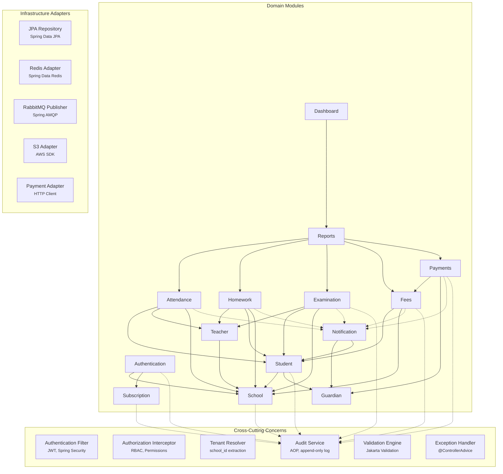

# EduSync C4 Architecture — Level 3: Component Diagram

| Field | Value |
| --- | --- |
| Document ID | EDUSYNC-C4-L3-001 |
| Version | 1.0.0 |
| Status | Draft |
| Author | Pushpraj Jaiswal |
| Created | 2026-07-02 |
| Last Updated | 2026-07-02 |
| Confidentiality | Internal |

---

## Overview

The Component diagram zooms into the API Server container and shows the internal domain modules, cross-cutting concerns, and infrastructure adapters that compose the backend application.

---

## Structurizr DSL

```dsl
workspace "EduSync – Component Diagram (API Server)" {

    model {

        # ── External Containers ──
        webApp          = softwareSystem "Web Application"     "React SPA"                "External Container"
        mobileApp       = softwareSystem "Mobile Application"  "React Native app"         "External Container"
        database        = softwareSystem "PostgreSQL"           "Primary database"         "Database"
        cache           = softwareSystem "Redis"                "Cache and sessions"       "Database"
        messageQueue    = softwareSystem "RabbitMQ"             "Message broker"           "Queue"
        fileStorage     = softwareSystem "AWS S3"               "File storage"             "Storage"
        paymentGateway  = softwareSystem "Payment Gateway"      "Razorpay or Stripe"       "External System"

        # ── API Server Boundary ──
        apiServer = softwareSystem "API Server" "Spring Boot REST API" {

            # ── API Layer ──
            apiGatewayController = component "API Gateway Controller" "Routes incoming HTTP requests to domain controllers" "Spring MVC DispatcherServlet" "Controller"

            # ── Cross-Cutting Components ──
            authFilter       = component "Authentication Filter" "Validates JWT tokens, resolves user identity and tenant context" "Spring Security Filter Chain" "Security"
            authzInterceptor = component "Authorization Interceptor" "Enforces role-based and permission-based access control" "Spring Security, Custom Annotations" "Security"
            tenantResolver   = component "Tenant Context Resolver" "Extracts and validates school_id from authenticated session" "Custom Spring Component" "Security"
            auditService     = component "Audit Service" "Records sensitive operations with actor, action, entity, and timestamp" "Spring AOP, JPA" "Cross-Cutting"
            exceptionHandler = component "Global Exception Handler" "Standardized error responses with error codes and messages" "Spring @ControllerAdvice" "Cross-Cutting"
            validationEngine = component "Validation Engine" "Bean validation and custom business rule validation" "Jakarta Validation, Custom Validators" "Cross-Cutting"

            # ── Domain Module Components ──
            authModule = component "Authentication Module" "Login, logout, password reset, session management, account lifecycle" "Spring Security, JWT" "Domain Module"
            schoolModule = component "School Module" "School profiles, academic years, classes, sections, subjects, settings" "Spring Service, JPA" "Domain Module"
            studentModule = component "Student Module" "Student profiles, class assignments, documents, lifecycle management" "Spring Service, JPA" "Domain Module"
            teacherModule = component "Teacher Module" "Teacher profiles, class-subject assignments, employment lifecycle" "Spring Service, JPA" "Domain Module"
            guardianModule = component "Guardian Module" "Guardian profiles, student links, contact and communication preferences" "Spring Service, JPA" "Domain Module"
            attendanceModule = component "Attendance Module" "Daily student and staff attendance capture, correction, reporting" "Spring Service, JPA" "Domain Module"
            homeworkModule = component "Homework Module" "Homework creation, publication, attachments, submission tracking" "Spring Service, JPA" "Domain Module"
            examModule = component "Examination Module" "Exam setup, scheduling, marks entry, grading, result publication" "Spring Service, JPA" "Domain Module"
            feeModule = component "Fees Module" "Fee structures, invoices, installments, discounts, dues management" "Spring Service, JPA" "Domain Module"
            paymentModule = component "Payments Module" "Payment initiation, gateway integration, reconciliation, receipts" "Spring Service, JPA" "Domain Module"
            reportModule = component "Reports Module" "Academic, financial, attendance, and operational report generation" "Spring Service, JPA, Jasper" "Domain Module"
            dashboardModule = component "Dashboard Module" "Role-specific dashboard data aggregation and widget queries" "Spring Service, JPA" "Domain Module"
            notificationModule = component "Notification Module" "Template management, multi-channel dispatch, delivery tracking" "Spring Service, RabbitMQ" "Domain Module"
            subscriptionModule = component "Subscription Module" "Plan management, entitlements, tenant lifecycle, billing status" "Spring Service, JPA" "Domain Module"

            # ── Infrastructure Adapters ──
            jpaRepository     = component "JPA Repository Layer" "Database access via Spring Data JPA repositories" "Spring Data JPA, Hibernate" "Infrastructure"
            redisAdapter      = component "Redis Adapter" "Cache operations and session store" "Spring Data Redis" "Infrastructure"
            rabbitPublisher   = component "RabbitMQ Publisher" "Publishes domain events and notification messages" "Spring AMQP" "Infrastructure"
            rabbitConsumer    = component "RabbitMQ Consumer" "Consumes messages for notification delivery and async processing" "Spring AMQP" "Infrastructure"
            s3Adapter         = component "S3 Storage Adapter" "File upload, download, pre-signed URL generation" "AWS SDK for Java" "Infrastructure"
            paymentAdapter    = component "Payment Gateway Adapter" "Payment order creation, callback verification, status polling" "HTTP Client, Webhook Handler" "Infrastructure"
            notificationWorker = component "Notification Worker" "Dispatches notifications to SMS, WhatsApp, and email providers" "Spring AMQP Consumer" "Infrastructure"
        }

        # ── Relationships: Inbound ──
        webApp    -> apiGatewayController "Sends HTTP requests" "HTTPS/JSON"
        mobileApp -> apiGatewayController "Sends HTTP requests" "HTTPS/JSON"

        # ── Relationships: API Layer to Cross-Cutting ──
        apiGatewayController -> authFilter       "Passes through filter chain"
        authFilter           -> authzInterceptor "Delegates authorization check"
        authFilter           -> tenantResolver   "Resolves tenant context"
        apiGatewayController -> validationEngine "Validates request payloads"
        apiGatewayController -> exceptionHandler "Delegates error handling"

        # ── Relationships: API Layer to Domain Modules ──
        apiGatewayController -> authModule         "Routes auth requests"
        apiGatewayController -> schoolModule       "Routes school requests"
        apiGatewayController -> studentModule      "Routes student requests"
        apiGatewayController -> teacherModule      "Routes teacher requests"
        apiGatewayController -> guardianModule     "Routes guardian requests"
        apiGatewayController -> attendanceModule   "Routes attendance requests"
        apiGatewayController -> homeworkModule     "Routes homework requests"
        apiGatewayController -> examModule         "Routes exam requests"
        apiGatewayController -> feeModule          "Routes fee requests"
        apiGatewayController -> paymentModule      "Routes payment requests"
        apiGatewayController -> reportModule       "Routes report requests"
        apiGatewayController -> dashboardModule    "Routes dashboard requests"
        apiGatewayController -> notificationModule "Routes notification requests"
        apiGatewayController -> subscriptionModule "Routes subscription requests"

        # ── Relationships: Domain Module Dependencies ──
        authModule         -> schoolModule       "Resolves tenant context"
        authModule         -> subscriptionModule "Checks subscription status"
        studentModule      -> schoolModule       "Uses academic structure"
        studentModule      -> guardianModule     "Manages guardian links"
        teacherModule      -> schoolModule       "Uses class-subject config"
        attendanceModule   -> studentModule      "Resolves enrolled students"
        attendanceModule   -> teacherModule      "Validates teacher assignments"
        attendanceModule   -> schoolModule       "Uses academic calendar"
        homeworkModule     -> teacherModule      "Validates teacher assignments"
        homeworkModule     -> studentModule      "Resolves target students"
        homeworkModule     -> schoolModule       "Uses class-subject config"
        examModule         -> teacherModule      "Validates marks entry permissions"
        examModule         -> studentModule      "Resolves exam-eligible students"
        examModule         -> schoolModule       "Uses grading and academic config"
        feeModule          -> studentModule      "Resolves fee-eligible students"
        feeModule          -> schoolModule       "Uses academic year and class config"
        paymentModule      -> feeModule          "Resolves invoices and dues"
        paymentModule      -> guardianModule     "Resolves payer guardian"
        reportModule       -> attendanceModule   "Fetches attendance data"
        reportModule       -> homeworkModule     "Fetches homework data"
        reportModule       -> examModule         "Fetches exam results"
        reportModule       -> feeModule          "Fetches fee and dues data"
        reportModule       -> paymentModule      "Fetches payment data"
        dashboardModule    -> reportModule       "Aggregates dashboard metrics"
        notificationModule -> guardianModule     "Resolves notification recipients"
        notificationModule -> studentModule      "Resolves student context"

        # ── Relationships: Domain Modules to Cross-Cutting ──
        authModule         -> auditService "Logs auth events"
        schoolModule       -> auditService "Logs config changes"
        studentModule      -> auditService "Logs profile changes"
        teacherModule      -> auditService "Logs assignment changes"
        attendanceModule   -> auditService "Logs corrections"
        feeModule          -> auditService "Logs discounts and adjustments"
        paymentModule      -> auditService "Logs payment events"
        examModule         -> auditService "Logs result publication"
        subscriptionModule -> auditService "Logs plan changes"

        # ── Relationships: Domain Modules to Notification ──
        attendanceModule   -> notificationModule "Triggers absence alerts"
        homeworkModule     -> notificationModule "Triggers homework alerts"
        examModule         -> notificationModule "Triggers result alerts"
        feeModule          -> notificationModule "Triggers fee reminders"
        paymentModule      -> notificationModule "Triggers payment receipts"

        # ── Relationships: Domain Modules to Infrastructure ──
        authModule           -> jpaRepository   "Persists user and session data"
        schoolModule         -> jpaRepository   "Persists school config data"
        studentModule        -> jpaRepository   "Persists student records"
        teacherModule        -> jpaRepository   "Persists teacher records"
        guardianModule       -> jpaRepository   "Persists guardian records"
        attendanceModule     -> jpaRepository   "Persists attendance records"
        homeworkModule       -> jpaRepository   "Persists homework records"
        examModule           -> jpaRepository   "Persists exam records"
        feeModule            -> jpaRepository   "Persists fee records"
        paymentModule        -> jpaRepository   "Persists payment records"
        reportModule         -> jpaRepository   "Queries report data"
        dashboardModule      -> jpaRepository   "Queries dashboard data"
        notificationModule   -> jpaRepository   "Persists notification records"
        subscriptionModule   -> jpaRepository   "Persists subscription records"
        auditService         -> jpaRepository   "Persists audit logs"

        authModule         -> redisAdapter    "Manages session cache"
        dashboardModule    -> redisAdapter    "Caches dashboard metrics"

        notificationModule -> rabbitPublisher "Publishes notification events"
        homeworkModule     -> s3Adapter       "Uploads homework attachments"
        studentModule      -> s3Adapter       "Uploads student documents"
        reportModule       -> s3Adapter       "Stores generated report files"
        paymentModule      -> paymentAdapter  "Processes online payments"

        # ── Relationships: Infrastructure to External ──
        jpaRepository      -> database       "Executes SQL queries"    "JDBC"
        redisAdapter       -> cache          "Reads and writes cache"  "Redis Protocol"
        rabbitPublisher    -> messageQueue   "Publishes messages"      "AMQP"
        rabbitConsumer     -> messageQueue   "Consumes messages"       "AMQP"
        s3Adapter          -> fileStorage    "Stores and retrieves"    "AWS SDK"
        paymentAdapter     -> paymentGateway "Creates orders, verifies" "HTTPS"
        notificationWorker -> messageQueue   "Consumes notification messages" "AMQP"
    }

    views {
        component apiServer "Components" {
            include *
            autoLayout tb
        }

        styles {
            element "Controller" {
                background #438DD5
                color #ffffff
            }
            element "Security" {
                background #FF6B35
                color #ffffff
            }
            element "Cross-Cutting" {
                background #85BBF0
                color #000000
            }
            element "Domain Module" {
                background #1168BD
                color #ffffff
            }
            element "Infrastructure" {
                background #2D882D
                color #ffffff
            }
            element "Database" {
                background #999999
                color #ffffff
                shape Cylinder
            }
            element "Queue" {
                background #999999
                color #ffffff
                shape Pipe
            }
            element "Storage" {
                background #999999
                color #ffffff
                shape Folder
            }
            element "External System" {
                background #999999
                color #ffffff
            }
            element "External Container" {
                background #999999
                color #ffffff
            }
        }
    }
}
```

---

## Mermaid Equivalent — Domain Modules

```mermaid
C4Component
    title EduSync — API Server Component Diagram (C4 Level 3)

    Container_Boundary(apiServer, "API Server (Spring Boot)") {

        Component(apiController, "API Gateway Controller", "Spring MVC", "Routes HTTP requests to domain controllers")

        Component(authFilter, "Auth Filter", "Spring Security", "JWT validation, identity resolution")
        Component(authzInterceptor, "Authz Interceptor", "Spring Security", "RBAC enforcement")
        Component(tenantResolver, "Tenant Resolver", "Custom Component", "Extracts school_id from session")
        Component(auditService, "Audit Service", "Spring AOP", "Records sensitive operations")
        Component(validationEngine, "Validation Engine", "Jakarta Validation", "Request validation")

        Component(authModule, "Auth Module", "Spring Security, JWT", "Login, logout, password reset, sessions")
        Component(schoolModule, "School Module", "Spring Service", "School config, academic structure")
        Component(studentModule, "Student Module", "Spring Service", "Student profiles, assignments")
        Component(teacherModule, "Teacher Module", "Spring Service", "Teacher profiles, assignments")
        Component(guardianModule, "Guardian Module", "Spring Service", "Guardian profiles, student links")
        Component(attendanceModule, "Attendance Module", "Spring Service", "Attendance capture, corrections")
        Component(homeworkModule, "Homework Module", "Spring Service", "Homework, attachments, submissions")
        Component(examModule, "Exam Module", "Spring Service", "Exams, marks, grading, results")
        Component(feeModule, "Fees Module", "Spring Service", "Fee structures, invoices, discounts")
        Component(paymentModule, "Payments Module", "Spring Service", "Payments, reconciliation, receipts")
        Component(reportModule, "Reports Module", "Spring Service", "Academic, financial, operational reports")
        Component(dashboardModule, "Dashboard Module", "Spring Service", "Role-specific metric aggregation")
        Component(notifModule, "Notification Module", "Spring Service", "Templates, dispatch, tracking")
        Component(subModule, "Subscription Module", "Spring Service", "Plans, entitlements, lifecycle")

        Component(jpaRepo, "JPA Repository", "Spring Data JPA", "Database access layer")
        Component(redisAdapter, "Redis Adapter", "Spring Data Redis", "Cache and session operations")
        Component(rabbitPub, "RabbitMQ Publisher", "Spring AMQP", "Event publishing")
        Component(s3Adapter, "S3 Adapter", "AWS SDK", "File storage operations")
        Component(payAdapter, "Payment Adapter", "HTTP Client", "Gateway integration")
    }

    ContainerDb(db, "PostgreSQL", "Primary database")
    ContainerDb(redis, "Redis", "Cache")
    ContainerQueue(rabbit, "RabbitMQ", "Message broker")
    Container(s3, "AWS S3", "File storage")
    System_Ext(gateway, "Payment Gateway", "Razorpay/Stripe")

    Rel(apiController, authFilter, "Filter chain")
    Rel(authFilter, tenantResolver, "Resolves tenant")

    Rel(apiController, authModule, "Auth requests")
    Rel(apiController, schoolModule, "School requests")
    Rel(apiController, studentModule, "Student requests")
    Rel(apiController, teacherModule, "Teacher requests")
    Rel(apiController, guardianModule, "Guardian requests")
    Rel(apiController, attendanceModule, "Attendance requests")
    Rel(apiController, homeworkModule, "Homework requests")
    Rel(apiController, examModule, "Exam requests")
    Rel(apiController, feeModule, "Fee requests")
    Rel(apiController, paymentModule, "Payment requests")
    Rel(apiController, reportModule, "Report requests")
    Rel(apiController, dashboardModule, "Dashboard requests")
    Rel(apiController, notifModule, "Notification requests")
    Rel(apiController, subModule, "Subscription requests")

    Rel(jpaRepo, db, "SQL queries", "JDBC")
    Rel(redisAdapter, redis, "Cache ops", "Redis Protocol")
    Rel(rabbitPub, rabbit, "Publishes events", "AMQP")
    Rel(s3Adapter, s3, "File ops", "AWS SDK")
    Rel(payAdapter, gateway, "Payment orders", "HTTPS")
```



---

## Mermaid Equivalent — Module Dependencies



---

## Component Categories

### Cross-Cutting Concerns

| Component | Technology | Responsibility |
| --- | --- | --- |
| Authentication Filter | Spring Security Filter Chain | JWT validation, user identity resolution, tenant context |
| Authorization Interceptor | Spring Security, Custom Annotations | Role-based and permission-based access control |
| Tenant Context Resolver | Custom Spring Component | Extracts and validates school_id from authenticated session |
| Audit Service | Spring AOP, JPA | Records sensitive operations in append-only audit log |
| Validation Engine | Jakarta Validation, Custom Validators | Request payload validation and business rule checks |
| Global Exception Handler | Spring @ControllerAdvice | Standardized error responses with error codes |

### Domain Modules

| Module | Responsibility | Key Dependencies |
| --- | --- | --- |
| Authentication | Login, logout, password reset, session management | School, Subscription |
| School | Tenant profiles, academic years, classes, sections, subjects, settings | None (foundational) |
| Student | Student profiles, class assignments, documents, lifecycle | School, Guardian |
| Teacher | Teacher profiles, class-subject assignments, employment lifecycle | School |
| Guardian | Guardian profiles, student links, communication preferences | Student |
| Attendance | Student and staff attendance capture, correction, reporting | Student, Teacher, School |
| Homework | Homework creation, publication, attachments, submissions | Teacher, Student, School |
| Examination | Exam setup, marks entry, grading, result publication | Teacher, Student, School |
| Fees | Fee structures, invoices, installments, discounts, dues | Student, School |
| Payments | Payment initiation, gateway integration, reconciliation, receipts | Fees, Guardian |
| Reports | Academic, financial, attendance, and operational reports | Attendance, Homework, Exam, Fees, Payments |
| Dashboard | Role-specific dashboard data aggregation | Reports |
| Notification | Template management, multi-channel dispatch, delivery tracking | Guardian, Student |
| Subscription | Plan management, entitlements, tenant lifecycle | School |

### Infrastructure Adapters

| Adapter | Technology | External System |
| --- | --- | --- |
| JPA Repository Layer | Spring Data JPA, Hibernate | PostgreSQL |
| Redis Adapter | Spring Data Redis | Redis |
| RabbitMQ Publisher | Spring AMQP | RabbitMQ |
| RabbitMQ Consumer | Spring AMQP | RabbitMQ |
| S3 Storage Adapter | AWS SDK for Java | AWS S3 |
| Payment Gateway Adapter | HTTP Client, Webhook Handler | Payment Gateway |
| Notification Worker | Spring AMQP Consumer | SMS, WhatsApp, Email Providers |

---

## References

- [C4 Level 2 — Container Diagram](C4-Level-2-Container.md)
- [C4 Level 4 — Code Diagram (Omitted)](../README.md#level-4-code-diagram)
- [Product Requirements](../../03-Product-Requirements/product-requirements.md)
- [Database Schema](../../07-Database/Database-Schema.md)
- [Architecture Overview](../README.md)

---

## Revision History

| Version | Date | Author | Changes |
| --- | --- | --- | --- |
| 1.0.0 | 2026-07-02 | Pushpraj Jaiswal | Initial component diagram with 14 domain modules |
