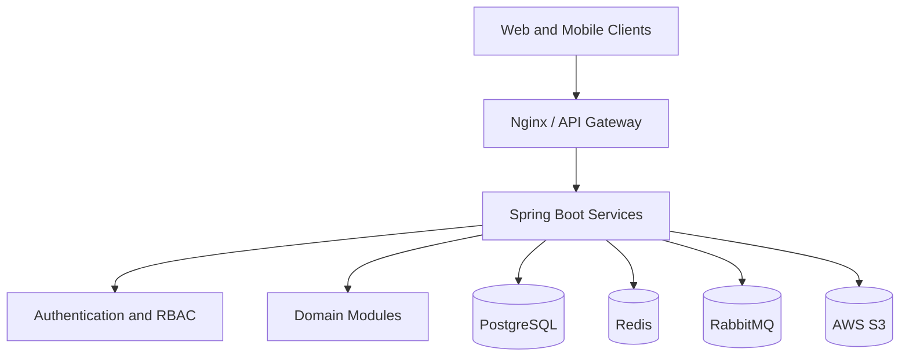

# EduSync Architecture Overview

| Field | Value |
| --- | --- |
| Document ID | EDUSYNC-ARCH-001 |
| Version | 1.0.0 |
| Status | Draft |
| Author | Pushpraj Jaiswal |
| Created | 2026-07-02 |
| Last Updated | 2026-07-02 |
| Confidentiality | Internal |

---

## Cover Page

**Product:** EduSync School Management SaaS  
**Document Type:** Architecture Overview and C4 Model Definition  
**Date:** July 2026  

---

## Revision History

| Version | Date | Author | Status | Changes |
| --- | --- | --- | --- | --- |
| 1.0.0 | 2026-07-02 | Pushpraj Jaiswal | Draft | Initial Architecture Overview draft with C4 diagram mapping |

---

## Table of Contents

1. [Executive Summary](#executive-summary)
2. [Purpose](#purpose)
3. [Objectives](#objectives)
4. [Scope](#scope)
5. [Out of Scope](#out-of-scope)
6. [Audience](#audience)
7. [Definitions](#definitions)
8. [Assumptions](#assumptions)
9. [Dependencies](#dependencies)
10. [Architecture Principles](#architecture-principles)
11. [C4 Architecture Model](#c4-architecture-model)
    - [Level 1: System Context](#level-1-system-context)
    - [Level 2: Container Diagram](#level-2-container-diagram)
    - [Level 3: Component Diagram](#level-3-component-diagram)
    - [Level 4: Code Diagram](#level-4-code-diagram)
12. [High-Level Flow](#high-level-flow)
13. [References](#references)
14. [Conclusion](#conclusion)

---

## Executive Summary

EduSync is a cloud-native, multi-tenant School Management SaaS platform designed to operate as a digital system of record for modern schools and coaching institutes. The architecture leverages a modular monolith pattern built using React, Spring Boot, and PostgreSQL. It enforces tenant isolation at the database layer and relies on asynchronous event-driven notifications via RabbitMQ.

---

## Purpose

The purpose of this document is to define the high-level architecture of the EduSync platform and to outline the C4 software architecture model. This ensures that engineers, architects, and product management have a unified framework for technical implementation and scaling.

---

## Objectives

- Establish architectural standards and principles for the project.
- Map the C4 architectural layers (Context, Container, Component).
- Clarify data flows, boundaries, and system responsibilities.
- Guide frontend, backend, database, and infrastructure engineering teams.

---

## Scope

This architecture overview covers:
- Core architecture principles and system components.
- C4 Level 1 (System Context), Level 2 (Container), and Level 3 (Component) diagrams.
- Mapping of cross-cutting concerns (Security, Tenant Isolation, Auditing).

---

## Out of Scope

- Low-level class-level design diagrams and code implementation (C4 Level 4).
- Server deployment scripts, Terraform files, and environment infrastructure configuration.

---

## Audience

- Software Architects & Technical Leads
- Backend & Frontend Engineering Teams
- QA & Security Auditors
- Product Managers & Executives

---

## Definitions

| Term | Definition |
| --- | --- |
| Multi-tenancy | Software architecture where a single instance of software runs on a server and serves multiple tenants (schools). |
| Tenant Isolation | Security mechanisms that ensure one tenant's users cannot access another tenant's data. |
| Modular Monolith | A software design pattern where the code is structured into distinct, independent modules but deployed as a single application unit. |
| DBML | Database Markup Language, a domain-specific language to define and document database schemas. |

---

## Assumptions

- PostgreSQL will be configured for schema-based or row-level logical multi-tenant separation.
- Authentication tokens (JWT) will securely convey user identity and tenant context (`school_id`).
- High-volume notification tasks will be offloaded asynchronously to background workers via RabbitMQ queues.

---

## Dependencies

- **Java Development Kit (JDK 21)** and **Spring Boot 3.x** framework.
- **PostgreSQL 16** primary relational database.
- **Redis 7** for session storage and caching.
- **RabbitMQ 3.13** as the system event message broker.
- **AWS S3** or compatible API for object storage.

---

## Architecture Principles

1. **Security & Isolation first:** Every request must be validated for user authentication, authorization, and tenant membership before accessing database queries.
2. **Modular Design:** Keep domain boundaries clean to allow transition to microservices if needed.
3. **Auditability:** Log all major operational, commercial, and structural mutations in an append-only audit trail.
4. **Resiliency:** Failures in third-party SMS, email, or payment services must not block core application transactions.

---

## C4 Architecture Model

EduSync's architecture is documented using the C4 model. You can navigate through the detailed specifications for each level using the links below:

### Level 1: System Context
The System Context diagram shows the overall system boundary of EduSync, the target user roles (Principals, Teachers, Guardians, Admins), and interactions with external systems (SMS gateway, email delivery, payments, S3).
- [View Detailed Level 1 System Context Specification](C4/C4-Level-1-System-Context.md)

### Level 2: Container Diagram
The Container diagram details the high-level technical choices (React web, React Native mobile, Nginx gateway, Spring Boot API, PostgreSQL, Redis, RabbitMQ, AWS S3) and how data flows between them.
- [View Detailed Level 2 Container Diagram Specification](C4/C4-Level-2-Container.md)

### Level 3: Component Diagram
The Component diagram inspects the internals of the API Server container, detailing the Spring Boot controller mapping, 14 distinct domain services, security filter chains, auditing, and DB integration components.
- [View Detailed Level 3 Component Diagram Specification](C4/C4-Level-3-Component.md)

### Level 4: Code Diagram
C4 Level 4 details class structures and interactions. This level is omitted because the system's actual code implementation does not yet exist. Code diagrams will be generated as design blueprints when development begins.

---

## High-Level Flow

---

## References

- [Product Requirements](../03-Product-Requirements/product-requirements.md)
- [Database Schema Specification](../07-Database/Database-Schema.md)
- [Figma planning UI/UX Document](../05-UI-UX/Figma-Planning.md)

---

## Conclusion

This architectural blueprint sets a clear roadmap for backend and frontend implementation. By following a modular design and relying on robust container boundaries, EduSync will scale to support thousands of institutions securely and efficiently.
