# EduSync Database Schema

| Field | Value |
| --- | --- |
| Document ID | EDUSYNC-DB-001 |
| Version | 1.0.0 |
| Status | Draft |
| Author | Pushpraj Jaiswal |
| Created | 2026-07-02 |
| Last Updated | 2026-07-02 |
| Confidentiality | Internal |

---

## Overview

This page presents the complete database schema for EduSync, defined in [dbdiagram.io](https://dbdiagram.io) DBML syntax. The schema covers all 14 product modules with 43 tables, 27 enums, and 136 foreign key relationships.

To visualize this schema as an interactive ER diagram, copy the DBML code below and paste it into [dbdiagram.io](https://dbdiagram.io).

---

## Schema Summary

| Metric | Count |
| --- | --- |
| Tables | 43 |
| Enums | 27 |
| Foreign Key Relationships | 136 |
| Unique Constraints | 33 |

---

## Module Coverage

| Module | Tables |
| --- | --- |
| Platform / Authentication | `users`, `user_permissions` |
| School | `schools`, `academic_years`, `classes`, `sections`, `subjects`, `class_subjects`, `holidays`, `school_settings` |
| Student | `students`, `student_class_assignments`, `student_documents` |
| Teacher | `teachers`, `teacher_class_assignments` |
| Guardian | `guardians`, `student_guardian_links` |
| Attendance | `attendance_records`, `staff_attendance` |
| Homework | `homework`, `homework_attachments`, `homework_submissions` |
| Examination | `exam_terms`, `exam_schedules`, `exam_results`, `grading_scales`, `report_cards` |
| Fees | `fee_components`, `fee_structures`, `fee_structure_items`, `fee_structure_applicability`, `fee_invoices`, `fee_invoice_items`, `fee_discounts` |
| Payments | `payments` |
| Notification | `notification_templates`, `notifications` |
| Subscription | `subscription_plans`, `plan_entitlements`, `school_subscriptions`, `subscription_history` |
| Audit | `audit_logs` |
| Timetable | `timetable_periods` |

---

## Design Patterns

| Pattern | Implementation |
| --- | --- |
| Multi-tenancy | Every tenant-owned table includes `school_id` column |
| Soft Delete | `is_deleted` (boolean) + `deleted_at` (timestamp) on all tenant tables |
| Audit Columns | `created_at`, `created_by`, `updated_at`, `updated_by` on every table |
| Append-only Audit Log | `audit_logs` table is never updated or deleted |
| UUID Primary Keys | All tables use `uuid` as primary key type |

---

## Enums

### User and Access

| Enum | Values |
| --- | --- |
| `user_status` | active, inactive, suspended, locked, pending_verification |
| `user_role` | super_admin, school_owner, principal, school_admin, finance_user, teacher, guardian, student |

### School

| Enum | Values |
| --- | --- |
| `school_status` | active, suspended, archived, pending_setup |
| `board_affiliation` | cbse, icse, state_board, international, other |
| `institution_type` | school, coaching_institute, play_school, other |

### People

| Enum | Values |
| --- | --- |
| `gender` | male, female, other, prefer_not_to_say |
| `student_status` | enquiry, admitted, active, inactive, transferred, alumni, expelled |
| `teacher_status` | active, inactive, on_leave, terminated, resigned |
| `guardian_status` | active, inactive |
| `relationship_type` | father, mother, legal_guardian, grandparent, sibling, emergency_contact, other |

### Academics

| Enum | Values |
| --- | --- |
| `attendance_status` | present, absent, late, half_day, leave, holiday, not_marked |
| `attendance_session` | morning, afternoon, full_day |
| `homework_status` | draft, published, cancelled, archived |
| `submission_status` | pending, submitted, late_submitted, graded, returned |
| `exam_status` | draft, scheduled, in_progress, completed, published, cancelled |
| `result_status` | draft, approved, published, correction_pending |

### Finance

| Enum | Values |
| --- | --- |
| `fee_component_frequency` | one_time, monthly, quarterly, term_wise, half_yearly, annual |
| `invoice_status` | draft, issued, partially_paid, paid, overdue, cancelled, adjusted, waived |
| `discount_type` | percentage, fixed_amount |
| `payment_status` | initiated, pending, successful, failed, cancelled, refunded, reversed |
| `payment_method` | online_gateway, upi, net_banking, credit_card, debit_card, cash, cheque, bank_transfer, demand_draft, other |

### Communication

| Enum | Values |
| --- | --- |
| `notification_channel` | in_app, sms, whatsapp, email, push |
| `notification_status` | queued, sent, delivered, failed, cancelled, retrying |

### Subscription

| Enum | Values |
| --- | --- |
| `subscription_status` | trial, active, grace, suspended, cancelled, expired |
| `subscription_change_type` | created, renewed, upgraded, downgraded, suspended, reactivated, cancelled, expired |

### System

| Enum | Values |
| --- | --- |
| `audit_action` | create, update, delete, login, logout, failed_login, password_reset, status_change, publish, approve, correction, export |
| `day_of_week` | monday, tuesday, wednesday, thursday, friday, saturday, sunday |

---

## Entity Relationship Diagram

```mermaid
erDiagram
    schools ||--o{ users : "owns"
    schools ||--o{ academic_years : "configures"
    schools ||--o{ classes : "configures"
    schools ||--o{ sections : "configures"
    schools ||--o{ subjects : "configures"
    schools ||--o{ students : "enrolls"
    schools ||--o{ teachers : "employs"
    schools ||--o{ guardians : "registers"

    academic_years ||--o{ classes : "scopes"
    classes ||--o{ sections : "has"
    classes ||--o{ class_subjects : "maps"
    subjects ||--o{ class_subjects : "maps"

    students ||--o{ student_class_assignments : "assigned"
    students ||--o{ student_guardian_links : "linked"
    guardians ||--o{ student_guardian_links : "linked"

    students ||--o{ attendance_records : "has"
    students ||--o{ homework_submissions : "submits"
    students ||--o{ exam_results : "earns"
    students ||--o{ fee_invoices : "billed"

    teachers ||--o{ teacher_class_assignments : "teaches"
    teachers ||--o{ homework : "creates"

    homework ||--o{ homework_attachments : "has"
    homework ||--o{ homework_submissions : "receives"

    exam_terms ||--o{ exam_schedules : "contains"
    exam_schedules ||--o{ exam_results : "records"

    fee_structures ||--o{ fee_structure_items : "contains"
    fee_structures ||--o{ fee_structure_applicability : "applies_to"
    fee_invoices ||--o{ fee_invoice_items : "itemized"
    fee_invoices ||--o{ fee_discounts : "discounted"
    fee_invoices ||--o{ payments : "paid_by"

    schools ||--o{ notifications : "sends"
    schools ||--o{ school_subscriptions : "subscribes"
    subscription_plans ||--o{ plan_entitlements : "defines"
    subscription_plans ||--o{ school_subscriptions : "used_by"
    school_subscriptions ||--o{ subscription_history : "tracks"
```



---

## Complete DBML Schema

Copy and paste the following into [dbdiagram.io](https://dbdiagram.io) to generate the interactive ER diagram.

```sql
// ============================================================
// EduSync — Complete Database Schema (dbdiagram.io DBML)
// Version: 1.0.0
// Generated from: docs/03-Product-Requirements/product-requirements.md
// Database: PostgreSQL
// Multi-tenancy: Row-level isolation via school_id
// Audit: created_at, created_by, updated_at, updated_by on every table
// Soft Delete: is_deleted + deleted_at on tenant-owned tables
// ============================================================

// ======================== ENUMS ========================

Enum user_status {
  active
  inactive
  suspended
  locked
  pending_verification
}

Enum user_role {
  super_admin
  school_owner
  principal
  school_admin
  finance_user
  teacher
  guardian
  student
}

Enum school_status {
  active
  suspended
  archived
  pending_setup
}

Enum board_affiliation {
  cbse
  icse
  state_board
  international
  other
}

Enum institution_type {
  school
  coaching_institute
  play_school
  other
}

Enum gender {
  male
  female
  other
  prefer_not_to_say
}

Enum student_status {
  enquiry
  admitted
  active
  inactive
  transferred
  alumni
  expelled
}

Enum teacher_status {
  active
  inactive
  on_leave
  terminated
  resigned
}

Enum guardian_status {
  active
  inactive
}

Enum relationship_type {
  father
  mother
  legal_guardian
  grandparent
  sibling
  emergency_contact
  other
}

Enum attendance_status {
  present
  absent
  late
  half_day
  leave
  holiday
  not_marked
}

Enum attendance_session {
  morning
  afternoon
  full_day
}

Enum homework_status {
  draft
  published
  cancelled
  archived
}

Enum submission_status {
  pending
  submitted
  late_submitted
  graded
  returned
}

Enum exam_status {
  draft
  scheduled
  in_progress
  completed
  published
  cancelled
}

Enum result_status {
  draft
  approved
  published
  correction_pending
}

Enum fee_component_frequency {
  one_time
  monthly
  quarterly
  term_wise
  half_yearly
  annual
}

Enum invoice_status {
  draft
  issued
  partially_paid
  paid
  overdue
  cancelled
  adjusted
  waived
}

Enum discount_type {
  percentage
  fixed_amount
}

Enum payment_status {
  initiated
  pending
  successful
  failed
  cancelled
  refunded
  reversed
}

Enum payment_method {
  online_gateway
  upi
  net_banking
  credit_card
  debit_card
  cash
  cheque
  bank_transfer
  demand_draft
  other
}

Enum notification_channel {
  in_app
  sms
  whatsapp
  email
  push
}

Enum notification_status {
  queued
  sent
  delivered
  failed
  cancelled
  retrying
}

Enum subscription_status {
  trial
  active
  grace
  suspended
  cancelled
  expired
}

Enum subscription_change_type {
  created
  renewed
  upgraded
  downgraded
  suspended
  reactivated
  cancelled
  expired
}

Enum audit_action {
  create
  update
  delete
  login
  logout
  failed_login
  password_reset
  status_change
  publish
  approve
  correction
  export
}

Enum day_of_week {
  monday
  tuesday
  wednesday
  thursday
  friday
  saturday
  sunday
}


// ======================== PLATFORM TABLES ========================

Table users {
  id uuid [pk, note: 'Primary key']
  school_id uuid [note: 'FK to schools. NULL for super admins']
  email varchar(255) [unique, not null]
  phone varchar(20)
  password_hash varchar(255) [not null]
  first_name varchar(100) [not null]
  last_name varchar(100)
  role user_role [not null]
  status user_status [not null, default: 'pending_verification']
  email_verified boolean [default: false]
  phone_verified boolean [default: false]
  last_login_at timestamp
  failed_login_count int [default: 0]
  locked_until timestamp
  password_reset_token varchar(255)
  password_reset_expires_at timestamp
  avatar_url varchar(500)
  is_deleted boolean [default: false]
  deleted_at timestamp
  created_at timestamp [not null, default: `now()`]
  created_by uuid
  updated_at timestamp [not null, default: `now()`]
  updated_by uuid

  indexes {
    school_id
    email
    phone
    (school_id, role)
    (school_id, status)
  }
}

Table user_permissions {
  id uuid [pk]
  user_id uuid [not null, ref: > users.id]
  module varchar(50) [not null, note: 'e.g. student, fees, attendance']
  action varchar(50) [not null, note: 'e.g. create, read, update, delete, export']
  granted boolean [default: true]
  created_at timestamp [not null, default: `now()`]
  created_by uuid
  updated_at timestamp [not null, default: `now()`]
  updated_by uuid

  indexes {
    user_id
    (user_id, module, action) [unique]
  }
}


// ======================== SCHOOL MODULE ========================

Table schools {
  id uuid [pk]
  name varchar(255) [not null]
  code varchar(50) [unique, not null, note: 'Immutable after activation']
  status school_status [not null, default: 'pending_setup']
  board_affiliation board_affiliation
  institution_type institution_type [default: 'school']
  logo_url varchar(500)
  address_line1 varchar(255)
  address_line2 varchar(255)
  city varchar(100)
  state varchar(100)
  country varchar(100) [default: 'India']
  pincode varchar(20)
  contact_email varchar(255)
  contact_phone varchar(20)
  website varchar(255)
  established_year int
  principal_name varchar(200)
  timezone varchar(50) [default: 'Asia/Kolkata']
  currency_code varchar(10) [default: 'INR']
  setup_completed boolean [default: false]
  is_deleted boolean [default: false]
  deleted_at timestamp
  created_at timestamp [not null, default: `now()`]
  created_by uuid
  updated_at timestamp [not null, default: `now()`]
  updated_by uuid

  indexes {
    code [unique]
    status
    board_affiliation
  }
}

Table academic_years {
  id uuid [pk]
  school_id uuid [not null, ref: > schools.id]
  name varchar(50) [not null, note: 'e.g. 2025-26']
  start_date date [not null]
  end_date date [not null]
  is_current boolean [default: false]
  is_deleted boolean [default: false]
  deleted_at timestamp
  created_at timestamp [not null, default: `now()`]
  created_by uuid
  updated_at timestamp [not null, default: `now()`]
  updated_by uuid

  indexes {
    school_id
    (school_id, name) [unique]
    (school_id, is_current)
  }
}

Table classes {
  id uuid [pk]
  school_id uuid [not null, ref: > schools.id]
  academic_year_id uuid [not null, ref: > academic_years.id]
  name varchar(50) [not null, note: 'e.g. Grade 9, Class X']
  display_order int [default: 0]
  is_deleted boolean [default: false]
  deleted_at timestamp
  created_at timestamp [not null, default: `now()`]
  created_by uuid
  updated_at timestamp [not null, default: `now()`]
  updated_by uuid

  indexes {
    school_id
    academic_year_id
    (school_id, academic_year_id, name) [unique]
  }
}

Table sections {
  id uuid [pk]
  school_id uuid [not null, ref: > schools.id]
  class_id uuid [not null, ref: > classes.id]
  name varchar(20) [not null, note: 'e.g. A, B, C']
  capacity int
  is_deleted boolean [default: false]
  deleted_at timestamp
  created_at timestamp [not null, default: `now()`]
  created_by uuid
  updated_at timestamp [not null, default: `now()`]
  updated_by uuid

  indexes {
    school_id
    class_id
    (class_id, name) [unique]
  }
}

Table subjects {
  id uuid [pk]
  school_id uuid [not null, ref: > schools.id]
  name varchar(100) [not null]
  code varchar(20)
  description text
  is_elective boolean [default: false]
  is_deleted boolean [default: false]
  deleted_at timestamp
  created_at timestamp [not null, default: `now()`]
  created_by uuid
  updated_at timestamp [not null, default: `now()`]
  updated_by uuid

  indexes {
    school_id
    (school_id, code) [unique]
  }
}

Table class_subjects {
  id uuid [pk]
  school_id uuid [not null, ref: > schools.id]
  class_id uuid [not null, ref: > classes.id]
  subject_id uuid [not null, ref: > subjects.id]
  is_mandatory boolean [default: true]
  is_deleted boolean [default: false]
  deleted_at timestamp
  created_at timestamp [not null, default: `now()`]
  created_by uuid
  updated_at timestamp [not null, default: `now()`]
  updated_by uuid

  indexes {
    school_id
    (class_id, subject_id) [unique]
  }
}

Table holidays {
  id uuid [pk]
  school_id uuid [not null, ref: > schools.id]
  academic_year_id uuid [not null, ref: > academic_years.id]
  name varchar(200) [not null]
  date date [not null]
  description text
  is_deleted boolean [default: false]
  deleted_at timestamp
  created_at timestamp [not null, default: `now()`]
  created_by uuid
  updated_at timestamp [not null, default: `now()`]
  updated_by uuid

  indexes {
    school_id
    (school_id, academic_year_id, date) [unique]
  }
}

Table school_settings {
  id uuid [pk]
  school_id uuid [not null, ref: > schools.id]
  setting_key varchar(100) [not null, note: 'e.g. attendance_lock_time, fee_late_penalty_rate']
  setting_value text [not null]
  description text
  created_at timestamp [not null, default: `now()`]
  created_by uuid
  updated_at timestamp [not null, default: `now()`]
  updated_by uuid

  indexes {
    (school_id, setting_key) [unique]
  }
}


// ======================== STUDENT MODULE ========================

Table students {
  id uuid [pk]
  school_id uuid [not null, ref: > schools.id]
  user_id uuid [ref: > users.id, note: 'Linked user account for student portal']
  admission_number varchar(50) [not null]
  first_name varchar(100) [not null]
  last_name varchar(100)
  date_of_birth date
  gender gender
  blood_group varchar(10)
  nationality varchar(50) [default: 'Indian']
  religion varchar(50)
  caste_category varchar(50)
  aadhaar_number varchar(20)
  address_line1 varchar(255)
  address_line2 varchar(255)
  city varchar(100)
  state varchar(100)
  pincode varchar(20)
  phone varchar(20)
  email varchar(255)
  photo_url varchar(500)
  status student_status [not null, default: 'active']
  admission_date date
  leaving_date date
  leaving_reason text
  previous_school varchar(255)
  medical_notes text
  is_deleted boolean [default: false]
  deleted_at timestamp
  created_at timestamp [not null, default: `now()`]
  created_by uuid
  updated_at timestamp [not null, default: `now()`]
  updated_by uuid

  indexes {
    school_id
    (school_id, admission_number) [unique]
    (school_id, status)
    user_id
    (school_id, first_name, last_name)
  }
}

Table student_class_assignments {
  id uuid [pk]
  school_id uuid [not null, ref: > schools.id]
  student_id uuid [not null, ref: > students.id]
  academic_year_id uuid [not null, ref: > academic_years.id]
  class_id uuid [not null, ref: > classes.id]
  section_id uuid [not null, ref: > sections.id]
  roll_number varchar(20)
  is_current boolean [default: true]
  is_deleted boolean [default: false]
  deleted_at timestamp
  created_at timestamp [not null, default: `now()`]
  created_by uuid
  updated_at timestamp [not null, default: `now()`]
  updated_by uuid

  indexes {
    school_id
    student_id
    academic_year_id
    (student_id, academic_year_id) [unique]
    (school_id, academic_year_id, class_id, section_id, roll_number) [unique]
  }
}

Table student_documents {
  id uuid [pk]
  school_id uuid [not null, ref: > schools.id]
  student_id uuid [not null, ref: > students.id]
  document_type varchar(50) [not null, note: 'e.g. birth_certificate, transfer_certificate, aadhaar']
  document_name varchar(255) [not null]
  file_url varchar(500) [not null]
  file_size_bytes bigint
  mime_type varchar(100)
  uploaded_at timestamp [not null, default: `now()`]
  is_deleted boolean [default: false]
  deleted_at timestamp
  created_at timestamp [not null, default: `now()`]
  created_by uuid
  updated_at timestamp [not null, default: `now()`]
  updated_by uuid

  indexes {
    school_id
    student_id
    (student_id, document_type)
  }
}


// ======================== TEACHER MODULE ========================

Table teachers {
  id uuid [pk]
  school_id uuid [not null, ref: > schools.id]
  user_id uuid [not null, ref: > users.id]
  employee_code varchar(50)
  first_name varchar(100) [not null]
  last_name varchar(100)
  date_of_birth date
  gender gender
  phone varchar(20)
  email varchar(255)
  qualification varchar(255)
  experience_years int
  specialization varchar(255)
  joining_date date
  leaving_date date
  photo_url varchar(500)
  status teacher_status [not null, default: 'active']
  is_class_teacher boolean [default: false]
  is_deleted boolean [default: false]
  deleted_at timestamp
  created_at timestamp [not null, default: `now()`]
  created_by uuid
  updated_at timestamp [not null, default: `now()`]
  updated_by uuid

  indexes {
    school_id
    user_id
    (school_id, employee_code) [unique]
    (school_id, status)
  }
}

Table teacher_class_assignments {
  id uuid [pk]
  school_id uuid [not null, ref: > schools.id]
  teacher_id uuid [not null, ref: > teachers.id]
  academic_year_id uuid [not null, ref: > academic_years.id]
  class_id uuid [not null, ref: > classes.id]
  section_id uuid [not null, ref: > sections.id]
  subject_id uuid [not null, ref: > subjects.id]
  is_class_teacher boolean [default: false]
  is_deleted boolean [default: false]
  deleted_at timestamp
  created_at timestamp [not null, default: `now()`]
  created_by uuid
  updated_at timestamp [not null, default: `now()`]
  updated_by uuid

  indexes {
    school_id
    teacher_id
    (teacher_id, academic_year_id, class_id, section_id, subject_id) [unique]
  }
}


// ======================== GUARDIAN MODULE ========================

Table guardians {
  id uuid [pk]
  school_id uuid [not null, ref: > schools.id]
  user_id uuid [ref: > users.id, note: 'Linked user account for parent portal']
  first_name varchar(100) [not null]
  last_name varchar(100)
  phone varchar(20) [not null]
  email varchar(255)
  occupation varchar(100)
  address_line1 varchar(255)
  address_line2 varchar(255)
  city varchar(100)
  state varchar(100)
  pincode varchar(20)
  aadhaar_number varchar(20)
  photo_url varchar(500)
  status guardian_status [not null, default: 'active']
  preferred_communication_channel notification_channel [default: 'sms']
  is_deleted boolean [default: false]
  deleted_at timestamp
  created_at timestamp [not null, default: `now()`]
  created_by uuid
  updated_at timestamp [not null, default: `now()`]
  updated_by uuid

  indexes {
    school_id
    user_id
    (school_id, phone)
    (school_id, email)
    (school_id, status)
  }
}

Table student_guardian_links {
  id uuid [pk]
  school_id uuid [not null, ref: > schools.id]
  student_id uuid [not null, ref: > students.id]
  guardian_id uuid [not null, ref: > guardians.id]
  relationship relationship_type [not null]
  is_primary boolean [default: false]
  is_emergency_contact boolean [default: false]
  can_pick_up boolean [default: false]
  is_fee_payer boolean [default: false]
  is_deleted boolean [default: false]
  deleted_at timestamp
  created_at timestamp [not null, default: `now()`]
  created_by uuid
  updated_at timestamp [not null, default: `now()`]
  updated_by uuid

  indexes {
    school_id
    student_id
    guardian_id
    (student_id, guardian_id) [unique]
  }
}


// ======================== ATTENDANCE MODULE ========================

Table attendance_records {
  id uuid [pk]
  school_id uuid [not null, ref: > schools.id]
  academic_year_id uuid [not null, ref: > academic_years.id]
  class_id uuid [not null, ref: > classes.id]
  section_id uuid [not null, ref: > sections.id]
  student_id uuid [not null, ref: > students.id]
  date date [not null]
  session attendance_session [not null, default: 'full_day']
  status attendance_status [not null]
  marked_by uuid [not null, ref: > users.id]
  remarks text
  is_corrected boolean [default: false]
  correction_reason text
  corrected_by uuid [ref: > users.id]
  corrected_at timestamp
  is_deleted boolean [default: false]
  deleted_at timestamp
  created_at timestamp [not null, default: `now()`]
  created_by uuid
  updated_at timestamp [not null, default: `now()`]
  updated_by uuid

  indexes {
    school_id
    student_id
    date
    (school_id, student_id, date, session) [unique]
    (school_id, class_id, section_id, date)
    (school_id, date, status)
  }
}

Table staff_attendance {
  id uuid [pk]
  school_id uuid [not null, ref: > schools.id]
  user_id uuid [not null, ref: > users.id]
  date date [not null]
  status attendance_status [not null]
  check_in_time time
  check_out_time time
  remarks text
  marked_by uuid [ref: > users.id]
  is_deleted boolean [default: false]
  deleted_at timestamp
  created_at timestamp [not null, default: `now()`]
  created_by uuid
  updated_at timestamp [not null, default: `now()`]
  updated_by uuid

  indexes {
    school_id
    (school_id, user_id, date) [unique]
  }
}


// ======================== HOMEWORK MODULE ========================

Table homework {
  id uuid [pk]
  school_id uuid [not null, ref: > schools.id]
  academic_year_id uuid [not null, ref: > academic_years.id]
  class_id uuid [not null, ref: > classes.id]
  section_id uuid [ref: > sections.id, note: 'NULL means all sections of the class']
  subject_id uuid [not null, ref: > subjects.id]
  teacher_id uuid [not null, ref: > teachers.id]
  title varchar(255) [not null]
  description text [not null]
  assignment_date date [not null]
  due_date date [not null]
  status homework_status [not null, default: 'draft']
  published_at timestamp
  max_marks decimal(5,2)
  is_deleted boolean [default: false]
  deleted_at timestamp
  created_at timestamp [not null, default: `now()`]
  created_by uuid
  updated_at timestamp [not null, default: `now()`]
  updated_by uuid

  indexes {
    school_id
    teacher_id
    (school_id, class_id, subject_id, due_date)
    (school_id, status)
    academic_year_id
  }
}

Table homework_attachments {
  id uuid [pk]
  school_id uuid [not null, ref: > schools.id]
  homework_id uuid [not null, ref: > homework.id]
  file_name varchar(255) [not null]
  file_url varchar(500) [not null]
  file_size_bytes bigint
  mime_type varchar(100)
  created_at timestamp [not null, default: `now()`]
  created_by uuid

  indexes {
    homework_id
  }
}

Table homework_submissions {
  id uuid [pk]
  school_id uuid [not null, ref: > schools.id]
  homework_id uuid [not null, ref: > homework.id]
  student_id uuid [not null, ref: > students.id]
  status submission_status [not null, default: 'pending']
  submitted_at timestamp
  submission_text text
  file_url varchar(500)
  marks_obtained decimal(5,2)
  teacher_feedback text
  graded_at timestamp
  graded_by uuid [ref: > users.id]
  is_deleted boolean [default: false]
  deleted_at timestamp
  created_at timestamp [not null, default: `now()`]
  created_by uuid
  updated_at timestamp [not null, default: `now()`]
  updated_by uuid

  indexes {
    school_id
    homework_id
    (homework_id, student_id) [unique]
  }
}


// ======================== EXAMINATION MODULE ========================

Table exam_terms {
  id uuid [pk]
  school_id uuid [not null, ref: > schools.id]
  academic_year_id uuid [not null, ref: > academic_years.id]
  name varchar(100) [not null, note: 'e.g. Term 1, Unit Test 2, Final Exam']
  start_date date
  end_date date
  weightage decimal(5,2) [note: 'Percentage weightage for final calculation']
  display_order int [default: 0]
  status exam_status [not null, default: 'draft']
  is_deleted boolean [default: false]
  deleted_at timestamp
  created_at timestamp [not null, default: `now()`]
  created_by uuid
  updated_at timestamp [not null, default: `now()`]
  updated_by uuid

  indexes {
    school_id
    academic_year_id
    (school_id, academic_year_id, name) [unique]
  }
}

Table exam_schedules {
  id uuid [pk]
  school_id uuid [not null, ref: > schools.id]
  exam_term_id uuid [not null, ref: > exam_terms.id]
  class_id uuid [not null, ref: > classes.id]
  subject_id uuid [not null, ref: > subjects.id]
  exam_date date [not null]
  start_time time
  end_time time
  max_marks decimal(5,2) [not null]
  passing_marks decimal(5,2) [not null]
  room_number varchar(20)
  is_deleted boolean [default: false]
  deleted_at timestamp
  created_at timestamp [not null, default: `now()`]
  created_by uuid
  updated_at timestamp [not null, default: `now()`]
  updated_by uuid

  indexes {
    school_id
    exam_term_id
    (exam_term_id, class_id, subject_id) [unique]
  }
}

Table exam_results {
  id uuid [pk]
  school_id uuid [not null, ref: > schools.id]
  exam_schedule_id uuid [not null, ref: > exam_schedules.id]
  student_id uuid [not null, ref: > students.id]
  marks_obtained decimal(5,2)
  is_absent boolean [default: false]
  grade varchar(5)
  remarks text
  status result_status [not null, default: 'draft']
  entered_by uuid [not null, ref: > users.id]
  approved_by uuid [ref: > users.id]
  approved_at timestamp
  published_at timestamp
  is_deleted boolean [default: false]
  deleted_at timestamp
  created_at timestamp [not null, default: `now()`]
  created_by uuid
  updated_at timestamp [not null, default: `now()`]
  updated_by uuid

  indexes {
    school_id
    exam_schedule_id
    student_id
    (exam_schedule_id, student_id) [unique]
    (school_id, status)
  }
}

Table grading_scales {
  id uuid [pk]
  school_id uuid [not null, ref: > schools.id]
  academic_year_id uuid [not null, ref: > academic_years.id]
  grade varchar(5) [not null, note: 'e.g. A+, A, B+, B, C, D, F']
  min_percentage decimal(5,2) [not null]
  max_percentage decimal(5,2) [not null]
  grade_point decimal(3,1)
  description varchar(100)
  is_deleted boolean [default: false]
  deleted_at timestamp
  created_at timestamp [not null, default: `now()`]
  created_by uuid
  updated_at timestamp [not null, default: `now()`]
  updated_by uuid

  indexes {
    school_id
    (school_id, academic_year_id, grade) [unique]
  }
}

Table report_cards {
  id uuid [pk]
  school_id uuid [not null, ref: > schools.id]
  student_id uuid [not null, ref: > students.id]
  academic_year_id uuid [not null, ref: > academic_years.id]
  exam_term_id uuid [ref: > exam_terms.id, note: 'NULL for cumulative annual report card']
  total_marks decimal(7,2)
  obtained_marks decimal(7,2)
  percentage decimal(5,2)
  grade varchar(5)
  gpa decimal(3,1)
  class_rank int
  teacher_remarks text
  principal_remarks text
  generated_at timestamp
  file_url varchar(500)
  is_published boolean [default: false]
  published_at timestamp
  is_deleted boolean [default: false]
  deleted_at timestamp
  created_at timestamp [not null, default: `now()`]
  created_by uuid
  updated_at timestamp [not null, default: `now()`]
  updated_by uuid

  indexes {
    school_id
    student_id
    (student_id, academic_year_id, exam_term_id) [unique]
  }
}


// ======================== FEES MODULE ========================

Table fee_components {
  id uuid [pk]
  school_id uuid [not null, ref: > schools.id]
  name varchar(100) [not null, note: 'e.g. Tuition, Transport, Lab, Library, Activity']
  code varchar(30)
  description text
  frequency fee_component_frequency [not null, default: 'term_wise']
  is_refundable boolean [default: false]
  is_deleted boolean [default: false]
  deleted_at timestamp
  created_at timestamp [not null, default: `now()`]
  created_by uuid
  updated_at timestamp [not null, default: `now()`]
  updated_by uuid

  indexes {
    school_id
    (school_id, code) [unique]
  }
}

Table fee_structures {
  id uuid [pk]
  school_id uuid [not null, ref: > schools.id]
  academic_year_id uuid [not null, ref: > academic_years.id]
  name varchar(200) [not null]
  description text
  is_approved boolean [default: false]
  approved_by uuid [ref: > users.id]
  approved_at timestamp
  is_deleted boolean [default: false]
  deleted_at timestamp
  created_at timestamp [not null, default: `now()`]
  created_by uuid
  updated_at timestamp [not null, default: `now()`]
  updated_by uuid

  indexes {
    school_id
    academic_year_id
    (school_id, academic_year_id, name) [unique]
  }
}

Table fee_structure_items {
  id uuid [pk]
  school_id uuid [not null, ref: > schools.id]
  fee_structure_id uuid [not null, ref: > fee_structures.id]
  fee_component_id uuid [not null, ref: > fee_components.id]
  amount decimal(12,2) [not null]
  due_date date
  installment_number int
  late_fee_per_day decimal(8,2) [default: 0]
  late_fee_max decimal(10,2)
  is_deleted boolean [default: false]
  deleted_at timestamp
  created_at timestamp [not null, default: `now()`]
  created_by uuid
  updated_at timestamp [not null, default: `now()`]
  updated_by uuid

  indexes {
    fee_structure_id
    (fee_structure_id, fee_component_id, installment_number) [unique]
  }
}

Table fee_structure_applicability {
  id uuid [pk]
  school_id uuid [not null, ref: > schools.id]
  fee_structure_id uuid [not null, ref: > fee_structures.id]
  class_id uuid [ref: > classes.id, note: 'NULL means all classes']
  section_id uuid [ref: > sections.id, note: 'NULL means all sections in class']
  student_id uuid [ref: > students.id, note: 'For individual student applicability']
  student_category varchar(50) [note: 'e.g. day_scholar, boarder, transport_user']
  is_deleted boolean [default: false]
  deleted_at timestamp
  created_at timestamp [not null, default: `now()`]
  created_by uuid
  updated_at timestamp [not null, default: `now()`]
  updated_by uuid

  indexes {
    school_id
    fee_structure_id
  }
}

Table fee_invoices {
  id uuid [pk]
  school_id uuid [not null, ref: > schools.id]
  student_id uuid [not null, ref: > students.id]
  academic_year_id uuid [not null, ref: > academic_years.id]
  fee_structure_id uuid [not null, ref: > fee_structures.id]
  invoice_number varchar(50) [not null]
  total_amount decimal(12,2) [not null]
  discount_amount decimal(12,2) [default: 0]
  paid_amount decimal(12,2) [default: 0]
  due_amount decimal(12,2) [not null]
  late_fee decimal(10,2) [default: 0]
  due_date date [not null]
  status invoice_status [not null, default: 'issued']
  issued_at timestamp [not null, default: `now()`]
  is_deleted boolean [default: false]
  deleted_at timestamp
  created_at timestamp [not null, default: `now()`]
  created_by uuid
  updated_at timestamp [not null, default: `now()`]
  updated_by uuid

  indexes {
    school_id
    student_id
    (school_id, invoice_number) [unique]
    (school_id, status)
    (school_id, due_date)
    academic_year_id
  }
}

Table fee_invoice_items {
  id uuid [pk]
  school_id uuid [not null, ref: > schools.id]
  fee_invoice_id uuid [not null, ref: > fee_invoices.id]
  fee_component_id uuid [not null, ref: > fee_components.id]
  amount decimal(12,2) [not null]
  description varchar(200)
  is_deleted boolean [default: false]
  deleted_at timestamp
  created_at timestamp [not null, default: `now()`]
  created_by uuid
  updated_at timestamp [not null, default: `now()`]
  updated_by uuid

  indexes {
    fee_invoice_id
  }
}

Table fee_discounts {
  id uuid [pk]
  school_id uuid [not null, ref: > schools.id]
  fee_invoice_id uuid [not null, ref: > fee_invoices.id]
  student_id uuid [not null, ref: > students.id]
  discount_name varchar(100) [not null]
  discount_type discount_type [not null]
  discount_value decimal(12,2) [not null]
  discount_amount decimal(12,2) [not null, note: 'Calculated final discount amount']
  reason text
  approved_by uuid [not null, ref: > users.id]
  approved_at timestamp [not null]
  is_deleted boolean [default: false]
  deleted_at timestamp
  created_at timestamp [not null, default: `now()`]
  created_by uuid
  updated_at timestamp [not null, default: `now()`]
  updated_by uuid

  indexes {
    school_id
    fee_invoice_id
    student_id
  }
}


// ======================== PAYMENTS MODULE ========================

Table payments {
  id uuid [pk]
  school_id uuid [not null, ref: > schools.id]
  fee_invoice_id uuid [not null, ref: > fee_invoices.id]
  student_id uuid [not null, ref: > students.id]
  guardian_id uuid [ref: > guardians.id, note: 'Payer guardian']
  amount decimal(12,2) [not null]
  payment_method payment_method [not null]
  status payment_status [not null, default: 'initiated']
  transaction_id varchar(100) [note: 'Gateway transaction reference']
  gateway_order_id varchar(100)
  gateway_payment_id varchar(100)
  gateway_signature varchar(255)
  gateway_response jsonb
  payment_date timestamp
  failure_reason text
  receipt_number varchar(50)
  receipt_url varchar(500)
  remarks text
  recorded_by uuid [ref: > users.id, note: 'For manual payments']
  refund_amount decimal(12,2)
  refund_date timestamp
  refund_reason text
  refunded_by uuid [ref: > users.id]
  is_deleted boolean [default: false]
  deleted_at timestamp
  created_at timestamp [not null, default: `now()`]
  created_by uuid
  updated_at timestamp [not null, default: `now()`]
  updated_by uuid

  indexes {
    school_id
    fee_invoice_id
    student_id
    (school_id, transaction_id) [unique]
    (school_id, receipt_number) [unique]
    (school_id, status)
    payment_date
  }
}


// ======================== NOTIFICATION MODULE ========================

Table notification_templates {
  id uuid [pk]
  school_id uuid [ref: > schools.id, note: 'NULL for platform-level templates']
  module varchar(50) [not null, note: 'e.g. attendance, fees, homework, exam, auth']
  event varchar(100) [not null, note: 'e.g. student_absent, fee_reminder, result_published']
  channel notification_channel [not null]
  subject varchar(255)
  body_template text [not null, note: 'Supports merge tags like {student_name}, {amount}']
  is_active boolean [default: true]
  is_approved boolean [default: false]
  is_deleted boolean [default: false]
  deleted_at timestamp
  created_at timestamp [not null, default: `now()`]
  created_by uuid
  updated_at timestamp [not null, default: `now()`]
  updated_by uuid

  indexes {
    school_id
    (school_id, module, event, channel) [unique]
  }
}

Table notifications {
  id uuid [pk]
  school_id uuid [ref: > schools.id, note: 'NULL for platform-level notifications']
  template_id uuid [ref: > notification_templates.id]
  recipient_user_id uuid [ref: > users.id]
  recipient_name varchar(200)
  recipient_phone varchar(20)
  recipient_email varchar(255)
  channel notification_channel [not null]
  subject varchar(255)
  body text [not null]
  status notification_status [not null, default: 'queued']
  module varchar(50) [note: 'Originating module']
  reference_id uuid [note: 'ID of the originating record']
  reference_type varchar(50) [note: 'e.g. attendance, invoice, payment, homework']
  sent_at timestamp
  delivered_at timestamp
  failed_at timestamp
  failure_reason text
  retry_count int [default: 0]
  max_retries int [default: 3]
  provider_message_id varchar(255)
  is_read boolean [default: false]
  read_at timestamp
  created_at timestamp [not null, default: `now()`]
  created_by uuid
  updated_at timestamp [not null, default: `now()`]
  updated_by uuid

  indexes {
    school_id
    recipient_user_id
    (school_id, channel, status)
    (school_id, module, reference_id)
    created_at
    status
  }
}


// ======================== SUBSCRIPTION MODULE ========================

Table subscription_plans {
  id uuid [pk]
  name varchar(100) [not null, unique]
  code varchar(30) [not null, unique]
  description text
  max_students int [note: 'Student limit, NULL for unlimited']
  max_teachers int
  max_guardians int
  price_monthly decimal(10,2)
  price_annual decimal(10,2)
  is_trial boolean [default: false]
  trial_duration_days int
  is_active boolean [default: true]
  display_order int [default: 0]
  created_at timestamp [not null, default: `now()`]
  created_by uuid
  updated_at timestamp [not null, default: `now()`]
  updated_by uuid

  indexes {
    is_active
  }
}

Table plan_entitlements {
  id uuid [pk]
  plan_id uuid [not null, ref: > subscription_plans.id]
  module varchar(50) [not null]
  feature varchar(100) [note: 'Specific feature within the module']
  channel varchar(30) [note: 'e.g. sms, whatsapp, email']
  usage_limit int [note: 'NULL for unlimited']
  is_enabled boolean [default: true]
  created_at timestamp [not null, default: `now()`]
  created_by uuid
  updated_at timestamp [not null, default: `now()`]
  updated_by uuid

  indexes {
    plan_id
    (plan_id, module, feature) [unique]
  }
}

Table school_subscriptions {
  id uuid [pk]
  school_id uuid [not null, ref: > schools.id]
  plan_id uuid [not null, ref: > subscription_plans.id]
  status subscription_status [not null, default: 'trial']
  start_date date [not null]
  end_date date
  trial_ends_at date
  grace_period_days int [default: 15]
  cancelled_at timestamp
  cancellation_reason text
  is_auto_renew boolean [default: true]
  is_deleted boolean [default: false]
  deleted_at timestamp
  created_at timestamp [not null, default: `now()`]
  created_by uuid
  updated_at timestamp [not null, default: `now()`]
  updated_by uuid

  indexes {
    school_id
    plan_id
    status
    end_date
    (school_id, status)
  }
}

Table subscription_history {
  id uuid [pk]
  school_id uuid [not null, ref: > schools.id]
  subscription_id uuid [not null, ref: > school_subscriptions.id]
  change_type subscription_change_type [not null]
  old_plan_id uuid [ref: > subscription_plans.id]
  new_plan_id uuid [ref: > subscription_plans.id]
  old_status subscription_status
  new_status subscription_status
  reason text
  changed_by uuid [not null, ref: > users.id]
  changed_at timestamp [not null, default: `now()`]
  created_at timestamp [not null, default: `now()`]

  indexes {
    school_id
    subscription_id
    changed_at
  }
}


// ======================== AUDIT MODULE ========================

Table audit_logs {
  id uuid [pk]
  school_id uuid [ref: > schools.id, note: 'NULL for platform-level events']
  user_id uuid [ref: > users.id]
  user_role user_role
  action audit_action [not null]
  module varchar(50) [not null]
  entity_type varchar(50) [not null, note: 'e.g. student, teacher, payment, attendance']
  entity_id uuid [note: 'ID of the affected record']
  description text
  old_values jsonb [note: 'Snapshot of previous state']
  new_values jsonb [note: 'Snapshot of new state']
  ip_address varchar(45)
  user_agent text
  created_at timestamp [not null, default: `now()`]

  indexes {
    school_id
    user_id
    action
    module
    entity_type
    (school_id, entity_type, entity_id)
    created_at
    (school_id, module, created_at)
  }

  Note: 'Append-only table. Records are never updated or deleted.'
}


// ======================== TIMETABLE (SUPPORTING) ========================

Table timetable_periods {
  id uuid [pk]
  school_id uuid [not null, ref: > schools.id]
  academic_year_id uuid [not null, ref: > academic_years.id]
  class_id uuid [not null, ref: > classes.id]
  section_id uuid [not null, ref: > sections.id]
  subject_id uuid [not null, ref: > subjects.id]
  teacher_id uuid [not null, ref: > teachers.id]
  day_of_week day_of_week [not null]
  period_number int [not null]
  start_time time [not null]
  end_time time [not null]
  room_number varchar(20)
  is_deleted boolean [default: false]
  deleted_at timestamp
  created_at timestamp [not null, default: `now()`]
  created_by uuid
  updated_at timestamp [not null, default: `now()`]
  updated_by uuid

  indexes {
    school_id
    (school_id, academic_year_id, class_id, section_id, day_of_week, period_number) [unique]
    (school_id, teacher_id, day_of_week, period_number) [unique]
  }
}


// ======================== RELATIONSHIPS (ADDITIONAL FKs) ========================

Ref: users.school_id > schools.id
Ref: students.school_id > schools.id
Ref: teachers.school_id > schools.id
Ref: guardians.school_id > schools.id
Ref: attendance_records.marked_by > users.id
Ref: attendance_records.corrected_by > users.id
Ref: fee_discounts.approved_by > users.id
Ref: fee_structures.approved_by > users.id
Ref: exam_results.entered_by > users.id
Ref: exam_results.approved_by > users.id
Ref: payments.recorded_by > users.id
Ref: payments.refunded_by > users.id
Ref: subscription_history.changed_by > users.id
```

---

## Revision History

| Version | Date | Author | Changes |
| --- | --- | --- | --- |
| 1.0.0 | 2026-07-02 | Pushpraj Jaiswal | Initial database schema with 43 tables, 27 enums |
