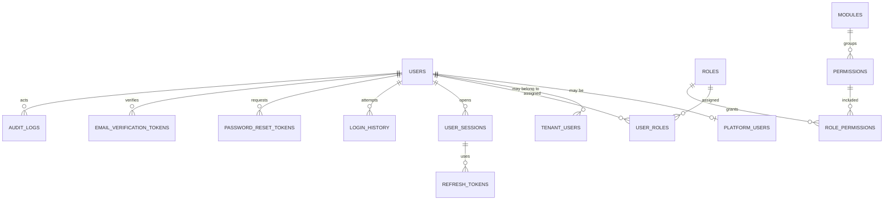
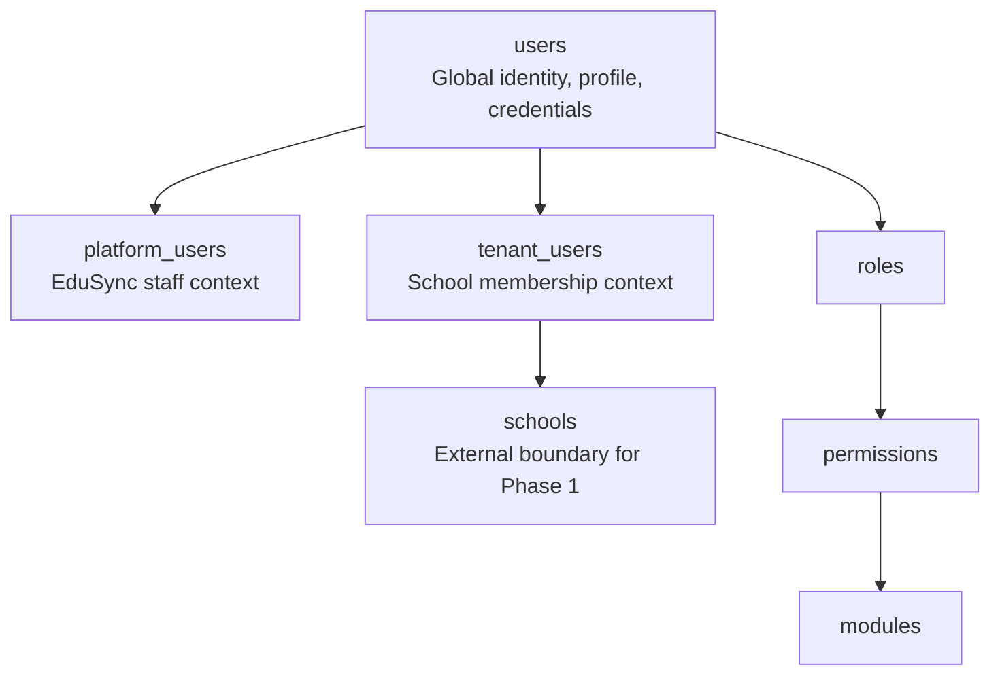
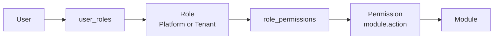
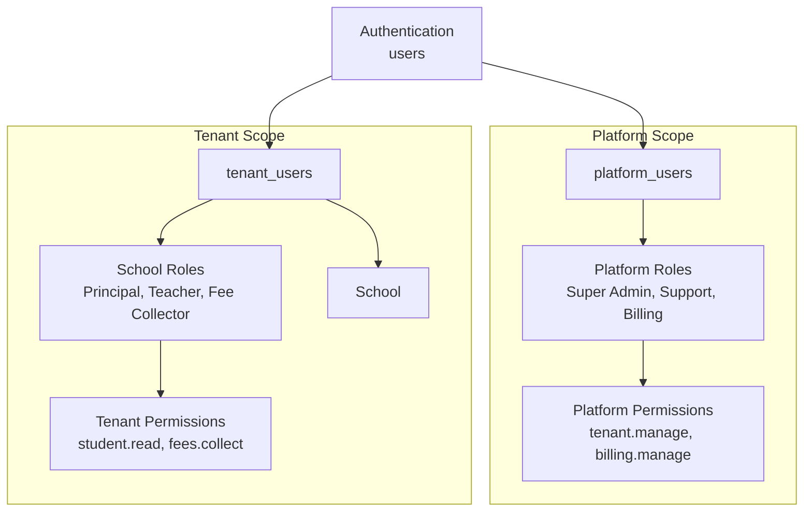
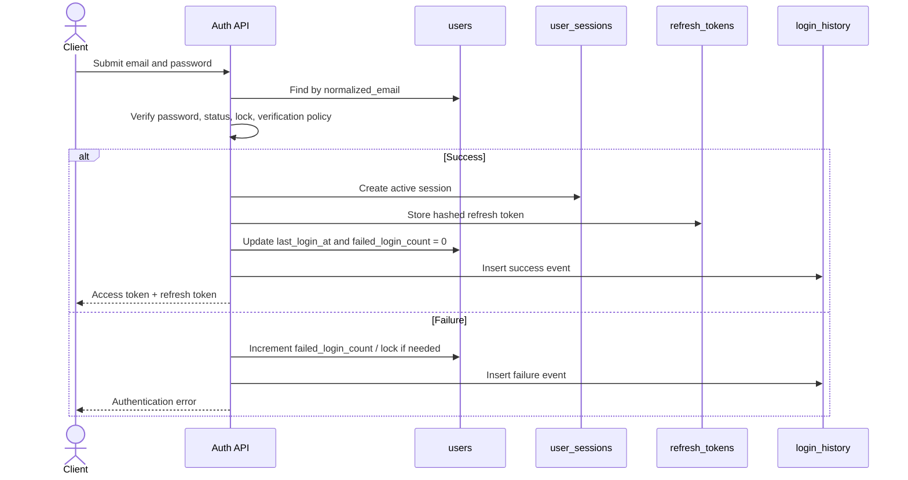
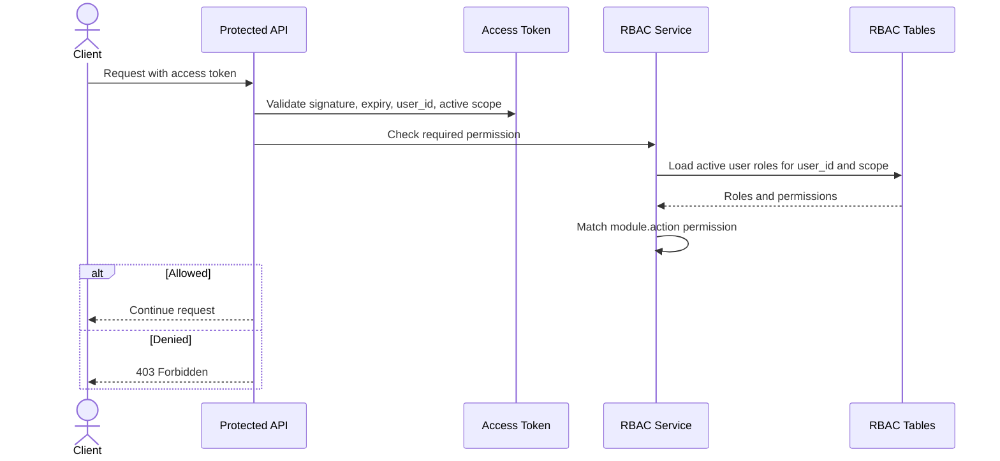

# Phase 1 - Identity & RBAC

| Field | Value |
| --- | --- |
| Document ID | EDUSYNC-DB-PHASE-1 |
| Version | 0.1.0 |
| Status | Review Required |
| Phase | Identity & RBAC |
| Database | PostgreSQL |
| Backend Fit | Java 21, Spring Boot, Spring Security, Spring Data JPA |
| Boundary | Identity, Authentication, Authorization, Audit |

---

## Approval Checkpoint

This document covers only Phase 1: Identity & RBAC. It intentionally does not redesign academic, finance, communication, or platform subscription tables.

Phase 2 must not begin until this module is reviewed and approved.

---

## Architecture Review

The current schema stores authorization as `users.role user_role` and direct `user_permissions`. That design does not support enterprise RBAC because it binds one user to one enum role, requires code/database migrations for every new role, and mixes identity, tenancy, and authorization into a single table.

The proposed Phase 1 model separates four concerns:

| Concern | Proposed Tables | Reason |
| --- | --- | --- |
| Global identity | `users` | Stores shared profile, credentials, verification, and account status. |
| Account context | `platform_users`, `tenant_users` | Separates platform staff from school users and supports tenant-scoped membership. |
| RBAC catalog | `modules`, `permissions`, `roles` | Allows dynamic modules, permissions, and school-defined roles. |
| RBAC assignment | `user_roles`, `role_permissions` | Supports many users, many roles, and many permissions. |
| Authentication state | `refresh_tokens`, `user_sessions`, `login_history`, `password_reset_tokens`, `email_verification_tokens` | Supports multi-device login, token rotation, logout, reset, and verification flows. |
| Audit | `audit_logs` | Captures security and business-relevant events in an append-only table. |

### Boundary Rules

- `platform_users` must never reference a school.
- `tenant_users` must always reference a school.
- `users` does not contain `school_id` or `role`.
- Roles are data, not enums.
- Permissions are reusable and module-scoped.
- Tenant-created roles are scoped to one school.
- Platform roles are scoped globally.
- Authentication works against `users`; authorization is evaluated against the active account context.

---

## Design Decisions

### 1. Global `users` Table

`users` stores identity, profile, credentials, and common account status. It deliberately does not store `school_id`, `role`, or module-specific fields such as teacher qualification or student admission number.

This keeps authentication consistent across platform and tenant accounts and avoids duplicated password state if the same person belongs to multiple schools.

### 2. Platform and Tenant Account Contexts

`platform_users` represents EduSync internal users such as Super Admin, Support Engineer, and Billing Team. It has no `school_id`.

`tenant_users` represents school membership and always has `school_id`. A single global user can have separate tenant memberships if the business later supports a parent, teacher, or consultant across multiple schools.

### 3. Dynamic RBAC

`roles` replaces `Enum user_role`. School administrators can create roles such as Sports Coordinator, Exam Coordinator, Fee Collector, HR, Library Staff, or Transport Manager without code changes.

`permissions` replaces direct string permissions on users. Permissions are atomic capabilities such as `student.read`, `attendance.mark`, and `fees.collect`.

### 4. Modules as First-Class Data

`modules` groups permissions by product capability. It also becomes the integration point for later feature flags and subscription entitlements without coupling Phase 1 to Phase 5.

### 5. User Role Assignments

`user_roles` assigns roles to a user inside an authorization context. For tenant roles, `school_id` is required. For platform roles, `school_id` is null.

Application-level and database-level checks must enforce that role scope and assignment scope match.

### 6. Token and Session Design

`refresh_tokens` stores hashed refresh tokens, not raw tokens. Token rotation is supported through `rotated_from_token_id`, `revoked_at`, and `expires_at`.

`user_sessions` groups refresh tokens and login activity by device. This supports "logout this device" and "logout all devices".

### 7. Login History

`login_history` is append-only security history. It tracks successful and failed attempts with IP, browser, device, and timing metadata.

### 8. Password Reset and Email Verification

Password reset and email verification tokens are modeled separately because they have different lifecycles, audit needs, and security policies.

### 9. Audit Logs

`audit_logs` is append-only. It supports security events and later business events. It stores actor context, target context, tenant context, request metadata, and JSON snapshots.

---

## DBML

Copy this Phase 1 DBML into dbdiagram.io for review. It is intentionally limited to Identity & RBAC.

```sql
// ============================================================
// EduSync - Phase 1 Identity & RBAC Schema
// Status: Review Required
// Database: PostgreSQL
// ============================================================

Enum user_status {
  pending_verification
  active
  inactive
  suspended
  locked
  archived
}

Enum account_scope {
  platform
  tenant
}

Enum role_status {
  active
  inactive
  archived
}

Enum permission_status {
  active
  inactive
  deprecated
}

Enum session_status {
  active
  expired
  revoked
}

Enum auth_event_status {
  success
  failure
  blocked
}

Enum token_status {
  active
  used
  expired
  revoked
}

Enum audit_action {
  create
  update
  delete
  login
  logout
  failed_login
  token_refresh
  password_reset_requested
  password_reset_completed
  email_verification_requested
  email_verified
  role_assigned
  role_revoked
  permission_granted
  permission_revoked
  status_change
}

Table users {
  id uuid [pk]
  email varchar(255) [not null, unique]
  normalized_email varchar(255) [not null, unique]
  phone varchar(30)
  password_hash varchar(255) [not null]
  first_name varchar(100) [not null]
  last_name varchar(100)
  display_name varchar(200)
  photo_url varchar(500)
  status user_status [not null, default: 'pending_verification']
  email_verified boolean [not null, default: false]
  phone_verified boolean [not null, default: false]
  failed_login_count int [not null, default: 0]
  locked_until timestamp
  password_changed_at timestamp
  last_login_at timestamp
  mfa_enabled boolean [not null, default: false]
  metadata jsonb
  is_deleted boolean [not null, default: false]
  deleted_at timestamp
  deleted_by uuid [ref: > users.id]
  created_at timestamp [not null, default: `now()`]
  created_by uuid [ref: > users.id]
  updated_at timestamp [not null, default: `now()`]
  updated_by uuid [ref: > users.id]

  indexes {
    normalized_email [unique]
    phone
    status
    (status, locked_until)
    is_deleted
  }
}

Table platform_users {
  id uuid [pk]
  user_id uuid [not null, unique, ref: > users.id]
  employee_code varchar(50) [unique]
  department varchar(100)
  title varchar(100)
  support_access_enabled boolean [not null, default: false]
  status user_status [not null, default: 'active']
  created_at timestamp [not null, default: `now()`]
  created_by uuid [ref: > users.id]
  updated_at timestamp [not null, default: `now()`]
  updated_by uuid [ref: > users.id]

  indexes {
    user_id [unique]
    employee_code [unique]
    status
  }
}

Table tenant_users {
  id uuid [pk]
  user_id uuid [not null, ref: > users.id]
  school_id uuid [not null, note: 'FK to schools.id from the Academic/School boundary']
  tenant_user_code varchar(50)
  status user_status [not null, default: 'active']
  joined_at timestamp
  left_at timestamp
  is_primary_contact boolean [not null, default: false]
  is_deleted boolean [not null, default: false]
  deleted_at timestamp
  deleted_by uuid [ref: > users.id]
  created_at timestamp [not null, default: `now()`]
  created_by uuid [ref: > users.id]
  updated_at timestamp [not null, default: `now()`]
  updated_by uuid [ref: > users.id]

  indexes {
    user_id
    school_id
    (school_id, user_id) [unique]
    (school_id, status)
    (school_id, tenant_user_code) [unique]
    is_deleted
  }
}

Table modules {
  id uuid [pk]
  code varchar(100) [not null, unique, note: 'Example: student, attendance, fees']
  name varchar(150) [not null]
  description text
  is_platform_module boolean [not null, default: false]
  is_tenant_module boolean [not null, default: true]
  sort_order int [not null, default: 0]
  status permission_status [not null, default: 'active']
  created_at timestamp [not null, default: `now()`]
  created_by uuid [ref: > users.id]
  updated_at timestamp [not null, default: `now()`]
  updated_by uuid [ref: > users.id]

  indexes {
    code [unique]
    status
  }
}

Table permissions {
  id uuid [pk]
  module_id uuid [not null, ref: > modules.id]
  code varchar(150) [not null, unique, note: 'Example: student.read']
  action varchar(80) [not null, note: 'Example: read, create, update, delete, approve']
  name varchar(150) [not null]
  description text
  scope account_scope [not null]
  status permission_status [not null, default: 'active']
  created_at timestamp [not null, default: `now()`]
  created_by uuid [ref: > users.id]
  updated_at timestamp [not null, default: `now()`]
  updated_by uuid [ref: > users.id]

  indexes {
    module_id
    code [unique]
    (module_id, action)
    (scope, status)
  }
}

Table roles {
  id uuid [pk]
  school_id uuid [note: 'NULL for platform roles; required for tenant-created roles']
  code varchar(120) [not null, note: 'Example: principal, fee_collector, support_engineer']
  name varchar(150) [not null]
  description text
  scope account_scope [not null]
  is_system_role boolean [not null, default: false]
  status role_status [not null, default: 'active']
  created_at timestamp [not null, default: `now()`]
  created_by uuid [ref: > users.id]
  updated_at timestamp [not null, default: `now()`]
  updated_by uuid [ref: > users.id]

  indexes {
    school_id
    (scope, code)
    (school_id, code)
    (scope, status)
  }
}

Table role_permissions {
  id uuid [pk]
  role_id uuid [not null, ref: > roles.id]
  permission_id uuid [not null, ref: > permissions.id]
  granted_at timestamp [not null, default: `now()`]
  granted_by uuid [ref: > users.id]
  created_at timestamp [not null, default: `now()`]
  created_by uuid [ref: > users.id]
  updated_at timestamp [not null, default: `now()`]
  updated_by uuid [ref: > users.id]

  indexes {
    role_id
    permission_id
    (role_id, permission_id) [unique]
  }
}

Table user_roles {
  id uuid [pk]
  user_id uuid [not null, ref: > users.id]
  role_id uuid [not null, ref: > roles.id]
  school_id uuid [note: 'NULL for platform role assignments; required for tenant role assignments']
  assigned_at timestamp [not null, default: `now()`]
  assigned_by uuid [ref: > users.id]
  expires_at timestamp
  revoked_at timestamp
  revoked_by uuid [ref: > users.id]
  revoke_reason varchar(255)
  created_at timestamp [not null, default: `now()`]
  created_by uuid [ref: > users.id]
  updated_at timestamp [not null, default: `now()`]
  updated_by uuid [ref: > users.id]

  indexes {
    user_id
    role_id
    school_id
    (user_id, role_id, school_id)
    (school_id, user_id)
    revoked_at
  }
}

Table user_sessions {
  id uuid [pk]
  user_id uuid [not null, ref: > users.id]
  school_id uuid [note: 'Active tenant context when applicable']
  status session_status [not null, default: 'active']
  device_id varchar(150)
  device_name varchar(255)
  user_agent text
  ip_address inet
  started_at timestamp [not null, default: `now()`]
  last_seen_at timestamp
  expires_at timestamp [not null]
  revoked_at timestamp
  revoked_by uuid [ref: > users.id]
  revoke_reason varchar(255)
  created_at timestamp [not null, default: `now()`]
  updated_at timestamp [not null, default: `now()`]

  indexes {
    user_id
    school_id
    status
    (user_id, status)
    expires_at
  }
}

Table refresh_tokens {
  id uuid [pk]
  user_id uuid [not null, ref: > users.id]
  session_id uuid [not null, ref: > user_sessions.id]
  token_hash varchar(255) [not null, unique]
  rotated_from_token_id uuid [ref: > refresh_tokens.id]
  status token_status [not null, default: 'active']
  issued_at timestamp [not null, default: `now()`]
  expires_at timestamp [not null]
  revoked_at timestamp
  revoked_by uuid [ref: > users.id]
  revoke_reason varchar(255)
  created_at timestamp [not null, default: `now()`]
  updated_at timestamp [not null, default: `now()`]

  indexes {
    user_id
    session_id
    token_hash [unique]
    status
    expires_at
  }
}

Table login_history {
  id uuid [pk]
  user_id uuid [ref: > users.id]
  session_id uuid [ref: > user_sessions.id]
  attempted_email varchar(255)
  school_id uuid [note: 'Tenant context selected during login, when applicable']
  status auth_event_status [not null]
  failure_reason varchar(255)
  ip_address inet
  device_id varchar(150)
  device_name varchar(255)
  browser varchar(120)
  operating_system varchar(120)
  user_agent text
  logged_in_at timestamp [not null, default: `now()`]
  logged_out_at timestamp
  created_at timestamp [not null, default: `now()`]

  indexes {
    user_id
    school_id
    status
    attempted_email
    ip_address
    logged_in_at
  }
}

Table password_reset_tokens {
  id uuid [pk]
  user_id uuid [not null, ref: > users.id]
  token_hash varchar(255) [not null, unique]
  status token_status [not null, default: 'active']
  requested_ip inet
  requested_user_agent text
  expires_at timestamp [not null]
  used_at timestamp
  revoked_at timestamp
  created_at timestamp [not null, default: `now()`]

  indexes {
    user_id
    token_hash [unique]
    status
    expires_at
  }
}

Table email_verification_tokens {
  id uuid [pk]
  user_id uuid [not null, ref: > users.id]
  email varchar(255) [not null]
  token_hash varchar(255) [not null, unique]
  status token_status [not null, default: 'active']
  expires_at timestamp [not null]
  verified_at timestamp
  revoked_at timestamp
  created_at timestamp [not null, default: `now()`]

  indexes {
    user_id
    email
    token_hash [unique]
    status
    expires_at
  }
}

Table audit_logs {
  id uuid [pk]
  actor_user_id uuid [ref: > users.id]
  actor_school_id uuid
  actor_scope account_scope
  action audit_action [not null]
  target_table varchar(120)
  target_id uuid
  target_school_id uuid
  request_id varchar(100)
  ip_address inet
  user_agent text
  before_data jsonb
  after_data jsonb
  metadata jsonb
  created_at timestamp [not null, default: `now()`]

  indexes {
    actor_user_id
    actor_school_id
    action
    target_table
    target_id
    target_school_id
    request_id
    created_at
  }
}
```

---

## ER Diagram



---

## Identity Architecture Diagram



---

## RBAC Diagram



---

## Platform vs Tenant Architecture



---

## Authentication Flow



---

## Authorization Flow



---

## Migration Strategy

### Step 1 - Add New Tables

Create Phase 1 tables alongside the existing schema. Do not drop `users.role` or `user_permissions` in the first migration.

### Step 2 - Backfill Global Users

Normalize existing `users.email` into `normalized_email`. Preserve password hashes, profile fields, status, login counters, and verification fields.

### Step 3 - Create Account Contexts

- Existing users with `role = super_admin` become `platform_users`.
- Existing school-owned users become `tenant_users`.
- Existing users with `school_id IS NULL` but non-platform roles must be reviewed manually.

### Step 4 - Seed Modules and Permissions

Seed system modules and permissions from application constants or migration data. Initial examples:

| Module | Permission Examples |
| --- | --- |
| Student | `student.read`, `student.create`, `student.update`, `student.delete` |
| Attendance | `attendance.mark`, `attendance.view`, `attendance.approve` |
| Fees | `fees.read`, `fees.collect`, `fees.refund` |
| Reports | `reports.view`, `reports.export` |
| Notifications | `notification.send`, `notification.template.manage` |
| Platform | `tenant.manage`, `support.impersonate`, `billing.manage` |

### Step 5 - Convert Enum Roles to Role Rows

Create system roles for the existing enum values. Tenant roles receive `scope = tenant`; platform roles receive `scope = platform`.

### Step 6 - Backfill `user_roles`

For every existing user, map the old enum role to a role row and insert a `user_roles` record.

### Step 7 - Dual-Read Authorization

Temporarily support both old and new authorization models behind a feature flag. Log differences between legacy and RBAC authorization decisions.

### Step 8 - Cut Over

Switch authorization to RBAC tables after reconciliation. Then remove legacy `users.role`, `Enum user_role`, and `user_permissions`.

---

## Index and Performance Review

Recommended indexes are included in the DBML. Critical access paths:

| Use Case | Index |
| --- | --- |
| Login lookup | `users.normalized_email` unique |
| Tenant user lookup | `tenant_users(school_id, user_id)` unique |
| Role resolution | `user_roles(school_id, user_id)` |
| Role permission lookup | `role_permissions(role_id, permission_id)` unique |
| Token lookup | `refresh_tokens.token_hash` unique |
| Active sessions | `user_sessions(user_id, status)` |
| Audit investigation | `audit_logs(actor_user_id)`, `audit_logs(target_id)`, `audit_logs(created_at)` |

Future optimization may add partial indexes for active-only rows, such as active sessions, active refresh tokens, and non-deleted tenant users.

### PostgreSQL Constraints Not Fully Expressible in DBML

DBML is useful for design review, but final PostgreSQL migrations should add stricter checks:

| Rule | PostgreSQL Constraint |
| --- | --- |
| Platform roles must not have `school_id` | `CHECK ((scope = 'platform' AND school_id IS NULL) OR (scope = 'tenant' AND school_id IS NOT NULL))` on `roles` |
| Platform role code uniqueness | Partial unique index on `roles(code) WHERE scope = 'platform'` |
| Tenant role code uniqueness | Partial unique index on `roles(school_id, code) WHERE scope = 'tenant'` |
| Active tenant role assignment uniqueness | Partial unique index on `user_roles(user_id, role_id, school_id) WHERE school_id IS NOT NULL AND revoked_at IS NULL` |
| Active platform role assignment uniqueness | Partial unique index on `user_roles(user_id, role_id) WHERE school_id IS NULL AND revoked_at IS NULL` |
| Tenant assignments must use tenant roles | Trigger or application invariant checking `user_roles.school_id = roles.school_id` when `roles.scope = 'tenant'` |
| Platform assignments must use platform roles | Trigger or application invariant checking `user_roles.school_id IS NULL` when `roles.scope = 'platform'` |

---

## Security Review

- Store password hashes using a modern adaptive algorithm such as Argon2id or BCrypt with strong parameters.
- Store only hashed refresh, reset, and verification tokens.
- Normalize email before lookup and enforce unique normalized email.
- Keep platform and tenant authorization scopes separate.
- Enforce tenant isolation at service and repository query boundaries.
- Add database constraints or triggers to enforce scope rules that DBML cannot express.
- Avoid storing raw PII in audit snapshots unless required for compliance.
- Mask sensitive values in `audit_logs.before_data` and `audit_logs.after_data`.
- Use short-lived JWT access tokens and rotate refresh tokens.
- Revoke all active sessions when password changes.

---

## Trade-Offs

| Decision | Benefit | Trade-Off |
| --- | --- | --- |
| Global `users` plus account contexts | Avoids duplicate credentials and supports multi-school membership | Requires context-aware authorization logic |
| Database-backed roles | Dynamic and school-customizable | Needs role management UI and guardrails |
| Atomic permissions | Fine-grained access control | More seed data and permission mapping work |
| Hashed token storage | Safer if database leaks | Tokens cannot be recovered, only verified |
| Append-only login/audit tables | Strong investigation trail | Requires retention and partitioning strategy |

---

## Future Scalability Concerns

- `audit_logs` and `login_history` will grow quickly and should be partitioned by month or quarter once volume is known.
- Permission checks should be cached in Redis by `user_id + school_id + role_version`.
- Role and permission changes should publish cache invalidation events through RabbitMQ.
- Support impersonation only with explicit platform permissions and mandatory audit records.
- If tenant data residency becomes a requirement, tenant-scoped identity tables may need regional partitioning.
- If SSO is introduced, add `identity_providers` and `external_identities` without changing the RBAC core.

---

## Review Report

### Issues Resolved

- Removes single-role enum authorization.
- Supports multiple roles per user.
- Separates platform users from school users.
- Supports dynamic school-defined roles.
- Adds reusable module-scoped permissions.
- Adds refresh tokens, session management, login history, password reset, email verification, and audit logs.

### Items Requiring Approval

- Approve `users` as global identity with `platform_users` and `tenant_users` as account contexts.
- Approve `user_roles` as scoped by `school_id` for tenant authorization.
- Approve token/session tables as part of Phase 1.
- Approve migration strategy before any database implementation begins.

### Explicit Stop

Phase 1 is now ready for review. Do not continue to Phase 2 until this document is approved.
