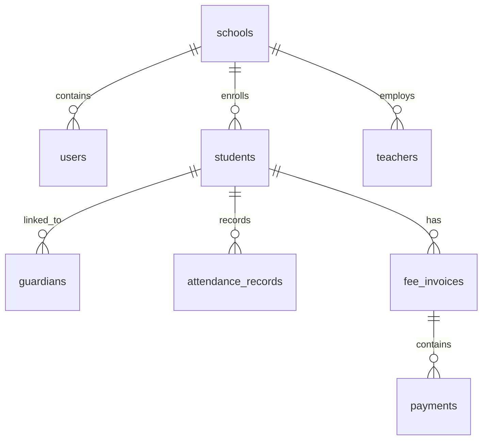

# Database

The database design centers on tenant isolation, historical accuracy for academic and financial records, and efficient reporting.

```mermaid
erDiagram
    schools ||--o{ users : contains
    schools ||--o{ students : enrolls
    schools ||--o{ teachers : employs
    students ||--o{ guardians : linked_to
    students ||--o{ attendance_records : records
    students ||--o{ fee_invoices : has
    fee_invoices ||--o{ payments : contains
```
