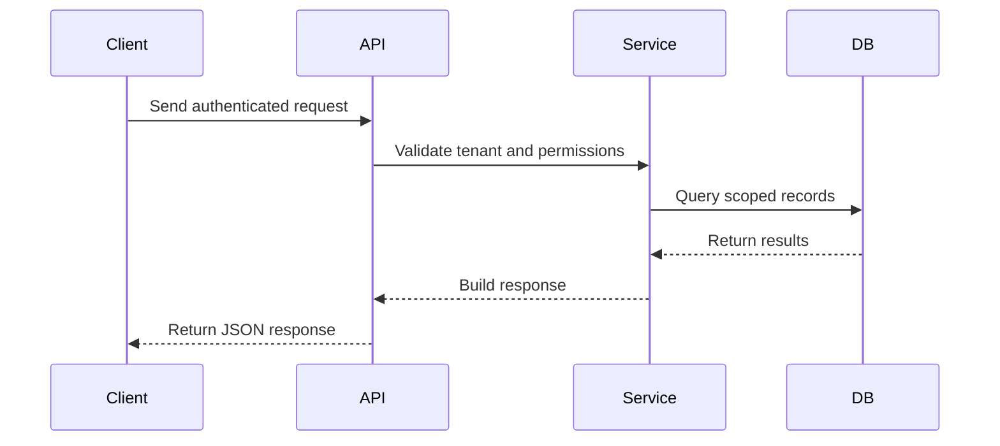

# API

The API layer exposes secure, tenant-aware endpoints for web, mobile, and background integrations.

```mermaid
sequenceDiagram
    participant Client
    participant API
    participant Service
    participant DB

    Client->>API: Send authenticated request
    API->>Service: Validate tenant and permissions
    Service->>DB: Query scoped records
    DB-->>Service: Return results
    Service-->>API: Build response
    API-->>Client: Return JSON response
```
