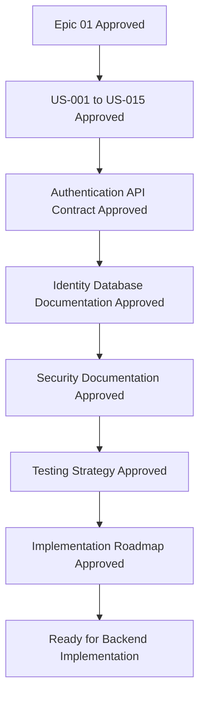

# Epic 01 - Identity & Authentication

| Field | Value |
| --- | --- |
| Title | Epic 01 - Identity & Authentication |
| Document ID | EDUSYNC-BE-AUTH-EPIC-001 |
| Version | 1.0 |
| Status | Draft |
| Author | Pushpraj Jaiswal |
| Created Date | 2026-07-05 |
| Last Updated | 2026-07-05 |
| Reviewers | Product Owner, Software Architect, Security Engineer, Backend Lead, QA Lead |
| Approval Status | Pending Review |
| Confidentiality | Internal |

---

## Revision History

| Version | Date | Author | Changes |
| --- | --- | --- | --- |
| 1.0 | 2026-07-05 | Pushpraj Jaiswal | Initial version of the Identity & Authentication epic overview. |

---

## Table of Contents

1. [Executive Summary](#1-executive-summary)
2. [Purpose](#2-purpose)
3. [Objectives](#3-objectives)
4. [Epic Overview](#4-epic-overview)
5. [Business Goal](#5-business-goal)
6. [Technical Goal](#6-technical-goal)
7. [Success Criteria](#7-success-criteria)
8. [Scope](#8-scope)
9. [Out of Scope](#9-out-of-scope)
10. [Audience](#10-audience)
11. [Definitions](#11-definitions)
12. [Assumptions](#12-assumptions)
13. [Dependencies](#13-dependencies)
14. [Deliverables](#14-deliverables)
15. [Timeline](#15-timeline)
16. [Team Responsibilities](#16-team-responsibilities)
17. [Business Rules](#17-business-rules)
18. [Technical Requirements](#18-technical-requirements)
19. [Functional Requirements](#19-functional-requirements)
20. [Non Functional Requirements](#20-non-functional-requirements)
21. [Risks](#21-risks)
22. [Epic Workflow](#22-epic-workflow)
23. [References](#23-references)
24. [Related Documents](#24-related-documents)
25. [Future Scope](#25-future-scope)
26. [Conclusion](#26-conclusion)

---

## 1 Executive Summary

Epic 01 defines the Identity & Authentication foundation for EduSync. This epic enables secure access for platform users and school users, supports multi-tenant account separation, introduces enterprise RBAC, and establishes the authentication controls required before any business module can be implemented.

The epic uses the approved Phase 1 Identity & RBAC database schema as the source of truth. It does not redesign the database schema. It converts the approved architecture into an implementation contract for product, engineering, security, and QA teams.

---

## 2 Purpose

The purpose of this document is to define the business and technical boundaries for Epic 01 before implementation begins.

This document ensures that:

- Engineering understands the expected authentication and authorization capabilities.
- Product stakeholders understand the business outcomes and release scope.
- Security reviewers can validate the access-control model before development.
- QA teams can prepare test strategy and acceptance coverage.
- Future Identity & Authentication documents remain consistent with the approved schema.

---

## 3 Objectives

| Objective ID | Objective | Priority | Business Value |
| --- | --- | --- | --- |
| OBJ-AUTH-001 | Provide secure login for platform and school users. | Critical | Allows authorized users to access EduSync safely. |
| OBJ-AUTH-002 | Support JWT-based authentication with refresh token rotation. | Critical | Enables secure web and mobile sessions. |
| OBJ-AUTH-003 | Support logout, logout from one device, and logout from all devices. | High | Gives users control over active sessions. |
| OBJ-AUTH-004 | Support database-backed roles and permissions. | Critical | Allows schools to assign multiple roles without code changes. |
| OBJ-AUTH-005 | Support password reset and email verification. | High | Enables account recovery and identity verification. |
| OBJ-AUTH-006 | Record login history and security audit events. | High | Supports security monitoring, investigation, and compliance. |

---

## 4 Epic Overview

Epic 01 covers the complete identity foundation for EduSync Phase 1. It includes authentication, authorization, session management, token lifecycle, password recovery, email verification, and audit logging.

EduSync has two major user contexts:

| Context | Description | Examples |
| --- | --- | --- |
| Platform | EduSync internal users who manage the SaaS platform. | Super Admin, Support Engineer, Billing Team |
| Tenant | School users who operate inside a specific school tenant. | School Admin, Principal, Teacher, Accountant, Parent, Student |

The epic must support users with multiple roles. For example, one school employee may act as Teacher, Fee Collector, and Exam Coordinator without requiring code changes or enum changes.

---

## 5 Business Goal

The business goal is to establish a secure and scalable access foundation that allows EduSync to onboard schools, protect sensitive education data, and support role-based workflows across school administration, teaching, finance, attendance, and communication modules.

| Business Goal ID | Business Goal | Success Indicator |
| --- | --- | --- |
| BG-AUTH-001 | Enable secure school onboarding. | School administrators can access the platform after account verification. |
| BG-AUTH-002 | Support operational role flexibility. | A user can hold multiple roles simultaneously. |
| BG-AUTH-003 | Reduce manual support dependency. | Users can reset passwords and verify email addresses without administrator intervention. |
| BG-AUTH-004 | Improve security accountability. | Login, logout, role assignment, and sensitive actions are auditable. |

---

## 6 Technical Goal

The technical goal is to implement a Spring Security compatible identity layer backed by PostgreSQL, JWT access tokens, refresh token rotation, Redis-assisted authorization caching, and audit logging.

| Technical Goal ID | Technical Goal | Priority |
| --- | --- | --- |
| TG-AUTH-001 | Authenticate users using normalized email and password hash verification. | Critical |
| TG-AUTH-002 | Issue short-lived JWT access tokens. | Critical |
| TG-AUTH-003 | Store refresh tokens as hashes and rotate them on refresh. | Critical |
| TG-AUTH-004 | Evaluate authorization through roles and permissions. | Critical |
| TG-AUTH-005 | Maintain user sessions across multiple devices. | High |
| TG-AUTH-006 | Capture login history and audit events. | High |

---

## 7 Success Criteria

| Criteria ID | Success Criteria | Measurement |
| --- | --- | --- |
| SC-AUTH-001 | Users can authenticate with valid credentials. | Login API returns access and refresh tokens. |
| SC-AUTH-002 | Invalid login attempts are rejected and recorded. | Failed attempts appear in login history. |
| SC-AUTH-003 | Access tokens expire and cannot be reused after expiration. | Security tests pass for expired token access. |
| SC-AUTH-004 | Refresh token rotation invalidates previously used tokens. | Reuse of an old refresh token is rejected. |
| SC-AUTH-005 | Users can log out from current session. | Current refresh token and session are revoked. |
| SC-AUTH-006 | Users can log out from all sessions. | All active sessions for the user are revoked. |
| SC-AUTH-007 | RBAC denies users without required permissions. | Protected APIs return `403 Forbidden`. |
| SC-AUTH-008 | Role and permission changes are auditable. | Audit log records actor, target, and action. |

---

## 8 Scope

### 8.1 In Scope

| Scope Item | Description |
| --- | --- |
| User authentication | Login using email and password. |
| JWT access tokens | Short-lived signed access tokens for API access. |
| Refresh tokens | Secure refresh token lifecycle with rotation and revocation. |
| Session management | Track active sessions by user, device, and tenant context. |
| Logout | Revoke the current session and refresh token. |
| Logout all devices | Revoke all active sessions for a user. |
| Password reset | Request and complete password reset using secure token flow. |
| Email verification | Verify user email before or after first login based on policy. |
| Platform login | Authenticate EduSync internal platform users. |
| School login | Authenticate tenant users in a school context. |
| RBAC | Resolve user permissions from roles and role permissions. |
| Login history | Capture successful, failed, and blocked login attempts. |
| Audit logging | Capture authentication and authorization-sensitive events. |

### 8.2 User Stories Covered

| Story Range | Coverage |
| --- | --- |
| US-001 to US-015 | Identity & Authentication user stories for login, refresh, logout, password reset, email verification, sessions, roles, permissions, and audit. |

---

## 9 Out of Scope

| Item | Reason |
| --- | --- |
| Student admission workflow | Covered by the Academic module. |
| Employee management | Covered by the Academic or HR-related module. |
| Fee collection | Covered by the Finance module. |
| Notification template management | Covered by the Communication module. |
| Subscription billing | Covered by the Platform module. |
| Social login | Future enhancement after core authentication is stable. |
| SAML or enterprise SSO | Future enterprise enhancement. |
| Multi-factor authentication enforcement | Future security enhancement; schema allows `mfa_enabled` but full MFA implementation is not part of this epic. |

---

## 10 Audience

| Audience | Responsibility |
| --- | --- |
| Product Owner | Validate business goals, scope, and acceptance expectations. |
| Software Architect | Validate architecture consistency and module boundaries. |
| Security Engineer | Validate authentication, token, password, and RBAC controls. |
| Backend Lead | Convert documentation into implementation tasks. |
| Frontend Lead | Align login, session, and recovery user interfaces. |
| Mobile Lead | Align mobile token storage and refresh behavior. |
| QA Lead | Prepare test plans, regression coverage, and acceptance tests. |
| DevOps Engineer | Prepare environment configuration, secrets, and deployment controls. |

---

## 11 Definitions

| Term | Definition |
| --- | --- |
| Access Token | Short-lived JWT used to authenticate API requests. |
| Refresh Token | Long-lived token used to obtain a new access token. Only a hash is stored in the database. |
| RBAC | Role-Based Access Control. A user receives permissions through assigned roles. |
| Platform User | EduSync internal user who manages platform-level operations. |
| Tenant User | User who belongs to a school tenant. |
| Session | Server-side record of an authenticated device or browser context. |
| Token Rotation | Process where a refresh token is replaced with a new refresh token after use. |
| Audit Log | Append-only record of security or business-relevant events. |

---

## 12 Assumptions

| Assumption ID | Assumption |
| --- | --- |
| ASM-AUTH-001 | The Phase 1 Identity & RBAC schema is approved as the database source of truth. |
| ASM-AUTH-002 | PostgreSQL is the primary system of record for identity data. |
| ASM-AUTH-003 | Redis may be used for short-lived caches, rate limits, and authorization cache invalidation. |
| ASM-AUTH-004 | JWT signing secrets or keys are managed through secure environment configuration. |
| ASM-AUTH-005 | Email delivery capability is available before email verification and password reset flows are released. |
| ASM-AUTH-006 | All public authentication APIs are exposed over HTTPS in deployed environments. |

---

## 13 Dependencies

| Dependency | Type | Owner | Impact |
| --- | --- | --- | --- |
| Approved Identity & RBAC DBML | Database | Architecture | Required before implementation. |
| Spring Security | Framework | Backend | Required for authentication filters and authorization integration. |
| PostgreSQL | Database | Backend/DevOps | Required for users, roles, sessions, tokens, and audit logs. |
| Redis | Infrastructure | DevOps | Required for rate limiting and optional permission cache. |
| Email provider | External service | DevOps/Product | Required for reset and verification emails. |
| Frontend login screens | UI | Frontend | Required for end-user authentication workflows. |
| Mobile secure storage | Mobile | Mobile | Required for safe refresh token storage. |

---

## 14 Deliverables

| Deliverable | File | Status |
| --- | --- | --- |
| Epic Overview | `Epic-01-Identity-Authentication.md` | Draft |
| Sprint Plan | `Sprint-01-Plan.md` | Pending |
| Authentication Architecture | `Authentication-Architecture.md` | Pending |
| User Stories | `US-001.md` to `US-015.md` | Pending |
| API Specification | `Authentication-API.md` | Pending |
| Database Documentation | `Identity-Database.md` | Pending |
| Security Documentation | `Security.md` | Pending |
| Testing Documentation | `Testing.md` | Pending |
| Project Structure | `Project-Structure.md` | Pending |
| Implementation Roadmap | `Implementation-Roadmap.md` | Pending |

---

## 15 Timeline

| Phase | Activity | Expected Output |
| --- | --- | --- |
| Day 1 | Epic overview and review | Approved epic boundaries and goals. |
| Day 2 | Sprint planning | Sprint backlog and task breakdown. |
| Day 3 to Day 4 | Authentication architecture | Authentication, authorization, and token flows. |
| Day 5 to Day 7 | User stories | US-001 to US-015 approved for implementation. |
| Day 8 | API specification | Endpoint contract for backend and frontend teams. |
| Day 9 | Database documentation | Identity data dictionary and relationship documentation. |
| Day 10 | Security and testing documentation | Security controls and QA strategy. |
| Day 11 | Project structure and roadmap | Implementation sequence and package structure. |

The timeline is a planning baseline. Final scheduling depends on review turnaround and approval readiness.

---

## 16 Team Responsibilities

| Team | Responsibilities |
| --- | --- |
| Product | Confirm business goals, acceptance expectations, and release priority. |
| Architecture | Validate module boundaries, multi-tenancy model, and schema alignment. |
| Backend | Implement authentication, authorization, sessions, tokens, and audit logic after documentation approval. |
| Security | Review password policy, token storage, RBAC, rate limiting, and audit requirements. |
| Frontend | Build login, logout, password reset, email verification, and session views based on approved API contracts. |
| Mobile | Implement secure token storage and mobile session behavior. |
| QA | Prepare automated, manual, security, and regression tests. |
| DevOps | Configure secrets, HTTPS, environment variables, logging, and deployment readiness. |

---

## 17 Business Rules

| Rule ID | Business Rule | Priority |
| --- | --- | --- |
| BR-AUTH-001 | A user may have multiple roles at the same time. | Critical |
| BR-AUTH-002 | Platform users must not belong to a school tenant. | Critical |
| BR-AUTH-003 | Tenant users must always belong to a school tenant. | Critical |
| BR-AUTH-004 | A user must not access a tenant unless the user has an active tenant membership. | Critical |
| BR-AUTH-005 | A user must not perform an action unless a role grants the required permission. | Critical |
| BR-AUTH-006 | Authentication and authorization-sensitive events must be auditable. | High |
| BR-AUTH-007 | Password reset and email verification tokens must expire. | High |

---

## 18 Technical Requirements

| Requirement ID | Description | Priority | Acceptance Criteria | Dependencies |
| --- | --- | --- | --- | --- |
| REQ-AUTH-T-001 | System shall authenticate users by normalized email and password hash. | Critical | Valid credentials produce tokens; invalid credentials are rejected. | `users` table |
| REQ-AUTH-T-002 | System shall issue JWT access tokens after successful login. | Critical | Access token includes user identity and active context claims. | Spring Security |
| REQ-AUTH-T-003 | System shall store only hashed refresh tokens. | Critical | Raw refresh tokens are never persisted. | `refresh_tokens` table |
| REQ-AUTH-T-004 | System shall rotate refresh tokens. | Critical | Old refresh token is revoked after successful refresh. | `refresh_tokens` table |
| REQ-AUTH-T-005 | System shall resolve permissions through roles. | Critical | Authorization checks use `user_roles`, `roles`, `role_permissions`, and `permissions`. | RBAC tables |
| REQ-AUTH-T-006 | System shall record login history. | High | Login attempts are written to `login_history`. | `login_history` table |
| REQ-AUTH-T-007 | System shall record audit events. | High | Sensitive events are written to `audit_logs`. | `audit_logs` table |

---

## 19 Functional Requirements

| Requirement ID | Description | Priority | Business Value | Acceptance Criteria |
| --- | --- | --- | --- | --- |
| REQ-AUTH-F-001 | User can log in with email and password. | Critical | Enables access to EduSync. | User receives valid access and refresh tokens. |
| REQ-AUTH-F-002 | User can refresh an access token. | Critical | Supports uninterrupted sessions. | Valid refresh token returns a new token pair. |
| REQ-AUTH-F-003 | User can log out from current device. | High | Supports session control. | Current session is revoked. |
| REQ-AUTH-F-004 | User can log out from all devices. | High | Supports account protection. | All active sessions are revoked. |
| REQ-AUTH-F-005 | User can request password reset. | High | Supports account recovery. | Reset email is sent when account is eligible. |
| REQ-AUTH-F-006 | User can reset password using a valid token. | High | Restores account access. | Password changes and reset token becomes used. |
| REQ-AUTH-F-007 | User can verify email address. | High | Confirms ownership of email. | Email verification status becomes true. |
| REQ-AUTH-F-008 | Authorized administrator can assign roles. | High | Enables school-specific access control. | User receives role and audit event is recorded. |

---

## 20 Non Functional Requirements

| Requirement ID | Requirement | Priority | Acceptance Criteria |
| --- | --- | --- | --- |
| NFR-AUTH-001 | Authentication APIs must protect sensitive data. | Critical | Responses never expose password hashes or token hashes. |
| NFR-AUTH-002 | Login must be rate limited. | High | Excessive attempts are throttled or blocked. |
| NFR-AUTH-003 | Authorization checks must be efficient. | High | Permission checks are suitable for high-frequency API calls. |
| NFR-AUTH-004 | Audit logs must be append-only. | High | Application does not update or delete audit records. |
| NFR-AUTH-005 | Token validation must be stateless for access tokens. | High | Normal API requests validate JWT without database lookup unless policy requires it. |
| NFR-AUTH-006 | Session revocation must take effect for refresh operations. | Critical | Revoked sessions cannot refresh tokens. |

---

## 21 Risks

| Risk ID | Risk | Impact | Probability | Mitigation |
| --- | --- | --- | --- | --- |
| RISK-AUTH-001 | Token leakage from client storage. | High | Medium | Use HTTPS, secure storage, short-lived access tokens, and refresh token rotation. |
| RISK-AUTH-002 | Incorrect tenant context selection. | High | Medium | Require explicit tenant context for school login and validate active membership. |
| RISK-AUTH-003 | Over-permissive roles. | High | Medium | Seed least-privilege roles and require approval for sensitive permissions. |
| RISK-AUTH-004 | Audit log growth. | Medium | High | Plan retention, archival, and future partitioning. |
| RISK-AUTH-005 | Brute force login attempts. | High | Medium | Apply rate limits, lock policy, and login monitoring. |
| RISK-AUTH-006 | Inconsistent web and mobile token handling. | Medium | Medium | Define shared API contracts and platform-specific secure storage rules. |

---

## 22 Epic Workflow

---

## 23 References

| Reference | Location | Purpose |
| --- | --- | --- |
| Phase 1 Identity & RBAC Schema | `docs/07-Database/Identity-RBAC-Phase-1.md` | Approved database source of truth. |
| Documentation Instructions | `.ai/documentation.instructions.md` | Documentation standards and required sections. |
| Product Requirements | `docs/03-Product-Requirements/product-requirements.md` | Product-level context. |
| Software Requirements | `docs/04-Software-Requirements/software-requirements.md` | System-level requirements context. |

---

## 24 Related Documents

| Document | Status |
| --- | --- |
| `Sprint-01-Plan.md` | Pending |
| `Authentication-Architecture.md` | Pending |
| `US-001.md` to `US-015.md` | Pending |
| `Authentication-API.md` | Pending |
| `Identity-Database.md` | Pending |
| `Security.md` | Pending |
| `Testing.md` | Pending |
| `Project-Structure.md` | Pending |
| `Implementation-Roadmap.md` | Pending |

---

## 25 Future Scope

| Future Item | Description |
| --- | --- |
| Multi-factor authentication | Add OTP, authenticator app, or passkey-based second factor. |
| Enterprise SSO | Add SAML or OpenID Connect federation for larger institutions. |
| Passkeys | Support passwordless authentication using WebAuthn. |
| Risk-based authentication | Challenge suspicious logins based on device, location, or behavior. |
| Admin impersonation | Allow controlled support access with strict permission and audit requirements. |

---

## 26 Conclusion

Epic 01 establishes the secure identity foundation required for EduSync. It defines the business goals, technical goals, scope, success criteria, risks, dependencies, deliverables, and team responsibilities for Identity & Authentication.

This document must be reviewed and approved before the Sprint Plan is generated. No implementation should begin from this epic until the downstream architecture, API, database, security, testing, project structure, and roadmap documents are approved.
