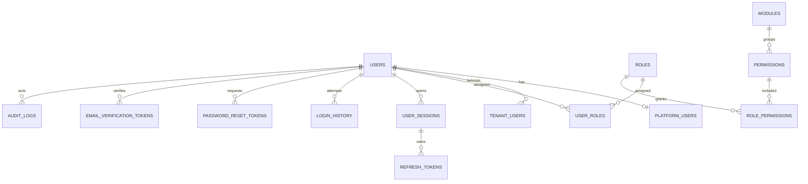

# Identity Database Documentation

| Field | Value |
| --- | --- |
| Title | Identity Database Documentation |
| Document ID | EDUSYNC-BE-AUTH-DB-001 |
| Version | 1.0 |
| Status | Draft |
| Author | Pushpraj Jaiswal |
| Created Date | 2026-07-05 |
| Last Updated | 2026-07-05 |
| Reviewers | Architect, Backend Lead, Security Engineer, DBA, QA Lead |
| Approval Status | Pending Review |
| Confidentiality | Internal |

---

## Revision History

| Version | Date | Author | Changes |
| --- | --- | --- | --- |
| 1.0 | 2026-07-05 | Pushpraj Jaiswal | Initial database documentation. |

---

## Table of Contents

1. [Executive Summary](#1-executive-summary)
2. [Purpose](#2-purpose)
3. [Objectives](#3-objectives)
4. [Scope](#4-scope)
5. [Out of Scope](#5-out-of-scope)
6. [Audience](#6-audience)
7. [Definitions](#7-definitions)
8. [Assumptions](#8-assumptions)
9. [Dependencies](#9-dependencies)
10. [Table Purpose](#10-table-purpose)
11. [Relationships](#11-relationships)
12. [Indexes](#12-indexes)
13. [Constraints](#13-constraints)
14. [Soft Delete](#14-soft-delete)
15. [Audit Columns](#15-audit-columns)
16. [ER Diagram](#16-er-diagram)
17. [Data Dictionary](#17-data-dictionary)
18. [Naming Convention](#18-naming-convention)
19. [Migration Notes](#19-migration-notes)
20. [References](#20-references)
21. [Conclusion](#21-conclusion)

---

## 1 Executive Summary

This document explains the approved Phase 1 Identity & RBAC database schema.

It does not redesign the schema. It documents how the identity tables support users, platform accounts, tenant accounts, RBAC, sessions, tokens, login history, password reset, email verification, and audit logs.

---

## 2 Purpose

Provide a clear database reference for backend implementation, review, and testing.

---

## 3 Objectives

| ID | Objective | Priority |
| --- | --- | --- |
| OBJ-001 | Document table purpose. | Critical |
| OBJ-002 | Document table relationships. | Critical |
| OBJ-003 | Document indexes and constraints. | High |
| OBJ-004 | Document audit and soft delete rules. | High |
| OBJ-005 | Document migration notes. | High |

---

## 4 Scope

| In Scope |
| --- |
| `users` |
| `platform_users` |
| `tenant_users` |
| `modules` |
| `permissions` |
| `roles` |
| `role_permissions` |
| `user_roles` |
| `user_sessions` |
| `refresh_tokens` |
| `login_history` |
| `password_reset_tokens` |
| `email_verification_tokens` |
| `audit_logs` |

---

## 5 Out of Scope

| Out of Scope | Reason |
| --- | --- |
| Academic tables | Phase 2 |
| Finance tables | Phase 3 |
| Communication tables | Phase 4 |
| Platform billing tables | Phase 5 |
| JPA entity code | Implementation phase |
| SQL migration scripts | After schema approval |

---

## 6 Audience

| Role | Purpose |
| --- | --- |
| Architect | Schema review |
| Backend Lead | Implementation mapping |
| Security Engineer | Security review |
| DBA | Index and constraint review |
| QA Lead | Database test planning |

---

## 7 Definitions

| Term | Meaning |
| --- | --- |
| Global Identity | Shared user record in `users` |
| Platform User | EduSync internal account in `platform_users` |
| Tenant User | School-scoped account in `tenant_users` |
| RBAC | Role-Based Access Control |
| Token Hash | Stored hash of token value, not the raw token |

---

## 8 Assumptions

| ID | Assumption |
| --- | --- |
| ASM-001 | Approved DBML is the source of truth. |
| ASM-002 | PostgreSQL is the database engine. |
| ASM-003 | UUID is used for primary keys. |
| ASM-004 | Raw refresh, reset, and verification tokens are never stored. |
| ASM-005 | `school_id` references the school boundary, but school schema is not redesigned here. |

---

## 9 Dependencies

| Dependency | Source |
| --- | --- |
| Approved DBML | `docs/07-Database/Identity-RBAC-Phase-1.md` |
| API Specification | `docs/09-Backend/Identity-Authentication/Authentication-API.md` |
| PostgreSQL | Database platform |
| Spring Data JPA | ORM mapping |

---

## 10 Table Purpose

| Table | Purpose |
| --- | --- |
| `users` | Stores global identity, credentials, profile, verification, and account status. |
| `platform_users` | Stores EduSync internal user context. |
| `tenant_users` | Stores school-scoped user membership. |
| `modules` | Groups permissions by product module. |
| `permissions` | Stores atomic capabilities such as `student.read`. |
| `roles` | Stores platform and tenant roles. |
| `role_permissions` | Maps roles to permissions. |
| `user_roles` | Assigns roles to users. |
| `user_sessions` | Tracks logged-in sessions by device/context. |
| `refresh_tokens` | Stores hashed refresh tokens and rotation state. |
| `login_history` | Records login attempts and logout timing. |
| `password_reset_tokens` | Stores hashed password reset tokens. |
| `email_verification_tokens` | Stores hashed email verification tokens. |
| `audit_logs` | Stores append-only security and business audit events. |

---

## 11 Relationships

| Relationship | Type |
| --- | --- |
| `users` to `platform_users` | One-to-zero-or-one |
| `users` to `tenant_users` | One-to-many |
| `users` to `user_roles` | One-to-many |
| `roles` to `user_roles` | One-to-many |
| `roles` to `role_permissions` | One-to-many |
| `permissions` to `role_permissions` | One-to-many |
| `modules` to `permissions` | One-to-many |
| `users` to `user_sessions` | One-to-many |
| `user_sessions` to `refresh_tokens` | One-to-many |
| `users` to `login_history` | One-to-many |
| `users` to `password_reset_tokens` | One-to-many |
| `users` to `email_verification_tokens` | One-to-many |
| `users` to `audit_logs` | One-to-many as actor |

---

## 12 Indexes

| Table | Important Indexes | Purpose |
| --- | --- | --- |
| `users` | `normalized_email`, `phone`, `status` | Login and account lookup |
| `tenant_users` | `(school_id, user_id)`, `(school_id, status)` | Tenant membership lookup |
| `modules` | `code`, `status` | Permission grouping lookup |
| `permissions` | `code`, `(module_id, action)`, `(scope, status)` | Permission resolution |
| `roles` | `school_id`, `(scope, code)`, `(school_id, code)` | Role lookup |
| `role_permissions` | `(role_id, permission_id)` | RBAC permission lookup |
| `user_roles` | `(school_id, user_id)`, `role_id`, `revoked_at` | User authorization lookup |
| `user_sessions` | `(user_id, status)`, `expires_at` | Active session lookup |
| `refresh_tokens` | `token_hash`, `session_id`, `expires_at` | Token validation |
| `login_history` | `user_id`, `school_id`, `logged_in_at`, `status` | Security investigation |
| `audit_logs` | `actor_user_id`, `target_id`, `created_at` | Audit investigation |

---

## 13 Constraints

| Rule | Constraint |
| --- | --- |
| Email must be unique | Unique index on `users.normalized_email` |
| Platform user maps to one user | Unique FK on `platform_users.user_id` |
| Tenant membership is unique per school | Unique index on `tenant_users(school_id, user_id)` |
| Permission code is unique | Unique index on `permissions.code` |
| Role-permission pair is unique | Unique index on `role_permissions(role_id, permission_id)` |
| Token hash is unique | Unique index on token hash columns |
| Platform roles must not have school ID | PostgreSQL check constraint |
| Tenant roles must have school ID | PostgreSQL check constraint |
| Active role assignment must be unique | PostgreSQL partial unique index |

---

## 14 Soft Delete

| Table | Soft Delete Columns |
| --- | --- |
| `users` | `is_deleted`, `deleted_at`, `deleted_by` |
| `tenant_users` | `is_deleted`, `deleted_at`, `deleted_by` |

Soft delete is used for user identity and tenant membership records. Authentication must reject deleted users and deleted tenant memberships.

---

## 15 Audit Columns

| Column | Purpose |
| --- | --- |
| `created_at` | Record creation timestamp |
| `created_by` | User who created the record |
| `updated_at` | Last update timestamp |
| `updated_by` | User who updated the record |
| `deleted_at` | Soft delete timestamp |
| `deleted_by` | User who soft deleted the record |

`audit_logs` is append-only and must not be updated or soft deleted.

---

## 16 ER Diagram

---

## 17 Data Dictionary

| Table | Key Columns |
| --- | --- |
| `users` | `id`, `email`, `normalized_email`, `password_hash`, `status`, `email_verified`, `locked_until` |
| `platform_users` | `id`, `user_id`, `employee_code`, `department`, `support_access_enabled`, `status` |
| `tenant_users` | `id`, `user_id`, `school_id`, `tenant_user_code`, `status`, `joined_at`, `left_at` |
| `modules` | `id`, `code`, `name`, `status` |
| `permissions` | `id`, `module_id`, `code`, `action`, `scope`, `status` |
| `roles` | `id`, `school_id`, `code`, `name`, `scope`, `is_system_role`, `status` |
| `role_permissions` | `id`, `role_id`, `permission_id`, `granted_at`, `granted_by` |
| `user_roles` | `id`, `user_id`, `role_id`, `school_id`, `assigned_at`, `expires_at`, `revoked_at` |
| `user_sessions` | `id`, `user_id`, `school_id`, `status`, `device_id`, `ip_address`, `expires_at`, `revoked_at` |
| `refresh_tokens` | `id`, `user_id`, `session_id`, `token_hash`, `rotated_from_token_id`, `status`, `expires_at` |
| `login_history` | `id`, `user_id`, `session_id`, `attempted_email`, `school_id`, `status`, `ip_address`, `logged_in_at`, `logged_out_at` |
| `password_reset_tokens` | `id`, `user_id`, `token_hash`, `status`, `expires_at`, `used_at` |
| `email_verification_tokens` | `id`, `user_id`, `email`, `token_hash`, `status`, `expires_at`, `verified_at` |
| `audit_logs` | `id`, `actor_user_id`, `actor_school_id`, `action`, `target_table`, `target_id`, `created_at` |

---

## 18 Naming Convention

| Item | Convention | Example |
| --- | --- | --- |
| Tables | Lowercase plural snake case | `refresh_tokens` |
| Columns | Lowercase snake case | `normalized_email` |
| Primary keys | `id` UUID | `users.id` |
| Foreign keys | `<table_singular>_id` | `user_id` |
| Enums | Lowercase snake case values | `pending_verification` |
| Permission codes | `<module>.<action>` | `student.read` |

---

## 19 Migration Notes

| Step | Note |
| --- | --- |
| 1 | Add new identity tables beside existing schema. |
| 2 | Backfill `users.normalized_email`. |
| 3 | Move platform accounts into `platform_users`. |
| 4 | Move school accounts into `tenant_users`. |
| 5 | Seed modules, permissions, roles, and role permissions. |
| 6 | Backfill `user_roles` from old role data. |
| 7 | Run dual-read authorization during transition. |
| 8 | Remove legacy `users.role`, `Enum user_role`, and `user_permissions` after approval. |

---

## 20 References

| Document | Location |
| --- | --- |
| Approved Identity & RBAC Schema | `docs/07-Database/Identity-RBAC-Phase-1.md` |
| API Specification | `docs/09-Backend/Identity-Authentication/Authentication-API.md` |
| Epic Overview | `docs/09-Backend/Identity-Authentication/Epic-01-Identity-Authentication.md` |

---

## 21 Conclusion

The Identity database model supports secure authentication, tenant separation, RBAC, token rotation, session control, login tracking, and audit logging. Implementation must follow the approved Phase 1 DBML.
