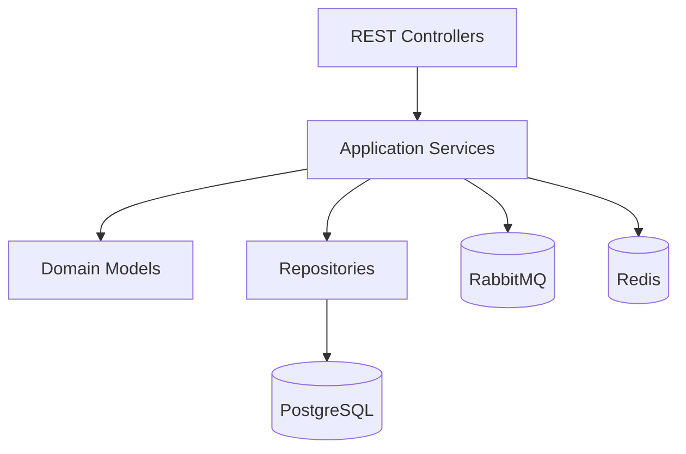

# Backend

The backend is organized around domain modules, application services, and infrastructure adapters that support daily school workflows.

```mermaid
flowchart TD
    Controller[REST Controllers] --> Service[Application Services]
    Service --> Domain[Domain Models]
    Service --> Repo[Repositories]
    Repo --> DB[(PostgreSQL)]
    Service --> Queue[(RabbitMQ)]
    Service --> Cache[(Redis)]
```
