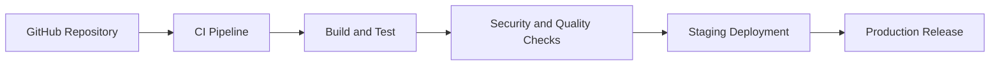

# DevOps

EduSync's delivery pipeline is structured to support continuous integration, reliability, and safe releases.

```mermaid
flowchart LR
    Code[GitHub Repository] --> CI[CI Pipeline]
    CI --> Test[Build and Test]
    Test --> Scan[Security and Quality Checks]
    Scan --> Deploy[Staging Deployment]
    Deploy --> Release[Production Release]
```
