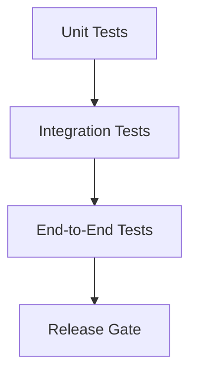

# Testing

Testing is layered to verify correctness at the unit, integration, and end-to-end levels before every major release.

```mermaid
flowchart TD
    Unit[Unit Tests] --> Integration[Integration Tests]
    Integration --> E2E[End-to-End Tests]
    E2E --> Release[Release Gate]
```
