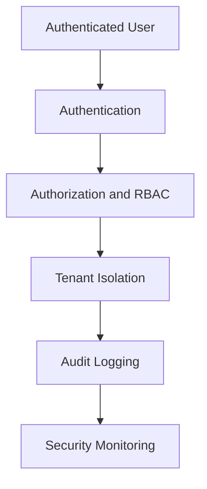

# Security

Security is treated as a platform capability, covering identity, authorization, tenant isolation, auditability, and operational monitoring.

```mermaid
flowchart TD
    User[Authenticated User] --> AuthN[Authentication]
    AuthN --> AuthZ[Authorization and RBAC]
    AuthZ --> Tenant[Tenant Isolation]
    Tenant --> Audit[Audit Logging]
    Audit --> Monitor[Security Monitoring]
```
