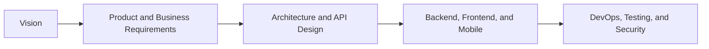

# EduSync Documentation

This documentation set provides the product, business, engineering, and operations blueprint for EduSync.

```mermaid
flowchart LR
    Vision[Vision] --> Requirements[Product and Business Requirements]
    Requirements --> Architecture[Architecture and API Design]
    Architecture --> Delivery[Backend, Frontend, and Mobile]
    Delivery --> Operations[DevOps, Testing, and Security]
```
